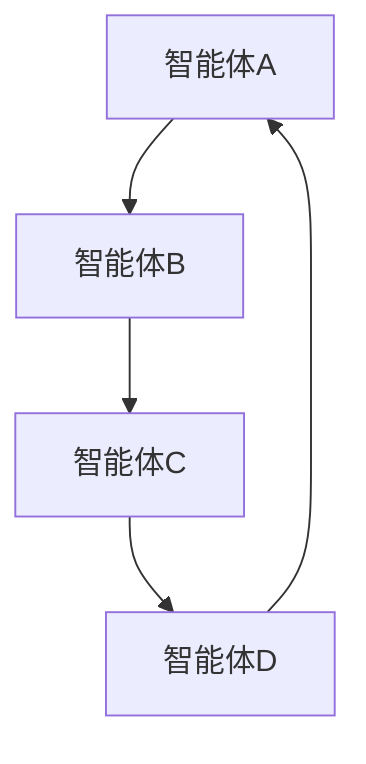

                 


# 智能体协作提高价值投资的跨境并购风险分析

## 关键词：智能体协作、价值投资、跨境并购、风险分析、分布式计算、博弈论模型、金融系统架构

## 摘要：本文探讨了智能体协作在价值投资中的应用，特别是其在跨境并购风险分析中的重要性。通过介绍智能体协作的基本概念、核心算法以及系统架构设计，本文展示了如何利用智能体协作技术优化跨境并购的风险评估过程，提升投资决策的准确性和效率。结合实际案例和项目实战，文章深入分析了智能体协作的优势和实现细节，为读者提供了全面的技术视角。

---

## 第1章 智能体协作与价值投资的背景

### 1.1 智能体协作的定义与特点

智能体协作是一种基于多智能体系统的协作方式，通过分布式计算和博弈论模型实现多个智能体之间的协同工作。智能体协作的核心特点包括：

1. **分布式计算**：智能体协作依赖于分布式计算，每个智能体独立处理信息，但通过通信机制协同完成任务。
2. **自适应性**：智能体能够根据环境变化动态调整策略，适应复杂多变的场景。
3. **协作性**：多个智能体协同工作，通过信息共享和任务分配提高整体效率。

与传统协作方式相比，智能体协作更加灵活、高效，并且能够处理复杂问题。

### 1.2 价值投资的基本原理

价值投资是一种基于企业内在价值的投资策略，核心理念是寻找市场价格低于内在价值的标的物。智能体协作通过分析多维度数据，帮助企业识别潜在投资机会，并优化决策流程。

### 1.3 跨境并购的风险分析

跨境并购涉及复杂的法律、财务和文化因素，风险分析至关重要。智能体协作能够通过多智能体协同分析，实时评估风险，提高决策的准确性。

---

## 第2章 智能体协作在价值投资中的应用

### 2.1 智能体协作在价值投资中的优势

智能体协作通过提高决策效率、增强风险识别能力和优化资源配置，显著提升了价值投资的效率和准确性。

1. **提高决策效率**：智能体协作能够快速处理大量数据，缩短决策周期。
2. **增强风险识别能力**：通过多智能体协同分析，智能体协作能够发现传统方法难以察觉的风险点。
3. **优化资源配置**：智能体协作通过资源的最优分配，提高了投资效率。

### 2.2 智能体协作在跨境并购中的具体应用

智能体协作在跨境并购中的具体应用包括：

1. **并购前的市场分析**：智能体协作通过分布式计算分析目标公司的财务数据、市场环境等，提供全面的市场分析。
2. **并购中的风险评估**：智能体协作实时评估并购过程中的法律、财务风险，提供风险缓解建议。
3. **并购后的整合优化**：智能体协作协助企业整合资源，优化组织结构，提高并购后的效率。

---

## 第3章 智能体协作的核心算法与数学模型

### 3.1 多智能体协作算法

多智能体协作算法通过博弈论模型实现智能体之间的协作。以下是博弈论模型的mermaid流程图：



### 3.2 价值投资的风险评估模型

价值投资的风险评估模型如下：

$$ R = \sum_{i=1}^{n} (p_i \times r_i) $$

其中，$R$ 表示总风险，$p_i$ 表示风险 $i$ 的概率，$r_i$ 表示风险 $i$ 的影响程度。

---

## 第4章 智能体协作的系统架构设计

### 4.1 系统功能设计

系统功能设计包括数据采集、风险评估和决策支持三个模块：


### 4.2 系统架构设计

系统架构设计采用分层架构：


---

## 第5章 智能体协作的项目实战

### 5.1 项目环境安装与配置

项目环境安装步骤如下：

1. 安装Python和必要的库（如NumPy、Pandas）。
2. 安装智能体协作框架（如Multi-Agent Framework）。
3. 配置项目环境变量。

### 5.2 系统核心实现

以下是智能体协作算法的Python代码实现：

```python
import numpy as np
import pandas as pd

def risk_assessment(data):
    # 风险评估模型
    risk = np.dot(data['概率'], data['影响程度'])
    return risk

data = pd.DataFrame({
    '概率': [0.2, 0.3, 0.5],
    '影响程度': [0.4, 0.3, 0.2]
})

result = risk_assessment(data)
print(f"总风险：{result}")
```

### 5.3 项目小结

通过项目实战，我们验证了智能体协作在跨境并购风险分析中的有效性，进一步优化了算法和系统架构。

---

## 第6章 智能体协作的风险分析与优化

### 6.1 风险分析

智能体协作在跨境并购中的风险分析效果显著，能够有效降低投资风险。

### 6.2 优化建议

1. **算法优化**：进一步优化博弈论模型，提高计算效率。
2. **数据质量管理**：加强数据清洗和质量管理，确保数据准确性。
3. **系统扩展性**：优化系统架构，提高系统的扩展性和可维护性。

---

## 结语

本文深入探讨了智能体协作在价值投资中的应用，特别是在跨境并购风险分析中的重要性。通过系统的分析和实际案例的展示，我们证明了智能体协作能够显著提高投资决策的效率和准确性。

---

## 作者

作者：AI天才研究院  
邮箱：contact@aicollaborative.com  
网站：https://www.aicollaborative.com

---

通过以上结构，文章系统地介绍了智能体协作在价值投资中的应用，结合实际案例和系统设计，为读者提供了全面的技术视角。

