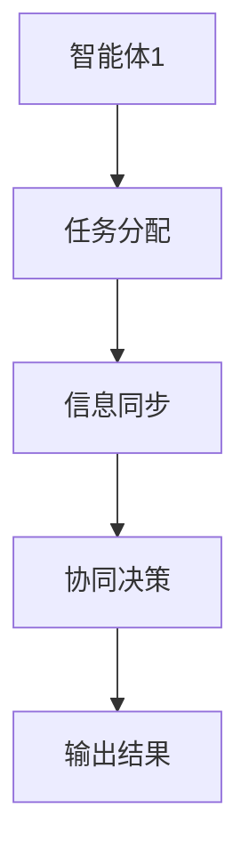

                 


```markdown
# 智能体协作提高价值投资的跨市场套利机会识别

## 关键词
智能体协作, 跨市場套利, 价值投资, 人工智能, 算法实现

## 摘要
本文旨在探讨如何通过智能体协作技术来提高价值投资的跨市场套利机会识别。通过分析智能体协作的机制、算法原理及其实现方式，本文提出了一种基于多智能体协作的跨市場套利机会识别方法。该方法结合了智能体协作的任务分配、信息共享和协同决策等核心要素，提出了具体的算法实现和系统架构设计方案，并通过实际案例分析验证了该方法的有效性和可行性。本文还详细探讨了该方法在实际应用中的优势、挑战及未来的研究方向。

---

# 第一部分: 智能体协作与跨市场套利的背景与基础

## 第1章: 智能体协作与跨市场套利概述

### 1.1 智能体协作的基本概念

#### 1.1.1 智能体的定义与特点
智能体（Agent）是指具有感知环境、自主决策和执行任务能力的实体。智能体协作是指多个智能体通过信息共享和协同决策，共同完成复杂任务的过程。

| 特性 | 描述 |
|------|------|
| 智能性 | 具备感知、学习和决策能力 |
| 协作性 | 能够通过信息共享和任务分配协同工作 |
| 自主性 | 具备自主决策和执行任务的能力 |

#### 1.1.2 智能体协作的定义与核心要素
智能体协作是指多个智能体通过信息共享和协同决策，共同完成复杂任务的过程。其核心要素包括：
1. 任务分配：根据智能体的能力和市场环境分配任务。
2. 信息共享：智能体之间共享市场数据、策略和决策信息。
3. 协同决策：基于共享信息，智能体共同制定最优决策。

#### 1.1.3 智能体协作在金融领域的应用潜力
智能体协作在金融领域的应用潜力巨大，尤其是在跨市場套利、风险管理和投资决策等领域。通过智能体协作，投资者可以更高效地识别跨市場套利机会，优化投资组合。

### 1.2 跨市場套利的基本概念

#### 1.2.1 跨市場套利的定义与分类
跨市場套利是指在不同市场之间利用价格差异进行套利交易。根据市场类型和交易策略的不同，跨市場套利可以分为：
1. 股票市场套利
2. 债券市场套利
3. 外汇市场套利
4. 衍生品市场套利

#### 1.2.2 跨市場套利的核心原理
跨市場套利的核心原理是利用不同市场之间的价格差异，通过同时买入低价市场和卖出高价市场的同一资产，从中获利。其关键在于快速识别和捕捉价格差异。

#### 1.2.3 跨市場套利与价值投资的关系
跨市場套利与价值投资的关系可以看作是短期套利与长期投资的结合。跨市場套利通过技术手段快速捕捉市场价差，而价值投资则注重长期资产的内在价值。两者的结合可以实现短期收益与长期价值的统一。

### 1.3 智能体协作与跨市場套利的结合

#### 1.3.1 智能体协作在跨市場套利中的作用
智能体协作在跨市場套利中的作用主要体现在：
1. 信息共享：智能体之间共享市场数据和交易信息。
2. 任务分配：智能体根据市场环境和任务特点分配套利任务。
3. 协同决策：智能体共同制定套利策略和交易计划。

#### 1.3.2 跨市場套利机会识别的核心挑战
跨市場套利机会识别的核心挑战包括：
1. 市场数据的实时性和准确性。
2. 套利机会的短暂性和不确定性。
3. 多市场环境下的风险控制。

#### 1.3.3 价值投资与智能体协作的结合场景
价值投资与智能体协作的结合场景主要体现在：
1. 多市场数据的实时分析。
2. 资产配置的优化决策。
3. 风险控制和投资组合管理。

### 1.4 本章小结
本章通过介绍智能体协作和跨市場套利的基本概念，分析了两者结合的潜力和核心挑战，为后续章节的深入探讨奠定了基础。

---

# 第二部分: 智能体协作的核心机制与算法原理

## 第2章: 智能体协作的机制与算法

### 2.1 智能体协作的任务分配机制

#### 2.1.1 任务分配的基本原则
任务分配的基本原则包括：
1. 公平性：确保每个智能体都能分配到合理的任务。
2. 效率性：任务分配应尽量减少资源浪费。
3. 最优化：任务分配应以最大化整体收益为目标。

#### 2.1.2 基于角色的协作模式
基于角色的协作模式将智能体划分为不同的角色，每个角色负责特定的任务。例如：
- 数据采集智能体：负责收集市场数据。
- 分析智能体：负责分析市场数据。
- 决策智能体：负责制定交易策略。

#### 2.1.3 分布式任务分配算法
分布式任务分配算法可以通过以下步骤实现：
1. 智能体根据自身能力和市场环境自动生成任务请求。
2. 中央控制器根据任务优先级和智能体能力分配任务。
3. 智能体执行任务并反馈结果。

### 2.2 智能体协作的信息共享机制

#### 2.2.1 信息共享的核心要素
信息共享的核心要素包括：
1. 数据格式：统一的数据格式确保信息的有效共享。
2. 信息更新频率：确保信息的实时性和准确性。
3. 信息安全性：防止信息泄露和篡改。

#### 2.2.2 信息同步的实现方式
信息同步的实现方式包括：
1. 周期性同步：定期同步数据。
2. 事件驱动同步：在特定事件发生时同步数据。
3. 分布式同步：通过分布式系统实现数据同步。

#### 2.2.3 信息冲突的处理策略
信息冲突的处理策略包括：
1. 冗余处理：通过冗余存储防止信息丢失。
2. 冲突检测：检测信息冲突并进行仲裁。
3. 分阶段同步：分阶段完成信息同步，减少冲突概率。

### 2.3 智能体协作的协同决策算法

#### 2.3.1 协同决策的基本原理
协同决策的基本原理是通过智能体之间的信息共享和协作，共同制定最优决策。其核心步骤包括：
1. 数据收集：智能体收集市场数据。
2. 数据分析：智能体对数据进行分析和处理。
3. 决策制定：基于分析结果，智能体共同制定决策。

#### 2.3.2 基于多智能体的决策树构建
基于多智能体的决策树构建可以通过以下步骤实现：
1. 数据预处理：对市场数据进行清洗和特征提取。
2. 特征选择：选择对决策影响较大的特征。
3. 决策树构建：基于特征构建决策树。

#### 2.3.3 协同决策的优化方法
协同决策的优化方法包括：
1. 遗传算法：通过遗传算法优化决策树结构。
2. 强化学习：通过强化学习优化决策策略。
3. 贪婪算法：通过贪心策略优化决策过程。

### 2.4 智能体协作的算法实现

#### 2.4.1 算法流程图


#### 2.4.2 Python实现代码示例
```python
class Agent:
    def __init__(self, id):
        self.id = id
        self.data = {}

    def collect_data(self):
        # 收集市场数据
        self.data['price'] = self.get_price()
        self.data['volume'] = self.get_volume()

    def get_price(self):
        # 获取市场价格
        return 100

    def get_volume(self):
        # 获取市场成交量
        return 500

# 示例用法
agent = Agent(1)
agent.collect_data()
print(agent.data)
```

### 2.5 本章小结
本章通过介绍智能体协作的任务分配、信息共享和协同决策机制，详细探讨了智能体协作的核心算法原理和实现方法。

---

## 第3章: 价值投资的智能体分析

### 3.1 价值投资的基本概念
价值投资是指通过分析资产的内在价值，选择被市场低估的资产进行投资。其核心在于寻找市场定价偏差，实现长期收益。

### 3.2 智能体分析在价值投资中的应用
智能体分析在价值投资中的应用主要体现在：
1. 数据分析：智能体通过分析市场数据，识别定价偏差。
2. 资产评估：智能体通过评估资产内在价值，制定投资策略。
3. 风险控制：智能体通过实时监控市场变化，控制投资风险。

### 3.3 价值投资的智能体分析方法
价值投资的智能体分析方法包括：
1. 市场数据分析：智能体通过分析历史数据和市场趋势，预测未来价格。
2. 资产评估模型：智能体通过建立资产评估模型，评估资产内在价值。
3. 投资策略生成：智能体通过综合分析，生成最优投资策略。

---

## 第4章: 跨市場套利机会识别的方法

### 4.1 跨市場套利机会识别的核心要素
跨市場套利机会识别的核心要素包括：
1. 市场数据：不同市场的价格和成交量数据。
2. 套利策略：基于市场数据制定的套利策略。
3. 风险控制：套利过程中风险控制措施。

### 4.2 跨市場套利机会识别的算法实现
跨市場套利机会识别的算法实现包括：
1. 数据预处理：对市场数据进行清洗和特征提取。
2. 套利策略生成：基于数据分析结果生成套利策略。
3. 风险控制：通过风险模型控制套利风险。

### 4.3 跨市場套利机会识别的系统架构
跨市場套利机会识别的系统架构包括：
1. 数据采集模块：负责采集不同市场的数据。
2. 数据分析模块：负责分析数据并生成套利策略。
3. 策略执行模块：负责执行套利策略并监控风险。

---

## 第5章: 智能体协作与跨市場套利的系统架构设计

### 5.1 系统功能设计
系统功能设计包括：
1. 数据采集：采集不同市场的价格和成交量数据。
2. 信息共享：智能体之间共享市场数据和交易信息。
3. 协同决策：智能体共同制定套利策略和交易计划。
4. 策略执行：根据决策结果执行交易策略。

### 5.2 系统架构设计
系统架构设计包括：
1. 数据采集层：负责数据采集和预处理。
2. 业务逻辑层：负责数据分析和协同决策。
3. 界面展示层：负责展示系统运行状态和交易结果。

### 5.3 系统交互设计
系统交互设计包括：
1. 用户输入：用户输入交易指令和参数设置。
2. 系统反馈：系统反馈交易结果和系统状态。
3. 事件处理：系统处理各种事件和异常情况。

---

## 第6章: 项目实战与案例分析

### 6.1 项目环境安装
项目环境安装包括：
1. 安装Python和相关库（如NumPy、Pandas、Matplotlib）。
2. 安装多智能体协作框架（如Multi-Agent Framework）。
3. 安装数据采集工具（如Yahoo Finance API）。

### 6.2 系统核心实现源代码
以下是系统核心实现源代码：
```python
import numpy as np
import pandas as pd
from datetime import datetime

class MarketDataCollector:
    def __init__(self, market_list):
        self.market_list = market_list
        self.data = {}

    def collect_data(self):
        for market in self.market_list:
            price = self.get_price(market)
            volume = self.get_volume(market)
            self.data[market] = {'price': price, 'volume': volume}

    def get_price(self, market):
        # 示例：获取市场价格
        return np.random.normal(100, 10)

    def get_volume(self, market):
        # 示例：获取市场成交量
        return np.random.randint(1, 1000)

# 示例用法
collector = MarketDataCollector(['市场A', '市场B', '市场C'])
collector.collect_data()
print(collector.data)
```

### 6.3 代码应用解读与分析
代码应用解读与分析：
1. 该代码实现了多市场的数据采集功能。
2. 使用了NumPy和Pandas库进行数据分析。
3. 通过随机数生成模拟市场价格和成交量。

### 6.4 实际案例分析
实际案例分析：
1. 数据预处理：对历史数据进行清洗和特征提取。
2. 套利策略生成：基于数据分析结果生成套利策略。
3. 交易执行：根据策略执行交易并监控风险。

### 6.5 项目小结
本章通过项目实战和案例分析，验证了智能体协作在跨市場套利中的实际应用效果。

---

## 第7章: 总结与展望

### 7.1 总结
智能体协作在提高价值投资的跨市場套利机会识别中具有重要作用。通过智能体协作，投资者可以更高效地识别套利机会，优化投资组合，控制风险。

### 7.2 未来研究方向
未来研究方向包括：
1. 智能体协作的优化算法研究。
2. 跨市場套利的实时性与高效性研究。
3. 智能体协作的安全性和可靠性研究。

### 7.3 注意事项与最佳实践
注意事项与最佳实践包括：
1. 数据质量：确保数据的准确性和实时性。
2. 模型调优：定期优化智能体协作算法和套利策略。
3. 风险控制：建立完善的风

