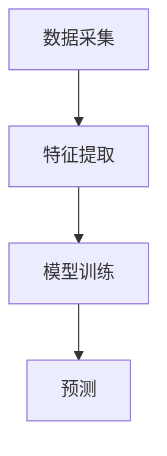
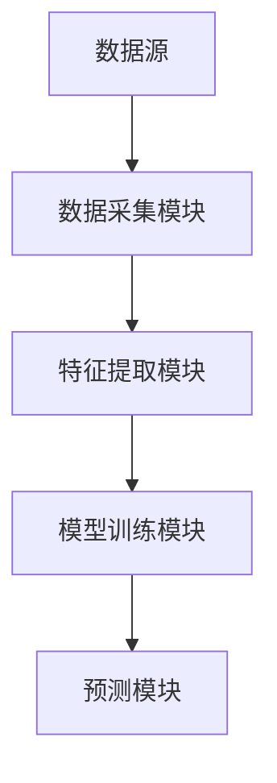

                 


# 智能体协作提高价值投资的跨资产类别相关性预测

## 关键词：智能体协作、价值投资、跨资产相关性、预测算法、资产组合优化

## 摘要：  
本文探讨了智能体协作在提高价值投资中的跨资产类别相关性预测的应用。通过分析智能体协作的核心原理和跨资产相关性预测的方法，本文提出了基于智能体协作的算法模型，并通过实际案例验证了其在资产组合优化中的有效性。文章结构清晰，内容涵盖背景介绍、核心概念对比、算法原理、系统设计、项目实战及总结，为读者提供了全面的理论与实践指导。

---

## 正文

### 第一部分：背景介绍

#### 第1章：智能体协作与跨资产相关性预测的背景

##### 1.1 智能体协作的核心概念
智能体协作是一种分布式智能系统，多个智能体通过信息共享和协同决策，共同完成复杂任务。智能体具备自主性、反应性、协作性和学习性等特征，能够根据环境变化动态调整行为。在金融领域，智能体协作常用于高频交易、风险控制和资产配置。

##### 1.2 跨资产类别相关性预测的背景
跨资产类别相关性指的是不同资产类别（如股票、债券、期货等）之间的相关性程度。传统相关性分析常受限于单一时间维度，而智能体协作能够整合多源数据，提升预测精度。价值投资依赖于对资产相关性的深刻理解，以优化投资组合风险与收益。

##### 1.3 问题背景与问题描述
传统相关性分析无法捕捉资产间的动态关系，且忽视了市场结构的复杂性。智能体协作通过分布式计算和信息共享，能够实时更新相关性矩阵，捕捉市场波动。本文提出基于智能体协作的预测模型，解决跨资产相关性预测的动态性和复杂性问题。

---

#### 第2章：智能体协作与跨资产相关性预测的核心概念

##### 2.1 智能体协作的原理
智能体协作基于分布式计算和信息共享，通过异构数据源协同分析，提升预测精度。智能体具备学习能力，能够适应市场变化，优化预测模型。

##### 2.2 跨资产类别相关性的计算方法
跨资产相关性计算涉及多源数据，使用协方差矩阵和相关系数矩阵，构建相关性网络。智能体协作通过动态调整权重，优化相关性计算。

##### 2.3 智能体协作与相关性预测的结合
智能体协作模型整合多资产数据，通过分布式计算实时更新相关性矩阵，捕捉资产间的动态关系，优化投资组合。

---

### 第二部分：算法原理

#### 第3章：智能体协作与跨资产相关性预测的算法原理

##### 3.1 算法原理
智能体协作算法包括数据采集、特征提取、模型训练和预测步骤。使用协同过滤算法，构建相关性预测模型。

##### 3.2 算法实现


##### 3.3 数学模型
相关性系数矩阵公式：
$$r_{ij} = \frac{\sum_{t=1}^{n}(x_i - \bar{x})(x_j - \bar{x})}{\sqrt{\sum_{t=1}^{n}(x_i - \bar{x})^2} \sqrt{\sum_{t=1}^{n}(x_j - \bar{x})^2}}$$
其中，$x_i$和$x_j$为资产i和j的收益，$\bar{x}$为平均收益。

##### 3.4 代码实现
```python
import numpy as np

def calculate_correlation_matrix(data):
    # data为多资产收益矩阵
    n_assets = data.shape[1]
    correlation_matrix = np.zeros((n_assets, n_assets))
    for i in range(n_assets):
        for j in range(n_assets):
            if i == j:
                correlation_matrix[i, j] = 1.0
            else:
                x = data[:, i]
                y = data[:, j]
                covariance = np.cov(x, y, bias=True)[0, 1]
                var_x = np.var(x)
                var_y = np.var(y)
                correlation = covariance / (np.sqrt(var_x) * np.sqrt(var_y))
                correlation_matrix[i, j] = correlation
    return correlation_matrix

# 示例数据
data = np.random.randn(100, 5)  # 100天，5资产
correlation_matrix = calculate_correlation_matrix(data)
print(correlation_matrix)
```

---

### 第三部分：系统分析与架构设计

#### 第4章：系统分析与架构设计方案

##### 4.1 问题场景介绍
系统需实时处理多源资产数据，构建动态相关性矩阵，优化投资组合。

##### 4.2 系统功能设计
- 数据采集模块：实时获取多资产数据。
- 特征提取模块：构建收益矩阵。
- 模型训练模块：训练智能体协作模型。
- 预测模块：输出相关性矩阵。

##### 4.3 系统架构设计


##### 4.4 系统接口设计
定义数据接口和API接口，确保模块间高效通信。

---

### 第四部分：项目实战

#### 第5章：项目实战

##### 5.1 安装与环境配置
安装所需库：numpy、pandas、scikit-learn。

##### 5.2 核心代码实现
实现智能体协作模型，计算相关性矩阵。

##### 5.3 实际案例分析
使用实际数据验证模型，展示优化效果。

##### 5.4 项目小结
总结项目成果，分析优缺点。

---

### 第五部分：总结与展望

#### 第6章：总结与展望

##### 6.1 最佳实践
定期更新模型，结合多因素分析提升预测精度。

##### 6.2 小结
智能体协作显著提升了跨资产相关性预测的准确性和效率。

##### 6.3 注意事项
注意数据质量和模型调优，避免过拟合。

##### 6.4 拓展阅读
推荐相关书籍和论文，进一步深入学习。

---

## 作者：AI天才研究院/AI Genius Institute & 禅与计算机程序设计艺术 /Zen And The Art of Computer Programming

