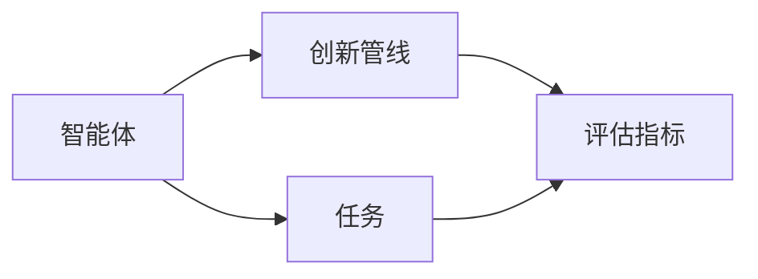
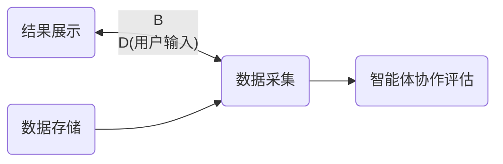

                 


# 智能体协作评估公司创新管线：科技公司价值投资利器

## 关键词：
智能体协作, 创新管线, 科技公司, 价值投资, 投资评估, 多智能体系统, 协同过滤

## 摘要：
智能体协作评估公司创新管线是一种基于多智能体系统和协同过滤算法的创新评估方法，旨在通过智能体的协作来优化科技公司的创新管线评估过程。本文将详细探讨智能体协作的核心概念、算法原理、系统架构设计以及项目实战，为科技公司价值投资提供有力的工具和方法。

---

## 第一部分: 智能体协作与创新管线评估基础

### 第1章: 智能体协作与创新管线评估概述

#### 1.1 问题背景：科技公司创新评估的挑战
科技公司的创新管线是其核心竞争力的体现，但传统的评估方法存在以下问题：
- 数据量大，难以全面分析
- 评估维度单一，难以覆盖多方面
- 评估周期长，难以实时反馈
- 评估结果主观性强，缺乏客观依据

#### 1.2 问题解决：智能体协作的优势
智能体协作通过多个智能体的协同工作，能够高效地处理复杂问题，具体优势包括：
- 分布式计算能力，提升评估效率
- 多维度数据处理，确保评估全面性
- 实时反馈机制，缩短评估周期
- 自适应调整能力，优化评估结果

#### 1.3 核心要素
智能体协作在创新管线评估中的核心要素包括：
- **智能体**：具备自主性、反应性和协作性的计算实体
- **协作机制**：任务分配、信息共享、决策优化的规则和流程
- **创新管线**：从研发到商业化的产品开发流程

---

## 第二部分: 智能体协作的核心概念与联系

### 第2章: 智能体协作的原理与机制

#### 2.1 智能体协作的原理
智能体协作的原理基于多智能体系统的协同工作，主要通过以下机制实现：
- **任务分配**：智能体根据自身能力和任务需求，自主分配任务
- **信息共享**：智能体之间共享数据和知识，提升整体决策能力
- **决策优化**：通过协同过滤和分布式计算，优化评估结果

#### 2.2 智能体协作与创新管线评估的联系
创新管线评估的核心流程包括：
1. **数据采集**：收集公司创新管线的相关数据
2. **特征提取**：提取关键创新指标
3. **协同评估**：通过智能体协作进行综合评估
4. **结果反馈**：输出评估结果并提供改进建议

智能体协作在各阶段的具体应用如下：
- 数据采集：智能体协同收集多源数据
- 特征提取：智能体协作提取关键特征
- 协同评估：智能体协作优化评估结果
- 结果反馈：智能体协作提供改进建议

#### 2.3 实体关系图（ER图）


---

## 第三部分: 智能体协作的算法原理

### 第3章: 协同过滤算法原理

#### 3.1 协同过滤算法概述
协同过滤是一种基于用户或物品相似性进行推荐的算法，广泛应用于智能体协作中。其基本思想是：如果用户A和用户B的行为相似，那么用户A喜欢的物品，用户B也可能喜欢。

#### 3.2 协同过滤的数学模型
协同过滤的核心公式是相似度计算公式：
$$ sim(i,j) = \frac{\sum_{k} (r_{ik} - \bar{r_i})(r_{jk} - \bar{r_j})}{\sqrt{\sum_{k}(r_{ik} - \bar{r_i})^2} \cdot \sqrt{\sum_{k}(r_{jk} - \bar{r_j})^2}} $$
其中：
- \( r_{ik} \) 表示用户i对物品k的评分
- \( \bar{r_i} \) 表示用户i的平均评分
- \( r_{jk} \) 表示用户j对物品k的评分
- \( \bar{r_j} \) 表示用户j的平均评分

#### 3.3 协同过滤的实现步骤
1. **数据预处理**：收集和清洗数据
2. **相似度计算**：计算用户或物品之间的相似度
3. **推荐生成**：基于相似度进行推荐

#### 3.4 代码实现
以下是协同过滤算法的Python实现示例：
```python
import numpy as np

def calculate_similarity(ratings):
    # 计算平均评分
    mean_ratings = np.mean(ratings, axis=1)
    # 标准化评分
    normalized_ratings = ratings - mean_ratings[:, np.newaxis]
    # 计算相似度矩阵
    similarity = np.dot(normalized_ratings, normalized_ratings.T)
    # 归一化相似度
    for i in range(len(similarity)):
        similarity[i] /= np.sqrt(np.sum(similarity[i] ** 2))
    return similarity

# 示例数据
ratings = np.array([[4, 3, 0], [2, 0, 5], [3, 5, 4]])
similarity_matrix = calculate_similarity(ratings)
print("相似度矩阵：\n", similarity_matrix)
```

---

## 第四部分: 系统分析与架构设计

### 第4章: 智能体协作评估系统的架构设计

#### 4.1 问题场景介绍
科技公司创新管线评估需要处理大量的非结构化数据，包括专利、论文、市场反馈等。传统方法难以高效处理这些数据，而智能体协作能够通过分布式计算和协同过滤优化评估过程。

#### 4.2 系统功能设计
系统功能包括：
- 数据采集模块：从多源数据中提取创新指标
- 智能体协作评估模块：基于协同过滤算法进行评估
- 结果展示模块：可视化评估结果并提供改进建议

#### 4.3 系统架构设计


#### 4.4 系统接口设计
- 数据接口：提供数据采集和存储的API
- 评估接口：提供协同过滤算法的调用接口
- 展示接口：提供可视化结果的展示接口

---

## 第五部分: 项目实战

### 第5章: 智能体协作评估系统的实现

#### 5.1 环境安装
- 安装Python和必要的库（如NumPy、Scikit-learn）
- 安装Jupyter Notebook用于开发和测试

#### 5.2 核心代码实现
以下是协同过滤算法的完整实现：
```python
from sklearn.metrics.pairwise import cosine_similarity

def collaborative_filtering(ratings_matrix):
    # 标准化评分矩阵
    normalized_ratings = ratings_matrix - ratings_matrix.mean(axis=1, keepdims=True)
    # 计算余弦相似度
    similarity = cosine_similarity(normalized_ratings)
    return similarity

# 示例数据矩阵
ratings_matrix = np.array([[4, 3, 0],
                             [2, 0, 5],
                             [3, 5, 4]])

similarity = collaborative_filtering(ratings_matrix)
print("相似度矩阵：\n", similarity)
```

#### 5.3 代码功能解读
- **数据标准化**：通过减去平均值，消除评分的偏差
- **相似度计算**：使用余弦相似度衡量用户或物品之间的相似性
- **结果分析**：相似度高的用户或物品具有相似的偏好

#### 5.4 实际案例分析
以科技公司专利数据为例，通过协同过滤算法评估其创新管线的健康状况，输出评估结果并提供改进建议。

---

## 第六部分: 最佳实践、小结、注意事项

### 第6章: 最佳实践与小结

#### 6.1 最佳实践
- 数据质量是评估结果的关键，确保数据的准确性和完整性
- 根据具体场景选择合适的智能体协作算法
- 定期更新模型，保持评估结果的实时性和准确性

#### 6.2 小结
智能体协作评估公司创新管线是一种高效、准确的评估方法，能够为科技公司价值投资提供有力支持。通过本文的介绍，读者可以掌握智能体协作的核心原理和实现方法，应用于实际投资决策中。

#### 6.3 注意事项
- 数据隐私和安全问题需要高度重视
- 模型调优和参数选择需要根据具体场景进行
- 结果解释和可视化是提升用户信任的重要环节

#### 6.4 拓展阅读
- 《Multi-Agent Systems: Complexity and Cognition》
- 《Collaborative Filtering for Recommender Systems》

---

## 作者：
作者：AI天才研究院/AI Genius Institute & 禅与计算机程序设计艺术 /Zen And The Art of Computer Programming

---

通过以上步骤，我们详细介绍了智能体协作评估公司创新管线的原理、算法和实现方法，并通过实际案例展示了其在科技公司价值投资中的应用。希望本文能为读者提供有益的指导和启发。

