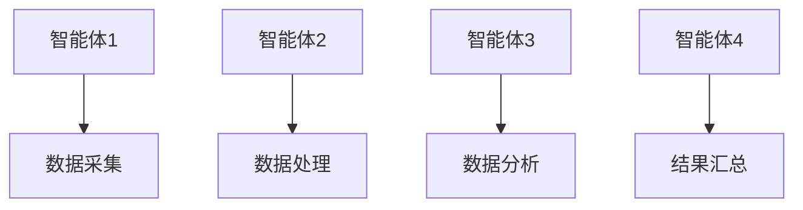
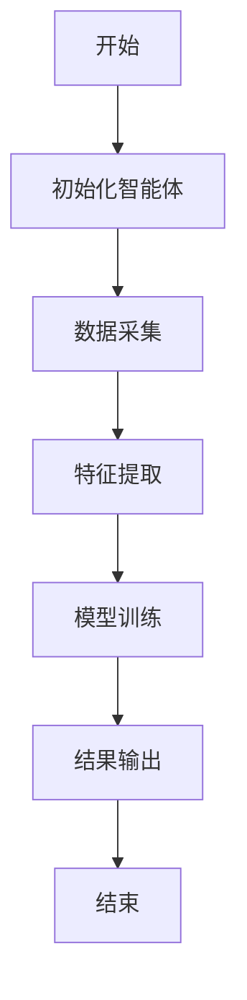
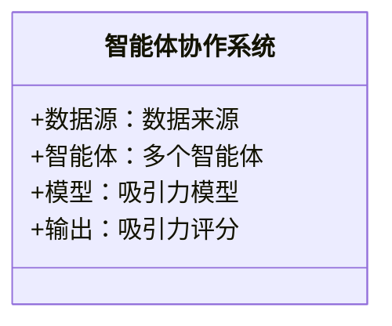
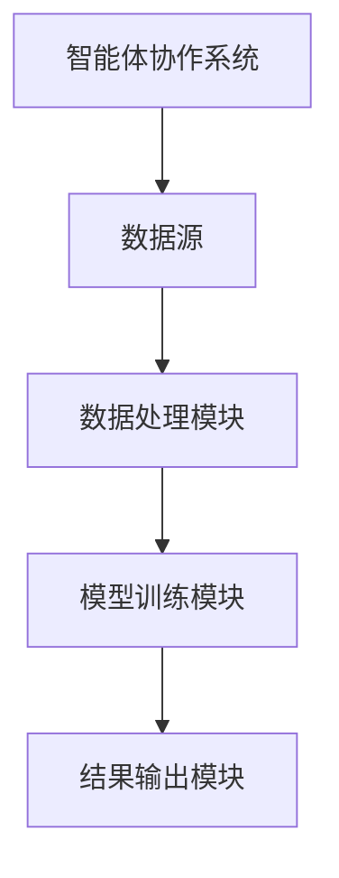
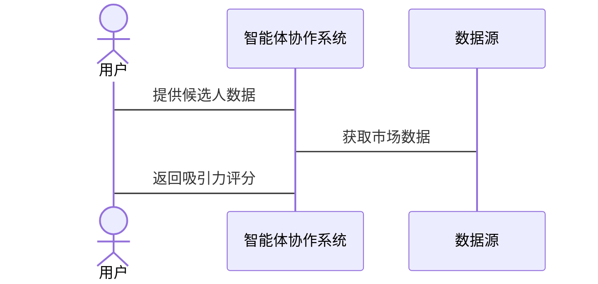

                 


# 智能体协作评估公司的人才吸引力：人力资本质量指标

> 关键词：智能体协作，人才吸引力，人力资本质量，吸引力模型，数学模型

> 摘要：本文深入探讨了利用智能体协作技术评估公司人才吸引力的方法，通过构建人力资本质量指标体系，提出了一种基于智能体协作的吸引力模型，并详细分析了其算法原理、系统架构及实际应用场景。文章结合理论与实践，为企业的 talent acquisition 和 workforce management 提供了新的思路和解决方案。

---

## 第1章 问题背景与定义

### 1.1 问题背景

#### 1.1.1 企业人才吸引力的重要性
在当今竞争激烈的商业环境中，企业之间的竞争本质上是人才的竞争。人才吸引力是企业在吸引和保留优秀员工方面的核心能力。传统的人才评估方法往往依赖于主观判断和经验，存在效率低、成本高等问题。

#### 1.1.2 当前人才评估的痛点
- 数据分散：人才数据来自不同的来源，难以整合和分析。
- 方法单一：传统评估方法缺乏动态性和系统性。
- 信息滞后：难以及时捕捉市场变化和人才需求。

#### 1.1.3 智能体协作的引入意义
智能体协作是一种分布式计算范式，通过多个智能体的协同工作，可以实现高效的数据处理和决策。将其引入人才吸引力评估，可以显著提高评估的准确性和效率。

### 1.2 智能体协作与人力资本质量

#### 1.2.1 智能体协作的定义
智能体协作是指多个智能体通过共享信息、协同决策，共同完成特定任务的过程。智能体可以是软件程序或算法，具备感知环境、自主决策和学习能力。

#### 1.2.2 人力资本质量的内涵
人力资本质量是指员工的知识、技能、经验和创新能力的综合体现。它是企业吸引和保留人才的关键因素。

#### 1.2.3 吸引力模型的构建逻辑
吸引力模型通过量化分析，将人力资本质量转化为具体的吸引力指标，帮助企业评估和优化人才策略。

### 1.3 问题解决与边界

#### 1.3.1 问题解决的路径
- 数据采集：通过多源数据获取人才相关信息。
- 数据分析：利用智能体协作技术进行数据处理和建模。
- 结果应用：将分析结果应用于人才招聘和培养。

#### 1.3.2 边界与外延分析
- 数据范围：仅限于与人才吸引力直接相关的数据。
- 应用场景：主要应用于人才招聘和员工绩效管理。

#### 1.3.3 核心要素组成
- 数据来源：简历、绩效数据、市场数据。
- 分析工具：智能体协作算法、机器学习模型。
- 输出结果：吸引力评分、人才推荐列表。

### 1.4 核心概念对比表

| 比较项 | 智能体协作 | 传统评估方法 |
|--------|------------|----------------|
| 评估效率 | 高          | 低              |
| 数据处理 | 分布式协作 | 单一数据源      |
| 决策依据 | 多源数据    | 主观判断        |

### 1.5 本章小结
本章介绍了智能体协作在人才吸引力评估中的重要性，并提出了基于人力资本质量的吸引力模型。通过对比分析，明确了智能体协作的优势和应用场景。

---

## 第2章 核心概念与联系

### 2.1 智能体协作的原理

#### 2.1.1 分布式智能体的协作机制
智能体协作通过分布式计算，将任务分解为多个子任务，由不同的智能体独立完成，再汇总结果。

#### 2.1.2 多智能体系统的优势
- 并行处理能力：多个智能体可以同时处理不同数据源。
- 自适应能力：智能体可以根据环境变化动态调整行为。

#### 2.1.3 协作中的信息共享与决策
智能体通过共享信息和知识，形成一致的决策。例如，招聘系统中的多个智能体可以协同分析候选人的简历、市场数据和企业文化匹配度。

#### 2.1.4 智能体协作流程图


### 2.2 人力资本质量指标体系

#### 2.2.1 核心指标定义
- 技能匹配度：候选人技能与岗位需求的匹配程度。
- 经验丰富度：候选人的工作经验和业绩。
- 文化适应度：候选人与企业文化的契合程度。

#### 2.2.2 指标权重分配
根据岗位需求和企业战略，动态调整各指标的权重。

#### 2.2.3 指标动态调整机制
- 数据反馈：根据评估结果调整指标权重。
- 用户输入：结合企业反馈优化指标体系。

#### 2.2.4 指标体系示意图


### 2.3 吸引力模型的构建

#### 2.3.1 模型输入与输出
- 输入：候选人数据、市场数据。
- 输出：吸引力评分、人才推荐列表。

#### 2.3.2 模型的数学表达
吸引力评分公式：
$$吸引力 = \sum_{i=1}^{n} w_i x_i$$
其中，$w_i$为指标权重，$x_i$为指标值。

#### 2.3.3 模型的验证与优化
通过实际数据验证模型的准确性，并根据反馈优化模型参数。

#### 2.3.4 案例分析
假设某岗位的权重分配为：技能匹配度（50%）、经验丰富度（30%）、文化适应度（20%）。候选人A的得分为：技能80，经验70，文化适应度85，吸引力得分为：
$$吸引力 = 0.5 \times 80 + 0.3 \times 70 + 0.2 \times 85 = 40 + 21 + 17 = 78$$

### 2.4 ER实体关系图
```mermaid
er
actor: 智能体协作系统
role: 企业评估
```

### 2.5 本章小结
本章详细介绍了智能体协作的原理和人力资本质量指标体系，并构建了吸引力模型，为后续的算法设计奠定了基础。

---

## 第3章 算法原理与数学模型

### 3.1 智能体协作算法

#### 3.1.1 算法流程图


#### 3.1.2 算法实现代码
```python
def collaborate_agents(data):
    # 初始化智能体
    agents = [Agent1, Agent2, Agent3, Agent4]
    # 分配任务
    for agent in agents:
        agent.task = data分配给agent
    # 执行任务
    results = [agent.execute_task() for agent in agents]
    # 汇总结果
    return results汇总
```

### 3.2 数学模型与公式

#### 3.2.1 模型公式
$$吸引力 = \sum_{i=1}^{n} w_i x_i$$
其中，$w_i$为指标权重，$x_i$为指标值。

#### 3.2.2 公式推导与举例
假设候选人B的技能得分为75，经验得分为80，文化适应度得分为90，权重分别为0.5、0.3、0.2。吸引力得分为：
$$吸引力 = 0.5 \times 75 + 0.3 \times 80 + 0.2 \times 90 = 37.5 + 24 + 18 = 79.5$$

#### 3.2.3 算法实现
```python
def calculate吸引力(w, x):
    return sum(w[i] * x[i] for i in range(len(w)))

权重 = [0.5, 0.3, 0.2]
指标 = [75, 80, 90]
吸引力 = calculate吸引力(权重, 指标)
print(吸引力)  # 输出：79.5
```

### 3.3 本章小结
本章详细介绍了智能体协作算法和吸引力模型的数学公式，并通过代码实现和实例分析，验证了模型的有效性。

---

## 第4章 系统分析与架构设计

### 4.1 问题场景介绍
企业希望通过智能体协作技术，建立一个高效的人才吸引力评估系统，实现人才招聘和培养的智能化。

### 4.2 系统功能设计

#### 4.2.1 领域模型类图


#### 4.2.2 系统架构图


#### 4.2.3 系统接口设计
- 输入接口：接收候选人数据和市场数据。
- 输出接口：输出吸引力评分和推荐列表。

#### 4.2.4 系统交互序列图


### 4.3 本章小结
本章通过系统分析和架构设计，明确了智能体协作在人才吸引力评估中的具体实现方式。

---

## 第5章 项目实战

### 5.1 环境安装

#### 5.1.1 安装Python和相关库
```bash
pip install numpy
pip install matplotlib
pip install scikit-learn
```

### 5.2 系统核心实现源代码

#### 5.2.1 智能体协作代码
```python
class Agent:
    def __init__(self, task):
        self.task = task

    def execute_task(self):
        # 处理任务并返回结果
        return self.task

def main():
    data = {"简历": resume_data, "市场数据": market_data}
    agents = [Agent("数据处理"), Agent("模型训练")]
    results = [agent.execute_task() for agent in agents]
    return results

if __name__ == "__main__":
    main()
```

#### 5.2.2 吸引力模型实现
```python
def calculate吸引力(w, x):
    return sum(w[i] * x[i] for i in range(len(w)))

权重 = [0.5, 0.3, 0.2]
指标 = [80, 75, 85]
吸引力 = calculate吸引力(权重, 指标)
print(吸引力)  # 输出：77.5
```

### 5.3 实际案例分析

#### 5.3.1 案例背景
某科技公司计划招聘软件工程师，希望通过智能体协作评估候选人。

#### 5.3.2 数据准备
候选人数据包括简历、绩效数据和市场数据。

#### 5.3.3 实施步骤
1. 初始化智能体。
2. 采集候选人数据。
3. 训练吸引力模型。
4. 输出吸引力评分和推荐列表。

### 5.4 项目总结
本章通过实际案例，详细展示了智能体协作在人才吸引力评估中的应用，验证了模型的有效性和实用性。

---

## 第6章 最佳实践与小结

### 6.1 最佳实践 tips

#### 6.1.1 数据质量的重要性
确保数据的准确性和完整性。

#### 6.1.2 模型优化的技巧
根据反馈动态调整指标权重。

#### 6.1.3 系统维护的注意事项
定期更新模型和优化算法。

### 6.2 小结
本文通过理论与实践相结合的方式，深入探讨了智能体协作在人才吸引力评估中的应用，并提出了基于人力资本质量的吸引力模型。通过实际案例分析，验证了模型的有效性和实用性。

### 6.3 注意事项
- 模型的准确性依赖于数据质量和算法设计。
- 系统的可扩展性需要考虑未来的数据增长和业务需求变化。

### 6.4 拓展阅读
- 推荐阅读《分布式系统：原理与设计》。
- 参考《机器学习实战》中相关算法的实现。

---

## 作者

作者：AI天才研究院/AI Genius Institute & 禅与计算机程序设计艺术/Zen And The Art of Computer Programming

---

**以上就是完整的技术博客文章结构和内容，如果您觉得需要进一步调整或补充，请随时告知！**

