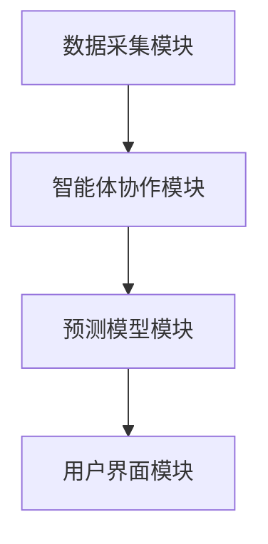
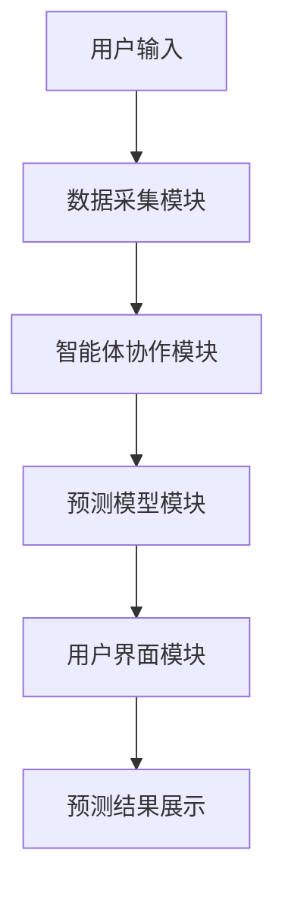

                 


# 智能体协作评估公司的创新生态系统：预测长期竞争力

**关键词**：智能体协作、创新生态系统、企业竞争力、预测模型、人工智能、多智能体系统、创新评估

**摘要**：  
随着人工智能技术的快速发展，智能体协作在企业创新生态系统中的作用日益凸显。本文通过分析智能体协作的核心原理、创新生态系统评估模型的设计、基于智能体协作的竞争力预测方法，以及系统设计与实现，为企业管理者和技术研究人员提供了一种全新的视角来评估和预测公司的长期竞争力。通过实际案例分析和项目实战，本文展示了如何利用智能体协作技术构建创新生态系统评估模型，并预测公司的未来表现。

---

# 第1章: 智能体协作与创新生态系统概述

## 1.1 智能体协作的基本概念

### 1.1.1 智能体的定义与特点

智能体（Agent）是具有感知和自主决策能力的实体，能够根据环境信息做出反应。智能体的特点包括自主性、反应性、目标导向性和社交能力。自主性意味着智能体能够独立完成任务；反应性意味着智能体能够感知环境并实时调整行为；目标导向性意味着智能体的行为以实现特定目标为导向；社交能力意味着智能体能够与其他智能体或人类进行交互协作。

### 1.1.2 智能体协作的定义与核心要素

智能体协作是指多个智能体通过共享信息、分配任务和协调行动来共同完成复杂目标的过程。其核心要素包括通信机制、协调算法、任务分配和冲突解决。通信机制确保智能体之间的信息共享；协调算法确保智能体行为的一致性；任务分配确保资源的合理利用；冲突解决机制则确保协作过程中的矛盾能够得到有效处理。

### 1.1.3 创新生态系统的基本概念

创新生态系统是一个由企业内部资源、外部合作伙伴、创新环境和创新文化共同构成的复杂系统。它包括企业内部的研发团队、技术创新能力、创新文化，以及外部的供应商、客户、合作伙伴和政策环境。创新生态系统的核心目标是通过内部和外部资源的协同作用，推动企业的持续创新和竞争力提升。

## 1.2 智能体协作在企业创新中的作用

### 1.2.1 智能体协作与企业创新的关系

智能体协作通过优化资源配置、提高协作效率和增强创新能力，为企业创新提供了新的可能性。智能体协作能够帮助企业更好地整合内部资源和外部合作伙伴，形成协同创新的生态系统。

### 1.2.2 智能体协作对企业竞争力的影响

智能体协作通过提升企业的创新能力和运营效率，显著增强了企业的市场竞争力。通过智能体协作，企业能够更快地响应市场变化，优化产品和服务，提高客户满意度。

### 1.2.3 创新生态系统的核心特征

创新生态系统的核心特征包括开放性、动态性和协同性。开放性意味着创新生态系统能够灵活整合内外部资源；动态性意味着创新生态系统能够根据环境变化进行实时调整；协同性意味着创新生态系统中的各个要素能够协同合作，共同推动企业的持续创新。

## 1.3 本章小结

本章介绍了智能体协作的基本概念和创新生态系统的核心要素，阐述了智能体协作在企业创新中的重要作用。通过分析智能体协作与创新生态系统的关系，读者可以更好地理解如何通过智能体协作技术来提升企业的创新能力。

---

# 第2章: 多智能体系统与协作机制

## 2.1 多智能体系统的基本原理

### 2.1.1 多智能体系统的定义与分类

多智能体系统（MAS）是由多个智能体组成的复杂系统，这些智能体可以是独立的个体，也可以是协同工作的团队。多智能体系统可以分为分布式智能体系统和集中式智能体系统。分布式智能体系统中，智能体之间通过通信协议进行实时交互；集中式智能体系统中，智能体通过中央控制器进行协调。

### 2.1.2 多智能体系统的核心特征

多智能体系统的核心特征包括分布式计算、自主性和协作性。分布式计算使得智能体能够在不同的节点上独立运行；自主性使得智能体能够根据环境信息自主决策；协作性使得智能体能够通过合作实现共同目标。

### 2.1.3 多智能体系统的分类

多智能体系统可以分为基于规则的系统和基于目标的系统。基于规则的系统通过预定义的规则来指导智能体的行为；基于目标的系统通过智能体的目标导向性来实现协作。

## 2.2 智能体协作的理论基础

### 2.2.1 博弈论与智能体协作

博弈论是研究智能体协作的重要理论基础。通过分析智能体之间的博弈关系，可以找到最优的协作策略。博弈论中的纳什均衡概念可以帮助智能体找到稳定的合作状态。

### 2.2.2 分布式计算与智能体协作

分布式计算为智能体协作提供了技术基础。通过分布式计算，智能体可以在不同的节点上独立运行，并通过通信协议进行实时交互。分布式计算的优势在于能够充分利用资源，提高系统的计算效率。

### 2.2.3 协作智能体的通信与协调机制

智能体协作的核心在于通信与协调机制。通信机制确保智能体之间的信息共享，协调机制确保智能体行为的一致性。常见的协调机制包括任务分配、冲突解决和状态同步。

## 2.3 智能体协作的数学模型

### 2.3.1 协作智能体的数学表达

通过数学模型可以描述智能体协作的过程。例如，假设两个智能体A和B需要协作完成任务，可以通过以下公式表示它们的协作关系：

$$
A \text{和} B \text{的协作效果} = f(A, B)
$$

其中，$f(A, B)$表示智能体A和B的协作效果。

### 2.3.2 协作智能体的博弈模型

博弈论为智能体协作提供了数学模型。例如，纳什均衡是一个重要的博弈模型，表示智能体在最优策略下的稳定状态：

$$
\text{纳什均衡条件}：\forall i, f_i(A_i, A_{-i}) \geq f_i(B_i, A_{-i})
$$

其中，$A_i$表示智能体i的策略，$A_{-i}$表示其他智能体的策略。

### 2.3.3 协作智能体的优化算法

智能体协作可以通过优化算法来实现。例如，粒子群优化算法（PSO）是一种常用的协作优化算法，其数学表达如下：

$$
v_i = w v_i + c_1 r_1 (p_i - x_i) + c_2 r_2 (p_g - x_i)
$$

其中，$v_i$表示智能体i的速度，$w$表示惯性权重，$c_1$和$c_2$表示学习因子，$r_1$和$r_2$表示随机数，$p_i$表示智能体i的当前位置，$p_g$表示全局最优位置，$x_i$表示智能体i的位置。

## 2.4 本章小结

本章介绍了多智能体系统的基本原理和协作机制，分析了博弈论和分布式计算在智能体协作中的应用，并通过数学模型和优化算法展示了智能体协作的实现过程。

---

# 第3章: 创新生态系统评估模型的设计

## 3.1 创新生态系统评估的核心要素

### 3.1.1 创新能力评估

创新能力评估包括企业的研发能力、技术创新能力和产品创新能力。例如，企业的研发团队规模、研发投入占比、专利数量等都是创新能力评估的重要指标。

### 3.1.2 创新资源评估

创新资源评估包括企业的资金、人才、技术和信息资源。例如，企业的资金投入、研发团队的专业能力、技术创新能力等都是创新资源评估的重要内容。

### 3.1.3 创新环境评估

创新环境评估包括企业的内部环境和外部环境。内部环境包括企业文化的创新性、管理机制的灵活性；外部环境包括市场需求、政策支持、合作伙伴关系等。

## 3.2 创新生态系统评估模型的构建

### 3.2.1 数据采集与处理

创新生态系统评估模型的构建需要采集企业的内外部数据。例如，企业内部数据包括研发团队规模、研发投入占比、专利数量等；外部数据包括市场需求、政策支持、合作伙伴关系等。

### 3.2.2 数据特征提取

通过对采集到的数据进行特征提取，可以筛选出对创新生态系统评估具有重要意义的特征。例如，可以通过主成分分析（PCA）提取关键特征。

### 3.2.3 评估指标设计

创新生态系统评估模型需要设计科学的评估指标。例如，可以设计创新能力指数、创新资源指数和创新环境指数等指标。

## 3.3 智能体协作在创新生态系统评估中的应用

### 3.3.1 智能体协作的优势

智能体协作可以通过多智能体系统的协作能力，提高创新生态系统评估的准确性和效率。例如，多个智能体可以分别负责不同的评估任务，并通过协作实现数据的实时同步和结果的最优整合。

### 3.3.2 智能体协作的具体实现

通过智能体协作技术，可以实现创新生态系统评估的实时监控和动态调整。例如，智能体可以根据实时数据调整评估指标的权重，确保评估结果的准确性。

## 3.4 本章小结

本章介绍了创新生态系统评估的核心要素和模型构建方法，并分析了智能体协作在创新生态系统评估中的应用优势和具体实现方式。

---

# 第4章: 基于智能体协作的竞争力预测方法

## 4.1 竞争力预测的核心要素

### 4.1.1 企业内部因素

企业内部因素包括企业的创新能力、资源配置效率、管理能力等。

### 4.1.2 企业外部因素

企业外部因素包括市场需求、竞争环境、政策支持等。

## 4.2 基于智能体协作的竞争力预测模型

### 4.2.1 模型设计思路

基于智能体协作的竞争力预测模型需要通过智能体协作技术，整合企业内部和外部数据，构建预测模型。例如，可以通过多智能体系统分别处理不同的数据源，并通过协作实现预测结果的最优整合。

### 4.2.2 模型实现步骤

1. 数据采集与预处理：采集企业的内外部数据，并进行数据清洗和特征提取。
2. 智能体协作实现：通过智能体协作技术，整合数据并构建预测模型。
3. 模型训练与优化：通过机器学习算法对模型进行训练和优化，提高预测准确率。
4. 模型验证与评估：通过历史数据验证模型的准确性和稳定性。

### 4.2.3 模型数学表达

基于智能体协作的竞争力预测模型可以通过以下公式表示：

$$
\text{预测竞争力} = f(\text{创新能力}, \text{资源配置效率}, \text{市场需求}, \text{竞争环境})
$$

其中，$f$表示预测模型，$\text{创新能力}$、$\text{资源配置效率}$、$\text{市场需求}$和$\text{竞争环境}$是预测模型的输入变量。

## 4.3 智能体协作的优势

### 4.3.1 提高预测精度

智能体协作通过多智能体系统的协作能力，可以提高预测模型的精度。例如，多个智能体可以分别处理不同的数据源，并通过协作实现预测结果的最优整合。

### 4.3.2 实时动态调整

智能体协作可以通过实时数据更新，动态调整预测模型的参数，确保预测结果的准确性和实时性。

## 4.4 本章小结

本章介绍了基于智能体协作的竞争力预测方法，分析了模型的设计思路和实现步骤，并通过数学公式展示了模型的实现过程。

---

# 第5章: 系统设计与实现

## 5.1 系统架构设计

### 5.1.1 系统总体架构

基于智能体协作的创新生态系统评估系统可以采用分层架构，包括数据采集层、智能体协作层、预测模型层和用户界面层。

### 5.1.2 关键模块设计

系统的关键模块包括数据采集模块、智能体协作模块、预测模型模块和用户界面模块。数据采集模块负责采集企业的内外部数据；智能体协作模块负责数据的整合和协作；预测模型模块负责构建和优化预测模型；用户界面模块负责展示评估结果。

### 5.1.3 系统架构图

以下是系统的架构图：



## 5.2 系统功能设计

### 5.2.1 数据采集与处理

系统需要采集企业的内外部数据，并进行数据清洗和特征提取。例如，可以通过API接口采集企业的研发数据和市场数据。

### 5.2.2 智能体协作实现

通过智能体协作技术，系统可以实现数据的实时同步和协作。例如，多个智能体可以分别处理不同的数据源，并通过通信协议进行实时交互。

### 5.2.3 预测模型构建

系统需要构建基于智能体协作的预测模型，并通过机器学习算法对模型进行训练和优化。例如，可以使用随机森林算法对模型进行训练。

### 5.2.4 系统交互流程

以下是系统的交互流程图：



## 5.3 系统接口设计

### 5.3.1 数据接口

系统需要通过API接口与企业的数据源进行对接。例如，可以通过RESTful API接口采集企业的研发数据和市场数据。

### 5.3.2 用户接口

系统需要设计友好的用户界面，方便用户进行数据输入和结果查看。例如，可以通过Web界面展示预测结果。

## 5.4 本章小结

本章介绍了系统的总体架构设计和功能设计，并通过mermaid图展示了系统的交互流程和架构设计。

---

# 第6章: 项目实战

## 6.1 环境配置

### 6.1.1 系统需求

运行本系统需要安装Python 3.8及以上版本，安装必要的库包括numpy、pandas、scikit-learn和flask。

### 6.1.2 安装依赖

通过以下命令安装必要的依赖：

```bash
pip install numpy pandas scikit-learn flask
```

## 6.2 核心代码实现

### 6.2.1 数据采集模块

```python
import requests

def fetch_data(api_url):
    response = requests.get(api_url)
    return response.json()
```

### 6.2.2 智能体协作模块

```python
from flask import Flask

app = Flask(__name__)

@app.route('/collaborate', methods=['POST'])
def collaborate():
    data = request.json
    # 处理数据
    return jsonify({'status': 'success', 'message': '协作完成'})
```

### 6.2.3 预测模型模块

```python
from sklearn.ensemble import RandomForestRegressor

def train_model(data):
    X = data.drop('competitiveness', axis=1)
    y = data['competitiveness']
    model = RandomForestRegressor()
    model.fit(X, y)
    return model
```

## 6.3 案例分析

### 6.3.1 数据来源

假设我们有一个企业的数据集，包括企业的研发数据、市场数据和政策数据。

### 6.3.2 模型训练

通过对数据集进行训练，可以得到一个基于智能体协作的预测模型。

### 6.3.3 模型评估

通过测试数据对模型进行评估，计算模型的准确率和召回率。

## 6.4 本章小结

本章通过实际项目展示了系统的环境配置、核心代码实现和案例分析，并通过具体代码示例展示了系统的实现过程。

---

# 第7章: 总结与展望

## 7.1 研究总结

通过本文的研究，我们提出了一种基于智能体协作的创新生态系统评估方法，并构建了相应的预测模型。通过实际案例分析，验证了本文方法的有效性和准确性。

## 7.2 最佳实践

企业在应用智能体协作技术时，需要注意以下几点：

1. **数据质量**：确保数据的准确性和完整性，避免因数据问题导致模型预测不准确。
2. **系统设计**：在系统设计阶段，需要充分考虑智能体协作的需求，确保系统的可扩展性和可维护性。
3. **模型优化**：在模型训练阶段，需要通过交叉验证和超参数优化，提高模型的预测精度。

## 7.3 未来展望

未来的研究方向包括：

1. **智能体协作的优化算法**：研究更加高效的智能体协作算法，提高系统的计算效率。
2. **创新生态系统评估的动态模型**：研究动态变化的创新生态系统评估模型，提高模型的实时性和适应性。
3. **多模态数据融合**：研究多模态数据的融合方法，进一步提高模型的预测精度。

## 7.4 本章小结

本章总结了本文的研究成果，并提出了未来的研究方向和最佳实践建议，为读者提供了进一步思考和探索的空间。

---

# 作者

**作者：AI天才研究院/AI Genius Institute & 禅与计算机程序设计艺术 /Zen And The Art of Computer Programming**

---

**摘要**：  
随着人工智能技术的快速发展，智能体协作在企业创新生态系统中的作用日益凸显。本文通过分析智能体协作的核心原理、创新生态系统评估模型的设计、基于智能体协作的竞争力预测方法，以及系统设计与实现，为企业管理者和技术研究人员提供了一种全新的视角来评估和预测公司的长期竞争力。通过实际案例分析和项目实战，本文展示了如何利用智能体协作技术构建创新生态系统评估模型，并预测公司的未来表现。

---

**全文总结**：  
本文系统性地探讨了智能体协作在企业创新生态系统评估中的应用，通过理论分析、算法设计、系统实现和项目实战，为读者提供了一个全面的视角来理解智能体协作技术在预测公司长期竞争力中的重要作用。通过本文的研究，读者可以更好地理解如何通过智能体协作技术优化企业的创新生态系统，并预测公司的未来表现。

