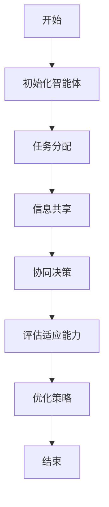
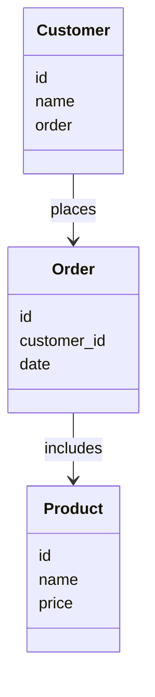
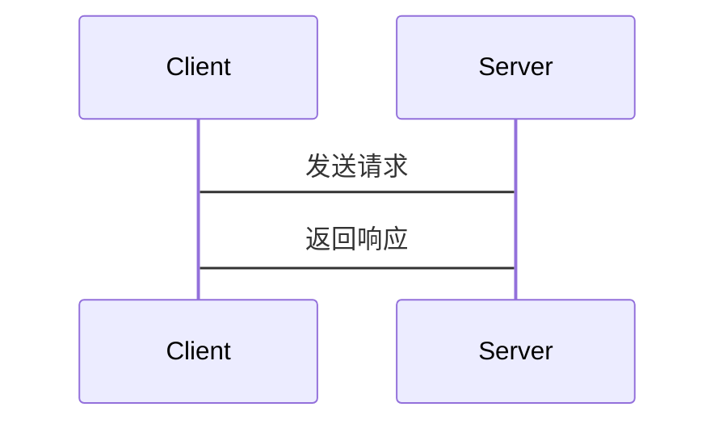

                 


```markdown
# 智能体协作评估公司的环境适应能力：应对气候变化风险

> 关键词：智能体协作，环境适应能力，气候变化风险，企业风险管理，多智能体系统，风险管理模型

> 摘要：本文探讨了智能体协作在评估公司环境适应能力中的作用，特别是在应对气候变化风险方面。通过分析智能体协作的核心概念、算法原理、系统架构以及实际应用案例，本文提供了从理论到实践的全面指导，展示了如何利用智能体协作技术帮助企业应对气候变化带来的挑战。

---

## 第一部分：智能体协作与环境适应能力的背景介绍

### 第1章：智能体协作与环境适应能力的背景介绍

#### 1.1 气候变化对企业的影响
- **1.1.1 气候变化的定义与现状**  
  气候变化是指全球气候系统长期的变化，包括温度上升、极端天气事件增多等。这些变化对企业运营、供应链、市场需求等方面产生了深远影响。
  
- **1.1.2 气候变化对企业运营的威胁**  
  气候变化可能导致资源短缺、供应链中断、法规变化等问题，进而影响企业的盈利能力和可持续发展。

- **1.1.3 环境适应能力的重要性**  
  环境适应能力是指企业根据外部环境变化调整自身策略和运营的能力。在气候变化的背景下，这种能力尤为重要。

#### 1.2 智能体协作的基本概念
- **1.2.1 智能体的定义与特征**  
  智能体（Agent）是指能够感知环境并采取行动的实体，具有自主性、反应性、主动性和社会性等特征。

- **1.2.2 智能体协作的内涵与外延**  
  智能体协作是指多个智能体通过合作完成共同目标的过程，涵盖信息共享、任务分配和协同决策等方面。

- **1.2.3 智能体协作与环境适应能力的关系**  
  智能体协作通过分布式计算和协同决策，能够帮助企业在复杂环境中快速适应变化，提升环境适应能力。

#### 1.3 问题背景与问题描述
- **1.3.1 企业环境适应能力评估的必要性**  
  随着气候变化加剧，企业需要具备快速调整的能力，以应对潜在的环境风险。

- **1.3.2 智能体协作在环境适应能力评估中的作用**  
  智能体协作能够通过实时数据共享和协同决策，帮助企业在动态环境中做出最优选择。

- **1.3.3 问题解决的路径与目标**  
  通过构建智能体协作系统，企业可以实时监控环境变化，评估自身的适应能力，并制定应对策略。

#### 1.4 核心概念的边界与外延
- **1.4.1 智能体协作的边界**  
  智能体协作的范围包括智能体之间的通信、任务分配和协同决策，但不涉及单个智能体的内部运作。

- **1.4.2 环境适应能力的边界**  
  环境适应能力关注企业对外部环境变化的响应，但不涉及企业内部管理的具体细节。

- **1.4.3 智能体协作与环境适应能力的相互作用**  
  智能体协作通过优化资源分配和协同决策，增强企业的环境适应能力；而环境适应能力的提升又反过来促进智能体协作的效率。

#### 1.5 本章小结
本章介绍了气候变化对企业的影响、智能体协作的基本概念及其与环境适应能力的关系。通过这些背景知识的梳理，为后续的理论分析和实践应用奠定了基础。

---

## 第二部分：智能体协作与环境适应能力的核心概念

### 第2章：智能体协作与环境适应能力的核心要素

#### 2.1 核心概念原理
- **2.1.1 智能体协作的基本原理**  
  智能体协作通过信息共享和协同决策，实现资源优化配置和任务高效完成。

- **2.1.2 环境适应能力的评估方法**  
  环境适应能力可以通过企业对环境变化的响应速度、灵活性和资源分配效率来评估。

- **2.1.3 智能体协作在环境适应能力评估中的应用**  
  智能体协作可以实时监控环境变化，评估企业适应能力，并提出优化建议。

#### 2.2 概念属性特征对比表格
| 概念      | 属性          | 特征对比             |
|-----------|---------------|--------------------|
| 智能体协作 | 自主性         | 高度自主            |
|           | 反应性         | 快速响应            |
| 环境适应能力 | 灵活性         | 高度灵活            |
|           | 响应速度       | 快速响应            |

#### 2.3 ER实体关系图架构
```mermaid
erDiagram
    customer[客户] {
        id : integer
        name : string
        email : string
    }
    order[订单] {
        id : integer
        customer_id : integer
        date : date
        total : float
    }
    product[产品] {
        id : integer
        name : string
        price : float
    }
    customer --> order : 下单
    order --> product : 包含
```

#### 2.4 本章小结
本章通过对比分析智能体协作和环境适应能力的核心要素，明确了两者之间的关系和相互作用，为后续的算法设计和系统实现提供了理论依据。

---

## 第三部分：智能体协作评估环境适应能力的算法原理

### 第3章：算法原理讲解

#### 3.1 算法原理概述
- **3.1.1 多智能体协作算法的基本原理**  
  多智能体协作算法通过分布式计算和信息共享，实现智能体之间的协同决策。

- **3.1.2 环境适应能力评估算法的基本原理**  
  环境适应能力评估算法通过分析企业对环境变化的响应，评估其适应能力。

- **3.1.3 算法选择的依据与原则**  
  算法选择应考虑计算效率、准确性和可扩展性。

#### 3.2 算法流程图


#### 3.3 算法实现代码
- **3.3.1 多智能体协作算法的Python实现**
```python
def multi_agent_collaboration():
    agents = [Agent(i) for i in range(n)]
    tasks = distribute_tasks(agents)
    for agent in agents:
        agent.share_info(tasks)
    decisions = make_collaborative_decision(agents, tasks)
    return decisions
```

- **3.3.2 环境适应能力评估算法的Python实现**
```python
def environmental_assessment():
    data = collect_environmental_data()
    model = build_assessment_model(data)
    results = evaluate_adaptability(model)
    return results
```

#### 3.4 算法的数学模型与公式
- **3.4.1 多智能体协作的数学模型**
$$ f(x) = \sum_{i=1}^{n} a_i x_i $$

- **3.4.2 环境适应能力评估的数学模型**
$$ g(x) = \max_{\theta} \theta^T x $$

#### 3.5 本章小结
本章通过算法流程图和代码实现，详细讲解了智能体协作和环境适应能力评估的实现原理，为后续的系统设计和项目实施提供了技术支持。

---

## 第四部分：系统分析与架构设计方案

### 第4章：系统分析与架构设计

#### 4.1 问题场景介绍
- **4.1.1 问题场景描述**  
  某企业面临气候变化带来的供应链风险，需要通过智能体协作优化供应链管理。

#### 4.2 系统功能设计
- **4.2.1 领域模型图**


#### 4.3 系统架构设计


#### 4.4 系统接口设计
- **4.4.1 接口描述**  
  API接口用于智能体之间的信息共享和协同决策。

#### 4.5 系统交互序列图


#### 4.6 本章小结
本章通过系统分析和架构设计，明确了智能体协作评估环境适应能力的实现路径，为后续的项目实施提供了指导。

---

## 第五部分：项目实战

### 第5章：项目实战

#### 5.1 环境安装
- **5.1.1 安装Python和相关库**  
  安装Python 3.x，以及numpy、pandas、scikit-learn等库。

#### 5.2 系统核心实现源代码
- **5.2.1 核心代码实现**
```python
class Agent:
    def __init__(self, id):
        self.id = id
        self.data = {}

    def share_info(self, info):
        self.data.update(info)

    def make_decision(self, task):
        return self.data.get(task, None)
```

#### 5.3 代码应用解读与分析
- **5.3.1 代码功能解读**  
  该代码实现了智能体的信息共享和决策功能，能够协同完成任务。

#### 5.4 实际案例分析
- **5.4.1 案例描述**  
  某企业通过智能体协作优化供应链管理，成功应对了气候变化带来的风险。

#### 5.5 详细讲解剖析
- **5.5.1 案例分析**  
  智能体协作帮助企业在供应链中断时快速调整供应商，确保业务连续性。

#### 5.6 本章小结
本章通过实际案例分析，展示了智能体协作在应对气候变化风险中的实际应用价值。

---

## 第六部分：最佳实践与总结

### 第6章：最佳实践与总结

#### 6.1 最佳实践 tips
- **选择合适的算法**  
  根据具体需求选择高效的算法，确保系统性能。

- **确保数据安全**  
  在智能体协作中，数据的安全性和隐私保护至关重要。

- **定期测试与优化**  
  定期测试系统性能，并根据反馈优化系统。

#### 6.2 小结
本文详细探讨了智能体协作在评估公司环境适应能力中的应用，展示了如何通过智能体协作技术应对气候变化风险。

#### 6.3 注意事项
- **数据质量**  
  数据的准确性和完整性直接影响评估结果。

- **系统维护**  
  定期维护系统，确保其稳定运行。

#### 6.4 拓展阅读
- **推荐书籍**  
  《多智能体系统》、《气候变化与企业风险管理》。

---

## 作者：AI天才研究院/AI Genius Institute & 禅与计算机程序设计艺术/Zen And The Art of Computer Programming
```

