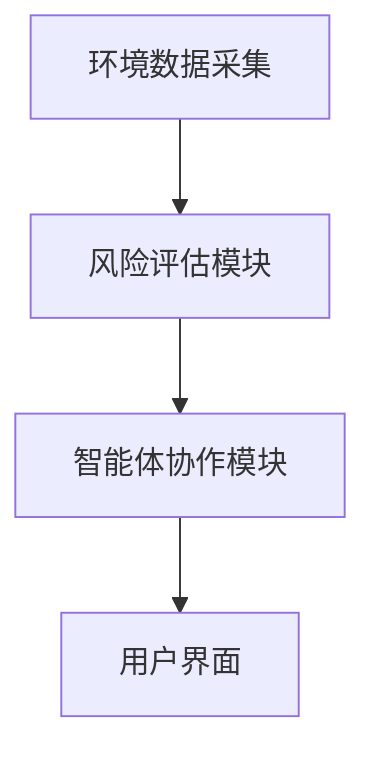

                 


# 智能体协作评估公司的环境风险：可持续发展视角

## 关键词：智能体协作、环境风险评估、可持续发展、风险管理、企业责任、绿色技术

## 摘要：  
在当前全球气候变化和环境问题日益严重的背景下，企业社会责任和可持续发展已成为全球关注的焦点。智能体协作作为一种新兴的技术手段，能够通过智能化、协同化的方式，有效评估和管理企业的环境风险。本文从可持续发展的视角，探讨智能体协作在环境风险评估中的应用，分析其技术原理、系统架构、项目实战及最佳实践，为企业实现绿色技术转型和可持续发展提供理论和实践指导。

---

## 第一部分：背景与概念

### 第1章：智能体协作概述

#### 1.1 智能体协作的定义与特点
智能体（Agent）是指能够感知环境、自主决策并采取行动以实现特定目标的实体。智能体协作是指多个智能体通过协同工作，共同完成复杂任务的过程。其特点包括：  
- **自主性**：智能体能够独立决策。  
- **社会性**：智能体之间通过交互和协作完成任务。  
- **反应性**：智能体能够根据环境变化动态调整行为。  
- **分布式**：协作过程通常涉及多个智能体的分布式部署。

#### 1.2 环境风险评估的基本概念
环境风险评估是指识别、分析和量化企业在运营过程中可能对环境造成的影响及其潜在风险。核心内容包括：  
- **环境影响分析**：评估企业活动对生态系统的潜在影响。  
- **风险量化**：通过模型和数据量化风险的严重性和概率。  
- **风险缓解策略**：制定降低环境风险的措施。

#### 1.3 可持续发展视角下的环境风险管理
可持续发展要求企业在追求经济利益的同时，兼顾环境保护和社会责任。在环境风险管理中，智能体协作能够通过数据共享、协同决策和实时反馈，帮助企业实现绿色技术转型。

---

### 第2章：智能体协作与环境风险评估的核心概念

#### 2.1 智能体协作的核心要素
- **协作目标**：明确智能体协作的具体任务和目标。  
- **协作规则**：定义智能体之间的交互规则和通信协议。  
- **协作机制**：包括任务分配、信息共享和决策协调等机制。

#### 2.2 环境风险评估的核心要素
- **评估指标**：包括碳排放、资源消耗、污染排放等关键指标。  
- **评估方法**：如生命周期评估（LCA）、环境足迹分析等。  
- **评估模型**：基于数学模型量化环境风险。

#### 2.3 智能体协作与环境风险评估的联系
智能体协作能够通过数据共享和协同计算，提升环境风险评估的效率和准确性。例如，多个智能体可以实时收集和分析企业的环境数据，共同完成风险评估任务。

---

## 第二部分：智能体协作与环境风险评估的技术原理

### 第3章：智能体协作机制的技术原理

#### 3.1 智能体协作的基本原理
智能体协作基于分布式计算和多智能体系统（MAS）理论，通过以下步骤实现协作：  
1. **感知环境**：智能体通过传感器或数据接口获取环境信息。  
2. **信息共享**：智能体之间通过通信协议共享数据。  
3. **任务分配**：根据智能体的能力和任务需求，动态分配任务。  
4. **协同决策**：智能体基于共享信息共同制定解决方案。  
5. **执行与反馈**：智能体根据决策执行任务，并根据反馈调整行为。

#### 3.2 环境风险评估的技术原理
环境风险评估基于数学模型和数据驱动的方法，主要包括：  
- **数据收集**：获取企业的环境数据，如能源消耗、碳排放等。  
- **模型构建**：建立环境风险评估模型，量化风险。  
- **算法实现**：使用机器学习或统计方法优化模型参数。

#### 3.3 智能体协作与环境风险评估的协同优化
通过协同优化，智能体协作能够提升环境风险评估的效率和精度。例如，多个智能体可以同时处理不同类型的数据，加速评估过程。

---

### 第4章：环境风险评估的数学模型与算法实现

#### 4.1 环境风险评分模型
环境风险评分公式如下：  
$$ R = \alpha \cdot E + \beta \cdot S + \gamma \cdot G $$  
其中，$R$为总风险评分，$E$为环境影响因子，$S$为社会影响因子，$G$为治理能力因子，$\alpha$、$\beta$、$\gamma$为权重系数。

#### 4.2 智能体协作算法
以下是智能体协作的伪代码实现：  
```python
def collaborate_agents(agents):
    for agent in agents:
        agent.perceive_environment()
        agent.share_info()
    task = assign_task(agents)
    solution = agents协同决策(task)
    return solution
```

---

## 第三部分：系统架构与设计

### 第4章：智能体协作与环境风险评估的系统架构

#### 4.1 系统总体架构设计
系统架构包括以下模块：  
- **环境数据采集模块**：收集企业的环境数据。  
- **风险评估模块**：基于数据进行风险评估。  
- **智能体协作模块**：实现智能体之间的协作。  
- **用户界面模块**：提供可视化界面供用户操作。

#### 4.2 系统功能设计
系统功能包括：  
- 数据采集与处理：实时采集企业的环境数据。  
- 风险评估：基于模型计算环境风险。  
- 协作优化：通过智能体协作提升评估效率。

#### 4.3 系统架构图（使用 Mermaid）



---

## 第四部分：项目实战与案例分析

### 第5章：项目实战

#### 5.1 环境安装
安装必要的依赖包：  
```bash
pip install numpy pandas scikit-learn
```

#### 5.2 核心代码实现
以下是环境风险评估的核心代码：  
```python
import numpy as np
import pandas as pd
from sklearn.metrics import mean_squared_error

def evaluate_environment_risk(data):
    # 数据预处理
    data = data.dropna()
    # 训练模型
    model = LinearRegression()
    model.fit(data[['E', 'S']], data['R'])
    # 预测风险
    predicted = model.predict(data[['E', 'S']])
    return mean_squared_error(data['R'], predicted)
```

#### 5.3 案例分析
以某制造企业为例，通过智能体协作评估其环境风险。假设企业碳排放数据如下：  
```python
carbon_emissions = [50, 60, 70, 80, 90]
```

---

## 第五部分：总结与展望

### 第6章：总结与展望

#### 6.1 项目总结
智能体协作在环境风险评估中的应用能够显著提升评估效率和准确性，为企业实现可持续发展提供有力支持。

#### 6.2 未来研究方向
- 智能体协作的优化算法研究。  
- 环境风险评估的动态模型开发。  
- 智能体协作在其他领域的应用探索。

#### 6.3 注意事项
- 数据隐私和安全问题需重点关注。  
- 系统的可扩展性和稳定性需进一步优化。  
- 智能体协作的算法设计需结合具体应用场景。

---

## 作者：AI天才研究院 & 禅与计算机程序设计艺术

---

通过以上结构，文章将从背景、技术、系统架构、项目实战等多方面全面探讨智能体协作在环境风险评估中的应用，为企业实现可持续发展提供理论和实践指导。

