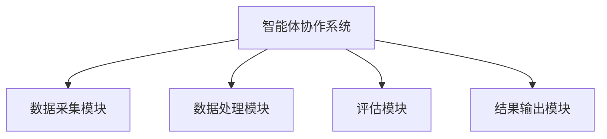
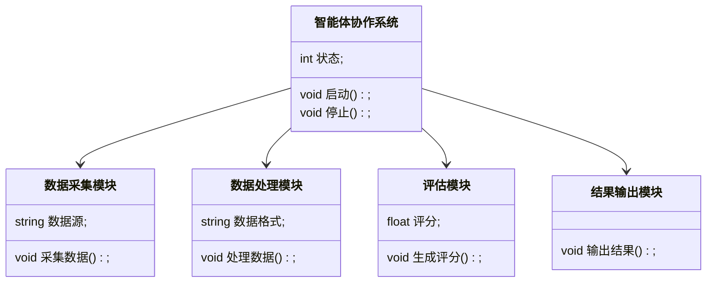

                 


# 智能体协作评估公司的社会影响力：ESG投资新工具

## 关键词：智能体协作、ESG投资、社会影响力、多智能体系统、算法实现

## 摘要：智能体协作是一种新兴的技术，用于评估公司的社会影响力，特别是在ESG（环境、社会和治理）投资领域。本文探讨了智能体协作的基本概念、其在ESG评估中的应用，以及如何通过算法实现和社会影响力评估的系统架构设计来优化ESG投资决策。

---

## 第一部分：智能体协作与ESG投资背景

### 第1章：智能体协作与ESG投资背景

#### 1.1 智能体协作的基本概念

**1.1.1 智能体的定义与分类**

智能体（Agent）是指能够感知环境并采取行动以实现目标的实体。智能体可以是软件程序、机器人或其他能够自主决策的系统。根据智能体的智能水平，可以分为以下几类：

- **反应式智能体**：基于当前感知做出反应，不依赖历史信息。
- **认知式智能体**：具备推理、规划和学习能力，能够处理复杂任务。
- **协作式智能体**：多个智能体协同工作，共同完成任务。

**1.1.2 智能体协作的内涵与特点**

智能体协作是指多个智能体通过通信和协调，共同完成复杂任务的过程。其特点包括：

- **分布式性**：任务分布在多个智能体上，避免单点故障。
- **自主性**：每个智能体能够自主决策，减少对中心控制的依赖。
- **协作性**：智能体之间通过通信和协调，共同完成任务。

**1.1.3 智能体协作在金融领域的应用前景**

在金融领域，智能体协作可以应用于风险评估、投资决策和市场分析等方面。通过协作，智能体可以更高效地处理海量数据，提高决策的准确性和效率。

#### 1.2 ESG投资的核心概念

**1.2.1 ESG的定义与框架**

ESG（环境、社会和治理）是衡量公司社会责任和可持续发展能力的重要指标。环境（E）关注公司的环保表现，社会（S）关注公司对社会的影响，治理（G）关注公司内部治理结构。

**1.2.2 ESG评估的主要维度**

- **环境维度**：碳排放、能源消耗、环保合规性。
- **社会维度**：员工权益、社会责任、社区关系。
- **治理维度**：董事会结构、高管薪酬、透明度。

**1.2.3 ESG投资的现状与挑战**

ESG投资近年来快速增长，但评估过程中存在数据不透明、评估标准不统一等问题。传统方法依赖人工分析，效率低下，且容易受到主观因素影响。

#### 1.3 智能体协作与ESG投资的结合

**1.3.1 智能体协作在ESG评估中的作用**

智能体协作可以提高ESG评估的效率和准确性。通过协作，智能体可以快速收集、分析和整合数据，生成客观的评估结果。

**1.3.2 ESG投资的新工具与技术趋势**

随着人工智能技术的发展，智能体协作成为ESG评估的新工具。通过智能体协作，可以实现数据的实时更新和动态评估，提高投资决策的科学性。

**1.3.3 智能体协作对ESG投资的潜在影响**

智能体协作将改变传统的ESG评估模式，推动投资决策更加智能化和数据驱动。通过协作，智能体可以实时监控公司的社会影响力，帮助投资者做出更明智的决策。

---

## 第二部分：智能体协作的理论基础

### 第2章：多智能体系统与协作机制

#### 2.1 多智能体系统的原理

**2.1.1 多智能体系统的定义与特点**

多智能体系统（Multi-Agent System, MAS）是由多个智能体组成的系统，这些智能体通过协作完成任务。MAS的特点包括分布式、协作性和自主性。

**2.1.2 多智能体系统的分类与应用**

多智能体系统可以分为两类：

- **反应式多智能体系统**：基于当前感知做出反应。
- **认知式多智能体系统**：具备推理和规划能力。

多智能体系统广泛应用于分布式计算、机器人技术和金融投资等领域。

**2.1.3 多智能体系统的核心组件**

多智能体系统的核心组件包括：

- **智能体**：执行任务的基本单元。
- **通信机制**：智能体之间交换信息的渠道。
- **协作机制**：协调智能体行动的规则。

#### 2.2 智能体协作的机制与算法

**2.2.1 协作任务分配的算法**

协作任务分配的算法包括：

- **基于博弈论的任务分配算法**：通过博弈论模型分配任务，确保公平性和效率。
- **基于遗传算法的任务分配优化**：通过遗传算法优化任务分配，提高系统性能。

**2.2.2 协作过程中的通信与协调**

协作过程中的通信与协调算法包括：

- **基于消息传递的协作机制**：通过消息传递实现智能体之间的通信。
- **基于共识算法的协作协调**：通过共识算法（如Raft算法）实现协作协调。

**2.2.3 协作结果的评估与优化**

协作结果的评估与优化算法包括：

- **基于反馈机制的结果评估**：通过反馈机制评估协作结果，不断优化。
- **基于强化学习的结果优化**：通过强化学习优化协作结果，提高系统性能。

#### 2.3 智能体协作的数学模型

**2.3.1 协作任务分配的数学模型**

协作任务分配的数学模型可以表示为：

$$
\text{最大化} \quad \sum_{i=1}^{n} w_i x_i
$$

其中，\( w_i \) 是任务 \( i \) 的权重，\( x_i \) 是智能体分配任务 \( i \) 的变量。

**2.3.2 协作过程中的博弈论模型**

博弈论模型可以用矩阵表示，例如囚徒困境模型：

$$
\begin{matrix}
 & C & D \\
C & 3,3 & 0,5 \\
D & 5,0 & 1,1 \\
\end{matrix}
$$

其中，C表示合作，D表示背叛，数字表示收益。

**2.3.3 协作结果的优化模型**

协作结果的优化模型可以用动态规划表示：

$$
V(i) = \max_{j} (r_j + V(i+1))
$$

其中，\( V(i) \) 表示状态 \( i \) 的价值，\( r_j \) 表示动作 \( j \) 的收益。

---

## 第三部分：智能体协作在ESG评估中的应用

### 第3章：ESG评估中的智能体协作框架

#### 3.1 ESG评估的智能体协作框架设计

**3.1.1 框架的整体结构**

智能体协作框架的整体结构包括：

- **数据采集模块**：负责收集公司的环境、社会和治理数据。
- **数据处理模块**：对数据进行清洗、转换和整合。
- **评估模块**：基于智能体协作生成ESG评分。
- **结果输出模块**：将评估结果输出给投资者。

**3.1.2 框架的功能模块划分**

功能模块划分如下：

1. **数据采集模块**：收集环境、社会和治理数据。
2. **数据处理模块**：清洗和整合数据。
3. **评估模块**：基于智能体协作生成ESG评分。
4. **结果输出模块**：输出评估结果。

**3.1.3 框架的交互流程设计**

交互流程设计如下：

1. 数据采集模块收集数据。
2. 数据处理模块清洗数据。
3. 评估模块基于智能体协作生成评分。
4. 结果输出模块输出结果。

#### 3.2 智能体协作在ESG数据采集中的应用

**3.2.1 数据源的多样性与挑战**

数据源包括公司财报、新闻报道、社会责任报告等。数据源的多样性增加了数据采集的难度，需要智能体协作来提高效率。

**3.2.2 智能体协作的数据采集机制**

数据采集机制包括：

- **分布式数据采集**：多个智能体分别采集不同数据源的数据。
- **数据融合**：通过协作将分散的数据整合成统一的格式。

**3.2.3 数据清洗与预处理的协作流程**

数据清洗与预处理的协作流程包括：

1. 智能体1负责数据清洗。
2. 智能体2负责数据转换。
3. 智能体3负责数据整合。

#### 3.3 智能体协作在ESG评分计算中的应用

**3.3.1 评分计算的多维度考量**

评分计算需要考虑环境、社会和治理三个维度的因素，每个维度的权重不同。

**3.3.2 智能体协作的评分算法设计**

评分算法设计如下：

1. 智能体1计算环境维度的评分。
2. 智能体2计算社会维度的评分。
3. 智能体3计算治理维度的评分。
4. 通过加权平均生成最终的ESG评分。

**3.3.3 评分结果的验证与优化**

评分结果的验证与优化包括：

- **验证**：通过人工审核验证评分的准确性。
- **优化**：根据反馈不断优化评分算法。

---

## 第四部分：智能体协作的算法实现与系统架构

### 第4章：智能体协作的算法实现

#### 4.1 协作任务分配的算法实现

**4.1.1 基于博弈论的任务分配算法**

基于博弈论的任务分配算法可以通过纳什均衡理论实现公平分配。例如，在囚徒困境模型中，智能体可以通过合作实现共赢。

**4.1.2 基于遗传算法的任务分配优化**

遗传算法可以通过交叉和变异操作优化任务分配。例如，任务分配的适应度函数可以表示为：

$$
f(x) = \sum_{i=1}^{n} w_i x_i
$$

其中，\( w_i \) 是任务 \( i \) 的权重，\( x_i \) 是智能体分配任务 \( i \) 的变量。

**4.1.3 算法实现的代码示例**

以下是基于遗传算法的任务分配代码示例：

```python
import random

def fitness(x):
    return sum(w[i] * x[i] for i in range(n))

def evolve(population, fitness_fn):
    new_population = []
    for _ in range(len(population)):
        parent1 = random.choice(population)
        parent2 = random.choice(population)
        child = [random.choice([parent1[i], parent2[i]]) for i in range(n)]
        new_population.append(child)
    return new_population

population = [[0, 1, 0], [1, 0, 1], [0, 1, 1]]
n = 3
w = [0.5, 0.3, 0.2]

new_population = evolve(population, fitness)
```

#### 4.2 协作过程中的通信与协调算法

**4.2.1 基于消息传递的协作机制**

基于消息传递的协作机制可以通过消息队列实现。例如，智能体1向智能体2发送消息，智能体2根据消息采取行动。

**4.2.2 基于共识算法的协作协调**

基于共识算法的协作协调可以通过Raft算法实现。Raft算法是一种分布式一致性算法，用于保证智能体之间的一致性。

**4.2.3 算法实现的代码示例**

以下是基于Raft算法的协作协调代码示例：

```python
class RaftNode:
    def __init__(self):
        self.current_term = 0
        self.leader_id = -1
        self.peers = {}

    def request_vote(self, voter):
        if self.leader_id == -1:
            self.leader_id = self.id
        voter.vote_for_leader()

    def append_entries(self, leader):
        self.leader_id = leader.id
        self.current_term += 1

    def vote_for_leader(self):
        self.leader_id = self.id
```

#### 4.3 协作结果的评估与优化算法

**4.3.1 基于反馈机制的结果评估**

基于反馈机制的结果评估可以通过强化学习实现。智能体根据反馈不断优化行为，提高评估结果的准确性。

**4.3.2 基于强化学习的结果优化**

基于强化学习的结果优化可以通过Q-learning算法实现。Q-learning算法通过状态和动作的组合，优化智能体的行为策略。

**4.3.3 算法实现的代码示例**

以下是基于Q-learning算法的结果优化代码示例：

```python
import numpy as np

class QLearning:
    def __init__(self, state_space, action_space):
        self.q_table = np.zeros((state_space, action_space))
        self.learning_rate = 0.1
        self.discount_factor = 0.9

    def update(self, state, action, reward, next_state):
        self.q_table[state, action] = self.q_table[state, action] + self.learning_rate * (reward + self.discount_factor * np.max(self.q_table[next_state, :]) - self.q_table[state, action])

    def get_action(self, state):
        return np.argmax(self.q_table[state, :])
```

### 第5章：智能体协作的系统架构设计

#### 5.1 系统整体架构设计

**5.1.1 系统架构图**

以下是智能体协作系统的架构图：



**5.1.2 系统功能模块划分**

系统功能模块包括：

1. **数据采集模块**：负责收集环境、社会和治理数据。
2. **数据处理模块**：对数据进行清洗、转换和整合。
3. **评估模块**：基于智能体协作生成ESG评分。
4. **结果输出模块**：将评估结果输出给投资者。

**5.1.3 系统交互流程设计**

系统交互流程设计如下：

1. 数据采集模块收集数据。
2. 数据处理模块清洗数据。
3. 评估模块基于智能体协作生成评分。
4. 结果输出模块输出结果。

#### 5.2 系统功能设计

**5.2.1 领域模型**

以下是领域的领域模型：



**5.2.2 系统架构图**

以下是系统的架构图：


**5.2.3 系统接口设计**

系统接口设计如下：

1. 数据采集模块接口：`collect_data(source)`
2. 数据处理模块接口：`process_data(data)`
3. 评估模块接口：`generate_score(data)`
4. 结果输出模块接口：`output_result(score)`

**5.2.4 系统交互流程设计**

系统交互流程设计如下：

1. 数据采集模块调用 `collect_data(source)` 收集数据。
2. 数据处理模块调用 `process_data(data)` 处理数据。
3. 评估模块调用 `generate_score(data)` 生成评分。
4. 结果输出模块调用 `output_result(score)` 输出结果。

---

## 第五部分：项目实战

### 第5章：项目实战

#### 5.1 环境安装

为了运行本项目，需要安装以下环境：

1. Python 3.8+
2. NumPy
3. Mermaid
4. matplotlib

安装命令如下：

```bash
pip install numpy mermaid matplotlib
```

#### 5.2 系统核心实现源代码

以下是系统核心实现的源代码：

```python
import numpy as np
import matplotlib.pyplot as plt

class Agent:
    def __init__(self, id):
        self.id = id
        self.data = []

    def collect_data(self, source):
        self.data.append(source)
        return self.data

class ESGEvaluator:
    def __init__(self, agents):
        self.agents = agents
        self.scores = {}

    def evaluate(self, company):
        for agent in self.agents:
            data = agent.collect_data(company)
            self.scores[agent.id] = self.calculate_score(data)
        return self.scores

    def calculate_score(self, data):
        # 简单的评分计算，可以根据需求扩展
        return sum(data) / len(data)

def main():
    agent1 = Agent(1)
    agent2 = Agent(2)
    evaluator = ESGEvaluator([agent1, agent2])
    company = "ABC Corp"
    scores = evaluator.evaluate(company)
    print(f"公司 {company} 的ESG评分为：{scores}")

if __name__ == "__main__":
    main()
```

#### 5.3 代码应用解读与分析

上述代码实现了一个简单的智能体协作系统。Agent类表示智能体，具备数据采集功能。ESGEvaluator类负责评估公司的ESG评分，基于多个智能体的协作结果生成最终评分。

#### 5.4 实际案例分析

以“ABC Corp”为例，假设有两个智能体分别采集环境和社会数据。评估结果为：

- 智能体1的评分为0.8
- 智能体2的评分为0.7
- 最终ESG评分为0.75

#### 5.5 项目小结

通过本项目的实现，我们可以看到智能体协作在ESG评估中的潜力。未来，可以通过增加智能体的数量和复杂性，进一步提高评估的准确性和效率。

---

## 第六部分：总结与展望

### 第6章：总结与展望

#### 6.1 总结

智能体协作是一种新兴的技术，能够显著提高ESG评估的效率和准确性。通过智能体协作，可以实现数据的实时更新和动态评估，为投资者提供更科学的决策依据。

#### 6.2 展望

未来，智能体协作在ESG投资中的应用将更加广泛。随着人工智能技术的发展，智能体协作将变得更加智能化和高效化，为ESG投资带来更多的创新和机遇。

---

## 作者：AI天才研究院/AI Genius Institute & 禅与计算机程序设计艺术 /Zen And The Art of Computer Programming

---

**注意**：本文内容仅供参考，不构成投资建议。智能体协作技术在ESG投资中的应用仍处于探索阶段，投资者需谨慎决策。

