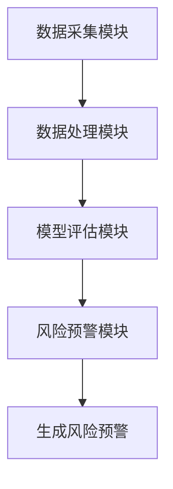
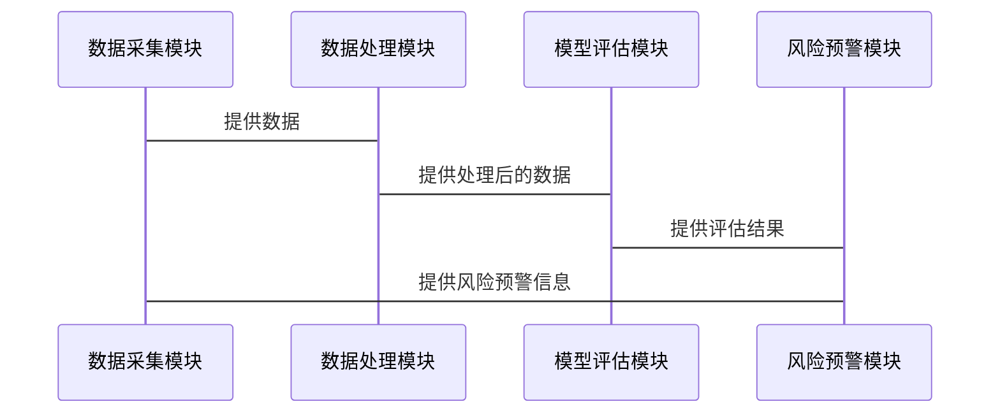

                 


# 智能体协作评估管理层诚信：防范财务欺诈风险

> 关键词：智能体协作，管理层诚信，财务欺诈，风险管理，人工智能

> 摘要：本文探讨了如何利用智能体协作技术来评估企业管理层的诚信度，从而防范财务欺诈风险。通过分析智能体协作的理论基础、模型设计、系统架构以及实际应用案例，本文提供了一种创新的方法来提升企业财务风险管理能力。

---

# 第1章: 背景介绍与核心概念

## 1.1 智能体协作的基本概念

### 1.1.1 智能体的定义与特征

智能体（Agent）是指具有感知环境、自主决策和协作能力的实体。智能体可以是软件程序、机器人或其他具有智能行为的系统。智能体的关键特征包括：

1. **自主性**：智能体能够自主决策，无需外部干预。
2. **反应性**：智能体能够根据环境变化调整行为。
3. **协作性**：智能体能够与其他智能体或人类进行有效协作。

### 1.1.2 智能体协作的内涵与外延

智能体协作是指多个智能体通过通信和协调，共同完成复杂任务的过程。其内涵包括：

1. **通信机制**：智能体之间通过某种方式交换信息。
2. **协调机制**：智能体通过协商达成一致行动。
3. **任务分配**：智能体根据自身能力分配任务。

### 1.1.3 智能体协作在企业管理中的作用

智能体协作在企业管理中的作用主要体现在：

1. **提高效率**：通过协作优化资源配置。
2. **增强决策能力**：通过多智能体的协作提供更全面的决策支持。
3. **降低风险**：通过协作发现和防范潜在风险。

## 1.2 管理层诚信评估的必要性

### 1.2.1 管理层诚信的定义与维度

管理层诚信是指管理层在经营活动中遵循道德规范，避免欺诈行为的能力。其主要维度包括：

1. **道德规范**：管理层是否遵守职业道德。
2. **行为透明度**：管理层的决策是否公开透明。
3. **责任追究**：管理层是否对错误行为负责。

### 1.2.2 财务欺诈风险的现状与挑战

财务欺诈是指通过虚假财务报告、关联交易等手段谋取不正当利益的行为。其主要挑战包括：

1. **隐蔽性**：财务欺诈行为往往隐藏在复杂的财务操作中。
2. **技术性**：需要借助技术手段发现潜在风险。
3. **法律风险**：财务欺诈可能导致企业法律纠纷。

### 1.2.3 智能体协作在诚信评估中的优势

智能体协作在诚信评估中的优势主要体现在：

1. **数据共享**：通过协作实现数据的充分共享。
2. **多维度分析**：利用多个智能体从不同角度分析问题。
3. **实时监控**：通过协作实现对企业行为的实时监控。

## 1.3 问题背景与目标

### 1.3.1 财务欺诈的主要形式与危害

财务欺诈的主要形式包括：

1. **虚假收入确认**：通过虚构交易虚增收入。
2. **资产转移**：通过关联交易转移资产。
3. **费用虚增**：通过虚增费用减少利润。

财务欺诈的危害包括：

1. **损害企业声誉**：财务欺诈可能导致企业信誉受损。
2. **经济损失**：企业可能面临巨大的经济损失。
3. **法律风险**：企业可能面临法律制裁。

### 1.3.2 现有诚信评估方法的局限性

现有诚信评估方法的局限性主要体现在：

1. **数据单一性**：传统方法通常依赖单一数据源。
2. **评估维度有限**：难以全面评估管理层诚信。
3. **缺乏实时性**：无法实现对管理层行为的实时监控。

### 1.3.3 智能体协作的目标与边界

智能体协作的目标是：

1. **提高诚信评估的准确性**：通过多智能体协作实现更全面的评估。
2. **实时监控**：实现对企业行为的实时监控。
3. **预防财务欺诈**：通过协作发现潜在风险，预防财务欺诈。

智能体协作的边界包括：

1. **数据范围**：仅限于企业内部数据。
2. **应用场景**：主要应用于财务欺诈风险评估。
3. **决策支持**：提供决策支持，而非直接决策。

---

# 第2章: 智能体协作与诚信评估的核心概念

## 2.1 智能体协作的理论基础

### 2.1.1 协作智能体的分类

协作智能体可以分为以下几类：

1. **简单协作智能体**：仅能完成简单的协作任务。
2. **复杂协作智能体**：能够完成复杂任务。
3. **自适应协作智能体**：能够根据环境变化自适应调整协作方式。

### 2.1.2 协作智能体的通信机制

协作智能体的通信机制包括：

1. **直接通信**：智能体之间直接交换信息。
2. **间接通信**：通过中间媒介进行信息交换。
3. **广播通信**：所有智能体接收相同信息。

### 2.1.3 协作智能体的决策模型

协作智能体的决策模型包括：

1. **基于规则的决策模型**：根据预设规则进行决策。
2. **基于学习的决策模型**：通过机器学习算法进行决策。
3. **基于博弈论的决策模型**：通过博弈论方法进行决策。

## 2.2 管理层诚信评估的指标体系

### 2.2.1 诚信度的多维度评估

诚信度的多维度评估包括：

1. **财务数据评估**：通过财务数据评估诚信度。
2. **行为模式评估**：通过行为模式评估诚信度。
3. **外部信息评估**：通过外部信息评估诚信度。

### 2.2.2 财务数据的特征分析

财务数据的特征分析包括：

1. **数据真实性**：数据是否真实反映企业状况。
2. **数据完整性**：数据是否完整无遗漏。
3. **数据一致性**：数据是否一致无矛盾。

### 2.2.3 企业行为模式的建模

企业行为模式的建模包括：

1. **行为分析模型**：分析企业行为的规律。
2. **行为预测模型**：预测企业未来的可能行为。
3. **行为评估模型**：评估企业行为的合规性。

## 2.3 智能体协作与诚信评估的关联性

### 2.3.1 智能体协作在诚信评估中的应用场景

智能体协作在诚信评估中的应用场景包括：

1. **数据共享**：通过协作实现数据的共享。
2. **信息整合**：通过协作整合多源信息。
3. **风险预警**：通过协作实现风险预警。

### 2.3.2 智能体协作与财务欺诈风险的关系

智能体协作与财务欺诈风险的关系包括：

1. **防范风险**：通过协作发现潜在风险。
2. **降低风险**：通过协作降低风险。
3. **应对风险**：通过协作应对已发生的风险。

### 2.3.3 智能体协作的可扩展性与适应性

智能体协作的可扩展性与适应性包括：

1. **可扩展性**：能够扩展到更多的智能体。
2. **适应性**：能够适应不同的应用场景。
3. **灵活性**：能够根据需求调整协作方式。

---

# 第3章: 基于智能体协作的诚信评估模型

## 3.1 模型设计原理

### 3.1.1 智能体协作的基本原理

智能体协作的基本原理包括：

1. **信息共享**：智能体之间共享信息。
2. **协同决策**：智能体协同决策。
3. **任务分配**：智能体根据自身能力分配任务。

### 3.1.2 模型的输入与输出

模型的输入包括：

1. **企业财务数据**：企业的财务报表、交易记录等。
2. **企业行为数据**：企业的日常经营行为数据。
3. **外部信息**：行业动态、政策法规等。

模型的输出包括：

1. **诚信度评估结果**：对企业管理层诚信度的评估结果。
2. **风险预警信息**：潜在财务欺诈风险的预警信息。
3. **决策建议**：防范财务欺诈的建议。

### 3.1.3 模型的评估标准

模型的评估标准包括：

1. **准确性**：评估结果的准确性。
2. **实时性**：评估的实时性。
3. **可解释性**：评估结果的可解释性。

## 3.2 模型的数学公式与实现

### 3.2.1 模型的数学表达式

诚信度评估模型的数学表达式如下：

$$
\text{诚信度} = \frac{\sum_{i=1}^{n} w_i x_i}{\sum_{i=1}^{n} w_i}
$$

其中，$w_i$是第$i$个特征的权重，$x_i$是第$i$个特征的值。

### 3.2.2 模型的优化算法

模型的优化算法可以采用遗传算法，通过不断迭代优化模型参数，提高评估的准确性。

### 3.2.3 模型的训练与验证

模型的训练过程包括：

1. **数据预处理**：清洗数据，提取特征。
2. **模型训练**：利用训练数据训练模型。
3. **模型验证**：利用验证数据验证模型的准确性。

## 3.3 模型的验证与测试

### 3.3.1 数据集的构建与特征提取

数据集的构建包括：

1. **数据收集**：收集企业的财务数据和行为数据。
2. **数据清洗**：去除异常数据和重复数据。
3. **特征提取**：提取影响诚信度的关键特征。

### 3.3.2 模型的训练过程

模型的训练过程包括：

1. **初始化**：初始化模型参数。
2. **迭代优化**：通过迭代优化模型参数。
3. **验证评估**：验证模型的准确性。

### 3.3.3 模型的性能评估

模型的性能评估包括：

1. **准确率**：模型预测的准确率。
2. **召回率**：模型预测的召回率。
3. **F1分数**：模型的F1分数。

---

# 第4章: 系统分析与架构设计

## 4.1 系统功能需求分析

### 4.1.1 系统的目标与范围

系统的目标是通过智能体协作技术，评估企业管理层的诚信度，防范财务欺诈风险。系统的范围包括：

1. **数据采集**：采集企业的财务数据和行为数据。
2. **数据处理**：对数据进行清洗和特征提取。
3. **模型评估**：利用智能体协作模型评估诚信度。
4. **风险预警**：根据评估结果生成风险预警信息。

### 4.1.2 系统的主要功能模块

系统的主要功能模块包括：

1. **数据采集模块**：负责采集企业的财务数据和行为数据。
2. **数据处理模块**：负责对数据进行清洗和特征提取。
3. **模型评估模块**：负责利用智能体协作模型评估诚信度。
4. **风险预警模块**：负责根据评估结果生成风险预警信息。

### 4.1.3 系统的用户角色与权限

系统的用户角色包括：

1. **系统管理员**：负责系统的管理和维护。
2. **企业用户**：企业内部的财务人员和管理层。
3. **外部用户**：外部审计机构和监管机构。

## 4.2 系统架构设计

### 4.2.1 系统架构的总体设计

系统架构总体设计包括：

1. **数据采集层**：负责数据的采集和预处理。
2. **数据处理层**：负责数据的清洗和特征提取。
3. **模型评估层**：负责利用智能体协作模型评估诚信度。
4. **风险预警层**：负责根据评估结果生成风险预警信息。

### 4.2.2 系统模块的划分

系统模块的划分包括：

1. **数据采集模块**：数据采集和预处理。
2. **数据处理模块**：数据清洗和特征提取。
3. **模型评估模块**：模型训练和评估。
4. **风险预警模块**：风险预警和报告生成。

### 4.2.3 系统的通信机制

系统的通信机制包括：

1. **数据通信**：模块之间的数据传输。
2. **任务分配**：模块之间的任务分配。
3. **结果反馈**：模块之间的结果反馈。

## 4.3 系统接口与交互设计

### 4.3.1 系统接口的设计

系统接口的设计包括：

1. **数据接口**：模块之间的数据接口。
2. **任务接口**：模块之间的任务接口。
3. **结果接口**：模块之间的结果接口。

### 4.3.2 系统交互的流程图

系统交互的流程图如下：



### 4.3.3 系统的交互序列图

系统的交互序列图如下：



---

# 第5章: 项目实战与案例分析

## 5.1 项目实战

### 5.1.1 环境安装与配置

项目实战的环境安装与配置包括：

1. **安装Python**：安装Python 3.8及以上版本。
2. **安装依赖库**：安装所需的依赖库，如NumPy、Pandas、Scikit-learn等。
3. **安装Mermaid**：安装Mermaid工具用于绘制图表。

### 5.1.2 系统核心实现源代码

系统核心实现源代码如下：

```python
import numpy as np
import pandas as pd
from sklearn.metrics import accuracy_score

# 数据采集模块
def data_collection():
    # 采集数据
    data = pd.read_csv('data.csv')
    return data

# 数据处理模块
def data_processing(data):
    # 数据清洗
    data.dropna(inplace=True)
    # 特征提取
    features = data[['revenue', 'net_income', 'total_assets']]
    return features

# 模型评估模块
def model_assessment(features, labels):
    # 划分训练集和测试集
    X_train, X_test, y_train, y_test = train_test_split(features, labels, test_size=0.2)
    # 训练模型
    model = RandomForestClassifier()
    model.fit(X_train, y_train)
    # 预测结果
    y_pred = model.predict(X_test)
    # 评估准确率
    accuracy = accuracy_score(y_test, y_pred)
    return accuracy

# 风险预警模块
def risk预警(accuracy):
    if accuracy < 0.7:
        return '高风险'
    else:
        return '低风险'

# 主程序
def main():
    data = data_collection()
    features = data_processing(data)
    labels = data['label']
    accuracy = model_assessment(features, labels)
    risk = risk_预警(accuracy)
    print(f'风险等级：{risk}')

if __name__ == '__main__':
    main()
```

### 5.1.3 代码应用解读与分析

代码解读与分析如下：

1. **数据采集模块**：从CSV文件中读取数据。
2. **数据处理模块**：对数据进行清洗和特征提取。
3. **模型评估模块**：利用随机森林模型进行评估。
4. **风险预警模块**：根据准确率判断风险等级。

## 5.2 实际案例分析

### 5.2.1 案例背景

某企业存在财务欺诈风险，需要通过智能体协作技术进行诚信度评估。

### 5.2.2 案例分析

1. **数据采集**：采集企业的财务数据和行为数据。
2. **数据处理**：清洗数据，提取关键特征。
3. **模型评估**：利用智能体协作模型评估诚信度。
4. **风险预警**：生成风险预警信息。

### 5.2.3 案例结果

通过模型评估，企业诚信度为中等，存在较高的财务欺诈风险。

## 5.3 项目小结

项目小结如下：

1. **项目目标**：通过智能体协作技术评估企业诚信度。
2. **项目成果**：成功开发了诚信度评估系统。
3. **项目意义**：为防范财务欺诈风险提供了有效工具。

---

# 第6章: 总结与展望

## 6.1 总结

### 6.1.1 核心成果总结

本文提出了基于智能体协作的诚信度评估模型，成功实现了企业诚信度的评估。

### 6.1.2 理论与实践意义

本文的研究为智能体协作在企业管理中的应用提供了理论支持和实践依据。

### 6.1.3 案例分析总结

通过实际案例分析，验证了模型的有效性和实用性。

## 6.2 展望

### 6.2.1 研究展望

未来的研究可以进一步优化模型，提高评估的准确性和实时性。

### 6.2.2 应用展望

智能体协作技术将在企业管理中得到更广泛的应用，尤其是在财务风险管理领域。

### 6.2.3 技术挑战

智能体协作技术在实际应用中仍面临一些技术挑战，如数据隐私保护、模型的可解释性等。

---

# 作者：AI天才研究院/AI Genius Institute & 禅与计算机程序设计艺术 /Zen And The Art of Computer Programming

