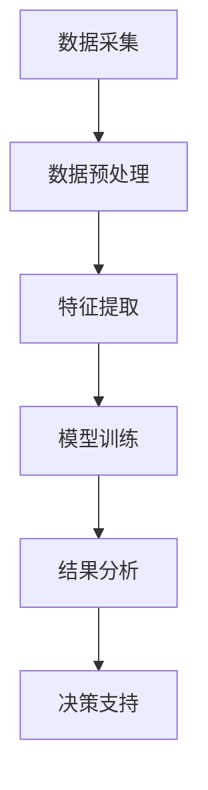
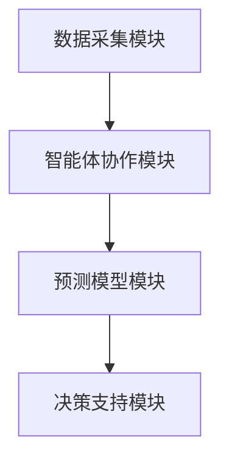
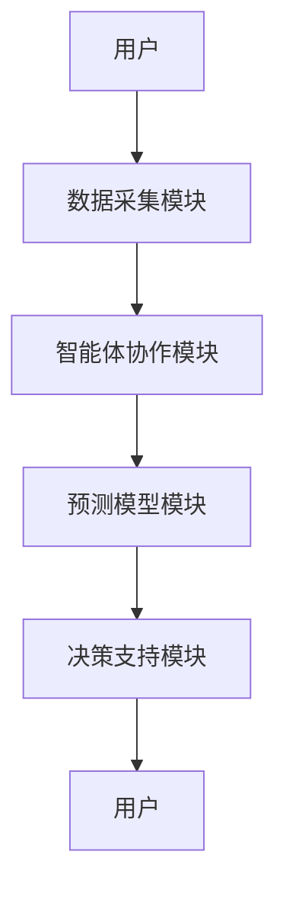

                 


# 智能体协作预测监管环境变化：提前应对政策风险

## 关键词：智能体协作、监管环境变化、政策风险、预测模型、系统架构

## 摘要：  
随着监管环境的复杂化和政策变化的不确定性，企业面临越来越大的政策风险。为了应对这一挑战，智能体协作预测监管环境变化的方法应运而生。通过智能体之间的协作，企业可以实时预测监管环境的变化趋势，并提前制定应对策略，从而有效降低政策风险。本文将详细探讨智能体协作预测监管环境变化的核心概念、算法原理、系统架构以及实际应用案例。

---

## 第一部分: 智能体协作预测监管环境变化的背景与概念

### 第1章: 智能体协作预测监管环境变化的背景介绍

#### 1.1 问题背景
##### 1.1.1 监管环境变化的复杂性  
监管环境的变化通常由政策制定者、行业趋势和国际形势等多种因素驱动，具有高度的不确定性和复杂性。企业需要快速适应这些变化，否则可能导致合规性问题、罚款甚至业务中断。  

##### 1.1.2 智能体协作的重要性  
智能体（Intelligent Agents）是能够感知环境、自主决策并协作完成任务的实体。通过智能体协作，企业可以实时分析海量数据，预测监管环境的变化趋势，并制定相应的应对策略。  

##### 1.1.3 政策风险对企业的影响  
政策风险是指由于政策变化对企业运营产生的负面影响。例如，新的法规可能要求企业调整业务模式或技术实现方式，这可能导致额外的成本或时间延迟。提前预测政策变化可以帮助企业快速调整，降低风险。  

#### 1.2 问题描述
##### 1.2.1 监管环境变化的多维度性  
监管环境的变化涉及多个维度，包括法律、经济、社会和技术等因素。例如，环保政策的变化可能影响企业的生产流程，而税收政策的变化可能影响企业的财务规划。  

##### 1.2.2 智能体协作预测的必要性  
传统的监管环境预测方法通常依赖于人工分析，效率低下且容易出错。智能体协作预测可以通过自动化和智能化的方式，实时分析数据，提高预测的准确性和效率。  

##### 1.2.3 政策风险的潜在影响  
政策风险可能对企业造成直接或间接的影响，例如罚款、业务中断、声誉损失等。通过提前预测政策变化，企业可以采取预防措施，降低潜在风险。  

#### 1.3 问题解决方法
##### 1.3.1 智能体协作预测的基本思路  
通过部署多个智能体，分别负责数据采集、分析和预测，智能体之间可以协作完成监管环境变化的预测任务。  

##### 1.3.2 监管环境变化的预测模型  
预测模型需要结合历史数据和实时数据，利用机器学习和数据分析技术，预测未来监管环境的变化趋势。  

##### 1.3.3 政策风险的提前应对策略  
企业可以根据预测结果，制定相应的应对策略，例如调整业务模式、优化流程或加强合规性管理。  

#### 1.4 边界与外延
##### 1.4.1 智能体协作预测的边界条件  
智能体协作预测需要依赖高质量的数据和先进的算法。如果数据不足或算法不完善，预测结果可能不准确。  

##### 1.4.2 监管环境变化的外延范围  
监管环境变化的外延包括政策、法律、经济、社会和技术等多个方面。企业需要综合考虑这些因素，制定全面的应对策略。  

##### 1.4.3 政策风险的可控性分析  
政策风险可以通过提前预测和预防措施来降低，但完全消除政策风险是不现实的。企业需要根据预测结果，灵活调整策略，降低潜在风险。  

#### 1.5 概念结构与核心要素
##### 1.5.1 智能体协作的核心要素  
智能体协作的核心要素包括感知能力、决策能力、协作能力和执行能力。  

##### 1.5.2 监管环境变化的构成要素  
监管环境变化的构成要素包括政策变化、行业趋势、社会舆论和技术发展。  

##### 1.5.3 政策风险的关联要素  
政策风险的关联要素包括企业合规性、业务模式和技术实现。  

---

### 第2章: 智能体协作预测监管环境变化的核心概念

#### 2.1 智能体协作的定义与特点
##### 2.1.1 智能体的定义  
智能体是指能够感知环境、自主决策并协作完成任务的实体。智能体可以是软件程序、机器人或其他智能设备。  

##### 2.1.2 智能体协作的核心特点  
智能体协作的特点包括分布式、自主性、协作性和适应性。智能体可以在没有中央控制的情况下自主协作，适应环境的变化。  

##### 2.1.3 智能体协作的优势  
智能体协作的优势包括高效性、灵活性和可扩展性。通过智能体协作，企业可以快速响应环境变化，提高效率。  

#### 2.2 监管环境变化的定义与特征
##### 2.2.1 监管环境的定义  
监管环境是指由政策、法律、行业标准和技术规范等因素构成的外部环境。  

##### 2.2.2 监管环境变化的特征  
监管环境变化的特征包括复杂性、不确定性和动态性。这些特征使得监管环境变化的预测具有挑战性。  

##### 2.2.3 监管环境变化的分类  
监管环境变化可以分为局部变化和全局变化。局部变化影响特定行业或地区，全局变化影响整个经济体系。  

#### 2.3 政策风险的定义与影响
##### 2.3.1 政策风险的定义  
政策风险是指由于政策变化对企业运营产生的负面影响。  

##### 2.3.2 政策风险的影响因素  
政策风险的影响因素包括政策变化的突然性、政策执行的严格性和政策对企业的依赖性。  

##### 2.3.3 政策风险的评估方法  
政策风险的评估方法包括定量分析和定性分析。定量分析通过数据模型预测风险概率，定性分析通过专家判断评估风险影响。  

#### 2.4 核心概念对比分析
##### 2.4.1 智能体协作与监管环境变化的关系  
智能体协作可以用于监管环境变化的预测和应对，通过智能体的协作，企业可以实时监控环境变化，制定应对策略。  

##### 2.4.2 监管环境变化与政策风险的联系  
监管环境变化直接影响政策风险。政策风险的大小取决于监管环境变化的剧烈程度和企业应对策略的有效性。  

##### 2.4.3 智能体协作对政策风险的缓解作用  
智能体协作通过提前预测监管环境变化，帮助企业制定应对策略，降低政策风险。  

---

### 第3章: 智能体协作预测监管环境变化的算法原理

#### 3.1 算法原理概述
##### 3.1.1 预测模型的基本原理  
预测模型通过分析历史数据和实时数据，利用机器学习和数据分析技术，预测未来监管环境的变化趋势。  

##### 3.1.2 智能体协作的算法框架  
智能体协作的算法框架包括数据采集、数据分析、预测模型和决策支持。  

##### 3.1.3 监管环境变化的预测流程  
监管环境变化的预测流程包括数据预处理、特征提取、模型训练和结果分析。  

#### 3.2 算法实现步骤
##### 3.2.1 数据采集与预处理  
数据采集包括从多个来源获取监管环境相关的数据，如政策文件、行业报告和社交媒体。数据预处理包括数据清洗和特征提取。  

##### 3.2.2 特征提取与选择  
特征提取通过分析数据，提取与监管环境变化相关的特征，如政策关键词、行业趋势和社会舆论。  

##### 3.2.3 模型训练与优化  
模型训练使用机器学习算法，如随机森林和神经网络，训练预测模型。模型优化通过调整参数和交叉验证，提高预测准确率。  

##### 3.2.4 结果分析与决策支持  
结果分析通过可视化工具，分析预测结果，并提供决策支持。  

#### 3.3 算法流程图


#### 3.4 算法代码示例
```python
import pandas as pd
from sklearn.ensemble import RandomForestClassifier
from sklearn.metrics import accuracy_score

# 数据预处理
data = pd.read_csv('regulation_data.csv')
X = data.drop('label', axis=1)
y = data['label']

# 特征选择
from sklearn.feature_selection import SelectKBest
selector = SelectKBest(k=10)
selector.fit(X, y)
X_selected = selector.transform(X)

# 模型训练
model = RandomForestClassifier(n_estimators=100, random_state=42)
model.fit(X_selected, y)

# 模型预测
y_pred = model.predict(X_selected)

# 结果分析
accuracy = accuracy_score(y, y_pred)
print(f'准确率: {accuracy}')
```

#### 3.5 数学模型与公式
##### 3.5.1 预测模型的数学公式  
$$ P(\text{未来监管变化}) = \sum_{i=1}^{n} w_i \cdot f_i(x) $$  
其中，$w_i$ 是特征 $i$ 的权重，$f_i(x)$ 是特征 $i$ 的函数。  

##### 3.5.2 模型优化的数学公式  
$$ \text{损失函数} = \sum_{i=1}^{m} (y_i - \hat{y}_i)^2 $$  
其中，$y_i$ 是真实值，$\hat{y}_i$ 是预测值。  

---

## 第二部分: 智能体协作预测监管环境变化的系统架构

### 第4章: 智能体协作预测系统的系统架构

#### 4.1 系统架构设计
##### 4.1.1 系统功能模块  
系统功能模块包括数据采集模块、智能体协作模块、预测模型模块和决策支持模块。  

##### 4.1.2 系统架构图  


##### 4.1.3 系统接口设计  
系统接口设计包括数据接口、模型接口和决策支持接口。  

##### 4.1.4 系统交互流程  
系统交互流程包括数据采集、智能体协作、模型预测和决策支持。  

#### 4.2 系统功能设计
##### 4.2.1 数据采集功能  
数据采集功能通过多种渠道获取监管环境相关的数据，如政策文件、行业报告和社交媒体。  

##### 4.2.2 智能体协作功能  
智能体协作功能通过智能体之间的协作，分析数据，预测监管环境的变化趋势。  

##### 4.2.3 预测模型功能  
预测模型功能通过机器学习算法，训练模型，预测监管环境的变化。  

##### 4.2.4 决策支持功能  
决策支持功能通过分析预测结果，提供决策支持，帮助企业制定应对策略。  

#### 4.3 系统交互流程图


---

## 第三部分: 智能体协作预测监管环境变化的项目实战

### 第5章: 智能体协作预测系统的项目实战

#### 5.1 项目环境安装
##### 5.1.1 安装Python  
安装Python 3.8或更高版本。  

##### 5.1.2 安装依赖库  
安装依赖库，如pandas、scikit-learn和mermaid。  

##### 5.1.3 安装TensorFlow  
安装TensorFlow 2.0或更高版本。  

#### 5.2 系统核心代码实现
##### 5.2.1 数据采集代码  
```python
import requests
from bs4 import BeautifulSoup

def fetch_data(url):
    response = requests.get(url)
    soup = BeautifulSoup(response.text, 'html.parser')
    return soup.text
```

##### 5.2.2 智能体协作代码  
```python
class Agent:
    def __init__(self, id):
        self.id = id
        self.data = []

    def collect_data(self, data):
        self.data.append(data)

    def share_data(self):
        return self.data
```

##### 5.2.3 预测模型代码  
```python
from sklearn.ensemble import RandomForestClassifier

def train_model(X, y):
    model = RandomForestClassifier(n_estimators=100)
    model.fit(X, y)
    return model
```

##### 5.2.4 决策支持代码  
```python
def generate_recommendations(model, data):
    recommendations = []
    for d in data:
        prediction = model.predict([d])
        recommendations.append(prediction)
    return recommendations
```

#### 5.3 案例分析
##### 5.3.1 案例背景  
假设某企业需要预测未来一年的监管环境变化，以应对潜在的政策风险。  

##### 5.3.2 数据采集与分析  
通过数据采集模块，获取监管环境相关的数据，如政策文件、行业报告和社交媒体。  

##### 5.3.3 模型训练与预测  
使用随机森林算法，训练预测模型，预测未来监管环境的变化趋势。  

##### 5.3.4 决策支持  
根据预测结果，制定应对策略，如调整业务模式或加强合规性管理。  

---

## 第四部分: 智能体协作预测监管环境变化的最佳实践

### 第6章: 智能体协作预测系统的最佳实践

#### 6.1 小结
智能体协作预测监管环境变化是一种高效、灵活的预测方法。通过智能体协作，企业可以实时预测监管环境的变化趋势，制定应对策略，降低政策风险。  

#### 6.2 注意事项
##### 6.2.1 数据质量  
数据质量是预测模型准确性的关键。企业需要确保数据的准确性和完整性。  

##### 6.2.2 模型优化  
模型优化是提高预测准确性的关键。企业需要不断调整模型参数，优化模型性能。  

##### 6.2.3 风险管理  
政策风险的降低需要综合考虑多种因素，企业需要制定全面的应对策略。  

#### 6.3 拓展阅读
##### 6.3.1 智能体协作的最新研究  
建议读者阅读智能体协作领域的最新研究论文，了解最新的技术进展。  

##### 6.3.2 监管环境预测的实践案例  
建议读者阅读相关行业的监管环境预测案例，了解实际应用中的挑战和解决方案。  

---

## 参考文献

1. Russell, S., & Norvig, P. (2010). *Artificial Intelligence: A Modern Approach*. Pearson.  
2. Bishop, C. M. (2006). *Pattern Recognition and Machine Learning*. Springer.  
3. LeCun, Y., Bengio, Y., & Hinton, G. (2015). *Deep Learning*. Nature.  

---

## 作者：AI天才研究院 & 禅与计算机程序设计艺术

