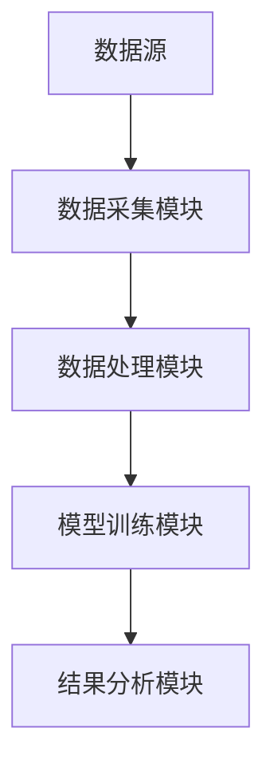

                 


# 智能体系统提升价值投资的另类数据信号提取能力

## 关键词：
智能体系统, 价值投资, 另类数据, 数据信号提取, 金融数据分析

## 摘要：
本文详细探讨了智能体系统在价值投资中的应用，特别是如何通过提取另类数据信号来提升投资决策的准确性和效率。通过分析智能体系统的核心原理、算法实现、系统架构以及实际案例，本文展示了如何利用非传统数据源（如文本、图像和音频）进行深度分析，从而挖掘潜在的投资机会。结合理论与实践，本文为读者提供了一套完整的解决方案，帮助他们在金融领域实现智能化、数据驱动的投资策略。

---

# 第一部分: 智能体系统与另类数据信号提取的背景与基础

## # 第1章: 智能体系统与另类数据概述

### ## 1.1 智能体系统的定义与特点

#### ### 1.1.1 智能体的基本概念
智能体（Intelligent Agent）是一种能够感知环境、自主决策并执行任务的实体。它通过传感器获取信息，利用推理和学习能力解决问题，并通过执行器与环境交互。智能体的核心目标是实现目标函数的最大化。

#### ### 1.1.2 智能体的核心特点
1. **自主性**：智能体能够自主决策，无需外部干预。
2. **反应性**：智能体能够实时感知环境变化并做出响应。
3. **学习能力**：智能体能够通过经验改进自身性能。
4. **推理能力**：智能体能够基于已有信息推导出新的结论。

#### ### 1.1.3 智能体与传统数据处理的区别
智能体不仅能够处理结构化数据，还能处理非结构化数据（如文本、图像、音频等），并通过学习和推理提升处理效率和准确性。

---

### ## 1.2 另类数据的定义与分类

#### ### 1.2.1 另类数据的定义
另类数据是指传统金融数据之外的非结构化数据，包括社交媒体帖子、新闻文章、公司财报、卫星图像、专利申请、招聘信息等。

#### ### 1.2.2 另类数据的主要分类
1. **文本数据**：包括新闻、评论、社交媒体帖子等。
2. **图像数据**：包括卫星图像、公司Logo、产品图片等。
3. **音频数据**：包括电话会议录音、市场广播等。
4. **视频数据**：包括公司宣传片、市场活动视频等。

#### ### 1.2.3 另类数据在金融领域的应用
1. **情绪分析**：通过分析社交媒体帖子的情绪，预测市场走势。
2. **信息提取**：从新闻中提取关键信息，辅助投资决策。
3. **风险预警**：通过分析公司财报和招聘信息，识别潜在风险。

---

### ## 1.3 智能体系统在价值投资中的作用

#### ### 1.3.1 价值投资的基本原理
价值投资是一种投资策略，通过分析公司的基本面（如财务状况、行业地位、管理团队等）来寻找被市场低估的投资机会。

#### ### 1.3.2 智能体系统如何提升投资决策
1. **数据处理能力**：智能体系统能够快速处理大量非结构化数据，提取有价值的信息。
2. **实时监控**：智能体系统能够实时监控市场动态，及时发现潜在投资机会或风险。
3. **决策优化**：智能体系统通过学习和推理，优化投资组合配置，提高投资收益。

#### ### 1.3.3 智能体系统在价值投资中的优势
1. **高效性**：智能体系统能够快速处理和分析数据，节省时间和成本。
2. **准确性**：通过深度学习和自然语言处理技术，智能体系统能够提高信息提取的准确性。
3. **适应性**：智能体系统能够根据市场变化动态调整投资策略。

---

## # 第2章: 价值投资与另类数据的结合

### ## 2.1 价值投资的核心理念

#### ### 2.1.1 价值投资的基本原则
1. **长期视角**：关注公司的长期价值，而非短期市场波动。
2. **基本面分析**：通过分析公司的财务状况、行业地位等因素，评估其内在价值。
3. **安全边际**：确保投资价格低于公司的内在价值，以降低风险。

#### ### 2.1.2 价值投资的决策流程
1. **识别潜在投资目标**：通过基本面分析筛选出具有潜力的公司。
2. **深入研究**：对目标公司进行详细研究，包括财务数据、行业趋势、竞争优势等。
3. **评估内在价值**：计算公司的内在价值，确定其是否被市场低估。
4. **制定投资策略**：根据研究结果，制定具体的投资策略并执行。

#### ### 2.1.3 价值投资的挑战与机遇
1. **挑战**：传统价值投资依赖于财务数据和市场分析，难以应对非结构化数据的复杂性。
2. **机遇**：通过智能体系统处理另类数据，价值投资者可以发现更多潜在机会，提高投资效率。

---

### ## 2.2 另类数据在价值投资中的应用

#### ### 2.2.1 文本数据的挖掘与分析
1. **情绪分析**：通过分析社交媒体和新闻的情绪，预测市场走势。
2. **信息提取**：从新闻和财报中提取关键信息，辅助投资决策。
3. **竞争分析**：通过分析竞争对手的新闻和评论，评估市场地位。

#### ### 2.2.2 图像数据的处理与应用
1. **卫星图像**：通过分析卫星图像，评估公司的生产基地和供应链情况。
2. **产品图片**：通过分析产品的外观和设计，评估产品的市场竞争力。
3. **公司Logo**：通过分析公司Logo的变化，判断公司的品牌策略。

#### ### 2.2.3 音频数据的分析与价值提取
1. **电话会议**：通过分析公司高管的电话会议录音，评估公司管理团队的稳定性。
2. **市场广播**：通过分析市场广播的内容，预测市场趋势。
3. **语音识别**：通过语音识别技术，提取音频数据中的关键信息。

---

### ## 2.3 智能体系统在另类数据中的创新应用

#### ### 2.3.1 智能体系统如何处理非结构化数据
智能体系统通过自然语言处理（NLP）、计算机视觉（CV）等技术，将非结构化数据转化为结构化信息，便于后续分析和决策。

#### ### 2.3.2 智能体系统如何优化投资决策
智能体系统通过实时监控市场动态、分析另类数据，帮助投资者快速识别潜在机会和风险，优化投资组合配置。

#### ### 2.3.3 智能体系统在风险控制中的作用
智能体系统通过分析另类数据，识别潜在风险（如公司财务造假、管理团队变动等），帮助投资者制定风险控制策略。

---

# 第二部分: 智能体系统与另类数据的核心概念与联系

## # 第3章: 智能体系统的核心原理

### ## 3.1 智能体系统的组成与功能

#### ### 3.1.1 智能体系统的组成模块
1. **感知模块**：通过传感器获取环境信息。
2. **推理模块**：通过推理和学习处理信息，做出决策。
3. **执行模块**：通过执行器与环境交互，执行决策。

#### ### 3.1.2 智能体系统的功能特点
1. **自主性**：智能体能够自主决策，无需外部干预。
2. **反应性**：智能体能够实时感知环境变化并做出响应。
3. **学习能力**：智能体能够通过经验改进自身性能。

#### ### 3.1.3 智能体系统与外部环境的交互
智能体系统通过感知环境、处理信息、做出决策并执行操作，与外部环境进行交互。

---

### ## 3.2 智能体系统的核心算法

#### ### 3.2.1 机器学习算法在智能体中的应用
1. **监督学习**：通过标记数据训练模型，预测未来趋势。
2. **无监督学习**：通过聚类分析，发现数据中的潜在模式。
3. **强化学习**：通过奖励机制，优化智能体的决策策略。

#### ### 3.2.2 自然语言处理在智能体中的应用
1. **文本分类**：通过NLP技术，对文本进行分类（如情感分析）。
2. **信息抽取**：从文本中提取关键信息（如公司财报中的财务数据）。
3. **对话生成**：通过生成模型，模拟与人类的对话。

#### ### 3.2.3 时间序列分析在智能体中的应用
1. **趋势预测**：通过时间序列分析，预测市场趋势。
2. **异常检测**：通过分析时间序列数据，识别异常情况。

---

### ## 3.3 智能体系统的性能评估

#### ### 3.3.1 性能评估的指标与方法
1. **准确率**：预测结果与实际结果的匹配程度。
2. **反应时间**：智能体系统处理数据的时间效率。
3. **决策质量**：投资决策的收益与风险比。

#### ### 3.3.2 智能体系统的效果对比分析
通过对比传统投资方法和智能体系统的效果，验证智能体系统在价值投资中的优势。

---

## # 第4章: 智能体系统的算法原理与实现

### ## 4.1 自然语言处理算法的实现

#### ### 4.1.1 NLP算法的原理
自然语言处理（NLP）是一种通过计算机理解、处理和生成人类语言的技术。

#### ### 4.1.2 NLP算法的实现步骤
1. **数据预处理**：对文本数据进行清洗、分词等预处理。
2. **特征提取**：提取文本数据的特征（如词袋模型、TF-IDF等）。
3. **模型训练**：通过机器学习算法训练模型（如SVM、随机森林、神经网络等）。
4. **结果分析**：通过分析模型输出结果，提取有用信息。

#### ### 4.1.3 NLP算法的代码实现
以下是使用Python实现的NLP算法示例代码：

```python
import nltk
from sklearn.feature_extraction.text import TfidfVectorizer
from sklearn.svm import SVC

# 数据预处理
text_data = ["This is a sample text.", "Another sample text."]

# 特征提取
vectorizer = TfidfVectorizer()
X = vectorizer.fit_transform(text_data)

# 模型训练
model = SVC()
model.fit(X, [0, 1])

# 模型预测
new_text = ["New sample text."]
new_X = vectorizer.transform(new_text)
print(model.predict(new_X))
```

---

### ## 4.2 时间序列分析算法的实现

#### ### 4.2.1 时间序列分析的原理
时间序列分析是一种通过分析历史数据，预测未来趋势的技术。

#### ### 4.2.2 时间序列分析的实现步骤
1. **数据预处理**：对时间序列数据进行平稳化处理。
2. **模型选择**：选择适合的时间序列模型（如ARIMA、LSTM等）。
3. **模型训练**：通过历史数据训练模型。
4. **结果分析**：通过分析模型输出结果，预测未来趋势。

#### ### 4.2.3 时间序列分析的代码实现
以下是使用Python实现的时间序列分析算法示例代码：

```python
import numpy as np
from sklearn.preprocessing import MinMaxScaler
from keras.models import Sequential
from keras.layers import LSTM, Dense

# 数据预处理
data = np.array([0.1, 0.2, 0.3, 0.4, 0.5])
scaler = MinMaxScaler()
data = scaler.fit_transform(data)

# 模型训练
model = Sequential()
model.add(LSTM(128, input_shape=(1, 1)))
model.add(Dense(1))
model.compile(loss='mean_squared_error', optimizer='adam')
model.fit(data, epochs=100, batch_size=1)

# 模型预测
new_data = np.array([0.6])
new_data = new_data.reshape(1, 1, 1)
prediction = model.predict(new_data)
print(scaler.inverse_transform(prediction))
```

---

## # 第5章: 智能体系统的系统分析与架构设计

### ## 5.1 系统功能设计

#### ### 5.1.1 系统功能模块
1. **数据采集模块**：从多种数据源采集数据（如社交媒体、新闻网站等）。
2. **数据处理模块**：对采集的数据进行清洗、转换和特征提取。
3. **模型训练模块**：通过机器学习算法训练模型。
4. **结果分析模块**：分析模型输出结果，提取有用信息。

#### ### 5.1.2 系统功能流程
1. 数据采集模块从多种数据源采集数据。
2. 数据处理模块对数据进行预处理，提取特征。
3. 模型训练模块通过特征数据训练模型。
4. 结果分析模块对模型输出结果进行分析，提取有用信息。

---

### ## 5.2 系统架构设计

#### ### 5.2.1 系统架构图
以下是系统架构设计的Mermaid图：



#### ### 5.2.2 系统接口设计
系统接口设计包括数据源接口、模型训练接口和结果分析接口。

#### ### 5.2.3 系统交互流程
1. 数据源通过数据采集模块采集数据。
2. 数据采集模块将数据传递给数据处理模块。
3. 数据处理模块对数据进行预处理，提取特征。
4. 数据处理模块将特征数据传递给模型训练模块。
5. 模型训练模块通过特征数据训练模型。
6. 模型训练模块将模型结果传递给结果分析模块。
7. 结果分析模块分析模型输出结果，提取有用信息。

---

## # 第6章: 项目实战与案例分析

### ## 6.1 项目环境安装

#### ### 6.1.1 Python环境安装
1. 安装Python 3.8及以上版本。
2. 安装必要的Python库（如numpy、pandas、scikit-learn、keras等）。

#### ### 6.1.2 数据源获取
1. 从社交媒体平台获取文本数据。
2. 从新闻网站获取文本数据。
3. 从公司网站获取图像数据。

---

### ## 6.2 系统核心实现

#### ### 6.2.1 数据采集模块实现
以下是数据采集模块的Python代码实现：

```python
import requests
from bs4 import BeautifulSoup

# 从新闻网站采集文本数据
url = "https://example.com"
response = requests.get(url)
soup = BeautifulSoup(response.text, 'html.parser')
text = soup.find('div', class_='article-content').text
print(text)
```

#### ### 6.2.2 数据处理模块实现
以下是数据处理模块的Python代码实现：

```python
import numpy as np
from sklearn.feature_extraction.text import TfidfVectorizer

# 文本数据预处理
texts = ["This is a sample text.", "Another sample text."]
vectorizer = TfidfVectorizer()
X = vectorizer.fit_transform(texts)
print(X)
```

#### ### 6.2.3 模型训练模块实现
以下是模型训练模块的Python代码实现：

```python
from sklearn.svm import SVC

# 训练模型
model = SVC()
model.fit(X, [0, 1])

# 模型预测
new_text = ["New sample text."]
new_X = vectorizer.transform([new_text])
print(model.predict(new_X))
```

---

### ## 6.3 案例分析与结果解读

#### ### 6.3.1 实际案例分析
1. 数据采集：从社交媒体平台采集公司相关新闻和评论。
2. 数据处理：对文本数据进行预处理，提取特征。
3. 模型训练：通过机器学习算法训练模型。
4. 结果分析：分析模型输出结果，提取有用信息。

#### ### 6.3.2 投资决策优化
通过智能体系统分析另类数据，识别潜在投资机会和风险，优化投资组合配置。

---

## # 第7章: 高级主题与扩展阅读

### ## 7.1 高级算法与前沿技术

#### ### 7.1.1 增强学习在智能体系统中的应用
增强学习是一种通过奖励机制优化智能体决策的技术。

#### ### 7.1.2 图神经网络在智能体系统中的应用
图神经网络是一种通过图结构数据进行学习的技术。

---

### ## 7.2 智能体系统的挑战与未来趋势

#### ### 7.2.1 当前挑战
1. **数据质量**：另类数据的质量参差不齐，影响分析结果。
2. **计算成本**：智能体系统的运行需要大量计算资源。
3. **模型解释性**：智能体系统的决策过程难以解释。

#### ### 7.2.2 未来趋势
1. **多模态数据处理**：智能体系统将更加擅长处理多种数据类型。
2. **实时分析**：智能体系统将更加注重实时数据分析。
3. **自适应学习**：智能体系统将具备更强的自适应学习能力。

---

# 结语

通过本文的详细讲解，我们了解了智能体系统在价值投资中的重要作用，特别是如何通过提取另类数据信号来提升投资决策的准确性和效率。结合理论与实践，我们展示了如何利用非传统数据源进行深度分析，挖掘潜在的投资机会。未来，随着人工智能技术的不断发展，智能体系统将在金融领域发挥越来越重要的作用。

---

# 作者：AI天才研究院/AI Genius Institute & 禅与计算机程序设计艺术 /Zen And The Art of Computer Programming

