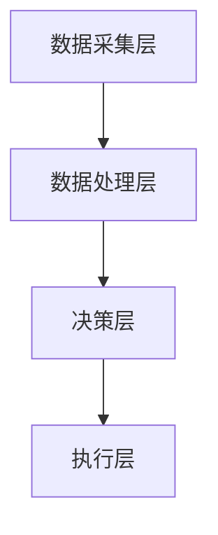
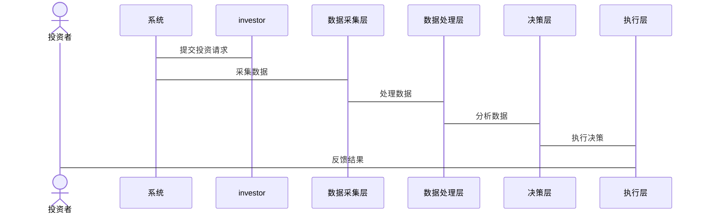

                 


# 智能体系统提升价值投资的另类数据分析能力

## 关键词：智能体系统，另类数据分析，价值投资，强化学习，时间序列分析

## 摘要：本文探讨智能体系统如何通过另类数据分析能力提升价值投资。通过分析智能体系统的定义、核心概念、算法原理、系统架构及项目实战，结合最佳实践，详细阐述如何利用智能体系统优化投资决策，提升投资收益。

---

## 第1章 智能体系统与另类数据分析概述

### 1.1 智能体系统的定义与特点

#### 1.1.1 智能体系统的定义

智能体系统（Intelligent Agent System）是一种能够感知环境、做出决策并采取行动的系统。它通过传感器获取数据，利用算法进行分析和推理，最终做出最优决策。智能体系统具备自主性、反应性、目标导向性和学习能力。

#### 1.1.2 智能体系统的核心特点

- **自主性**：无需外部干预，自主运行。
- **反应性**：能实时感知环境变化并做出反应。
- **目标导向性**：以实现特定目标为导向。
- **学习能力**：通过数据和经验不断优化性能。

#### 1.1.3 智能体系统与传统数据分析的区别

传统数据分析依赖于规则和模式匹配，而智能体系统能够理解上下文、推理和学习，具备更高的灵活性和适应性。

### 1.2 另类数据分析的定义与特点

#### 1.2.1 另类数据的定义

另类数据（Alternative Data）是指传统金融数据之外的非传统数据，例如卫星图像、社交媒体数据、供应链数据等。这些数据可以帮助投资者发现传统数据无法捕捉到的信息。

#### 1.2.2 另类数据的分类与应用场景

- **社交媒体数据**：用于情绪分析和市场情绪预测。
- **卫星图像数据**：用于分析供应链和物流情况。
- **物联网数据**：用于实时监测设备状态。

#### 1.2.3 另类数据分析的优势与挑战

- **优势**：提供更丰富的信息，帮助投资者做出更精准的决策。
- **挑战**：数据质量参差不齐，处理复杂，需要强大的技术支撑。

### 1.3 智能体系统在价值投资中的作用

#### 1.3.1 价值投资的核心理念

价值投资强调通过深入分析公司的基本面，寻找市场价格低于内在价值的投资标的。

#### 1.3.2 智能体系统如何提升价值投资

智能体系统能够快速处理和分析海量数据，识别潜在的投资机会，优化投资组合，降低风险。

#### 1.3.3 另类数据分析在价值投资中的应用

通过分析社交媒体、新闻和供应链数据，智能体系统能够更全面地评估公司的基本面，发现市场未察觉的信息。

### 1.4 本章小结

智能体系统通过另类数据分析，为价值投资提供了新的工具和方法，能够更高效地发现投资机会，优化投资决策。

---

## 第2章 智能体系统的核心概念与联系

### 2.1 智能体系统的组成与功能

#### 2.1.1 智能体系统的组成要素

- **感知层**：通过传感器获取数据。
- **数据处理层**：对数据进行清洗、转换和分析。
- **决策层**：基于分析结果做出决策。
- **行动层**：执行决策。

#### 2.1.2 智能体系统的功能模块

- **数据采集模块**：收集数据。
- **数据分析模块**：对数据进行分析和挖掘。
- **决策模块**：基于分析结果做出决策。
- **执行模块**：执行决策并反馈结果。

### 2.2 另类数据分析的核心原理

#### 2.2.1 数据采集与处理

通过多种渠道获取另类数据，并进行清洗和转换，确保数据质量。

#### 2.2.2 数据分析与挖掘

利用机器学习和深度学习算法，对数据进行分析和挖掘，提取有价值的信息。

#### 2.2.3 数据可视化与决策支持

通过可视化工具将分析结果呈现，为决策提供支持。

### 2.3 智能体系统与另类数据分析的关系

#### 2.3.1 智能体系统与另类数据分析的协同作用

智能体系统通过整合另类数据分析能力，提升数据处理和决策能力。

#### 2.3.2 智能体系统如何提升另类数据分析能力

通过自主学习和自适应能力，智能体系统能够不断优化数据分析模型，提高分析精度。

#### 2.3.3 智能体系统与价值投资的结合

智能体系统通过整合另类数据分析能力，为价值投资提供更全面、更精准的决策支持。

### 2.4 本章小结

智能体系统与另类数据分析的结合，为价值投资提供了更强大的工具和方法，能够更高效地发现投资机会，优化投资决策。

---

## 第3章 智能体系统的算法原理

### 3.1 强化学习在智能体系统中的应用

#### 3.1.1 强化学习的定义与特点

强化学习是一种通过试错机制，学习最优策略的算法。它通过与环境交互，不断优化决策策略。

#### 3.1.2 强化学习的数学模型

强化学习的核心是Q-learning算法，其数学模型如下：

$$ Q(s, a) = r + \gamma \max_{a'} Q(s', a') $$

其中，\( Q(s, a) \) 表示在状态 \( s \) 下采取行动 \( a \) 的奖励值，\( r \) 是立即奖励，\( \gamma \) 是折扣因子，\( s' \) 是下一状态。

#### 3.1.3 强化学习的实现步骤

1. 初始化Q值表。
2. 与环境交互，获取状态和奖励。
3. 更新Q值表。
4. 重复步骤2和3，直到收敛。

#### 3.1.4 强化学习在价值投资中的应用

通过模拟交易环境，智能体系统能够学习最优的交易策略，提高投资收益。

### 3.2 时间序列分析在智能体系统中的应用

#### 3.2.1 时间序列分析的定义与特点

时间序列分析是对随时间变化的数据进行建模和预测，常用于股票价格预测。

#### 3.2.2 时间序列分析的数学模型

ARIMA模型是一种常用的时间序列分析模型，其数学表达式为：

$$ ARIMA(p, d, q) $$

其中，\( p \) 是自回归阶数，\( d \) 是差分阶数，\( q \) 是移动平均阶数。

#### 3.2.3 时间序列分析的实现步骤

1. 数据预处理：对数据进行平移和差分。
2. 模型选择：选择合适的ARIMA参数。
3. 模型训练：基于训练数据拟合模型。
4. 模型预测：基于模型预测未来值。

#### 3.2.4 时间序列分析在价值投资中的应用

通过预测股票价格，智能体系统能够帮助投资者做出更明智的投资决策。

### 3.3 本章小结

智能体系统通过强化学习和时间序列分析等算法，能够有效提升另类数据分析能力，为价值投资提供有力支持。

---

## 第4章 智能体系统的系统分析与架构设计

### 4.1 问题场景介绍

我们面临的问题是如何利用智能体系统对另类数据进行分析，优化价值投资决策。

### 4.2 系统功能设计

#### 4.2.1 领域模型设计

领域模型是一个公司价值评估的类图，展示公司各个方面的信息。

```mermaid
classDiagram

class Company {
    +name: String
    +revenue: Float
    +profit: Float
    +marketValue: Float
}

class News {
    +title: String
    +content: String
    +pubDate: Date
}

class Tweet {
    +text: String
    +user: String
    +pubTime: Date
}

Company o News
Company o Tweet
```

#### 4.2.2 系统架构设计

系统架构采用分层架构，包括数据采集层、数据处理层、决策层和执行层。



#### 4.2.3 系统接口设计

系统接口包括数据采集接口、数据分析接口和决策执行接口。

#### 4.2.4 系统交互设计

系统交互流程如下：



### 4.3 本章小结

通过系统分析与架构设计，我们能够构建一个高效的智能体系统，用于另类数据分析和价值投资。

---

## 第5章 智能体系统的项目实战

### 5.1 环境安装与配置

#### 5.1.1 安装Python环境

使用Anaconda安装Python 3.8及以上版本。

#### 5.1.2 安装必要的库

安装numpy、pandas、scikit-learn、tensorflow等库。

### 5.2 系统核心实现

#### 5.2.1 数据采集模块实现

```python
import requests

def fetch_data(url):
    response = requests.get(url)
    return response.json()
```

#### 5.2.2 数据分析模块实现

```python
from sklearn import linear_model

def analyze_data(data):
    model = linear_model.LinearRegression()
    model.fit(data['features'], data['target'])
    return model.predict(data['new_features'])
```

#### 5.2.3 决策模块实现

```python
def make_decision(data, model):
    prediction = model.predict(data)
    if prediction > current_price:
        return '买入'
    else:
        return '卖出'
```

#### 5.2.4 执行模块实现

```python
import time

def execute_decision(action):
    if action == '买入':
        buy_stock()
    else:
        sell_stock()
    time.sleep(1)
```

### 5.3 实际案例分析

#### 5.3.1 案例背景

假设我们有一个股票数据集，包括股票价格、交易量、社交媒体情绪等数据。

#### 5.3.2 数据分析与建模

使用强化学习算法训练一个交易策略模型。

#### 5.3.3 系统执行与结果分析

通过回测，评估模型的性能和收益。

### 5.4 项目小结

通过项目实战，我们能够更好地理解智能体系统的实现和应用，提升另类数据分析能力。

---

## 第6章 最佳实践与总结

### 6.1 最佳实践

- **数据质量管理**：确保数据的准确性和完整性。
- **算法优化**：根据实际需求调整算法参数。
- **系统维护**：定期更新数据和模型。

### 6.2 小结

智能体系统通过另类数据分析能力，为价值投资提供了更强大的工具和方法，能够更高效地发现投资机会，优化投资决策。

### 6.3 注意事项

- **数据隐私**：确保数据的安全和隐私。
- **系统稳定性**：保证系统的稳定运行。
- **风险管理**：合理控制投资风险。

### 6.4 拓展阅读

- 《强化学习实战》
- 《时间序列分析与预测》
- 《智能体系统设计与实现》

---

## 作者：AI天才研究院/AI Genius Institute & 禅与计算机程序设计艺术 /Zen And The Art of Computer Programming

---

**本文由AI天才研究院原创，转载请注明出处。**

