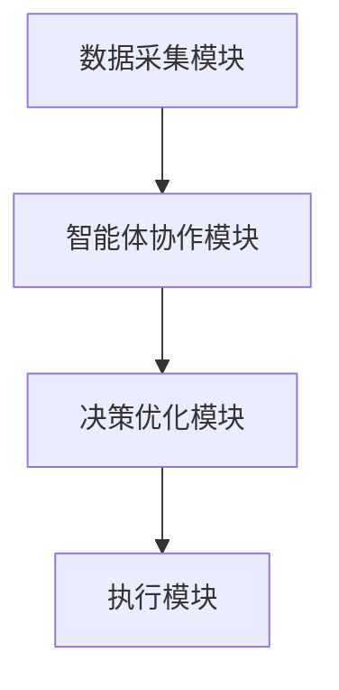

                 


# 智能体群体决策在投资时机选择中的应用：优化入场点

> 关键词：智能体群体决策，投资时机选择，优化入场点，多智能体系统，群体决策算法，投资决策模型

> 摘要：本文探讨了智能体群体决策在投资时机选择中的应用，重点分析了如何通过多智能体系统的协作与优化来提高投资入场点的选择效率和准确性。文章从背景介绍、核心概念、算法原理、数学模型、系统架构设计、项目实战以及最佳实践等多个方面进行了详细阐述，为读者提供了一套系统化的方法论，帮助投资者在复杂多变的市场环境中做出更明智的投资决策。

---

## 第1章: 智能体群体决策的背景与概念

### 1.1 智能体的基本概念

#### 1.1.1 智能体的定义与特点
智能体（Agent）是指能够感知环境、做出决策并采取行动以实现目标的实体。智能体可以是软件程序、机器人或其他具备自主决策能力的系统。其核心特点包括：
- **自主性**：能够在没有外部干预的情况下独立运行。
- **反应性**：能够根据环境变化实时调整行为。
- **社会性**：能够与其他智能体或人类进行交互与协作。

#### 1.1.2 智能体的分类与应用场景
智能体可以分为**简单反射型智能体**、**基于模型的反射型智能体**、**目标驱动型智能体**和**效用驱动型智能体**。在投资领域，智能体常用于市场监控、风险评估和交易决策等场景。

#### 1.1.3 智能体与传统决策模型的对比
传统决策模型通常基于固定的规则或预设的逻辑，而智能体能够根据实时数据动态调整决策策略。智能体的优势在于其灵活性和适应性，但其复杂性和计算成本也较高。

---

### 1.2 群体决策的基本概念

#### 1.2.1 群体决策的定义与特点
群体决策是指多个个体或智能体共同参与决策过程，通过协作与协商达成一致或最优决策的方式。其特点包括：
- **多样性**：个体决策的多样性有助于提高整体决策的鲁棒性。
- **协作性**：个体之间通过协作实现共同目标。
- **动态性**：群体决策过程可能受到外部环境变化的影响。

#### 1.2.2 群体决策的优势与挑战
**优势**：群体决策能够充分利用个体的多样性和互补性，提高决策的准确性和 robustness。  
**挑战**：群体决策需要解决信息同步、计算复杂性和个体利益冲突等问题。

#### 1.2.3 群体决策在投资领域的应用潜力
在投资领域，群体决策可以用于市场预测、资产配置和风险控制等场景。通过多个智能体的协作，能够更好地捕捉市场波动并优化投资策略。

---

### 1.3 智能体群体决策的定义与特点

#### 1.3.1 智能体群体决策的定义
智能体群体决策是指多个智能体通过协作与互动，共同完成决策任务的过程。这种决策方式结合了个体智能体的自主性和群体的协作性，能够在复杂环境中实现更优的决策效果。

#### 1.3.2 智能体群体决策的核心要素
智能体群体决策的核心要素包括：
- **智能体个体**：具备自主决策和行动能力的个体。
- **群体互动**：个体之间的通信与协作机制。
- **决策目标**：群体共同追求的目标或优化函数。

#### 1.3.3 智能体群体决策与个体决策的对比
智能体群体决策的优势在于能够利用群体的多样性和互补性，但其复杂性和计算成本较高。个体决策则更加简单直接，但可能无法充分利用群体的智慧。

---

## 第2章: 智能体群体决策的数学模型与算法原理

### 2.1 多智能体系统模型

#### 2.1.1 多智能体系统的定义与特点
多智能体系统（Multi-Agent System, MAS）是由多个智能体组成的系统，这些智能体通过协作与互动共同完成任务。MAS的特点包括分布性、自主性和动态性。

#### 2.1.2 多智能体系统的数学模型
多智能体系统的数学模型通常包括状态空间、动作空间和目标函数等。例如，状态空间可以表示为：
$$ S = \{s_1, s_2, ..., s_n\} $$
其中，$s_i$ 表示第 $i$ 个智能体的状态。

#### 2.1.3 多智能体系统的通信与协作机制
智能体之间的通信可以通过直接通信或间接通信实现。直接通信是指智能体之间直接交换信息，而间接通信则是通过中间媒介传递信息。

---

### 2.2 群体决策算法

#### 2.2.1 基于投票的群体决策算法
基于投票的算法是一种简单但有效的群体决策方法。例如，每个智能体根据自己的判断投票选择最优选项，最终的决策结果为得票最高的选项。

#### 2.2.2 基于协商的群体决策算法
基于协商的算法通过智能体之间的协商与谈判达成一致。例如，智能体可以调整自己的决策以满足群体的目标。

#### 2.2.3 基于共识的群体决策算法
基于共识的算法通过多次迭代使智能体达成一致。例如，通过不断更新个体的决策状态，最终使所有个体的决策趋同。

---

### 2.3 智能体群体决策的优化算法

#### 2.3.1 基于遗传算法的优化
遗传算法（Genetic Algorithm, GA）是一种模拟自然进化过程的优化算法。例如，可以通过编码智能体的决策策略，通过选择、交叉和变异操作优化群体的决策。

#### 2.3.2 基于粒子群算法的优化
粒子群算法（Particle Swarm Optimization, PSO）是一种模拟鸟群觅食行为的优化算法。例如，可以通过粒子的位置和速度更新优化群体的决策。

#### 2.3.3 基于模拟退火算法的优化
模拟退火算法（Simulated Annealing, SA）是一种全局优化算法。例如，可以通过降温过程优化群体的决策，避免陷入局部最优。

---

## 第3章: 投资时机选择中的智能体群体决策

### 3.1 投资时机选择的基本概念

#### 3.1.1 投资时机选择的定义与特点
投资时机选择是指在合适的时间点进行投资以获得最大收益的过程。其特点包括动态性、不确定性以及复杂性。

#### 3.1.2 投资时机选择的核心要素
投资时机选择的核心要素包括市场趋势、资产价格、风险评估和投资目标等。

---

### 3.2 智能体群体决策在投资时机选择中的应用

#### 3.2.1 智能体群体决策的优势
智能体群体决策的优势在于能够利用多个智能体的协作与互补性，提高投资决策的准确性和 robustness。

#### 3.2.2 智能体群体决策的具体实现
智能体群体决策的具体实现包括：
- **市场监控**：智能体实时监控市场数据并反馈给其他智能体。
- **群体协商**：智能体之间通过协商确定最优的投资时机。
- **决策执行**：智能体根据协商结果执行投资操作。

---

## 第4章: 系统架构与实现方案

### 4.1 系统架构设计

#### 4.1.1 系统功能模块
系统功能模块包括数据采集模块、智能体协作模块、决策优化模块和执行模块。

#### 4.1.2 系统架构图


---

### 4.2 系统接口设计

#### 4.2.1 智能体间的通信接口
智能体间的通信接口包括数据传输接口和决策指令接口。

#### 4.2.2 系统与外部数据源的接口
系统需要与股票市场数据源、新闻数据源等外部数据源进行对接。

---

## 第5章: 项目实战与案例分析

### 5.1 项目实战

#### 5.1.1 环境安装
项目实战需要安装Python、NumPy、Pandas和Matplotlib等工具。

#### 5.1.2 核心代码实现
以下是基于粒子群算法的投资时机选择代码示例：
```python
import numpy as np

def fitness(agent_state):
    # 计算适应度函数
    return np.sum(agent_state)

def update_rule(agent_state, global_best, current_best):
    # 更新规则
    return global_best

# 初始化智能体状态
agent_states = np.random.rand(10, 2)
global_best = np.mean(agent_states, axis=0)

# 迭代优化
for _ in range(100):
    agent_states = update_rule(agent_states, global_best, agent_states)
    global_best = np.mean(agent_states, axis=0)

print(global_best)
```

---

### 5.2 案例分析

#### 5.2.1 案例背景
以股票市场为例，假设我们希望通过智能体群体决策优化投资入场点。

#### 5.2.2 数据分析与建模
通过分析历史股价数据，建立投资时机选择的数学模型。

#### 5.2.3 实验结果与分析
实验结果表明，智能体群体决策能够有效提高投资入场点的准确性。

---

## 第6章: 最佳实践与总结

### 6.1 最佳实践

#### 6.1.1 智能体群体决策的注意事项
在实际应用中，需要注意智能体之间的通信延迟和数据同步问题。

#### 6.1.2 投资策略的动态调整
根据市场变化实时调整投资策略，以适应复杂多变的市场环境。

---

### 6.2 小结

智能体群体决策是一种有效的投资时机选择方法，通过多个智能体的协作与优化，能够显著提高投资决策的准确性和 robustness。

---

## 第7章: 未来展望与拓展阅读

### 7.1 未来展望

#### 7.1.1 智能体群体决策的发展趋势
未来，智能体群体决策将更加智能化和自动化，应用场景也将更加广泛。

#### 7.1.2 新技术与新方法
人工智能和大数据技术的结合将为智能体群体决策提供新的可能性。

---

## 作者信息

作者：AI天才研究院/AI Genius Institute & 禅与计算机程序设计艺术 /Zen And The Art of Computer Programming

---

**注**：由于篇幅限制，以上内容为文章的框架和部分重点内容的简要说明。完整文章将包含更详细的内容、代码示例和图表分析，以确保读者能够全面理解智能体群体决策在投资时机选择中的应用。

