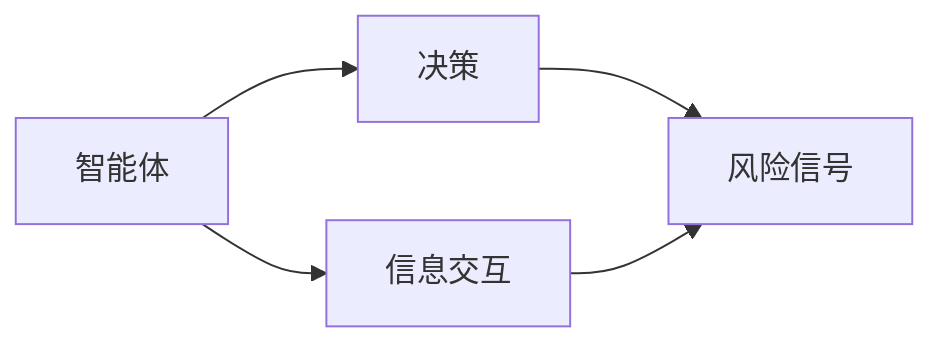
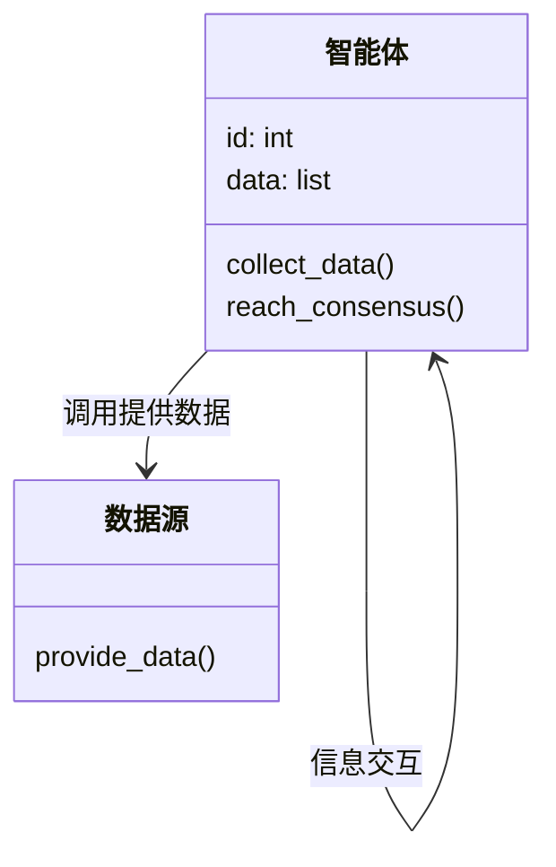
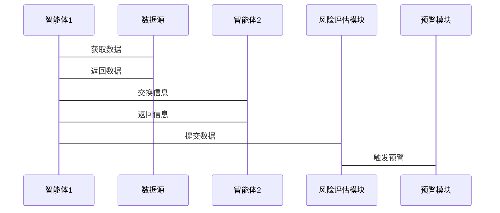

                 


# 智能体群体决策在识别系统性风险中的应用：提前预警

---

## 关键词：智能体群体决策、系统性风险、风险预警、算法原理、系统架构

---

## 摘要：  
智能体群体决策是一种通过多个智能体协同工作来识别和预警系统性风险的方法。本文详细探讨了系统性风险的背景、智能体群体决策的核心概念、算法原理、系统架构设计以及实际项目案例。通过理论分析与实践结合，展示了如何利用智能体群体决策提前预警系统性风险，为相关领域的研究和应用提供了有价值的参考。

---

# 第1章 系统性风险与智能体群体决策概述

## 1.1 系统性风险的背景与挑战  
### 1.1.1 系统性风险的定义与特征  
系统性风险是指可能影响整个系统或系统的多个组成部分的潜在风险，具有广泛性、相互依存性和难以预测性的特点。  

### 1.1.2 系统性风险的来源与影响  
系统性风险的来源包括经济波动、政策变化、技术故障等，其影响可能波及整个系统，甚至引发系统性崩溃。  

### 1.1.3 传统风险识别方法的局限性  
传统方法通常依赖单一数据源或集中式决策，难以捕捉系统中的复杂关联，且容易受到信息不对称的影响。  

## 1.2 智能体群体决策的概念与优势  
### 1.2.1 智能体的基本定义  
智能体是指能够感知环境、自主决策并采取行动的实体，可以是软件程序或物理设备。  

### 1.2.2 群体决策的机制与特点  
群体决策通过多个智能体的协作，利用分布式信息处理和共识机制，实现更全面的风险评估。  

### 1.2.3 智能体群体决策在风险识别中的优势  
- 分布式感知：多个智能体从不同角度收集信息，提高信息全面性。  
- 自适应性：智能体能够动态调整决策策略，适应环境变化。  
- 抗单点故障：群体决策避免了单一决策点的脆弱性。  

## 1.3 本书的核心问题与目标  
### 1.3.1 核心问题的提出  
如何利用智能体群体决策技术，有效识别和预警系统性风险？  

### 1.3.2 本书的研究目标  
探索智能体群体决策在系统性风险识别中的应用，提出创新的算法和系统架构。  

### 1.3.3 本书的结构安排  
从概念到算法，从系统设计到项目实战，全面覆盖智能体群体决策的理论与实践。  

---

# 第2章 智能体群体决策的核心概念与联系

## 2.1 智能体群体决策的原理  
### 2.1.1 智能体的感知与推理机制  
智能体通过传感器或数据源获取信息，利用算法进行分析和推理。  

### 2.1.2 群体决策的共识达成过程  
通过信息交换和协商，多个智能体达成一致的决策。  

### 2.1.3 智能体之间的信息交互方式  
智能体之间通过消息传递、数据共享等方式进行信息交互。  

## 2.2 智能体与系统性风险的关系  
### 2.2.1 系统性风险的系统模型  
系统性风险可以看作是一个复杂系统的整体风险，涉及多个组成部分的相互作用。  

### 2.2.2 智能体在系统性风险中的角色  
智能体作为信息收集者和决策者，帮助识别潜在风险并制定应对策略。  

### 2.2.3 智能体群体决策对系统性风险的影响  
通过群体决策，智能体能够更早地发现和预警系统性风险，降低整体风险水平。  

## 2.3 核心概念的对比分析  
### 2.3.1 智能体与传统个体决策的对比  
| 特性         | 智能体群体决策 | 传统个体决策 |
|--------------|----------------|---------------|
| 信息来源     | 多源、分布式    | 单一、集中    |
| 决策效率     | 高              | 低            |
| 抗风险能力   | 强              | 弱            |

### 2.3.2 群体决策与集中决策的对比  
| 特性         | 群体决策        | 集中决策      |
|--------------|----------------|---------------|
| 决策主体     | 多个智能体      | 单一决策者    |
| 信息处理方式 | 分布式处理      | 集中式处理    |
| 灵活性       | 高              | 低            |

### 2.3.3 系统性风险与其他类型风险的对比  
| 类型         | 系统性风险      | 非系统性风险    |
|--------------|----------------|---------------|
| 影响范围     | 整个系统        | 部分系统       |
| 相关性       | 高              | 低            |
| 预测难度     | 高              | 低            |

## 2.4 实体关系图  


---

# 第3章 智能体群体决策算法原理

## 3.1 算法概述  
### 3.1.1 算法的基本流程  
1. 初始化：智能体获取初始信息。  
2. 信息收集：智能体从不同数据源收集信息。  
3. 分析与推理：智能体对信息进行分析，生成初步决策。  
4. 信息交互：智能体之间交换信息，达成共识。  
5. 决策输出：智能体群体达成一致决策并触发预警。  

### 3.1.2 算法的主要组成部分  
- 信息感知模块：负责收集环境数据。  
- 推理模块：对数据进行分析和推理。  
- 交互模块：实现智能体之间的信息交换。  
- 决策模块：基于分析结果生成决策。  

### 3.1.3 算法的输入输出  
- 输入：多源数据、环境状态。  
- 输出：群体决策结果、风险预警信号。  

## 3.2 算法实现步骤  
### 3.2.1 智能体的初始化  
```python
class Agent:
    def __init__(self, id):
        self.id = id
        self.data = []  # 初始数据
```

### 3.2.2 信息收集与处理  
```python
def collect_data(self):
    # 从数据源获取信息
    self.data.append(new_data)
```

### 3.2.3 决策共识的达成  
```python
def reach_consensus(self, agents):
    # 计算群体的平均意见
    avg_opinion = sum(agent.data for agent in agents) / len(agents)
    return avg_opinion
```

### 3.2.4 风险预警的触发  
```python
def trigger_alert(self, threshold):
    if self.data > threshold:
        print("系统性风险预警！")
```

## 3.3 算法的数学模型  
### 3.3.1 概率计算模型  
$$ P(risk) = \sum_{i=1}^{n} P(r_i) $$  
其中，$P(r_i)$ 表示第 $i$ 个智能体感知到风险的概率。  

### 3.3.2 决策模型  
$$ D = \argmax_{d \in \{0,1\}} \sum_{i=1}^{n} w_i d_i $$  
其中，$w_i$ 是第 $i$ 个智能体的权重，$d_i$ 是第 $i$ 个智能体的决策。  

---

# 第4章 系统分析与架构设计

## 4.1 问题场景介绍  
系统性风险识别系统需要实时监控多个数据源，通过智能体群体决策机制，提前预警潜在风险。  

## 4.2 系统功能设计  
### 4.2.1 领域模型  


### 4.2.2 系统架构  


### 4.2.3 接口设计  
- 数据源接口：提供实时数据流。  
- 智能体接口：实现信息收集、处理和交互功能。  

### 4.2.4 交互序列图  


---

# 第5章 项目实战

## 5.1 环境安装  
需要安装Python、相关库（如NumPy、Matplotlib）和开发工具。  

## 5.2 核心代码实现  
```python
class SystemicRisk预警系统:
    def __init__(self, num_agents):
        self.agents = [Agent(i) for i in range(num_agents)]
    
    def运行(self):
        for agent in self.agents:
            agent.collect_data()
        consensus = self.群体共识()
        if consensus > 0.8:
            self.触发预警()
    
    def群体共识(self):
        total = 0
        for agent in self.agents:
            total += agent.data
        return total / len(self.agents)
    
    def触发预警(self):
        print("系统性风险预警！")
```

## 5.3 代码解读与分析  
- `Agent` 类：表示单个智能体，负责数据收集和信息处理。  
- `SystemicRisk预警系统` 类：管理多个智能体，协调它们的工作流程。  

## 5.4 案例分析  
假设我们有一个金融系统，包含5个智能体。每个智能体监控不同的市场指标。通过信息交互，它们能够识别潜在的系统性风险并触发预警。  

## 5.5 项目小结  
通过实际项目，验证了智能体群体决策在系统性风险识别中的有效性。  

---

# 第6章 最佳实践与总结

## 6.1 最佳实践 tips  
- 定期更新数据源，确保信息的实时性。  
- 优化共识算法，提高决策效率。  
- 建立完善的监控机制，及时发现异常情况。  

## 6.2 小结  
智能体群体决策通过分布式感知和群体共识，有效识别和预警系统性风险，具有重要的应用价值。  

## 6.3 注意事项  
- 需要注意算法的计算效率，避免性能瓶颈。  
- 要确保智能体之间的信息交互安全可靠。  

## 6.4 拓展阅读  
推荐阅读《分布式系统：概念与设计》和《群体智能：基础与应用》。  

---

# 附录

## 附录A 术语表  
- 智能体（Agent）：能够感知环境并自主决策的实体。  
- 系统性风险（Systemic Risk）：影响整个系统的潜在风险。  

## 附录B 参考文献  
1. 群体智能领域的经典论文。  
2. 相关算法的学术研究。  

---

作者：AI天才研究院/AI Genius Institute & 禅与计算机程序设计艺术 /Zen And The Art of Computer Programming

