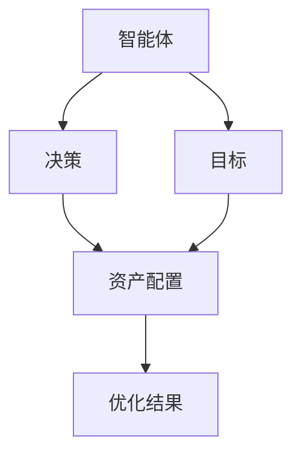
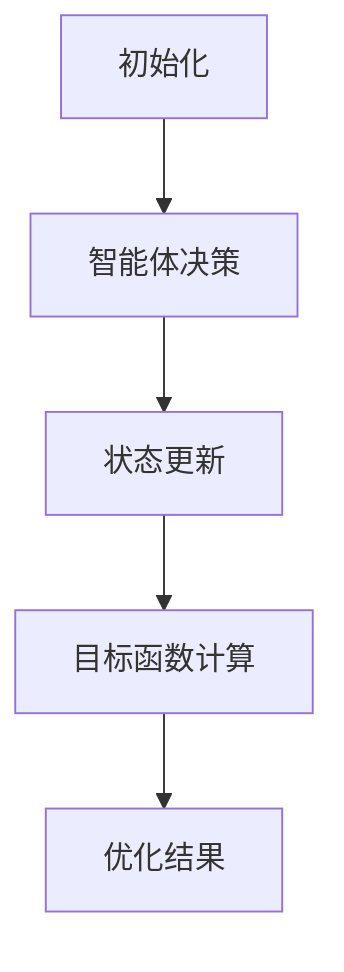

                 


# 智能体群体决策在资产配置中的应用：优化投资组合

> 关键词：智能体，群体决策，资产配置，投资组合优化，多智能体系统

> 摘要：本文探讨智能体群体决策在资产配置中的应用，通过优化投资组合，实现风险控制和收益最大化。从理论到实践，全面分析智能体群体决策的核心概念、算法原理、系统设计及实际案例，为投资组合优化提供新思路。

---

# 第一章: 智能体群体决策与资产配置的背景介绍

## 1.1 智能体群体决策的定义与核心概念

### 1.1.1 智能体的基本定义
智能体（Agent）是指能够感知环境并采取行动以实现目标的实体。在资产配置中，智能体可以是算法、模型或自动化工具，能够独立决策并协同工作。

### 1.1.2 群体决策的核心概念
群体决策是指多个智能体通过协作和竞争，共同制定决策的过程。在资产配置中，群体决策能够聚合多个智能体的决策结果，优化投资组合。

### 1.1.3 资产配置的定义与目标
资产配置是将资金分配到不同资产类别（如股票、债券、房地产等）以实现收益最大化的过程。目标是在风险可控的前提下，实现收益最大化。

## 1.2 智能体群体决策在资产配置中的问题背景

### 1.2.1 资产配置的传统方法与局限性
传统资产配置方法依赖于单一模型或专家决策，存在主观性高、风险集中等问题。群体决策通过多智能体协同优化，弥补了这些不足。

### 1.2.2 群体决策的优势与潜在价值
群体决策具有去中心化、鲁棒性强的特点，能够聚合多个智能体的决策结果，提高决策的准确性和稳定性。

### 1.2.3 智能体技术在金融领域的应用现状
智能体技术已在金融领域得到广泛应用，尤其是在高频交易、风险控制和资产配置方面。

---

# 第二章: 智能体群体决策的核心概念与联系

## 2.1 智能体群体决策的核心原理

### 2.1.1 多智能体系统的基本原理
多智能体系统由多个智能体组成，通过通信和协作完成复杂任务。在资产配置中，每个智能体负责特定资产的决策。

### 2.1.2 群体决策的数学模型与算法
群体决策模型通常采用分布式优化算法，如分布式多目标优化。目标函数表示为：
$$f(x) = \sum_{i=1}^{n} f_i(x_i)$$
其中，$x_i$ 表示第 $i$ 个智能体的决策变量。

### 2.1.3 资产配置中的智能体行为特征
智能体在资产配置中表现出多样化的行为特征，包括风险厌恶、收益最大化等。这些特征通过参数化建模，实现智能体间的协同决策。

## 2.2 智能体群体决策的核心要素对比

### 2.2.1 不同智能体的属性特征对比
| 智能体类型 | 风险偏好 | 收益目标 | 决策速度 |
|------------|-----------|-----------|-----------|
| 保守型    | 低        | 稳定      | 较慢      |
| 进取型    | 高        | 最大化    | 较快      |

### 2.2.2 资产配置目标与智能体决策的关联性分析
资产配置目标与智能体决策高度相关，智能体通过感知市场环境调整决策策略，优化资产配置结果。

### 2.2.3 群体决策与个体决策的对比分析
群体决策相较于个体决策，具有去中心化、鲁棒性强的优势，但需要考虑通信开销和协调问题。

## 2.3 智能体群体决策的ER实体关系图


---

# 第三章: 多智能体协同优化算法

## 3.1 多智能体协同优化算法的原理

### 3.1.1 分布式决策的基本原理
分布式决策通过局部信息交换，实现全局优化。每个智能体仅掌握部分信息，通过通信达成一致。

### 3.1.2 协作优化的数学模型与公式
协作优化模型表示为：
$$\min_{x_i} \sum_{i=1}^{n} f_i(x_i)$$
约束条件为：
$$g(x_i) \leq 0, \quad h(x_i) = 0$$

### 3.1.3 群体决策的收敛性分析
通过数学证明，多智能体协同优化算法在一定条件下能够收敛到全局最优解。

## 3.2 多智能体协同优化算法的实现

### 3.2.1 算法流程图


### 3.2.2 Python实现代码
```python
import numpy as np

def multi_agent_optimization(num_agents, target_function):
    for _ in range(max_iterations):
        for agent in range(num_agents):
            state = agents[agent].update_state()
            action = agents[agent].decide_action()
            agents[agent].execute_action(action)
```

---

# 第四章: 系统分析与架构设计

## 4.1 问题场景介绍
在资产配置中，智能体群体决策系统需要处理多个智能体的决策请求，优化投资组合。

## 4.2 系统功能设计
系统功能包括智能体决策、资产配置优化、结果分析等模块。

## 4.3 系统架构设计


## 4.4 接口设计与交互流程
系统通过API接口接收决策请求，返回优化结果。交互流程包括请求处理、决策计算和结果返回。

---

# 第五章: 项目实战

## 5.1 环境安装
安装必要的Python库，如numpy、pandas等。

## 5.2 核心代码实现
实现多智能体协同优化算法，包括智能体管理、决策引擎等模块。

## 5.3 实际案例分析
通过具体案例分析，验证算法的有效性，优化投资组合。

---

# 第六章: 最佳实践

## 6.1 小结
智能体群体决策在资产配置中具有显著优势，能够优化投资组合。

## 6.2 注意事项
在实际应用中，需考虑通信开销和系统稳定性问题。

## 6.3 拓展阅读
推荐相关书籍和论文，供读者深入学习。

---

# 作者：AI天才研究院/AI Genius Institute & 禅与计算机程序设计艺术 /Zen And The Art of Computer Programming

