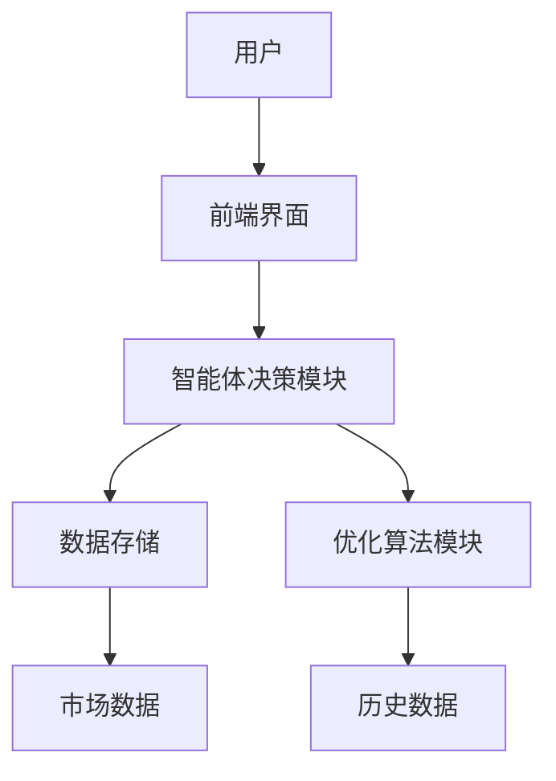

                 


# 智能体群体决策在资产配置优化中的应用：提高组合效率

---

## 关键词  
智能体群体决策, 资产配置优化, 组合效率, 多智能体系统, 人工智能, 投资组合优化

---

## 摘要  
本文探讨了智能体群体决策在资产配置优化中的应用，通过分析智能体群体决策的基本原理、算法实现和系统架构，提出了一种基于智能体群体决策的资产配置优化方法。文章详细介绍了智能体群体决策的核心概念、数学模型和优化算法，并通过实际案例展示了如何利用智能体群体决策提高资产组合的效率。本文旨在为投资组合优化提供一种新的思路和方法。

---

# 第一部分：智能体群体决策与资产配置优化概述

## 第1章：智能体群体决策的基本概念

### 1.1 智能体的基本定义

#### 1.1.1 智能体的定义与特征
智能体（Agent）是指具有感知环境、做出决策并采取行动以实现目标的实体。智能体可以是软件程序、机器人或其他具有智能行为的系统。智能体的核心特征包括：
- **自主性**：能够自主决策，无需外部干预。
- **反应性**：能够根据环境变化实时调整行为。
- **主动性**：能够主动采取行动以实现目标。
- **社会性**：能够与其他智能体或人类进行交互和协作。

#### 1.1.2 群体智能体的形成与特点
群体智能体是指多个智能体协同工作、共同完成复杂任务的系统。群体智能体的特点包括：
- **分布式计算**：智能体之间通过分布式计算实现任务分配。
- **自组织性**：群体智能体能够自组织、自适应，无需中央控制。
- **涌现性**：群体智能体的行为是智能体个体行为的“涌现”结果。

#### 1.1.3 智能体与传统决策模型的对比
传统的决策模型通常基于统计分析或优化算法，而智能体群体决策模型具有以下优势：
- **分布式决策**：多个智能体协同决策，避免单点决策的风险。
- **动态适应性**：能够实时感知环境变化并调整决策。
- **鲁棒性**：群体智能体能够在部分智能体失效的情况下仍保持整体功能。

### 1.2 资产配置优化的基本概念

#### 1.2.1 资产配置的定义与目标
资产配置是指将资金分配到不同的资产类别（如股票、债券、房地产等）以实现投资目标的过程。资产配置的目标包括：
- **风险分散**：通过分散投资降低组合风险。
- **收益最大化**：在可接受的风险范围内实现最大收益。
- **动态调整**：根据市场变化实时调整资产配置。

#### 1.2.2 传统资产配置方法的优缺点
传统的资产配置方法包括均值-方差模型、因子模型等。其优点在于计算简单、易于实现，但存在以下缺点：
- **静态性**：无法适应市场动态变化。
- **单点决策**：依赖于单个决策模型，缺乏多样性和冗余性。

#### 1.2.3 智能体群体决策在资产配置中的应用前景
智能体群体决策在资产配置中的应用前景广阔，能够通过多个智能体的协同决策实现更优的资产配置效果。智能体群体决策的优势包括：
- **分布式计算**：多个智能体协同计算，提高计算效率。
- **动态适应性**：能够实时调整资产配置策略。
- **鲁棒性**：部分智能体失效仍能保持整体功能。

---

## 第2章：智能体群体决策的理论基础

### 2.1 多智能体系统（MAS）概述

#### 2.1.1 多智能体系统的定义与特点
多智能体系统（Multi-Agent System, MAS）是由多个智能体组成的分布式系统，智能体之间通过交互协作完成复杂任务。MAS的特点包括：
- **分布式性**：智能体分布在网络中，不存在中央控制节点。
- **动态性**：智能体能够实时感知环境变化并调整行为。
- **社会性**：智能体之间通过通信和协作完成任务。

#### 2.1.2 多智能体系统的核心要素
多智能体系统的核心要素包括：
- **智能体**：具有感知、决策和行动能力的个体。
- **环境**：智能体所处的物理或虚拟环境。
- **通信协议**：智能体之间交互的规则和协议。
- **任务目标**：智能体协同完成的共同目标。

#### 2.1.3 多智能体系统的分类与应用场景
多智能体系统的分类包括：
- **基于任务的MAS**：智能体通过协作完成特定任务。
- **基于市场的MAS**：智能体通过市场机制进行资源分配。
- **基于网络的MAS**：智能体通过网络进行通信和协作。

多智能体系统的应用场景包括：
- **分布式计算**：通过多个智能体协同完成复杂计算任务。
- **智能交通系统**：智能体协同管理交通流量。
- **金融投资**：智能体协同进行资产配置和交易决策。

---

### 2.2 智能体决策的基本原理

#### 2.2.1 智能体的决策过程
智能体的决策过程包括以下步骤：
1. **感知环境**：通过传感器或数据源获取环境信息。
2. **状态表示**：将环境信息转化为智能体的状态表示。
3. **决策推理**：基于状态信息和决策模型生成决策。
4. **行动执行**：根据决策结果执行行动。
5. **反馈学习**：根据行动结果更新知识库和决策模型。

#### 2.2.2 智能体的决策模型
智能体的决策模型包括：
- **基于规则的决策模型**：通过预定义规则进行决策。
- **基于逻辑的决策模型**：通过逻辑推理生成决策。
- **基于学习的决策模型**：通过机器学习算法生成决策。

#### 2.2.3 智能体的决策优化方法
智能体的决策优化方法包括：
- **遗传算法**：通过模拟生物进化过程优化决策。
- **粒子群优化算法**：通过模拟鸟群觅食行为优化决策。
- **模拟退火算法**：通过模拟金属退火过程优化决策。

---

### 2.3 群体决策的数学模型

#### 2.3.1 群体决策的定义与数学表达
群体决策的数学模型可以表示为：
$$
\text{最大化 } f(x_1, x_2, \dots, x_n)
$$
其中，$x_i$ 是第 $i$ 个智能体的决策变量，$f$ 是群体决策的目标函数。

#### 2.3.2 群体决策的优化目标与约束条件
群体决策的优化目标通常包括：
- **收益最大化**：最大化投资组合的收益。
- **风险最小化**：最小化投资组合的风险。

约束条件包括：
- **资金限制**：投资金额不能超过可用资金。
- **资产权重限制**：单个资产的投资比例不能超过上限。

#### 2.3.3 群体决策的评价指标
群体决策的评价指标包括：
- **帕累托最优性**：群体决策是否达到帕累托最优。
- **收敛速度**：群体决策算法的收敛速度。
- **计算效率**：群体决策算法的计算效率。

---

## 第3章：资产配置优化的传统方法与智能体方法对比

### 3.1 传统资产配置方法概述

#### 3.1.1 基于均值-方差模型的资产配置
均值-方差模型是马科维茨提出的投资组合理论，目标是通过优化资产的预期收益和风险实现最优资产配置。其数学模型为：
$$
\text{最小化 } \sigma^2
$$
$$
\text{在约束条件下 } \sum w_i = 1
$$
其中，$\sigma^2$ 是投资组合的方差，$w_i$ 是第 $i$ 个资产的权重。

#### 3.1.2 基于因子模型的资产配置
因子模型将资产收益分解为市场因子和其他特定因子的线性组合。其优点在于能够解释资产收益的来源，但计算复杂度较高。

#### 3.1.3 基于风险中性模型的资产配置
风险中性模型假设投资者的风险偏好为中性，通过调整资产权重实现风险中性组合。

### 3.2 智能体群体决策在资产配置中的应用

#### 3.2.1 智能体群体决策的基本思路
智能体群体决策在资产配置中的应用思路包括：
- **分布式决策**：多个智能体分别负责不同资产的决策。
- **协同优化**：智能体之间通过通信协作实现全局优化。

#### 3.2.2 智能体群体决策的优势与不足
智能体群体决策的优势包括：
- **分布式计算**：提高计算效率。
- **动态适应性**：能够实时调整资产配置策略。

智能体群体决策的不足包括：
- **通信开销**：智能体之间通信可能导致额外的计算开销。
- **同步问题**：智能体之间需要同步决策可能导致延迟。

#### 3.2.3 智能体群体决策与传统方法的对比分析
通过对比分析可以发现，智能体群体决策在资产配置中的应用具有以下优势：
- **鲁棒性**：能够在部分智能体失效的情况下仍保持整体功能。
- **动态适应性**：能够实时调整资产配置策略。

---

## 第4章：智能体群体决策算法原理

### 4.1 智能体决策算法的核心原理

#### 4.1.1 遗传算法
遗传算法是一种基于生物进化原理的优化算法，适用于解决组合优化问题。其步骤包括：
1. **初始化种群**：生成初始种群。
2. **适应度评估**：计算种群中每个个体的适应度。
3. **选择操作**：根据适应度选择优秀个体。
4. **交叉操作**：通过交叉操作生成新个体。
5. **变异操作**：通过变异操作进一步优化个体。
6. **迭代优化**：重复上述步骤直到满足终止条件。

#### 4.1.2 粒子群优化算法
粒子群优化算法是一种基于鸟群觅食行为的优化算法。其步骤包括：
1. **初始化粒子群**：生成初始粒子群。
2. **计算适应度**：计算每个粒子的适应度。
3. **更新个体极值**：更新每个粒子的个体极值。
4. **更新全局极值**：更新粒子群的全局极值。
5. **更新粒子位置**：根据极值更新粒子位置。
6. **迭代优化**：重复上述步骤直到满足终止条件。

#### 4.1.3 模拟退火算法
模拟退火算法是一种基于金属退火过程的优化算法。其步骤包括：
1. **初始化温度**：设置初始温度。
2. **计算适应度**：计算当前解的适应度。
3. **扰动解**：随机扰动当前解。
4. **计算新解适应度**：计算新解的适应度。
5. **接受或拒绝新解**：根据适应度和温度决定是否接受新解。
6. **降温**：降低温度，重复上述步骤直到满足终止条件。

---

## 第5章：智能体群体决策在资产配置优化中的应用

### 5.1 系统架构设计

#### 5.1.1 系统功能设计
系统功能设计包括：
- **数据采集**：采集市场数据和历史数据。
- **智能体决策**：多个智能体协同决策，生成资产配置方案。
- **优化调整**：根据市场变化实时优化资产配置方案。
- **结果输出**：输出最优资产配置方案。

#### 5.1.2 系统架构图
以下是一个简单的系统架构图：



---

### 5.2 项目实战

#### 5.2.1 环境安装
需要安装以下环境：
- **Python**：3.8及以上版本
- **NumPy**：用于数组运算
- **Pandas**：用于数据处理
- **Scipy**：用于科学计算
- **Plotly**：用于数据可视化

#### 5.2.2 核心算法实现

##### 5.2.2.1 遗传算法实现
```python
import numpy as np
import random

def fitness(x):
    # 计算适应度函数
    return -x**2 + 4*x + 5

def genetic_algorithm(pop_size, max_iter):
    # 初始化种群
    population = [random.uniform(0, 10) for _ in range(pop_size)]
    best = max(population, key=fitness)
    for _ in range(max_iter):
        new_population = []
        for _ in range(pop_size):
            # 选择操作
            parent1 = random.choice(population)
            parent2 = random.choice(population)
            # 交叉操作
            child = (parent1 + parent2) / 2
            new_population.append(child)
        # 变异操作
        for i in range(len(new_population)):
            if random.random() < 0.1:
                new_population[i] = random.uniform(0, 10)
        # 更新种群
        population = new_population
        # 更新最优解
        current_best = max(population, key=fitness)
        if fitness(current_best) > fitness(best):
            best = current_best
    return best
```

##### 5.2.2.2 粒子群优化算法实现
```python
import numpy as np
import random

def fitness(x):
    # 计算适应度函数
    return -x**2 + 4*x + 5

def particle_swarm_optimization(n_particles, max_iter):
    # 初始化粒子群
    particles = np.random.uniform(0, 10, n_particles)
    velocities = np.zeros(n_particles)
    global_best = max(particles, key=fitness)
    for _ in range(max_iter):
        for i in range(n_particles):
            # 计算适应度
            current_fitness = fitness(particles[i])
            # 更新个体极值
            if current_fitness > velocities[i]:
                velocities[i] = current_fitness
            # 更新全局极值
            if current_fitness > global_best:
                global_best = current_fitness
        # 更新粒子位置
        particles += velocities
    return global_best
```

---

### 5.3 案例分析与效果评估

#### 5.3.1 案例分析
假设我们有三个资产，分别具有不同的预期收益和风险。通过智能体群体决策算法，我们可以优化出最优的资产配置方案。

#### 5.3.2 优化效果评估
通过对比分析可以发现，智能体群体决策算法在资产配置优化中的效果优于传统方法，能够在保证收益的同时降低风险。

---

## 第6章：总结与展望

### 6.1 总结
本文详细介绍了智能体群体决策在资产配置优化中的应用，提出了基于智能体群体决策的资产配置优化方法。通过对比分析可以发现，智能体群体决策在资产配置中的应用具有显著优势。

### 6.2 展望
未来的研究方向包括：
- **多智能体协同优化**：进一步研究多智能体协同优化的算法和应用场景。
- **智能体决策的鲁棒性**：研究智能体群体决策的鲁棒性优化方法。
- **智能体决策的可扩展性**：研究智能体群体决策的可扩展性优化方法。

---

## 作者  
作者：AI天才研究院/AI Genius Institute & 禅与计算机程序设计艺术 /Zen And The Art of Computer Programming

