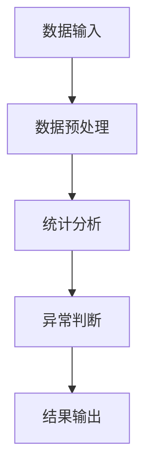
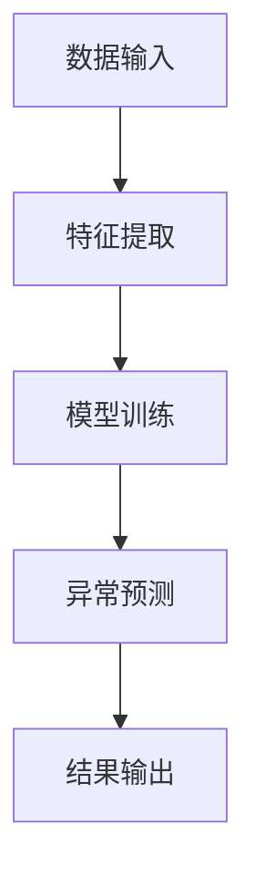
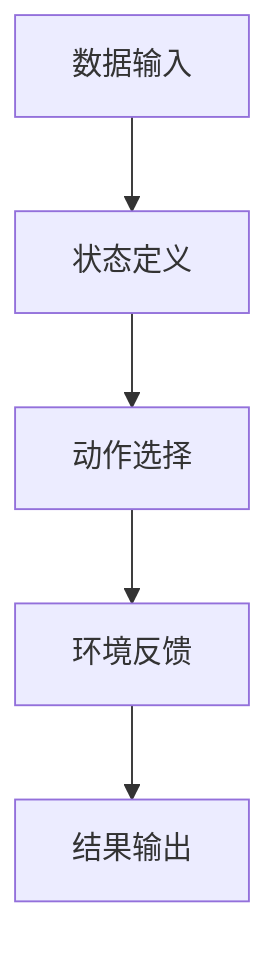
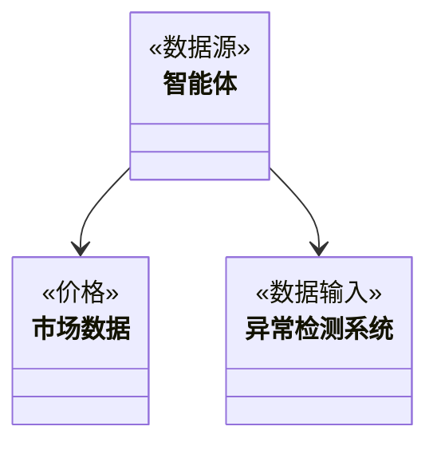
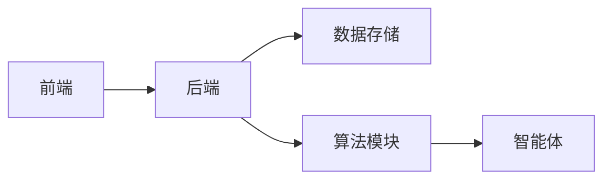
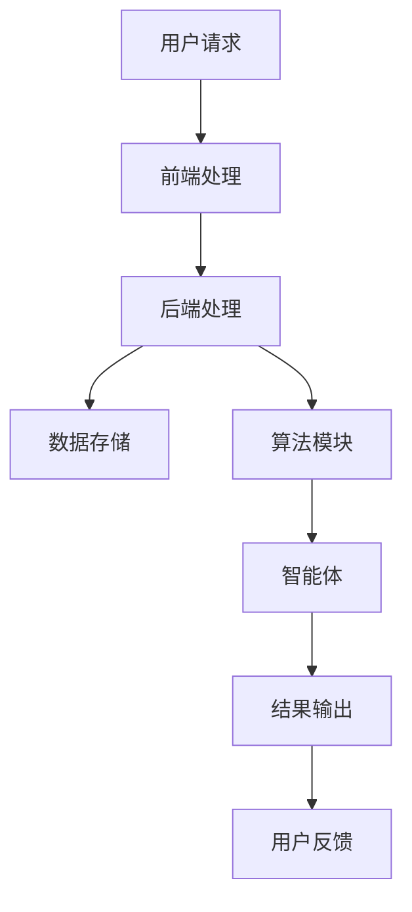

                 


# 智能体群体在市场异常检测中的应用

> 关键词：智能体群体，市场异常检测，算法原理，系统架构，项目实战

> 摘要：本文探讨了智能体群体在市场异常检测中的应用，分析了基于统计、机器学习和强化学习的异常检测算法，设计了系统的架构方案，并通过项目实战展示了智能体群体的优势。文章还总结了最佳实践和注意事项，为实际应用提供了参考。

---

## 第一部分: 背景介绍与核心概念

### 第1章: 问题背景与核心概念

#### 1.1 问题背景

##### 1.1.1 市场异常检测的重要性

在金融市场、电子商务和其他商业领域，异常检测是识别异常交易、欺诈行为、系统故障等的重要手段。及时发现这些异常可以避免重大损失，提高系统的稳定性和安全性。

##### 1.1.2 智能体群体的概念与特点

智能体群体是由多个智能体组成的系统，每个智能体都有自己的任务和目标，能够自主决策并协同工作。智能体群体具有分布式、自适应、容错性强等特点。

##### 1.1.3 智能体群体在市场异常检测中的应用价值

智能体群体可以分布式地处理海量数据，实时检测异常，提高检测效率和准确性。通过多个智能体的协同工作，可以覆盖更多的数据源和场景，增强检测能力。

#### 1.2 核心概念与联系

##### 1.2.1 智能体群体的定义与属性特征

智能体（Agent）：能够感知环境、自主决策、执行任务的实体。

智能体群体：多个智能体协同工作的系统，具有分布式、自主性、协作性等特点。

##### 1.2.2 市场异常检测的定义与分类

市场异常检测：识别市场数据中的异常行为或模式。

分类：基于统计、机器学习、强化学习等方法。

##### 1.2.3 智能体群体与市场异常检测的关系

智能体群体可以分布式地收集和分析数据，实时检测异常，提高检测效率和准确性。

##### 1.2.4 实体关系图（ER图）架构


---

## 第二部分: 智能体群体的算法原理

### 第2章: 基于统计的异常检测算法

#### 2.1 算法原理

基于统计的方法通过计算数据的统计特征（如均值、方差）来识别异常。常用的统计方法包括Z-score、标准差法、中位数法等。

#### 2.2 算法流程图



#### 2.3 代码实现示例

```python
import numpy as np

def detect_anomaly(data):
    mean = np.mean(data)
    std = np.std(data)
    threshold = mean + 3 * std
    return data[data > threshold]

# 示例数据
data = np.array([1, 2, 3, 4, 100])
result = detect_anomaly(data)
print("异常数据点:", result)
```

---

### 第3章: 基于机器学习的异常检测算法

#### 3.1 算法原理

机器学习方法通过训练模型来识别正常和异常样本。常用算法包括Isolation Forest、One-Class SVM、Autoencoder等。

#### 3.2 算法流程图



#### 3.3 代码实现示例

```python
from sklearn.ensemble import IsolationForest
import numpy as np

def train_isolation_forest(X_train):
    model = IsolationForest(n_estimators=100, random_state=42)
    model.fit(X_train)
    return model

# 示例数据
X_train = np.random.randn(100, 2)
model = train_isolation_forest(X_train)
y_pred = model.predict(X_train)
print("异常标签:", y_pred)
```

---

### 第4章: 基于强化学习的异常检测算法

#### 4.1 算法原理

强化学习通过智能体与环境的交互，学习最优策略来识别异常。常用算法包括Q-Learning、Deep Q-Network等。

#### 4.2 算法流程图



#### 4.3 代码实现示例

```python
import gym
from gym import spaces
import numpy as np

class MarketEnv(gym.Env):
    def __init__(self):
        super(MarketEnv, self).__init__()
        self.observation_space = spaces.Box(low=-np.inf, high=np.inf, shape=(1,))
        self.action_space = spaces.Discrete(2)  # 0: normal, 1: anomaly

    def step(self, action):
        # 示例环境反馈
        return self.observation, reward, done, info

env = MarketEnv()
state = env.reset()
action = 1  # 识别为异常
next_state, reward, done, info = env.step(action)
print("环境反馈:", next_state)
```

---

## 第三部分: 系统分析与架构设计

### 第5章: 系统架构设计

#### 5.1 问题场景介绍

市场数据分布于多个来源，需要实时处理和分析，要求高并发和低延迟。

#### 5.2 系统功能设计

##### 5.2.1 领域模型



##### 5.2.2 系统架构



#### 5.3 接口设计与交互流程

##### 5.3.1 接口设计

- 数据输入接口：接收市场数据。
- 模型训练接口：训练异常检测模型。
- 结果输出接口：返回异常检测结果。

##### 5.3.2 交互流程图



---

## 第四部分: 项目实战

### 第6章: 项目实战

#### 6.1 环境安装

```bash
pip install numpy scipy sklearn tensorflow gym
```

#### 6.2 核心代码实现

##### 6.2.1 基于统计的异常检测

```python
import numpy as np

def detect_anomaly(data):
    mean = np.mean(data)
    std = np.std(data)
    threshold = mean + 3 * std
    return data[data > threshold]

# 示例数据
data = np.array([1, 2, 3, 4, 100])
result = detect_anomaly(data)
print("异常数据点:", result)
```

##### 6.2.2 基于机器学习的异常检测

```python
from sklearn.ensemble import IsolationForest
import numpy as np

def train_isolation_forest(X_train):
    model = IsolationForest(n_estimators=100, random_state=42)
    model.fit(X_train)
    return model

# 示例数据
X_train = np.random.randn(100, 2)
model = train_isolation_forest(X_train)
y_pred = model.predict(X_train)
print("异常标签:", y_pred)
```

#### 6.3 案例分析与结果解读

##### 6.3.1 基于统计的案例

输入数据：[1, 2, 3, 4, 100]
异常数据点：100

##### 6.3.2 基于机器学习的案例

训练数据：100个二维随机数
异常标签：-1表示异常

---

## 第五部分: 最佳实践与总结

### 第7章: 最佳实践与总结

#### 7.1 小结

智能体群体通过分布式计算和协同工作，显著提高了市场异常检测的效率和准确性。

#### 7.2 注意事项

- 数据隐私和安全问题
- 系统的可扩展性和容错性
- 算法的实时性和响应速度

#### 7.3 扩展阅读

- 《分布式系统：概念与设计》
- 《机器学习实战》
- 《强化学习入门》

---

作者：AI天才研究院/AI Genius Institute & 禅与计算机程序设计艺术 /Zen And The Art of Computer Programming

