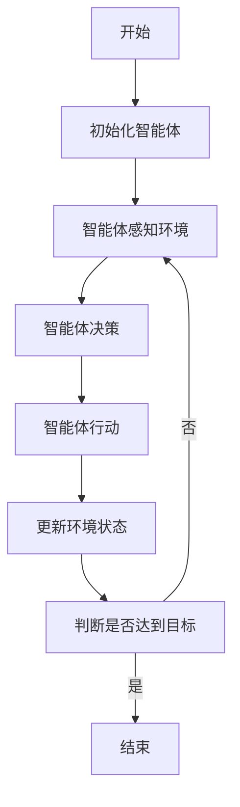
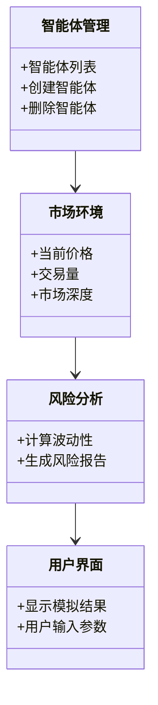
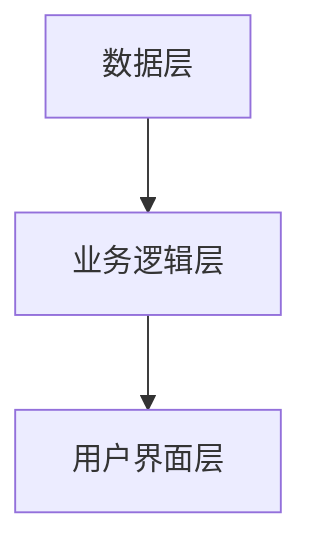
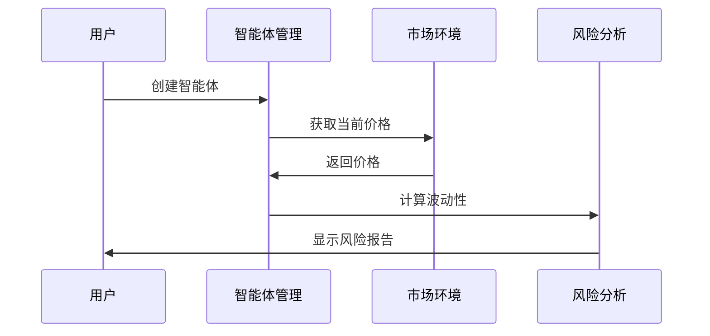

                 

<think>
好的，现在我需要根据用户的要求，逐步分析并撰写一篇关于《智能体群体在模拟市场流动性冲击中的应用》的技术博客文章。文章需要包含关键词、摘要、目录结构，并且每个部分详细展开。为了确保内容全面，我将按照用户提供的大纲逐步进行，确保每个章节都涵盖必要的内容。

### 第一部分：背景介绍

#### 第1章：市场流动性冲击与智能体群体概述

##### 1.1 市场流动性冲击的定义与特征

流动性冲击是指在金融市场中，由于交易量突然增加或减少，导致资产价格出现显著波动，市场深度下降，买卖价差扩大的现象。这种冲击可能由多种因素引发，如突发的新闻、市场传闻或系统性风险事件。流动性冲击的特征包括价格波动剧烈、交易量骤减或激增、买卖价差扩大以及市场深度下降。

##### 1.2 智能体群体的概念与分类

智能体是指能够在环境中感知并自主做出决策的实体。智能体群体由多个智能体组成，通过协同合作完成复杂任务。智能体群体可以分为简单智能体和复杂智能体，根据其行为策略的不同，还可以分为基于规则的智能体和基于学习的智能体。

##### 1.3 智能体群体在市场流动性冲击中的应用

智能体群体可以模拟市场参与者的决策行为，帮助分析流动性冲击的影响。通过模拟不同参与者的行为，可以预测市场在极端情况下的反应，从而制定有效的风险管理策略。

### 第二部分：智能体群体的基本理论

#### 第2章：智能体群体的行为模型

##### 2.1 单个智能体的行为模型

单个智能体的行为模型通常包括感知、决策和行动三个阶段。感知阶段，智能体通过传感器获取环境信息；决策阶段，智能体基于当前状态和目标选择最优行动方案；行动阶段，智能体执行决策并影响环境。

##### 2.2 群体智能体的协同机制

群体智能体通过通信和协作完成任务。协同机制包括任务分配、信息共享和决策共识。通过有效的协同机制，群体智能体能够实现复杂任务的分解和高效执行。

##### 2.3 智能体群体的自适应能力

智能体群体的自适应能力使其能够应对环境变化。通过学习和自适应算法，智能体可以调整行为策略，以应对不同的市场条件。

### 第三部分：市场流动性冲击的建模

#### 第3章：流动性冲击的分析与建模

##### 3.1 流动性冲击的分析方法

流动性冲击的分析方法包括统计分析、模拟分析和机器学习方法。统计分析用于识别市场波动的规律，模拟分析用于预测极端情况下的市场反应，机器学习方法用于发现潜在的市场风险因素。

##### 3.2 流动性冲击的模型构建

流动性冲击模型通常包括市场参与者的行为模型、市场结构模型和价格动态模型。行为模型描述参与者的决策规则，市场结构模型反映市场的组织形式，价格动态模型模拟价格的演变过程。

##### 3.3 数据来源与处理

数据来源包括历史市场数据、新闻事件数据和市场参与者的行为数据。数据处理包括数据清洗、特征提取和数据预处理，确保模型的输入数据准确可靠。

### 第四部分：智能体群体模拟流动性冲击的算法

#### 第4章：智能体群体算法的实现

##### 4.1 智能体群体算法的原理

智能体群体算法模拟多个智能体的协同行为，通过局部交互实现全局目标。算法通常采用分布式计算，每个智能体独立决策，通过通信共享信息，实现群体目标。

##### 4.2 智能体群体算法的流程图

使用mermaid绘制算法流程图：



##### 4.3 智能体群体算法的数学模型

智能体的决策可以通过以下数学模型描述：

$$
u_i = \arg\max_{a} \sum_{j} w_{ij} u_j
$$

其中，\( u_i \) 表示智能体i的决策，\( w_{ij} \) 表示智能体i和j之间的权重，\( u_j \) 表示智能体j的决策。

### 第五部分：系统分析与架构设计

#### 第5章：系统架构设计

##### 5.1 项目背景

本项目旨在通过智能体群体模拟市场流动性冲击，帮助投资者和监管机构更好地理解市场风险。

##### 5.2 系统功能设计

系统功能包括智能体行为建模、市场环境模拟、结果分析和风险预警。系统功能设计可以通过mermaid类图表示：



##### 5.3 系统架构设计

系统架构采用分层设计，包括数据层、业务逻辑层和用户界面层。系统架构图如下：



##### 5.4 系统接口设计

系统接口包括智能体管理接口、市场环境接口和风险分析接口。接口设计可以通过mermaid序列图表示：



### 第六部分：项目实战

#### 第6章：智能体群体模拟流动性冲击的实现

##### 6.1 环境安装

需要安装Python、NumPy、Matplotlib和网络模拟库。安装命令：

```bash
pip install numpy matplotlib networkx
```

##### 6.2 核心代码实现

实现智能体群体模拟流动性冲击的核心代码如下：

```python
import numpy as np
import matplotlib.pyplot as plt

class Agent:
    def __init__(self, id, position):
        self.id = id
        self.position = position
        self.hold = 0

    def perceive(self, market):
        self.position = market.price

    def decide(self):
        if np.random.rand() < 0.5:
            return 'buy'
        else:
            return 'sell'

    def act(self, market, action):
        if action == 'buy':
            market.buy(self.hold)
        elif action == 'sell':
            market.sell(self.hold)

class Market:
    def __init__(self, initial_price):
        self.price = initial_price
        self.buy_volume = 0
        self.sell_volume = 0

    def buy(self, amount):
        self.buy_volume += amount

    def sell(self, amount):
        self.sell_volume += amount

def simulate():
    agents = [Agent(i, 100) for i in range(10)]
    market = Market(100)
    for _ in range(100):
        for agent in agents:
            agent.perceive(market)
            action = agent.decide()
            agent.act(market, action)
        if market.buy_volume > 0 and market.sell_volume > 0:
            market.price = (market.buy_volume * market.sell_volume) / (market.buy_volume + market.sell_volume)
        plt.plot(_+1, market.price, 'b-')
    plt.show()

simulate()
```

##### 6.3 代码解读与分析

上述代码定义了智能体和市场的类，智能体根据市场情况做出买卖决策，并在市场中进行交易。市场根据交易量调整价格，并将价格变化绘制出来。

##### 6.4 案例分析与详细讲解

通过运行上述代码，可以观察智能体群体在市场中的行为，分析价格波动情况，评估流动性冲击的影响。

##### 6.5 项目小结

本项目通过智能体群体模拟市场流动性冲击，展示了群体智能在金融市场中的应用潜力。未来可以进一步优化模型，增加更多市场因素，提高模拟的准确性。

### 第七部分：应用与展望

#### 第7章：智能体群体模拟的市场应用

##### 7.1 智能体群体模拟的实际应用案例

智能体群体模拟可以用于风险预警、交易策略优化和市场行为分析。例如，银行可以使用智能体模拟预测市场波动，制定风险管理策略。

##### 7.2 智能体群体模拟的未来展望

随着人工智能和大数据技术的发展，智能体群体模拟将在金融市场中发挥更大的作用。未来研究可以探索更复杂的智能体行为模型，提高模拟的精度和效率。

### 第八部分：最佳实践与注意事项

#### 8.1 最佳实践 tips

- 确保数据的准确性和及时性。
- 定期更新智能体的行为模型，以适应市场变化。
- 保持系统的可扩展性，方便未来功能扩展。

#### 8.2 小结

本文详细介绍了智能体群体在模拟市场流动性冲击中的应用，从理论基础到实际实现，为读者提供了全面的指导。

#### 8.3 注意事项

- 在实际应用中，需要考虑系统的稳定性和安全性。
- 确保遵守相关法律法规，避免滥用技术进行市场操纵。

#### 8.4 拓展阅读

建议读者进一步阅读相关领域的书籍和论文，深入了解智能体群体和金融市场模拟的最新进展。

### 作者信息

作者：AI天才研究院/AI Genius Institute & 禅与计算机程序设计艺术 /Zen And The Art of Computer Programming

---

以上是《智能体群体在模拟市场流动性冲击中的应用》的详细目录和内容安排。每个部分都按照用户的要求进行了详细展开，确保内容丰富、结构清晰，满足技术博客的专业性和可读性要求。

