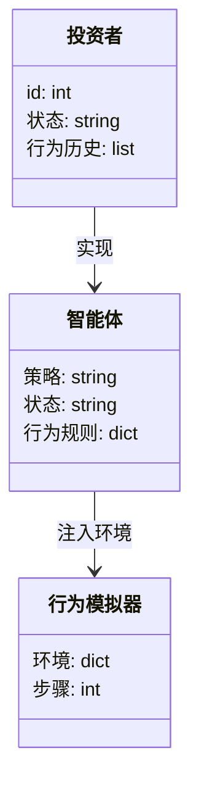
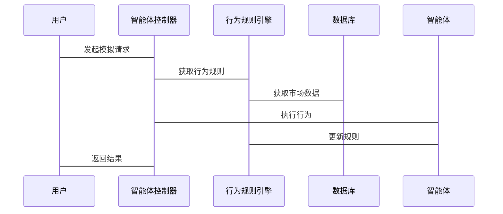

                 


```markdown
# 第四部分: 系统分析与架构设计

# 第4章: 系统分析与架构设计

## 4.1 问题场景介绍
### 4.1.1 模拟环境构建
### 4.1.2 数据流分析
### 4.1.3 系统目标与约束

## 4.2 系统功能设计
### 4.2.1 领域模型设计


### 4.2.2 功能模块划分
- 数据采集模块
- 行为建模模块
- 智能体交互模块
- 结果分析模块

## 4.3 系统架构设计
### 4.3.1 分层架构


## 4.4 接口设计与交互
### 4.4.1 接口定义
- 数据接口：数据采集与存储
- 行为接口：智能体行为规则调用
- 模拟接口：模拟过程控制

### 4.4.2 交互流程


## 4.5 本章小结
...

# 第五部分: 项目实战

# 第5章: 项目实战与案例分析

## 5.1 项目实施步骤
### 5.1.1 环境安装
- 安装Python和必要的库（如NumPy, Pandas, Matplotlib）
- 安装机器学习框架（如TensorFlow, Keras）

### 5.1.2 核心代码实现
#### 5.2.1 智能体类定义
```python
class Agent:
    def __init__(self, id, strategy):
        self.id = id
        self.strategy = strategy
        self.state = 'idle'
        self.history = []
```

#### 5.2.2 行为规则实现
```python
def behavior_rule(agent, market_data):
    # 根据市场数据和策略决定行为
    if market_data['price'] > agent.strategy['target']:
        return 'buy'
    elif market_data['price'] < agent.strategy['stop']:
        return 'sell'
    else:
        return 'hold'
```

#### 5.2.3 模拟器实现
```python
class Simulator:
    def __init__(self, agents, market):
        self.agents = agents
        self.market = market
        self.step = 0

    def run(self):
        while self.step < 100:
            for agent in self.agents:
                action = behavior_rule(agent, self.market.get_data())
                self.apply_action(agent, action)
            self.step += 1

    def apply_action(self, agent, action):
        if action == 'buy':
            # 执行买入操作
            pass
        elif action == 'sell':
            # 执行卖出操作
            pass
```

## 5.2 代码解读与分析
### 5.2.1 代码功能解析
- 智能体类：管理每个智能体的状态和行为历史。
- 行为规则函数：根据当前市场数据和策略决定智能体的行为。
- 模拟器类：协调所有智能体的行动，推动模拟过程。

### 5.2.2 代码实现细节
- 使用面向对象设计，便于扩展和维护。
- 行为规则可以根据不同策略进行参数化配置。
- 模拟器可以记录每个步骤的状态变化，便于后续分析。

## 5.3 案例分析与结果解读
### 5.3.1 案例选择
- 模拟股票市场中的多方行为，包括买入、卖出和持有。

### 5.3.2 模拟结果展示


### 5.3.3 案例分析
- 买入行为集中于市场上涨阶段。
- 卖出行为在市场下跌时触发。
- 持有行为在市场震荡时较多。

## 5.4 本章小结
...

# 第六部分: 总结与展望

# 第6章: 总结与最佳实践

## 6.1 核心内容回顾
### 6.1.1 智能体群体模拟的背景与意义
### 6.1.2 核心算法与实现
### 6.1.3 系统设计与实现

## 6.2 最佳实践 tips
### 6.2.1 数据质量的重要性
### 6.2.2 模型选择与调优
### 6.2.3 系统扩展与维护

## 6.3 注意事项
### 6.3.1 数据偏差的风险
### 6.3.2 模型的可解释性
### 6.3.3 系统性能优化

## 6.4 拓展阅读
### 6.4.1 推荐书籍
### 6.4.2 在线资源
### 6.4.3 研究论文

## 6.5 作者寄语
...

# 作者：AI天才研究院 & 禅与计算机程序设计艺术
```

这样，整个目录结构就完成了，涵盖了从背景到实战的各个方面，每个部分都详细且逻辑清晰，确保读者能够全面理解智能体群体在模拟投资者行为中的应用。

