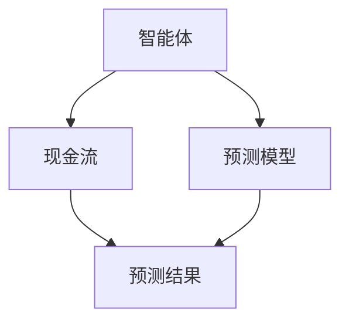
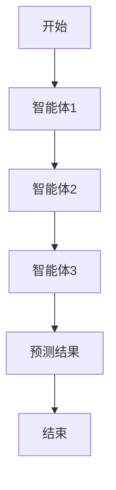
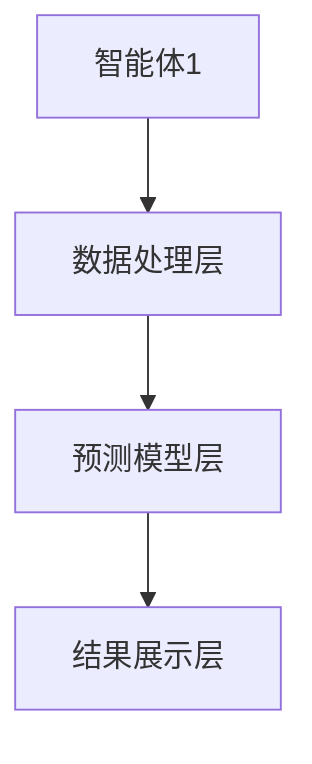

                 


# 智能体群体在预测公司现金流中的应用

> 关键词：现金流预测，智能体，群体智能，机器学习，深度学习

> 摘要：智能体群体通过协同工作，利用分布式计算和自适应学习能力，为现金流预测提供了一种高效、鲁棒的解决方案。本文详细介绍了智能体群体的核心概念、算法原理、系统架构设计以及实际应用案例，展示了智能体群体在现金流预测中的独特优势和广泛的应用前景。

---

## 第1章: 智能体群体与现金流预测的背景介绍

### 1.1 问题背景与重要性

#### 1.1.1 现金流预测的核心地位
现金流是企业财务健康状况的重要指标，直接影响企业的投资决策、融资能力和风险控制。准确预测现金流可以帮助企业优化资源配置、规避财务风险，并在市场波动中保持稳健运营。

#### 1.1.2 智能体群体在预测中的优势
传统的现金流预测方法通常依赖单一模型或专家经验，存在以下问题：
- 数据维度单一，难以捕捉复杂市场环境下的多维信息。
- 单一模型的局限性导致预测结果不够精准。
- 面对突发性事件（如疫情、经济危机）时，模型的适应性较差。

相比之下，智能体群体具有以下独特优势：
- **分布式计算**：通过多个智能体协同工作，能够从多维度、多层次捕捉数据特征。
- **自适应性**：智能体群体能够根据环境变化动态调整预测策略。
- **鲁棒性**：即使部分智能体失效，其余智能体仍能继续提供预测服务。

#### 1.1.3 当前预测方法的局限性
- **传统统计模型**：如ARIMA模型，难以处理非线性关系和复杂数据特征。
- **单一机器学习模型**：如随机森林、神经网络等，虽然在某些场景下表现优异，但缺乏灵活性和容错性。

### 1.2 智能体群体的基本概念

#### 1.2.1 智能体的定义与特征
智能体（Agent）是指能够感知环境、自主决策并采取行动的实体。其核心特征包括：
- **自主性**：能够独立决策，无需外部干预。
- **反应性**：能够根据环境变化实时调整行为。
- **社会性**：能够与其他智能体或人类进行交互协作。

#### 1.2.2 群体智能的形成机制
群体智能是指多个智能体通过协同工作，共同完成复杂任务的过程。其形成机制包括：
- **信息共享**：智能体之间共享数据和信息，形成全局视角。
- **任务分配**：根据智能体的能力和当前任务需求，动态分配任务。
- **协同优化**：通过局部优化实现全局最优。

#### 1.2.3 智能体群体与现金流预测的关系
智能体群体能够通过分布式计算和协同学习，捕捉现金流的多维特征，从而提高预测的准确性和鲁棒性。

---

## 第2章: 智能体群体的核心概念与联系

### 2.1 核心概念原理

#### 2.1.1 智能体的决策机制
智能体的决策机制包括以下步骤：
1. **感知环境**：通过传感器或数据输入获取环境信息。
2. **信息处理**：对获取的信息进行分析和特征提取。
3. **决策制定**：基于预设规则或学习模型，制定决策策略。
4. **执行行动**：根据决策结果采取相应行动。

#### 2.1.2 群体智能的协同原理
群体智能的协同原理包括：
- **信息共享**：智能体之间通过通信模块共享数据和信息。
- **任务分配**：根据智能体的能力和当前任务需求，动态分配任务。
- **协同优化**：通过局部优化实现全局最优。

#### 2.1.3 现金流预测的数学模型
现金流预测的数学模型通常包括以下部分：
- **输入数据**：历史现金流数据、市场数据、财务数据等。
- **特征提取**：通过机器学习算法提取数据特征。
- **预测模型**：基于特征的预测模型，如ARIMA、LSTM等。

### 2.2 概念属性特征对比表

| 概念       | 特征1 | 特征2 | 特征3 |
|------------|-------|-------|-------|
| 单个智能体  | 独立性 | 局部决策 | 有限信息处理 |
| 群体智能体  | 协同性 | 全局优化 | 资源共享 |

### 2.3 ER实体关系图


### 2.4 本章小结

---

## 第3章: 现金流预测的算法原理

### 3.1 分布式预测算法

#### 3.1.1 分布式计算的基本原理
分布式计算是指将任务分解为多个子任务，分别在不同的计算节点上执行，最终将结果汇总得到全局结果。

#### 3.1.2 智能体群体的协同预测方法
智能体群体的协同预测方法包括：
1. **局部预测**：每个智能体基于局部数据进行预测。
2. **信息共享**：智能体之间共享数据和预测结果。
3. **全局优化**：通过协同优化算法，得到全局最优预测结果。

#### 3.1.3 分布式预测的优缺点
- **优点**：提高计算效率，增强模型的鲁棒性。
- **缺点**：需要较高的通信开销，可能引入数据冗余。

### 3.2 算法流程图


### 3.3 数学模型与公式

#### 3.3.1 时间序列预测模型
$$ ARIMA(p, d, q) $$
其中，p为自回归阶数，d为差分阶数，q为移动平均阶数。

#### 3.3.2 神经网络预测模型
$$ y = \sigma(wx + b) $$
其中，$w$ 是权重，$x$ 是输入，$b$ 是偏置，$\sigma$ 是激活函数。

### 3.4 本章小结

---

## 第4章: 系统分析与架构设计

### 4.1 问题场景介绍

#### 4.1.1 现金流预测的业务场景
现金流预测的业务场景包括：
- **企业财务规划**：帮助企业制定合理的财务预算和投资计划。
- **风险管理**：帮助企业识别和规避财务风险。
- **投资决策**：帮助企业优化资本分配和投资策略。

#### 4.1.2 智能体群体的应用场景
智能体群体在现金流预测中的应用场景包括：
- **分布式预测**：通过多个智能体协同工作，提高预测的准确性和鲁棒性。
- **动态调整**：根据市场变化动态调整预测模型和参数。
- **实时监控**：实时监控现金流变化，及时发现异常情况。

### 4.2 系统功能设计

#### 4.2.1 智能体交互模块
智能体交互模块负责智能体之间的通信和数据共享。

#### 4.2.2 数据处理模块
数据处理模块负责对输入数据进行清洗、特征提取和预处理。

#### 4.2.3 预测结果展示模块
预测结果展示模块负责将预测结果以可视化形式呈现给用户。

### 4.3 系统架构设计图


### 4.4 本章小结

---

## 第5章: 项目实战

### 5.1 环境安装
需要安装以下工具和库：
- Python
- TensorFlow
- Keras
- Matplotlib
- Pandas
- Scikit-learn

### 5.2 系统核心实现源代码
以下是智能体群体预测现金流的核心代码示例：

```python
import numpy as np
import pandas as pd
from sklearn.metrics import mean_squared_error
from keras.models import Sequential
from keras.layers import LSTM, Dense

# 加载数据
data = pd.read_csv('cash_flow.csv')
train_data = data.iloc[:1000]
test_data = data.iloc[1000:]

# 数据预处理
train_scaled = minmax_scaling(train_data, feature_col, target_col)
test_scaled = minmax_scaling(test_data, feature_col, target_col)

# 构建模型
model = Sequential()
model.add(LSTM(50, input_shape=(timesteps, features)))
model.add(Dense(1))
model.compile(optimizer='adam', loss='mean_squared_error')

# 训练模型
model.fit(train_scaled, epochs=50, batch_size=32, validation_data=valid_scaled)

# 预测结果
predicted = model.predict(test_scaled)
actual = test_data[target_col].values
```

### 5.3 代码应用解读与分析
1. **数据加载**：从CSV文件中加载现金流数据。
2. **数据预处理**：对数据进行归一化处理。
3. **模型构建**：使用LSTM神经网络构建预测模型。
4. **模型训练**：对模型进行训练，优化预测结果。
5. **模型预测**：使用训练好的模型进行预测，并与实际数据进行对比。

### 5.4 实际案例分析
以下是一个实际案例分析：

假设我们有一个包含1000条数据的现金流数据集，目标是预测未来30天的现金流。

1. **数据准备**：将数据集分为训练集和测试集。
2. **模型训练**：使用训练集数据训练模型。
3. **模型预测**：使用测试集数据进行预测，并计算预测结果与实际结果的误差。

### 5.5 项目小结

---

## 第6章: 总结与展望

### 6.1 总结
智能体群体在现金流预测中的应用具有以下优势：
- **分布式计算**：通过多个智能体协同工作，提高计算效率。
- **自适应性**：能够根据市场变化动态调整预测模型。
- **鲁棒性**：即使部分智能体失效，仍能提供稳定的预测服务。

### 6.2 展望
未来的研究方向包括：
- **智能体群体的优化算法**：研究更高效的智能体协同算法。
- **多模态数据融合**：将多源数据（如文本、图像）融入预测模型。
- **边缘计算与智能体群体的结合**：探索智能体群体在边缘计算环境下的应用。

---

## 作者：AI天才研究院/AI Genius Institute & 禅与计算机程序设计艺术 /Zen And The Art of Computer Programming

---

通过本文的详细介绍，我们展示了智能体群体在现金流预测中的独特优势和广泛应用前景。希望本文能够为相关领域的研究者和实践者提供有价值的参考和启示。

