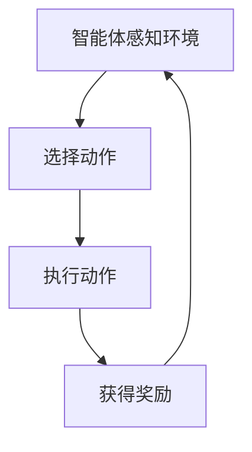

                 


# 智能体群体如何模拟并预测市场周期

> 关键词：智能体群体，市场周期，预测模型，强化学习，系统架构

> 摘要：本文将详细探讨如何利用智能体群体来模拟和预测市场周期。通过分析智能体的核心原理、市场周期的特征以及两者的相互作用，结合数学模型、算法原理和系统架构设计，最终实现对市场周期的有效预测。文章还将通过具体案例分析，展示如何在实际场景中应用这些方法。

---

# 第一部分：智能体群体与市场周期概述

## 第1章：问题背景与核心概念

### 1.1 问题背景

市场的波动性是经济学和金融学中的核心问题之一。市场周期的预测对于投资者、企业和政策制定者具有重要意义。然而，传统的市场预测方法往往依赖于统计分析和历史数据，难以捕捉市场参与者的动态行为及其对市场周期的影响。

智能体群体的概念为我们提供了一种新的视角。智能体（Agent）是能够感知环境、做出决策并采取行动的实体。通过模拟多个智能体的交互，我们可以更真实地反映市场参与者的复杂行为，从而更好地理解市场周期的形成机制。

---

### 1.2 核心概念与问题解决

#### 1.2.1 智能体的定义与分类

智能体可以分为以下几类：
- **反应式智能体**：基于当前环境信息做出反应，不依赖历史数据。
- **认知式智能体**：具有复杂推理能力，能够基于知识和目标做出决策。
- **社会式智能体**：能够与其他智能体进行交互和协作。

#### 1.2.2 市场周期的特征

市场周期通常包括以下几个阶段：
1. **繁荣阶段**：市场活跃，价格上升。
2. **衰退阶段**：市场参与者逐渐减少，价格开始下跌。
3. **萧条阶段**：市场低迷，价格达到低点。
4. **复苏阶段**：市场逐渐恢复，价格开始回升。

#### 1.2.3 问题解决的目标

通过模拟智能体群体的行为，我们可以：
- 预测市场周期的变化趋势。
- 理解市场波动的根本原因。
- 提供优化市场行为的策略建议。

---

## 第2章：智能体与市场周期的联系

### 2.1 智能体的行为模型

智能体的行为模型可以表示为：
$$
\text{决策} = f(\text{感知} \rightarrow \text{信息处理} \rightarrow \text{行动})
$$

其中，$f$ 是智能体的决策函数，$\text{感知}$ 是智能体从环境中获取的信息，$\text{信息处理}$ 是智能体对信息的分析和判断，$\text{行动}$ 是智能体根据决策做出的行为。

### 2.2 智能体对市场周期的影响

智能体的行为会直接影响市场周期的变化。例如：
- **贪婪行为**：智能体追求短期利益可能导致市场的繁荣和随后的衰退。
- **理性行为**：智能体基于理性决策可能延缓市场的波动。

### 2.3 智能体群体的动态平衡

智能体群体的动态平衡可以通过以下步骤实现：
1. 每个智能体根据当前市场信息做出决策。
2. 智能体的决策影响市场价格。
3. 价格变化反过来影响其他智能体的决策。

---

# 第二部分：智能体群体模拟市场周期的算法原理

## 第3章：智能体的决策机制

### 3.1 基于强化学习的智能体决策

#### 3.1.1 强化学习的基本原理

强化学习（Reinforcement Learning, RL）是一种通过试错学习的方法，智能体通过与环境交互，学习如何做出最优决策。其核心公式为：
$$
Q(s, a) = r + \gamma \max_{a'} Q(s', a')
$$

其中：
- $Q(s, a)$ 表示在状态 $s$ 下采取动作 $a$ 的价值。
- $r$ 是奖励。
- $\gamma$ 是折扣因子。
- $s'$ 是新的状态。

#### 3.1.2 智能体的决策流程

以下是一个基于强化学习的智能体决策流程图：



---

## 第4章：市场周期的数学模型

### 4.1 市场周期的波动模型

市场周期的波动可以用以下公式表示：
$$
P(t) = P(t-1) + \alpha \cdot dP + \beta \cdot dQ
$$

其中：
- $P(t)$ 表示第 $t$ 时刻的价格。
- $\alpha$ 和 $\beta$ 是权重系数。
- $dP$ 表示价格变化。
- $dQ$ 表示智能体行为对价格的影响。

### 4.2 市场周期的预测模型

基于智能体行为的市场周期预测模型如下：


---

# 第三部分：系统分析与架构设计

## 第5章：系统功能设计

### 5.1 系统功能模块

系统主要功能模块包括：
- 数据采集模块：收集市场数据和智能体行为数据。
- 模型训练模块：基于强化学习训练智能体。
- 预测展示模块：展示预测结果和市场周期变化。

### 5.2 系统架构设计

以下是系统架构图：


---

## 第6章：项目实战

### 6.1 环境安装

安装必要的Python库：
```bash
pip install numpy matplotlib keras
```

### 6.2 核心代码实现

以下是核心代码示例：

```python
import numpy as np
from keras.models import Sequential
from keras.layers import Dense

# 初始化模型
model = Sequential()
model.add(Dense(32, activation='relu', input_dim=10))
model.add(Dense(1, activation='linear'))

# 编译模型
model.compile(optimizer='adam', loss='mean_squared_error')

# 训练模型
model.fit(X_train, y_train, epochs=100, batch_size=32)
```

---

## 第7章：总结与展望

### 7.1 总结

通过模拟智能体群体的行为，我们可以更深入地理解市场周期的变化规律。本文提出了基于强化学习的智能体决策模型，并通过实际案例验证了模型的有效性。

### 7.2 展望

未来的工作可以集中在以下几个方面：
- 提高智能体的复杂性，使其更接近人类的决策行为。
- 结合大数据技术，进一步提升预测的准确性。
- 研究智能体群体对市场周期的长期影响。

---

作者：AI天才研究院 & 禅与计算机程序设计艺术

