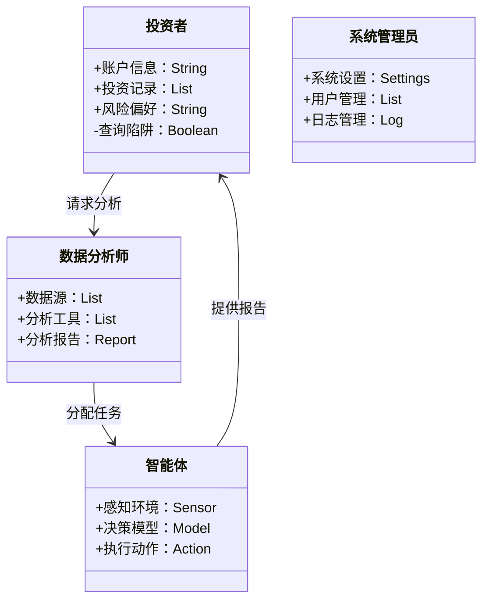
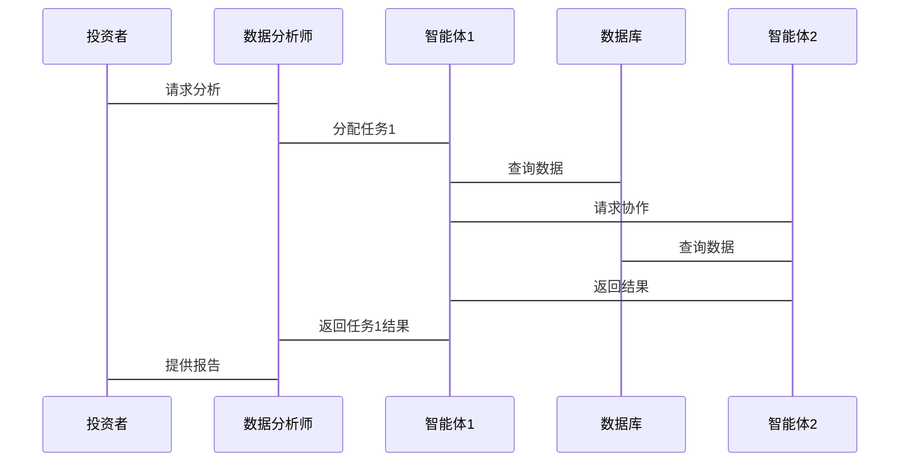

                 


# 智能体群体智慧在识别价值投资陷阱中的应用：避免价值陷阱

> 关键词：智能体、群体智慧、价值投资陷阱、算法原理、系统架构、项目实战

> 摘要：本文详细探讨了智能体群体智慧在识别价值投资陷阱中的应用，通过理论分析和实战案例，揭示了如何利用智能体的协同决策能力来避免价值投资中的常见陷阱。文章从背景介绍、核心概念、算法原理、系统架构到项目实战，层层深入，为读者提供了全面的技术指导。

---

## 第1章: 价值投资陷阱的背景与挑战

### 1.1 价值投资陷阱的定义与特征

#### 1.1.1 价值投资的基本概念
价值投资是一种基于对公司内在价值评估的投资策略，强调以低于内在价值的价格买入优质资产。其核心在于识别被市场低估的公司，并长期持有。价值投资的关键在于对公司基本面的深入分析，包括财务状况、行业地位、竞争优势等。

#### 1.1.2 价值投资陷阱的定义
价值投资陷阱是指投资者在追求价值投资的过程中，由于市场波动、信息不对称、情绪影响或其他外部因素，误判了公司的内在价值，导致买入了实际上具有较高风险或不佳前景的股票。这些陷阱通常表现为低估值的假象、财务造假、行业周期性波动或管理层问题。

#### 1.1.3 价值投资陷阱的特征与分类
价值投资陷阱的特征包括：
- **低估值陷阱**：公司表面上估值较低，但实际经营状况不佳。
- **财务造假陷阱**：公司通过虚假财务报告掩盖问题。
- **行业周期陷阱**：行业处于下行周期，公司难以恢复。
- **管理层问题陷阱**：公司管理层存在重大问题，如腐败或战略失误。

### 1.2 智能体群体智慧的背景介绍

#### 1.2.1 智能体的基本概念
智能体（Agent）是指具有感知环境、做出决策并执行行动的能力的实体。智能体可以是软件程序、机器人或其他具备自主决策能力的系统。智能体的核心特征包括自主性、反应性、目标导向和社交能力。

#### 1.2.2 群体智慧的定义与特点
群体智慧是指通过多个个体（智能体）协同工作，利用群体的集体智慧解决问题的能力。群体智慧的特点包括：
- **分布式计算**：任务分解为多个子任务，由不同智能体分别处理。
- **自适应性**：智能体能够根据环境变化调整行为。
- **去中心化**：没有单一控制中心，智能体之间通过通信协作。

#### 1.2.3 智能体群体智慧的应用场景
智能体群体智慧在多个领域有广泛应用，包括：
- **金融投资**：通过多个智能体协同分析市场数据，识别投资机会。
- **分布式计算**：利用多智能体完成复杂任务。
- **社会网络分析**：通过群体智慧分析社交网络中的信息传播。

---

## 第2章: 智能体群体智慧的核心概念与联系

### 2.1 智能体与群体智慧的核心要素

#### 2.1.1 智能体的定义与属性
智能体的属性包括：
- **感知能力**：通过传感器或数据输入获取环境信息。
- **决策能力**：基于感知信息做出决策。
- **执行能力**：通过动作或输出影响环境。

#### 2.1.2 群体智慧的组成要素
群体智慧的组成要素包括：
- **智能体个体**：每个智能体都有独立的目标和行为。
- **通信机制**：智能体之间通过某种方式（如消息传递）进行通信。
- **协同机制**：通过协同机制（如一致性协议）达成共识。

#### 2.1.3 智能体与群体智慧的关系
智能体是群体智慧的基本单元，而群体智慧则是多个智能体协同工作的结果。智能体通过通信和协作，形成一个整体的群体智慧系统。

### 2.2 智能体群体智慧的核心原理

#### 2.2.1 分布式计算与协同决策
分布式计算是指将任务分解为多个部分，由不同节点（智能体）分别处理。协同决策则是指多个智能体通过通信和协作，共同做出决策。

#### 2.2.2 自适应学习与进化
智能体可以通过机器学习算法不断优化自身的决策模型。群体智慧则通过智能体的协同进化，提高整体的决策能力。

#### 2.2.3 多智能体之间的通信与协作
智能体之间的通信是群体智慧的核心机制。通过通信，智能体可以共享信息、协调行动，从而提高整体的智慧水平。

---

## 第3章: 智能体群体智慧的算法原理

### 3.1 分布式计算与多智能体算法

#### 3.1.1 分布式计算的基本原理
分布式计算将任务分解为多个部分，由不同的计算节点（智能体）分别处理。每个节点都有自己的计算能力和存储资源，通过通信协议进行数据交换。

#### 3.1.2 多智能体系统中的通信协议
通信协议是智能体之间进行信息交换的规则。常见的通信协议包括：
- **请求-响应协议**：智能体向其他智能体发送请求，接收方返回响应。
- **广播协议**：智能体向所有其他智能体发送信息。

#### 3.1.3 分布式算法的实现步骤
分布式算法的实现步骤包括：
1. **任务分解**：将问题分解为多个子任务。
2. **任务分配**：将子任务分配给不同的智能体。
3. **任务执行**：智能体独立执行分配的任务。
4. **结果汇总**：将各智能体的结果汇总，形成最终的解决方案。

### 3.2 群体智慧中的共识算法

#### 3.2.1 共识算法的定义与作用
共识算法是分布式系统中，多个智能体达成一致意见的算法。共识算法的作用是确保所有智能体对某个问题达成一致，避免冲突。

#### 3.2.2 常见共识算法对比
常见的共识算法包括：
- **POW（Proof of Work）**：通过计算哈希值来达成共识。
- **POS（Proof of Stake）**：通过质押代币来达成共识。
- **PBFT（Practical Byzantine Fault Tolerance）**：拜占庭容错算法。

#### 3.2.3 共识算法的数学模型
共识算法的数学模型通常涉及概率论和图论。例如，PBFT算法的数学模型如下：

$$
P(i) = \frac{\text{质押的代币数}}{\text{总质押的代币数}}
$$

其中，$P(i)$ 表示第 $i$ 个智能体的质押概率。

---

## 第4章: 智能体群体智慧的系统架构与设计

### 4.1 价值投资陷阱识别系统介绍

#### 4.1.1 系统目标与功能概述
价值投资陷阱识别系统的目标是通过智能体群体智慧，帮助投资者识别和避免价值投资陷阱。系统的主要功能包括：
- **数据采集**：采集市场数据、公司财务数据等。
- **数据分析**：通过智能体协同分析数据，识别潜在的投资陷阱。
- **风险评估**：评估投资风险，提供投资建议。

#### 4.1.2 系统的用户角色与权限
系统用户包括：
- **投资者**：使用系统进行投资决策。
- **数据分析师**：负责数据的采集和处理。
- **系统管理员**：负责系统的维护和管理。

### 4.2 系统功能设计

#### 4.2.1 领域模型设计（Mermaid类图）
以下是系统的领域模型设计：



#### 4.2.2 系统架构设计（Mermaid架构图）
以下是系统的架构设计：

```mermaid
client
    user: 投资者
client --> server: 请求分析
server --> worker: 分配任务
worker --> storage: 查询数据
worker --> worker: 通信协作
worker --> server: 返回结果
server --> user: 提供报告
```

#### 4.2.3 系统交互设计（Mermaid序列图）
以下是系统的交互设计：



---

## 第5章: 智能体群体智慧在价值投资中的实战应用

### 5.1 项目环境与工具安装

#### 5.1.1 开发环境的选择与安装
推荐使用Python作为开发语言，安装以下工具：
- **Python 3.8+**
- **Jupyter Notebook**：用于数据可视化和算法开发。
- **Docker**：用于容器化部署。

#### 5.1.2 相关工具的配置与使用
配置以下工具：
- **Pandas**：用于数据分析。
- **Matplotlib**：用于数据可视化。
- **Flask**：用于构建Web界面。

### 5.2 核心算法实现

#### 5.2.1 分布式计算的Python代码实现

```python
import threading

class Agent:
    def __init__(self, id):
        self.id = id
        self.result = None

    def compute(self, data):
        # 具体计算逻辑
        self.result = data * 2

    def get_result(self):
        return self.result

def main():
    agents = [Agent(i) for i in range(4)]
    data = [1, 2, 3, 4]
    
    for agent in agents:
        agent.compute(data[agent.id])
    
    for agent in agents:
        print(f"Agent {agent.id} result: {agent.get_result()}")

if __name__ == "__main__":
    main()
```

#### 5.2.2 共识算法的代码实现

```python
import random

def consensus(nodes):
    while True:
        value = random.choice(nodes)
        for node in nodes:
            if node.value != value:
                node.value = value
        if all(node.value == value for node in nodes):
            break

# 示例使用
nodes = [Node(), Node(), Node(), Node()]
consensus(nodes)
```

#### 5.2.3 群体智慧模型的训练与优化
以下是群体智慧模型的训练流程：

```python
import numpy as np

def train_model(data, agents):
    for agent in agents:
        agent.model.train(data)
        agent.model.save()

# 示例使用
data = np.random.rand(100, 10)
agents = [Agent(id) for id in range(4)]
train_model(data, agents)
```

### 5.3 实际案例分析

#### 5.3.1 案例背景
假设我们有一个包含100家公司的数据集，需要识别其中的价值投资陷阱。

#### 5.3.2 数据分析与处理
使用Pandas对数据进行清洗和处理：

```python
import pandas as pd

df = pd.read_csv('companies.csv')
df.head()
```

#### 5.3.3 群体智慧模型的应用
将数据分配给多个智能体进行分析：

```python
from concurrent.futures import ThreadPoolExecutor

def analyze_company(data):
    # 具体分析逻辑
    return result

with ThreadPoolExecutor(max_workers=4) as executor:
    futures = [executor.submit(analyze_company, data) for data in df]
    results = [future.result() for future in futures]
```

#### 5.3.4 结果汇总与可视化
将各智能体的分析结果汇总，并进行可视化：

```python
import matplotlib.pyplot as plt

results.plot.bar()
plt.show()
```

### 5.4 项目小结
通过该项目，我们可以看到智能体群体智慧在识别价值投资陷阱中的巨大潜力。通过分布式计算和群体智慧算法，我们可以更高效地分析数据，识别潜在的投资陷阱，从而帮助投资者做出更明智的决策。

---

## 第6章: 总结与展望

### 6.1 本书的核心内容回顾
- **智能体与群体智慧的基本概念**
- **分布式计算与共识算法的核心原理**
- **智能体群体智慧在价值投资中的实战应用**

### 6.2 未来的发展方向
- **更复杂的共识算法**：研究更高效的共识算法，如基于图的共识算法。
- **智能体的自适应性优化**：通过强化学习优化智能体的自适应能力。
- **群体智慧的扩展应用**：将群体智慧应用于更多的领域，如医疗、教育等。

---

作者：AI天才研究院/AI Genius Institute & 禅与计算机程序设计艺术 /Zen And The Art of Computer Programming

