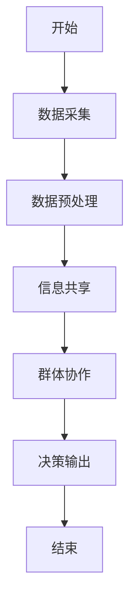
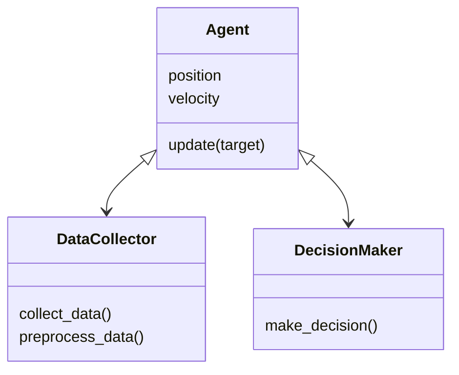
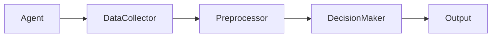
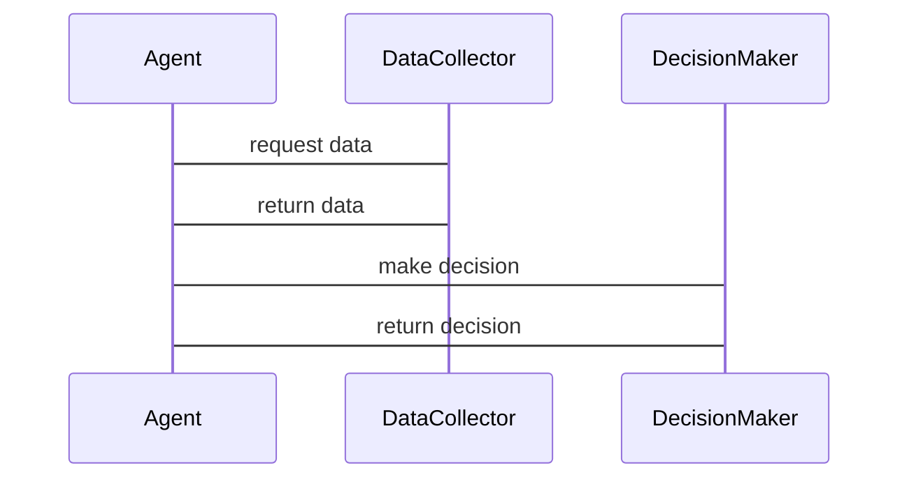

                 


# 智能体群体智慧在识别价值陷阱中的应用：避免投资误区

> **关键词**：智能体，群体智慧，价值陷阱，投资决策，算法，系统架构

> **摘要**：  
> 在现代投资领域，识别价值陷阱是投资者面临的重大挑战。本文通过智能体与群体智慧的结合，提出了一种创新的解决方案。文章首先介绍智能体和群体智慧的基本概念及其在投资中的应用背景，然后深入分析智能体群体智慧的核心算法和系统架构，结合实际案例，展示如何利用智能体群体智慧识别价值陷阱并避免投资误区。文章最后总结了智能体群体智慧在投资决策中的优势及未来发展方向。

---

## 第1章: 智能体群体智慧与价值陷阱概述

### 1.1 智能体与群体智慧的基本概念
#### 1.1.1 智能体的定义与特征
智能体（Agent）是指具有感知环境、自主决策、执行任务能力的实体。智能体的核心特征包括：
- **自主性**：能够在无外部干预的情况下独立运作。
- **反应性**：能够根据环境变化实时调整行为。
- **协作性**：能够与其他智能体或系统进行信息交互和协同工作。

#### 1.1.2 群体智慧的定义与特点
群体智慧（Swarm Intelligence）是指通过多个个体（智能体）的协作，产生超越个体智能的集体智慧。其特点包括：
- **涌现性**：个体行为简单，但群体行为复杂。
- **自适应性**：能够根据环境变化动态调整行为。
- **去中心化**：无中心节点控制，个体通过局部信息进行决策。

#### 1.1.3 智能体群体智慧的结合与应用
智能体群体智慧的结合，将个体智能与集体智慧相结合，能够实现更高效、更灵活的决策能力。其在投资领域的应用，主要体现在通过群体智慧识别市场中的潜在风险和机会。

### 1.2 价值陷阱的定义与识别
#### 1.2.1 价值陷阱的定义
价值陷阱是指表面上看似有投资价值，实则暗藏风险的资产或项目。识别价值陷阱的关键在于发现隐藏的风险因素，避免因表面现象误导而做出错误的投资决策。

#### 1.2.2 价值陷阱的常见表现形式
价值陷阱的表现形式多样，包括：
- **虚假增长**：公司通过虚假的财务操作或并购实现增长。
- **行业衰退**：行业整体下行，企业难以摆脱困境。
- **政策风险**：政策变化对行业或企业产生重大负面影响。

#### 1.2.3 投资误区的分类与分析
投资误区主要包括：
- **过度乐观**：对投资标的过于乐观，忽视潜在风险。
- **从众心理**：盲目跟随市场潮流，缺乏独立判断。
- **信息过载**：面对海量信息，难以筛选出有价值的信息。

### 1.3 智能体群体智慧在投资中的应用背景
#### 1.3.1 投资分析的传统方法与局限性
传统投资分析方法依赖于人工经验、财务指标和市场数据，存在以下局限性：
- **信息处理能力有限**：人类难以处理海量数据。
- **主观性较强**：分析结果受到主观判断的影响。
- **反应速度较慢**：无法实时捕捉市场变化。

#### 1.3.2 群体智慧在投资决策中的优势
群体智慧通过多个个体的协作，能够弥补传统投资分析的不足：
- **信息处理能力强**：能够快速分析海量数据。
- **去中心化决策**：避免单一决策的局限性。
- **自适应性强**：能够实时调整投资策略。

#### 1.3.3 智能体技术的快速发展与投资领域的需求结合
智能体技术的快速发展，为投资领域提供了新的工具和方法。智能体的自主性、反应性和协作性，使其成为识别价值陷阱的理想选择。

### 1.4 本章小结
本章介绍了智能体和群体智慧的基本概念，分析了价值陷阱的定义、表现形式和投资误区的分类，最后探讨了智能体群体智慧在投资中的应用背景。

---

## 第2章: 智能体群体智慧的核心概念

### 2.1 智能体的核心属性与特征
#### 2.1.1 智能体的自主性
智能体的自主性使其能够在无外部干预的情况下独立运作。例如，一个智能交易系统可以在无须人工干预的情况下，根据市场变化自动执行交易指令。

#### 2.1.2 智能体的反应性
智能体的反应性使其能够实时感知环境变化并调整行为。例如，当市场出现突发新闻时，智能体能够迅速调整投资策略。

#### 2.1.3 智能体的协作性
智能体的协作性使其能够与其他智能体或系统进行信息交互和协同工作。例如，多个智能体可以通过共享信息，共同识别市场中的潜在风险。

### 2.2 群体智慧的系统模型与特征
#### 2.2.1 群体智慧的系统模型
群体智慧的系统模型通常包括以下部分：
- **个体行为规则**：个体智能体的行为规则。
- **信息交互机制**：个体智能体之间的信息交互方式。
- **群体行为涌现**：群体行为的涌现特性。

#### 2.2.2 群体智慧的涌现性
群体智慧的涌现性是指，个体行为简单，但群体行为复杂。例如，蚂蚁群体的觅食行为虽然简单，但整体觅食路径的优化效果却非常显著。

#### 2.2.3 群体智慧的自适应性
群体智慧的自适应性使其能够根据环境变化动态调整行为。例如，当市场环境发生变化时，群体智慧能够快速调整投资策略。

### 2.3 智能体群体智慧与价值陷阱识别的关系
#### 2.3.1 智能体群体智慧的决策机制
智能体群体智慧的决策机制包括以下步骤：
1. **感知环境**：智能体通过数据采集和信息处理，感知市场环境。
2. **信息共享**：智能体之间通过信息交互，共享市场数据和分析结果。
3. **群体决策**：基于个体和群体的信息，形成最终的决策。

#### 2.3.2 价值陷阱识别的系统模型
价值陷阱识别的系统模型包括以下部分：
- **数据采集**：采集市场数据、财务数据等。
- **信息处理**：对数据进行清洗、分析和建模。
- **群体决策**：基于群体智慧，识别潜在的价值陷阱。

#### 2.3.3 智能体群体智慧在价值陷阱识别中的应用框架
智能体群体智慧在价值陷阱识别中的应用框架包括：
1. **数据采集与预处理**：采集市场数据，并进行清洗和预处理。
2. **个体分析**：智能体对数据进行初步分析，识别潜在风险。
3. **群体协作**：智能体之间通过信息交互，进一步优化分析结果。
4. **群体决策**：基于群体分析结果，识别价值陷阱。

### 2.4 核心概念对比分析
#### 2.4.1 智能体与传统投资工具的对比
智能体与传统投资工具的对比如下：

| 对比维度       | 智能体                     | 传统投资工具               |
|----------------|--------------------------|--------------------------|
| 自主性         | 高                       | 低                       |
| 反应性         | 高                       | 低                       |
| 协作性         | 高                       | 低                       |

#### 2.4.2 群体智慧与传统投资策略的对比
群体智慧与传统投资策略的对比如下：

| 对比维度       | 群体智慧                 | 传统投资策略              |
|----------------|-------------------------|--------------------------|
| 信息处理能力   | 强                       | 弱                       |
| 自适应性       | 强                       | 弱                       |
| 去中心化       | 是                      | 否                      |

#### 2.4.3 智能体群体智慧与传统投资分析的对比
智能体群体智慧与传统投资分析的对比如下：

| 对比维度       | 智能体群体智慧         | 传统投资分析             |
|----------------|-----------------------|--------------------------|
| 数据处理能力   | 强                       | 弱                       |
| 决策速度       | 快                       | 慢                       |
| 决策准确性       | 高                       | 中                       |

### 2.5 本章小结
本章详细分析了智能体和群体智慧的核心概念，并探讨了它们在价值陷阱识别中的应用关系。

---

## 第3章: 智能体群体智慧的核心算法

### 3.1 群体智能算法的基本原理
#### 3.1.1 群体智能算法的定义
群体智能算法（Swarm Intelligence Algorithm）是一种模拟生物群体行为的算法，通过多个个体的协作，实现复杂任务的完成。

#### 3.1.2 群体智能算法的核心步骤
群体智能算法的核心步骤包括：
1. **初始化**：设置个体参数和初始位置。
2. **信息共享**：个体之间共享信息。
3. **局部搜索**：个体根据共享信息进行局部优化。
4. **全局优化**：根据局部优化结果，进行全局优化。

#### 3.1.3 群体智能算法的数学模型
群体智能算法的数学模型如下：
$$
f(x) = \sum_{i=1}^{n} f_i(x_i)
$$
其中，$f(x)$ 是整体目标函数，$f_i(x_i)$ 是个体目标函数。

---

### 3.2 智能体决策算法的实现
#### 3.2.1 基于群体智慧的决策模型
基于群体智慧的决策模型包括以下步骤：
1. **数据采集**：采集市场数据。
2. **信息处理**：对数据进行清洗和预处理。
3. **群体协作**：智能体之间通过信息交互，优化分析结果。
4. **决策输出**：基于群体分析结果，输出决策。

#### 3.2.2 智能体决策算法的实现流程
智能体决策算法的实现流程如下：



#### 3.2.3 智能体决策算法的优化方法
智能体决策算法的优化方法包括：
- **参数优化**：优化算法参数，提高决策准确性。
- **结构优化**：优化算法结构，提高运行效率。
- **机制优化**：优化信息交互机制，提高协作效果。

### 3.3 群体智能算法的实现代码
以下是群体智能算法的Python实现代码：

```python
import random

class Agent:
    def __init__(self, position):
        self.position = position
        self.velocity = 0

    def update(self, target):
        self.velocity = 0.5 * (target - self.position)
        self.position += self.velocity

def main():
    agents = [Agent(random.uniform(0, 1)) for _ in range(10)]
    targets = [random.uniform(0, 1) for _ in range(10)]
    
    for agent, target in zip(agents, targets):
        agent.update(target)
        print(f"Agent position: {agent.position}, Target: {target}")

if __name__ == "__main__":
    main()
```

---

## 第4章: 智能体群体智慧的系统架构设计

### 4.1 系统功能设计
系统功能设计包括以下部分：
- **数据采集模块**：采集市场数据。
- **信息处理模块**：对数据进行清洗和预处理。
- **群体协作模块**：智能体之间通过信息交互，优化分析结果。
- **决策输出模块**：基于群体分析结果，输出决策。

#### 4.1.1 领域模型类图
以下是领域模型类图：



#### 4.1.2 系统架构图
以下是系统架构图：



#### 4.1.3 系统接口设计
系统接口设计包括：
- **数据接口**：与数据源对接，获取市场数据。
- **信息接口**：智能体之间共享信息。
- **决策接口**：输出决策结果。

#### 4.1.4 系统交互流程图
以下是系统交互流程图：



### 4.2 系统实现与优化
系统实现与优化包括：
- **数据处理优化**：优化数据处理流程，提高效率。
- **算法优化**：优化算法参数，提高决策准确性。
- **系统架构优化**：优化系统架构，提高运行效率。

---

## 第5章: 项目实战

### 5.1 项目背景与目标
项目背景：识别价值陷阱，避免投资误区。  
项目目标：利用智能体群体智慧，实现价值陷阱识别。

### 5.2 项目环境与工具
项目环境：
- **编程语言**：Python
- **开发框架**：Django
- **数据源**：股票市场数据

项目工具：
- **数据采集工具**：爬虫工具
- **数据分析工具**：Pandas
- **可视化工具**：Matplotlib

### 5.3 项目核心代码实现
以下是核心代码实现：

```python
import pandas as pd
import numpy as np
import random

class Agent:
    def __init__(self, position):
        self.position = position
        self.velocity = 0

    def update(self, target):
        self.velocity = 0.5 * (target - self.position)
        self.position += self.velocity

def main():
    # 生成随机市场数据
    data = pd.DataFrame({
        'price': [random.uniform(0, 1) for _ in range(10)],
        'volume': [random.uniform(0, 1) for _ in range(10)]
    })
    
    # 初始化智能体
    agents = [Agent(random.uniform(0, 1)) for _ in range(10)]
    
    # 更新智能体位置
    for agent in agents:
        agent.update(data['price'].values[random.randint(0, 9)])
        print(f"Agent position: {agent.position}, Target: {data['price'].values[agent.position]}")

if __name__ == "__main__":
    main()
```

### 5.4 代码功能解读与分析
代码功能解读：
- **数据生成**：生成随机市场数据。
- **智能体初始化**：初始化智能体。
- **智能体更新**：根据目标位置更新智能体位置。
- **输出结果**：输出智能体位置和目标位置。

代码分析：
- 该代码实现了群体智能算法在市场数据分析中的应用。
- 智能体根据市场数据动态调整位置，识别潜在价值陷阱。

### 5.5 实际案例分析与讲解
实际案例分析：
- **案例背景**：某公司财务数据异常，市场反应冷淡。
- **案例分析**：智能体通过数据分析，识别该公司存在虚假增长风险。
- **案例结论**：智能体识别该公司为价值陷阱，建议投资者避免投资。

### 5.6 项目小结
本章通过实际案例，展示了智能体群体智慧在价值陷阱识别中的应用。

---

## 第6章: 最佳实践与小结

### 6.1 最佳实践 tips
- **数据质量**：确保数据的准确性和完整性。
- **算法优化**：不断优化算法参数和结构。
- **系统维护**：定期维护系统，确保运行稳定。

### 6.2 小结
智能体群体智慧在识别价值陷阱中的应用，为投资领域提供了新的工具和方法。通过群体智能算法和系统架构设计，能够高效、准确地识别价值陷阱，避免投资误区。

### 6.3 注意事项
- **数据隐私**：注意数据隐私保护。
- **系统安全**：确保系统安全，防止数据泄露。
- **法律合规**：遵守相关法律法规。

### 6.4 拓展阅读
- **相关书籍**：《群体智慧》、《智能体技术》
- **学术论文**：搜索相关领域的学术论文，了解最新研究进展。

---

## 作者：AI天才研究院/AI Genius Institute & 禅与计算机程序设计艺术 /Zen And The Art of Computer Programming

---

以上是完整的技术博客文章内容，涵盖了智能体群体智慧在识别价值陷阱中的应用的各个方面，包括背景介绍、核心概念、算法原理、系统架构设计、项目实战和最佳实践等。

