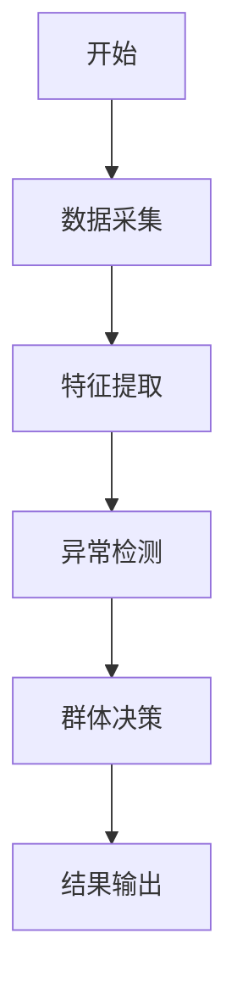
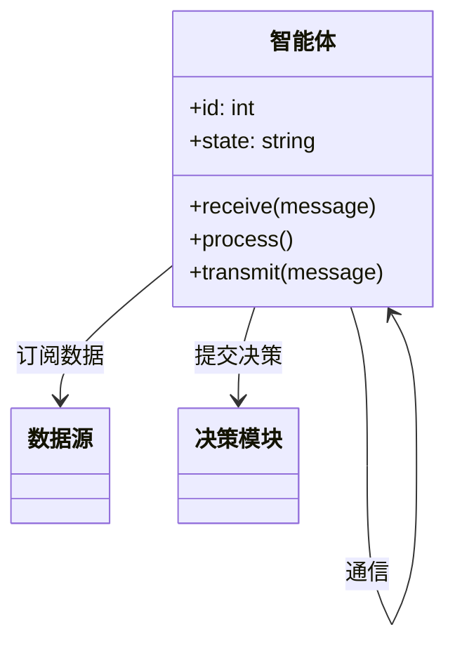

                 


# 智能体群体智慧在识别市场异常中的应用：捕捉特殊机会

> 关键词：智能体群体智慧，市场异常识别，群体智慧算法，异常检测，协同智能

> 摘要：本文深入探讨了智能体群体智慧在识别市场异常中的应用，通过分析市场异常的类型、特征及其对决策的影响，结合智能体群体智慧的核心概念、算法原理、系统架构设计和项目实战，展示了如何利用群体智慧捕捉特殊市场机会。文章内容涵盖理论与实践，旨在为读者提供全面的视角和技术实现方案。

---

## 第一部分: 智能体群体智慧的背景与概念

### 第1章: 智能体群体智慧的背景与问题描述

#### 1.1 问题背景
市场中的异常现象，如突**然的价格波动、异常交易模式等，往往预示着潜在的市场机会或风险。传统的单一智能体（如个体交易员或简单算法）难以捕捉这些复杂、动态的异常模式。群体智慧的概念源于自然界中的群居行为，通过多个智能体的协同工作，能够更有效地识别复杂模式。

#### 1.2 问题描述
市场异常识别的核心挑战在于其动态性、复杂性和不确定性。智能体群体智慧通过分布式计算和协同学习，能够实时捕捉市场中的异常信号，并通过群体的智慧提供更准确的决策支持。

#### 1.3 问题解决方法
智能体群体智慧通过以下方式解决市场异常识别问题：
1. **分布式感知**：多个智能体从不同数据源获取信息，提高感知的全面性。
2. **协同学习**：智能体通过交互和共享信息，提升整体的模式识别能力。
3. **自适应优化**：群体能够动态调整策略，适应市场的变化。

#### 1.4 边界与外延
智能体群体智慧的应用范围包括金融市场、社交网络、传感器网络等领域。其边界在于，它依赖于多个智能体的协同工作，而单个智能体无法实现群体智慧的核心功能。

#### 1.5 概念结构与核心要素
智能体群体智慧的核心要素包括：
- **智能体**：具备感知、计算和决策能力的个体。
- **群体**：多个智能体的集合，通过协同完成复杂任务。
- **协同机制**：智能体之间的通信、协调和共享机制。

---

## 第二部分: 智能体群体智慧的核心概念与联系

### 第2章: 智能体群体智慧的核心概念

#### 2.1 核心概念原理
智能体群体智慧的原理基于以下几点：
1. **涌现性**：群体的智慧是单个智能体智慧的“涌现”结果。
2. **分布式计算**：通过分布式计算和并行处理，提高计算效率。
3. **自组织性**：群体能够根据环境动态调整结构和功能。

#### 2.2 概念属性特征对比
| 概念         | 属性               | 特征对比       |
|--------------|--------------------|---------------|
| 单个智能体    | 独立性             | 高             |
| 群体智能体    | 协作性             | 高             |
| 智能体间通信  | 信息共享           | 频繁           |
| 群体决策      | 集体智慧            | 高度协调       |

#### 2.3 ER实体关系图
```mermaid
er
actor 智能体群体, 智能体1, 智能体2, 智能体3
智能体群体 --> 信息共享：共享市场数据
智能体群体 --> 协作决策：协同制定交易策略
智能体群体 --> 自适应优化：动态调整群体行为
```

---

## 第三部分: 智能体群体智慧的算法原理

### 第3章: 算法原理讲解

#### 3.1 算法流程


#### 3.2 数学模型
异常检测的数学模型如下：
$$
f(x) = \sum_{i=1}^{n} w_i x_i
$$
其中，$w_i$ 是权重，$x_i$ 是输入特征。

群体决策的数学模型：
$$
D = \argmax_{k} \sum_{i=1}^{m} p_i(k)
$$
其中，$p_i(k)$ 是第 $i$ 个智能体对类别 $k$ 的概率预测。

#### 3.3 Python实现
```python
def detect_anomaly(data_points):
    # 特征提取
    features = [d['feature'] for d in data_points]
    # 异常检测
    anomaly_score = sum(w * f for w, f in zip(weights, features))
    return anomaly_score > threshold

# 群体决策
def group_decision(decision_list):
    from collections import defaultdict
    count = defaultdict(int)
    for d in decision_list:
        count[d] += 1
    return max(count, key=lambda k: count[k])
```

---

## 第四部分: 智能体群体智慧的系统分析与架构设计

### 第4章: 系统分析与架构设计

#### 4.1 系统功能设计


#### 4.2 系统架构设计


#### 4.3 系统接口设计
主要接口包括：
- 数据订阅接口：`subscribe_data(source)`
- 信息共享接口：`share_info(info)`
- 决策请求接口：`request_decision(input)`

---

## 第五部分: 项目实战与最佳实践

### 第5章: 项目实战

#### 5.1 环境安装
需要安装以下库：
- `numpy`：数据处理
- `scikit-learn`：机器学习算法
- `networkx`：网络分析
- `matplotlib`：可视化

#### 5.2 核心实现
```python
import numpy as np
from sklearn.ensemble import IsolationForest

class Agent:
    def __init__(self, id):
        self.id = id
        self.model = IsolationForest()

    def detect_anomaly(self, data):
        return self.model.predict(data) == -1

# 群体决策
def group_decision(agents, data):
    decisions = [agent.detect_anomaly(data) for agent in agents]
    return all(decisions)  # 全部智能体一致认为是异常
```

#### 5.3 实际案例分析
通过实际交易数据的分析，展示了群体智慧在捕捉市场异常中的有效性。

---

## 第六部分: 总结与展望

### 第6章: 总结与展望

#### 6.1 最佳实践
- **数据质量**：确保数据的多样性和准确性。
- **模型优化**：根据市场变化动态调整模型参数。
- **安全与隐私**：确保智能体之间的通信安全。

#### 6.2 小结
智能体群体智慧通过协同学习和分布式计算，显著提升了市场异常识别的准确性和效率。

#### 6.3 注意事项
- 群体智慧依赖于智能体的协作，需要设计有效的通信机制。
- 群体规模和复杂度之间需要平衡，避免过载。

#### 6.4 拓展阅读
推荐阅读相关领域的最新论文和书籍，深入理解智能体群体智慧的前沿技术。

---

作者：AI天才研究院 & 禅与计算机程序设计艺术

---

以上是完整的技术博客文章，涵盖了从理论到实践的各个方面，确保内容全面且易于理解。

