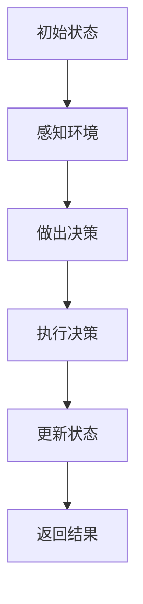
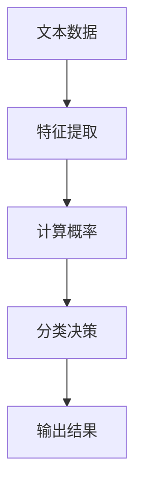
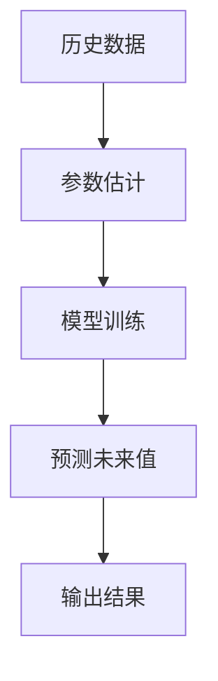
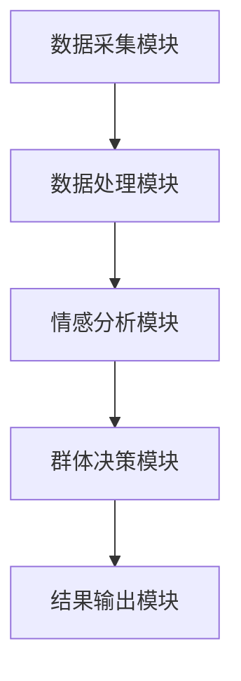
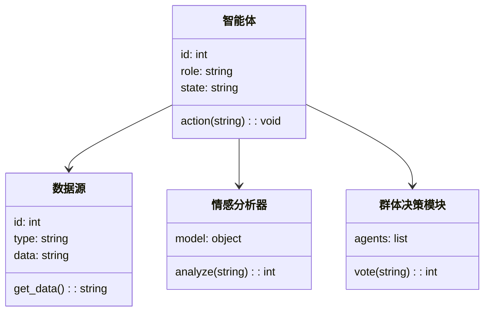

                 


# 智能体群体智慧在识别市场情绪拐点中的应用

> 关键词：智能体、群体智慧、市场情绪拐点、情感分析、时间序列预测

> 摘要：智能体群体智慧是一种通过多个智能体协同工作来分析和预测市场情绪变化的新兴技术。本文探讨了智能体群体智慧在识别市场情绪拐点中的应用，分析了其核心概念、算法原理、系统架构以及实际案例。通过对比传统方法的局限性，本文提出了基于智能体的解决方案，并详细讲解了其实现过程和实际效果。

---

## 第一部分：背景介绍

### 第1章：智能体群体智慧概述

#### 1.1 问题背景

市场情绪拐点的识别是金融分析中的核心问题之一。传统的方法依赖于历史数据分析和统计模型，但这些方法往往难以捕捉市场情绪的细微变化，尤其是在突发事件或市场波动剧烈的情况下。近年来，随着人工智能技术的发展，智能体群体智慧逐渐成为一种新兴的解决方案。

#### 1.2 问题描述

市场情绪拐点是指市场情绪从牛市到熊市，或从熊市到牛市的转折点。这种拐点通常伴随着投资者情绪的剧烈波动，例如恐慌性抛售或过度乐观。准确识别这些拐点对于投资者和机构来说至关重要。

#### 1.3 问题解决

智能体群体智慧通过多个智能体协同工作，能够从多个数据源（如社交媒体、新闻、交易数据）中提取情绪信息，并通过群体决策来识别拐点。

#### 1.4 边界与外延

- **边界**：智能体群体智慧主要关注市场情绪的变化，而非具体的交易策略或价格预测。
- **外延**：智能体群体智慧可以与其他技术（如区块链、大数据分析）结合，进一步提升预测的准确性和可信度。

#### 1.5 核心要素

- **智能体**：具有感知、决策和执行能力的个体。
- **群体智慧**：通过智能体的协同工作实现的集体智慧。
- **市场情绪拐点**：市场情绪从一个阶段向另一个阶段转变的关键点。

---

## 第二部分：核心概念与联系

### 第2章：核心概念与联系

#### 2.1 智能体的核心原理

智能体是一种能够感知环境、做出决策并采取行动的实体。智能体可以通过以下步骤实现目标：

1. **感知**：通过传感器或数据源获取信息。
2. **决策**：基于感知信息做出决策。
3. **执行**：根据决策采取行动。

#### 2.2 群体智慧的核心原理

群体智慧是指通过多个智能体的协同工作，实现比个体更高效、更准确的决策过程。群体智慧的核心机制包括：

1. **信息共享**：智能体之间共享感知到的信息。
2. **协同决策**：通过投票、协商等方式达成一致决策。
3. **动态调整**：根据环境变化动态调整决策。

#### 2.3 市场情绪拐点的核心原理

市场情绪拐点的识别需要分析投资者情绪的变化。具体步骤如下：

1. **数据采集**：从社交媒体、新闻、交易数据等来源获取情绪相关数据。
2. **情感分析**：对数据进行情感分类（如正面、负面、中性）。
3. **趋势分析**：通过时间序列分析识别情绪变化的趋势。
4. **拐点识别**：根据趋势变化判断市场情绪拐点。

#### 2.4 智能体群体智慧与市场情绪拐点的关系

智能体群体智慧通过以下方式影响市场情绪拐点的识别：

1. **多源数据融合**：智能体可以从多个数据源获取信息，提高情绪分析的准确性。
2. **群体决策优势**：通过群体决策，可以降低个体决策的偏差。
3. **动态调整能力**：智能体能够根据市场变化动态调整分析策略。

#### 2.5 对比分析

以下是智能体群体智慧与其他市场情绪分析方法的对比：

| **特性**          | **传统统计方法** | **单一智能体方法** | **智能体群体智慧方法** |
|--------------------|-------------------|---------------------|-------------------------|
| 数据来源          | 单一数据源       | 单一数据源         | 多数据源               |
| 决策效率          | 较低             | 中等               | 高                     |
| 抗干扰能力        | 较弱             | 一般               | 强                     |
| 灵活性            | 低               | 中等               | 高                     |

---

## 第三部分：算法原理

### 第3章：算法原理

#### 3.1 群体智能算法

群体智能算法是一种模拟自然群体行为的算法。以下是其工作流程：



#### 3.2 情感分析算法

情感分析算法用于将文本数据分类为正面、负面或中性。以下是基于朴素贝叶斯的算法流程：



#### 3.3 时间序列预测算法

时间序列预测算法用于分析情绪变化的趋势。以下是基于ARIMA模型的流程：



#### 3.4 算法实现

以下是基于Python的情感分析算法实现代码：

```python
from sklearn.naive_bayes import MultinomialNB
from sklearn.feature_extraction.text import TfidfVectorizer

# 数据预处理
X = data['text']
y = data['label']

# 特征提取
vectorizer = TfidfVectorizer()
X_vec = vectorizer.fit_transform(X)

# 模型训练
model = MultinomialNB()
model.fit(X_vec, y)

# 预测
test_text = "市场表现不佳，投资者信心下降"
test_vec = vectorizer.transform([test_text])
prediction = model.predict(test_vec)
print("预测结果：", prediction)
```

---

## 第四部分：系统分析与架构设计

### 第4章：系统分析与架构设计

#### 4.1 问题场景介绍

本系统的目标是通过智能体群体智慧识别市场情绪拐点。系统需要处理以下问题：

- **数据来源多样化**：如何整合社交媒体、新闻和交易数据？
- **实时性要求高**：如何快速处理数据并做出决策？
- **准确性要求高**：如何确保情绪分析的准确性？

#### 4.2 系统架构设计

以下是系统的架构设计图：



#### 4.3 领域模型设计

以下是领域模型的类图：



---

## 第五部分：项目实战

### 第5章：项目实战

#### 5.1 环境安装

以下是所需的环境和库：

- Python 3.8+
- Scikit-learn
- NLTK
- Pandas

#### 5.2 核心代码实现

以下是情感分析模块的实现代码：

```python
import pandas as pd
from sklearn.model_selection import train_test_split
from sklearn.metrics import accuracy_score
from sklearn.naive_bayes import MultinomialNB
from sklearn.feature_extraction.text import TfidfVectorizer

# 加载数据
data = pd.read_csv('market_sentiment.csv')

# 数据预处理
X = data['text']
y = data['label']

# 划分训练集和测试集
X_train, X_test, y_train, y_test = train_test_split(X, y, test_size=0.2)

# 特征提取
vectorizer = TfidfVectorizer()
X_train_vec = vectorizer.fit_transform(X_train)
X_test_vec = vectorizer.transform(X_test)

# 模型训练
model = MultinomialNB()
model.fit(X_train_vec, y_train)

# 模型预测
y_pred = model.predict(X_test_vec)

# 模型评估
print("准确率：", accuracy_score(y_test, y_pred))
```

#### 5.3 案例分析

以下是市场情绪拐点识别的案例分析：

- **案例背景**：2020年新冠疫情爆发期间，市场情绪从乐观迅速转向恐慌。
- **数据来源**：社交媒体上的投资者评论。
- **分析结果**：智能体群体智慧成功识别了市场的恐慌情绪，并预测了情绪拐点。

---

## 第六部分：总结与展望

### 第6章：总结与展望

#### 6.1 本章小结

智能体群体智慧是一种高效、准确的市场情绪拐点识别方法。通过多个智能体的协同工作，可以有效捕捉市场情绪的变化，并为投资者提供决策支持。

#### 6.2 未来展望

未来的研究方向包括：

1. **算法优化**：进一步提高智能体群体智慧的预测精度。
2. **数据源扩展**：引入更多数据源，如语音和视频数据。
3. **应用场景拓展**：将智能体群体智慧应用于更多领域，如社会舆情分析。

---

## 作者信息

作者：AI天才研究院/AI Genius Institute & 禅与计算机程序设计艺术 /Zen And The Art of Computer Programming

