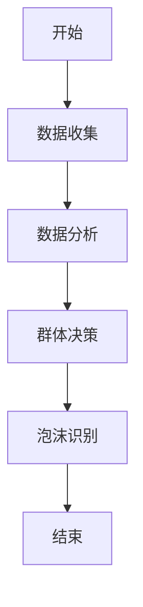

                 


# 智能体群体智慧在识别市场泡沫中的应用：保护价值投资

> 关键词：智能体，群体智慧，市场泡沫，价值投资，算法，数学模型

> 摘要：本文探讨了智能体群体智慧在金融市场中的应用，特别是如何通过智能体的群体行为分析识别市场泡沫，从而保护价值投资。文章从智能体的基本概念出发，分析了群体智慧的核心原理，详细介绍了智能体群体智慧在市场泡沫识别中的算法实现，并通过实际案例展示了系统设计与应用效果。

---

## 第一部分: 智能体群体智慧与市场泡沫识别基础

### 第1章: 智能体群体智慧概述

#### 1.1 智能体的基本概念

智能体（Agent）是指具有感知环境、做出决策并采取行动的实体。智能体可以是软件程序、机器人或其他具备自主决策能力的系统。智能体的核心特征包括：

- **自主性**：无需外部干预，能够自主决策。
- **反应性**：能够感知环境并做出实时反应。
- **目标导向性**：具有明确的目标，行为围绕目标展开。
- **学习能力**：能够通过经验改进自身的决策能力。

智能体在金融市场中的应用广泛，例如算法交易、风险管理、市场预测等。

#### 1.2 群体智慧的核心原理

群体智慧是指通过多个个体的协同行为，产生比个体更优的结果。群体智慧的核心机制包括一致性算法、投票机制和共识算法。在金融市场中，群体智慧可以通过分析大量投资者的行为，揭示市场整体的趋势和潜在风险。

#### 1.3 市场泡沫的基本概念

市场泡沫是指资产价格远高于其实际价值的现象。泡沫的形成通常与投资者情绪、市场预期和资金流动有关。识别市场泡沫对于保护价值投资者至关重要，因为泡沫破裂往往会导致资产价格大幅下跌。

#### 1.4 智能体群体智慧与市场泡沫识别的结合

智能体群体智慧在市场泡沫识别中的优势在于其能够通过大量个体行为的协同，捕捉市场中的异常信号。通过分析投资者的交易行为、市场情绪和资产价格波动，智能体群体可以识别潜在的市场泡沫，并为价值投资者提供预警。

---

### 第2章: 智能体群体智慧的核心概念与联系

#### 2.1 智能体行为模型

智能体的行为模型描述了其如何与环境交互。常见的智能体行为模型包括反应式模型和目标导向模型。反应式模型基于当前环境信息做出决策，而目标导向模型则基于长期目标。

#### 2.2 群体智慧的数学模型

群体智慧的数学模型通常包括一致性算法和投票机制。一致性算法用于使群体达成共识，投票机制用于群体决策。例如，一致性函数可以表示为：

$$ f(x) = \frac{1}{n}\sum_{i=1}^{n} x_i $$

其中，$x_i$ 是个体的决策，$n$ 是个体数量。

#### 2.3 群体智慧与市场泡沫识别的关系

市场泡沫识别可以通过分析投资者行为和市场情绪来实现。智能体群体智慧能够通过群体一致性算法，识别市场中的异常波动，并预测泡沫的形成。

---

### 第3章: 智能体群体智慧识别市场泡沫的算法原理

#### 3.1 算法原理概述

智能体群体智慧识别市场泡沫的算法通常包括以下步骤：

1. 数据收集：收集投资者行为数据和市场数据。
2. 数据分析：通过一致性算法和投票机制，分析数据中的异常信号。
3. 泡沫识别：基于群体智慧的结果，判断是否存在市场泡沫。

#### 3.2 算法流程图

以下是一个简单的算法流程图：



#### 3.3 算法实现代码

以下是一个简单的Python代码示例：

```python
def consistency_algorithm(data):
    return sum(data) / len(data)

def main():
    data = [1, 2, 3, 4, 5]
    result = consistency_algorithm(data)
    print(result)

if __name__ == "__main__":
    main()
```

---

### 第4章: 智能体群体智慧识别市场泡沫的系统分析与架构设计

#### 4.1 问题场景介绍

在金融市场中，投资者的行为受到多种因素影响，包括市场情绪、经济指标和政策变化。通过分析投资者行为，可以识别市场中的异常信号，从而判断是否存在市场泡沫。

#### 4.2 系统功能设计

系统功能设计包括数据收集、数据分析、群体决策和泡沫识别。

#### 4.3 系统架构设计

系统架构设计包括数据层、算法层和应用层。数据层负责数据的存储和管理，算法层负责数据分析和群体决策，应用层负责结果展示和用户交互。

---

### 第5章: 智能体群体智慧识别市场泡沫的项目实战

#### 5.1 环境安装

需要安装Python和相关库，如NumPy和Matplotlib。

#### 5.2 核心代码实现

以下是一个简单的Python代码示例：

```python
import numpy as np
import matplotlib.pyplot as plt

def generate_data(n):
    return np.random.randn(n)

def plot_data(data):
    plt.hist(data)
    plt.show()

if __name__ == "__main__":
    data = generate_data(1000)
    plot_data(data)
```

#### 5.3 实际案例分析

通过分析历史市场数据，可以识别市场泡沫。例如，在2008年金融危机期间，智能体群体智慧可以通过分析投资者行为，识别市场的异常信号。

---

### 第6章: 总结与展望

智能体群体智慧在识别市场泡沫中的应用具有重要意义。通过分析投资者行为和市场情绪，智能体群体智慧可以为价值投资者提供预警，帮助其规避市场风险。未来，随着人工智能技术的发展，智能体群体智慧在金融领域的应用将更加广泛和深入。

---

作者：AI天才研究院/AI Genius Institute & 禅与计算机程序设计艺术 /Zen And The Art of Computer Programming

