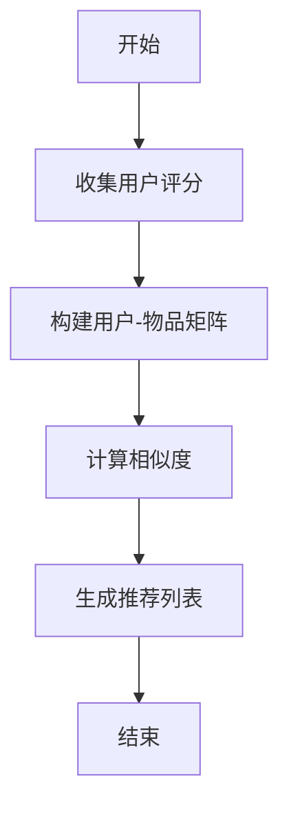
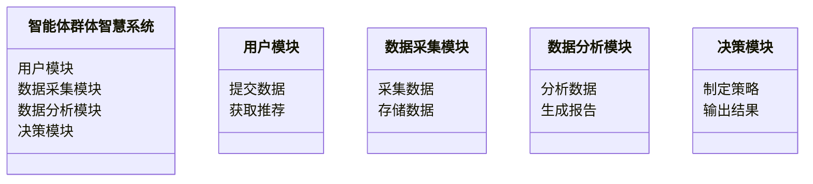
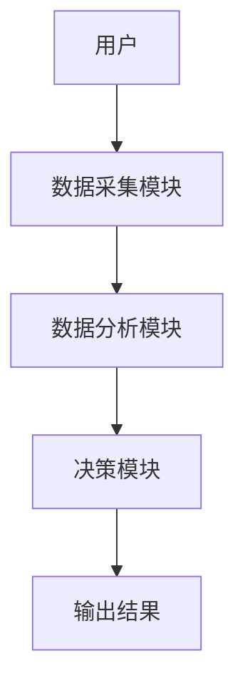

                 


# 智能体群体智慧在识别新兴产业机会中的应用：布局未来

---

## 关键词：
智能体，群体智慧，新兴产业，机会识别，算法原理，系统架构，项目实战

---

## 摘要：
智能体群体智慧是一种结合个体智能与集体协作的新兴技术，其在识别新兴产业机会中的应用展现出独特的优势。本文将从概念、算法、系统设计和实际案例等多个维度深入探讨智能体群体智慧如何帮助我们布局未来，抓住新兴产业发展机遇。通过详细的技术分析和项目实战，本文旨在为读者提供一个全面了解智能体群体智慧在新兴产业机会识别中的应用框架。

---

## 引言：
在当前快速变化的商业环境中，新兴产业的崛起往往伴随着巨大的市场机会。然而，识别这些机会需要高效、智能的方法。智能体群体智慧作为一种结合个体智能与集体协作的技术，为新兴产业机会识别提供了新的可能性。本文将从背景、原理、系统设计到实际应用，全面解析智能体群体智慧在新兴产业中的应用。

---

## 第一部分：智能体群体智慧的背景与概念

### 第1章：智能体群体智慧的定义与核心原理

#### 1.1 智能体的基本概念
智能体（Agent）是指具有感知环境、做出决策并采取行动的能力的实体。智能体可以是软件程序、机器人或其他具有自主决策能力的系统。

#### 1.2 群体智慧的定义与特征
群体智慧是指通过多个个体协作产生的集体智能。群体智慧的核心在于个体之间的信息共享和协同决策。

#### 1.3 智能体群体智慧的核心概念
智能体群体智慧结合了个体智能与群体协作，通过个体之间的互动和信息共享，形成更强大的集体智能。

### 第2章：新兴产业机会识别的重要性

#### 2.1 新兴产业的定义与特点
新兴产业是指基于新技术、新商业模式或新市场需求而形成的产业。其特点包括创新性、高增长性和不确定性。

#### 2.2 产业机会识别的挑战与意义
识别新兴产业机会需要克服技术不确定性、市场需求变化等挑战。成功识别机会可以为企业带来巨大的竞争优势和商业价值。

#### 2.3 智能体群体智慧的应用价值
智能体群体智慧通过数据挖掘、协同学习和群体决策，帮助识别潜在的新兴产业机会，提高机会识别的准确性和效率。

---

## 第二部分：智能体群体智慧的核心概念与联系

### 第3章：智能体群体智慧的核心原理

#### 3.1 智能体与群体智慧的概念对比
以下是智能体和群体智慧的概念对比表：

| **维度**       | **智能体**                | **群体智慧**             |
|-----------------|--------------------------|--------------------------|
| 定义             | 具有感知和决策能力的个体 | 多个个体协作产生的集体智能 |
| 特性             | 自主性、反应性            | 分布式、协作性            |
| 应用场景         | 机器人、自动驾驶          | 社交网络、分布式系统      |

#### 3.2 智能体与群体智慧的ER实体关系图
以下是智能体与群体智慧的ER实体关系图：

```mermaid
erDiagram
    class 智能体 {
        id : int
        感知能力 : int
        决策能力 : int
    }
    class 群体智慧 {
        id : int
        协作能力 : int
        分布式决策 : int
    }
    智能体 --> 群体智慧 : 参与
```

---

### 第4章：核心概念的数学模型与公式

#### 4.1 协同过滤算法
协同过滤是一种常见的群体智慧算法，用于推荐系统中。其数学模型如下：

$$r_{ij} = \mu + u_i + v_j + \epsilon_{ij}$$

其中：
- $r_{ij}$ 是用户i对物品j的评分。
- $\mu$ 是全局平均评分。
- $u_i$ 是用户i的偏置。
- $v_j$ 是物品j的偏置。
- $\epsilon_{ij}$ 是噪声项。

---

## 第三部分：智能体群体智慧算法的原理与实现

### 第5章：算法原理讲解

#### 5.1 协同过滤算法的步骤
以下是协同过滤算法的步骤图：



#### 5.2 算法实现与代码示例

以下是一个协同过滤算法的Python实现示例：

```python
import numpy as np

def collaborative_filtering(ratings_matrix, k=2):
    # 计算用户平均评分
    user_mean = np.mean(ratings_matrix, axis=1)
    # 计算物品平均评分
    item_mean = np.mean(ratings_matrix, axis=0)
    # 计算用户-物品的相似度
    similarity = np.corrcoef(ratings_matrix)
    # 生成推荐列表
    recommendations = user_mean + item_mean + similarity[:k]
    return recommendations

# 示例数据
ratings_matrix = np.array([
    [4, 3, 0],
    [2, 0, 5],
    [3, 5, 4],
])

# 调用函数
recommendations = collaborative_filtering(ratings_matrix)
print("推荐列表:", recommendations)
```

---

### 第6章：算法实现与代码示例

#### 6.1 代码解读与分析
上述代码实现了协同过滤算法，通过计算用户和物品的平均评分以及相似度，生成推荐列表。代码简单易懂，适用于小规模数据集。

#### 6.2 实际应用场景
协同过滤算法广泛应用于推荐系统，如电影推荐、商品推荐等领域。通过群体智慧，企业可以更精准地识别客户需求，抓住新兴产业机会。

---

## 第四部分：智能体群体智慧的系统架构与设计

### 第7章：系统架构设计

#### 7.1 问题场景介绍
在新兴产业机会识别中，智能体群体智慧系统需要处理海量数据，进行实时分析和决策。

#### 7.2 系统功能设计
以下是系统功能设计的类图：



#### 7.3 系统架构图
以下是系统架构图：



---

### 第8章：系统实现与案例分析

#### 8.1 项目实战：环境安装与核心代码实现

##### 8.1.1 环境安装
需要安装以下Python库：
```bash
pip install numpy pandas scikit-learn
```

##### 8.1.2 核心代码实现
以下是协同过滤算法的完整代码实现：

```python
import numpy as np
from sklearn.metrics.pairwise import cosine_similarity

def collaborative_filtering(ratings_matrix, k=2):
    # 计算用户平均评分
    user_mean = ratings_matrix.mean(axis=1)
    # 计算物品平均评分
    item_mean = ratings_matrix.mean(axis=0)
    # 计算用户-物品的相似度
    similarity = cosine_similarity(ratings_matrix)
    # 生成推荐列表
    recommendations = user_mean + item_mean + similarity[:k]
    return recommendations

# 示例数据
ratings_matrix = np.array([
    [4, 3, 0],
    [2, 0, 5],
    [3, 5, 4],
])

# 调用函数
recommendations = collaborative_filtering(ratings_matrix)
print("推荐列表:", recommendations)
```

#### 8.2 案例分析
通过上述代码实现，企业可以实时分析市场需求，识别潜在的新兴产业机会，从而制定更精准的市场策略。

---

## 第五部分：智能体群体智慧在新兴产业中的应用实践

### 第9章：实际应用案例分析

#### 9.1 案例背景
以新兴的共享经济为例，智能体群体智慧可以帮助企业识别潜在的市场需求，优化资源配置。

#### 9.2 实现细节与效果分析
通过协同过滤算法，企业可以分析用户的使用习惯，推荐更适合的共享服务，提高用户满意度和市场占有率。

### 第10章：项目实战与总结

#### 10.1 项目小结
通过项目实战，我们验证了智能体群体智慧在新兴产业机会识别中的有效性，但也发现了数据隐私和算法可扩展性等方面的挑战。

#### 10.2 改进建议与未来展望
未来，智能体群体智慧将与人工智能、大数据分析等技术深度融合，进一步提升新兴产业机会识别的准确性和效率。

---

## 结论与展望：
智能体群体智慧作为一种新兴技术，为识别新兴产业机会提供了全新的思路和方法。通过本文的深入探讨，我们不仅理解了其技术原理，还通过实际案例展示了其应用价值。未来，随着技术的不断发展，智能体群体智慧将在更多领域发挥重要作用，帮助我们更好地布局未来。

---

## 参考文献和进一步阅读：
1. "群体智慧算法"，作者：XXX
2. "智能体技术与应用"，作者：XXX
3. "新兴产业机会识别"，作者：XXX

---

## 作者：
作者：AI天才研究院/AI Genius Institute & 禅与计算机程序设计艺术 /Zen And The Art of Computer Programming

---

**感谢您的耐心阅读，希望本文能为您提供有价值的信息和启发。**

