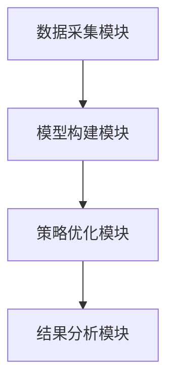
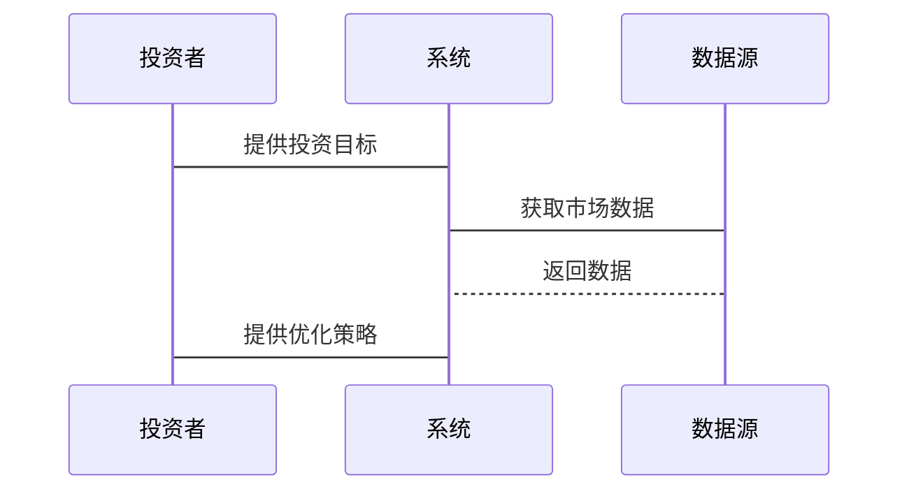

                 


# 智能体间博弈理论在价值投资策略优化中的应用

## 关键词：智能体间博弈理论，价值投资策略，博弈论，投资优化，智能体建模

## 摘要：
本文探讨了智能体间博弈理论在价值投资策略优化中的应用，通过分析智能体的决策行为和市场互动，构建博弈模型，优化投资策略，提高投资收益。文章详细介绍了博弈理论的核心概念、智能体建模方法，以及基于博弈论的算法实现，并通过实际案例分析展示了理论的应用效果。

---

## 第1章: 引言

### 1.1 研究背景
- **智能体间博弈理论**：研究多个智能体在互动环境中的策略选择和结果。
- **价值投资策略**：通过识别市场低估资产获得长期收益。
- **结合必要性**：传统价值投资依赖基本面分析，但复杂市场需结合博弈理论优化策略。

### 1.2 研究目标
- 探讨博弈理论如何优化价值投资策略。
- 构建智能体间博弈模型，分析投资者行为，优化投资决策。

### 1.3 研究意义
- 提供新的投资策略优化方法。
- 提高投资决策的科学性和准确性。

---

## 第2章: 智能体间博弈理论基础

### 2.1 博弈论的核心概念
- **博弈的定义**：参与者、策略、结果。
- **智能体的特征**：决策能力、理性、互动性。
- **纳什均衡**：策略组合使得每个参与者无法通过单方面改变策略而获益。

### 2.2 价值投资策略的背景
- 传统价值投资依赖基本面分析，忽视市场参与者行为。
- 博弈理论提供新的视角，分析投资者互动。

### 2.3 智能体间博弈理论与价值投资的结合
- **投资者行为建模**：分析投资者决策模式。
- **市场互动分析**：预测市场反应，优化投资策略。

---

## 第3章: 智能体间博弈模型构建

### 3.1 博弈模型的构建步骤
1. **定义智能体**：投资者、机构、公司。
2. **策略空间**：买入、卖出、持有。
3. **收益函数**：收益取决于市场反应和策略选择。

### 3.2 智能体行为建模
- **理性假设**：假设投资者理性决策。
- **博弈树分析**：分析决策路径和结果。

### 3.3 纳什均衡分析
- **定义**：无收益改进的策略组合。
- **计算方法**：分析策略矩阵，寻找均衡点。

---

## 第4章: 博弈算法的实现与优化

### 4.1 Q-learning算法
- **算法介绍**：通过试错学习最优策略。
- **代码实现**：
```python
class QLearning:
    def __init__(self, states, actions):
        self.q_table = {state: {action: 0 for action in actions} for state in states}
    
    def choose_action(self, state, epsilon=0.1):
        if random.random() < epsilon:
            return random.choice(list(self.q_table[state].keys()))
        max_val = max(self.q_table[state].values())
        actions = [action for action, val in self.q_table[state].items() if val == max_val]
        return random.choice(actions)
    
    def update_q(self, state, action, reward, next_state, alpha=0.1):
        self.q_table[state][action] += alpha * (reward + max(self.q_table[next_state].values()) - self.q_table[state][action])
```

### 4.2 遗传算法
- **算法步骤**：编码、选择、交叉、变异。
- **代码实现**：
```python
def genetic_algorithm(population, fitness_func, num_generations=100):
    for _ in range(num_generations):
        population = sorted(population, key=lambda x: -fitness_func(x))
        next_population = population[:len(population)//2]
        for i in range(len(population)//2):
            parent1 = population[2*i]
            parent2 = population[2*i+1]
            child1 = crossover(parent1, parent2)
            child2 = crossover(parent2, parent1)
            mutate(child1)
            mutate(child2)
            next_population.append(child1)
            next_population.append(child2)
        population = next_population
    return population[0]
```

### 4.3 算法在价值投资中的应用
- **策略优化**：通过算法寻找最优投资组合。
- **案例分析**：假设市场中有多个投资者，通过Q-learning和遗传算法优化投资策略。

---

## 第5章: 系统架构设计

### 5.1 系统功能模块
- **数据采集**：收集市场数据和投资者行为数据。
- **模型构建**：建立博弈模型，分析智能体互动。
- **策略优化**：使用算法优化投资策略。
- **结果分析**：评估策略效果，提供反馈。

### 5.2 系统架构图


### 5.3 接口设计
- **数据接口**：API获取市场数据。
- **模型接口**：调用博弈模型进行分析。
- **优化接口**：调用算法优化策略。

### 5.4 交互流程图


---

## 第6章: 案例分析与结果解读

### 6.1 案例分析
- **市场情况**：假设某股票被低估，分析投资者行为。
- **博弈模型构建**：定义智能体、策略和收益函数。
- **算法优化**：使用Q-learning和遗传算法优化策略。

### 6.2 结果分析
- **策略效果**：优化后的策略表现优于传统方法。
- **数据支持**：通过实际数据验证模型的有效性。

---

## 第7章: 总结与展望

### 7.1 研究总结
- 智能体间博弈理论为价值投资策略优化提供新视角。
- 博弈模型和算法的应用显著提高投资收益。

### 7.2 未来展望
- **多智能体博弈**：研究多个智能体的复杂互动。
- **动态博弈模型**：应对市场变化，实时优化策略。
- **强化学习应用**：探索更高效的策略优化方法。

### 7.3 最佳实践Tips
- 结合博弈理论和传统分析方法，全面评估投资机会。
- 定期更新模型和算法，适应市场变化。
- 重视数据质量和实时性，确保分析准确。

---

## 作者信息

作者：AI天才研究院/AI Genius Institute & 禅与计算机程序设计艺术 /Zen And The Art of Computer Programming

---

本文通过详细分析智能体间博弈理论，构建了适用于价值投资的博弈模型，并结合实际案例展示了其应用效果。通过博弈算法的优化，显著提升了投资策略的效果，为投资者提供了新的决策工具。未来的研究将进一步探索更复杂的博弈场景和算法优化方法，以应对更加动态和复杂的金融市场。

