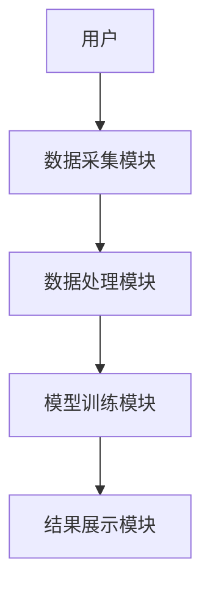
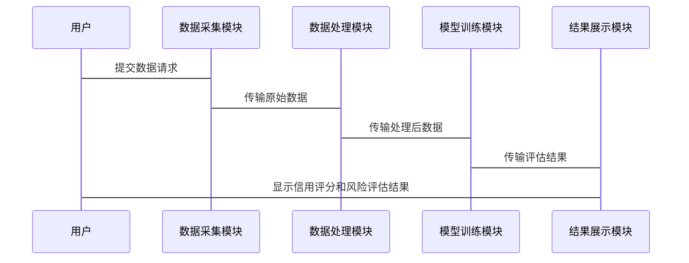

                 


# 《智能供应链金融信用评估》

---

## 关键词：

- 智能供应链金融
- 信用评估
- 人工智能
- 机器学习
- 金融风控
- 供应链管理

---

## 摘要：

智能供应链金融信用评估是一种结合供应链管理、金融信用评估和人工智能技术的创新方法。本文从供应链金融的基本概念出发，深入探讨智能信用评估的核心原理、算法实现、系统架构及实际应用场景。通过分析供应链金融中的信用风险，结合机器学习、图论算法等技术手段，构建智能信用评估模型，实现对供应链参与方的信用评分和风险控制。文章还通过具体案例展示了智能供应链金融信用评估系统的实现过程，为读者提供从理论到实践的全面指导。

---

# 目录大纲

---

## 第一部分：智能供应链金融信用评估的背景与基础

---

### 第1章：供应链金融与信用评估概述

#### 1.1 供应链金融的定义与特点
- 1.1.1 供应链金融的基本概念
  - 供应链的定义与特点
  - 供应链金融的定义与核心要素
- 1.1.2 供应链金融的核心特点
  - 系统性：供应链金融的多环节协同
  - 依赖性：供应链金融对数据和信任的依赖
  - 风险性：供应链金融中的信用风险与操作风险
- 1.1.3 供应链金融的参与者与流程
  - 供应链金融的主要参与者（企业、金融机构、物流平台等）
  - 供应链金融的典型流程（融资申请、审核、放款等）

#### 1.2 信用评估的基本原理
- 1.2.1 信用评估的定义与作用
  - 信用评估的定义
  - 信用评估在供应链金融中的作用
- 1.2.2 信用评估的主要方法
  - 传统信用评估方法（如5Cs法、5Ws法）
  - 数据驱动的信用评估方法（如机器学习模型）
- 1.2.3 信用评估的指标体系
  - 财务指标（如资产负债率、利润率）
  - 非财务指标（如企业声誉、供应链稳定性）

#### 1.3 智能供应链金融信用评估的定义与发展趋势
- 1.3.1 智能供应链金融信用评估的定义
  - 智能供应链金融的定义
  - 智能信用评估的核心特点（数据驱动、实时性、智能化）
- 1.3.2 智能供应链金融信用评估的核心优势
  - 数据驱动：利用供应链中的海量数据进行信用评估
  - 实时性：基于实时数据进行动态信用评估
  - 智能性：通过机器学习等技术实现自动化信用评估
- 1.3.3 智能供应链金融信用评估的发展趋势
  - 技术驱动：人工智能、大数据技术的快速发展推动信用评估智能化
  - 场景化：信用评估在供应链金融中的具体应用场景不断扩展
  - 标准化：智能信用评估的标准化和规范化

#### 1.4 供应链金融与智能信用评估的结合
- 1.4.1 供应链金融中的信用风险
  - 供应链金融中的主要风险（信用风险、操作风险、市场风险）
  - 信用风险的来源（企业信用、交易风险、金融产品风险）
- 1.4.2 智能技术在信用评估中的应用
  - 机器学习在信用评估中的应用（如分类、回归模型）
  - 图论算法在信用网络中的应用（如网络风险传播、社区检测）
- 1.4.3 智能供应链金融信用评估的场景与价值
  - 典型应用场景（如供应链融资、应收账款管理）
  - 信用评估对供应链金融的价值（提升效率、降低风险、优化资源配置）

#### 1.5 本章小结

---

### 第2章：智能供应链金融信用评估的核心概念与联系

#### 2.1 核心概念原理
- 2.1.1 供应链金融中的信用评估模型
  - 传统信用评估模型的局限性
  - 智能信用评估模型的构建原理
- 2.1.2 智能信用评估的核心算法
  - 机器学习算法（如逻辑回归、随机森林、神经网络）
  - 图论算法（如PageRank、Louvain算法）
- 2.1.3 数据驱动的信用评估方法
  - 数据来源（企业数据、交易数据、外部数据）
  - 数据特征提取（如企业经营状况、供应链稳定性）

#### 2.2 核心概念属性对比表
```markdown
| 概念             | 属性1（数据驱动） | 属性2（实时性） | 属性3（智能化） |
|------------------|------------------|----------------|----------------|
| 供应链金融       | 部分数据驱动     | 非实时         | 较低           |
| 传统信用评估     | 数据驱动有限     | 非实时         | 较低           |
| 智能供应链金融信用评估 | 数据驱动强     | 实时           | 高             |
```

#### 2.3 ER实体关系图架构
```mermaid
er
    actor 供应链金融参与者 {
        participant 企业
        participant 金融机构
        participant 物流平台
        participant 贸易平台
    }
    entity 供应链金融数据 {
        <<继承 自供应链数据>>
        <<继承 自金融数据>>
        key 交易数据
        key 企业数据
        key 外部数据
    }
    entity 信用评估模型 {
        <<继承 自机器学习模型>>
        <<继承 自图论模型>>
        key 输入数据
        key 模型参数
        key 输出结果
    }
    entity 信用评估结果 {
        key 企业信用评分
        key 供应链风险评分
        key 推荐融资方案
    }
```

#### 2.4 核心概念的联系
- 数据流：从供应链金融参与者到供应链金融数据，再到信用评估模型，最终生成信用评估结果。
- 模型流：信用评估模型通过数据驱动的方式，对供应链金融数据进行建模和分析，生成信用评估结果。
- 结果流：信用评估结果被应用于供应链金融的具体业务场景中，如融资审核、风险控制等。

#### 2.5 本章小结

---

## 第二部分：智能供应链金融信用评估的算法与实现

---

### 第3章：智能供应链金融信用评估的核心算法

#### 3.1 机器学习算法在信用评估中的应用
- 3.1.1 逻辑回归模型
  - 模型原理：通过线性回归模型预测信用评分
  - 优缺点：简单易懂，但对非线性关系的处理能力有限
- 3.1.2 随机森林模型
  - 模型原理：通过决策树的集成学习实现信用评分预测
  - 优缺点：对噪声数据鲁棒性好，但模型解释性较低
- 3.1.3 神经网络模型
  - 模型原理：通过多层神经网络实现非线性关系建模
  - 优缺点：模型复杂度高，但表达能力强

#### 3.2 图论算法在供应链信用网络中的应用
- 3.2.1 PageRank算法
  - 算法原理：用于衡量供应链网络中的节点重要性
  - 应用场景：供应链中的核心企业识别
- 3.2.2 Louvain算法
  - 算法原理：用于发现供应链网络中的社区结构
  - 应用场景：供应链中的风险传播路径分析
- 3.2.3 网络流算法
  - 算法原理：用于优化供应链中的资金流动效率
  - 应用场景：供应链融资的路径优化

#### 3.3 智能信用评估算法的数学模型
- 3.3.1 信用评分模型
  - 模型公式：$$ P = f(x_1, x_2, \ldots, x_n) $$
  - 参数解释：$x_i$ 表示影响信用评分的特征变量，$f$ 表示信用评分函数
- 3.3.2 风险评估模型
  - 模型公式：$$ R = g(y_1, y_2, \ldots, y_m) $$
  - 参数解释：$y_i$ 表示风险相关特征变量，$g$ 表示风险评估函数

#### 3.4 算法实现步骤
- 数据预处理：清洗、特征提取、数据标准化
- 模型训练：选择合适的算法，训练模型参数
- 模型评估：通过交叉验证评估模型性能
- 模型部署：将模型集成到供应链金融系统中

#### 3.5 本章小结

---

### 第4章：智能供应链金融信用评估系统的实现

#### 4.1 系统功能设计
- 4.1.1 系统功能模块
  - 数据采集模块：采集供应链金融数据
  - 数据处理模块：清洗、特征提取
  - 模型训练模块：训练信用评估模型
  - 结果展示模块：展示信用评分和风险评估结果
- 4.1.2 系统功能流程
  - 数据采集 -> 数据处理 -> 模型训练 -> 模型部署 -> 结果展示

#### 4.2 系统架构设计


#### 4.3 系统接口设计
- 数据接口：API接口定义（如RESTful API）
- 模型接口：模型调用接口（如Python函数调用）
- 结果接口：结果展示接口（如网页界面）

#### 4.4 系统交互流程


#### 4.5 系统实现案例
- 案例背景：某制造企业的供应链金融信用评估系统
- 案例实现：从数据采集到模型部署的具体步骤
- 案例分析：系统的实际效果和优化建议

#### 4.6 本章小结

---

## 第三部分：智能供应链金融信用评估的项目实战

---

### 第5章：智能供应链金融信用评估项目实战

#### 5.1 项目背景与目标
- 项目背景：某制造企业的供应链金融信用评估需求
- 项目目标：构建智能信用评估系统，提升供应链金融效率

#### 5.2 项目环境与工具
- 5.2.1 环境安装
  - 操作系统：Linux/Windows/MacOS
  - 开发工具：Python、Jupyter Notebook
  - 数据库：MySQL/PostgreSQL
  - 机器学习库：Scikit-learn、XGBoost
  - 图论库：NetworkX、Gephi
- 5.2.2 工具安装与配置
  - 安装Python环境：使用Anaconda或虚拟环境
  - 安装机器学习库：pip install scikit-learn, xgboost, networkx
  - 安装数据库驱动：安装MySQL Connector Python

#### 5.3 项目核心实现
- 5.3.1 数据采集与处理
  - 数据来源：企业数据、交易数据、外部数据
  - 数据清洗：处理缺失值、异常值
  - 特征提取：提取关键特征变量（如企业经营状况、供应链稳定性）
- 5.3.2 模型训练与部署
  - 选择模型：随机森林、XGBoost
  - 模型训练：使用训练数据训练模型
  - 模型部署：将模型集成到系统中
- 5.3.3 系统接口开发
  - API接口设计：RESTful API
  - 接口实现：使用Flask或Django框架
  - 接口测试：测试接口的响应时间、准确性

#### 5.4 项目案例分析
- 数据分析：展示项目数据的特征分布
- 模型评估：展示模型的准确率、召回率、F1分数
- 系统展示：展示系统的功能界面和评估结果

#### 5.5 项目优化与扩展
- 5.5.1 系统优化
  - 模型优化：尝试不同的算法组合（如集成学习）
  - 系统性能优化：优化数据处理速度、模型训练速度
- 5.5.2 系统扩展
  - 新增功能：如风险预警、融资方案推荐
  - 新增数据源：如引入外部信用评分数据

#### 5.6 本章小结

---

## 第四部分：智能供应链金融信用评估的总结与展望

---

### 第6章：总结与展望

#### 6.1 核心总结
- 本章总结了智能供应链金融信用评估的核心概念、算法实现和系统设计
- 强调了智能技术在信用评估中的重要性
- 总结了项目的实现过程和实际效果

#### 6.2 展望
- 技术进步：人工智能、大数据技术的进一步发展将推动智能信用评估的优化
- 应用场景扩展：智能信用评估将应用于更多供应链金融场景
- 标准化与规范化：智能信用评估的标准和规范将逐步完善

#### 6.3 最佳实践 tips
- 数据是关键：确保数据的准确性和完整性
- 模型选择：根据实际需求选择合适的模型
- 系统设计：注重系统的可扩展性和可维护性
- 风险控制：加强风险预警和控制机制

#### 6.4 小结
- 本文从理论到实践，全面介绍了智能供应链金融信用评估的方法和实现
- 展望了该领域的未来发展方向
- 提供了实际项目中的最佳实践建议

---

## 作者：AI天才研究院/AI Genius Institute & 禅与计算机程序设计艺术 /Zen And The Art of Computer Programming

---

**注：以上为目录大纲，实际文章内容需要根据每个章节进行详细扩展，涵盖每个部分的核心内容和具体实现。**

