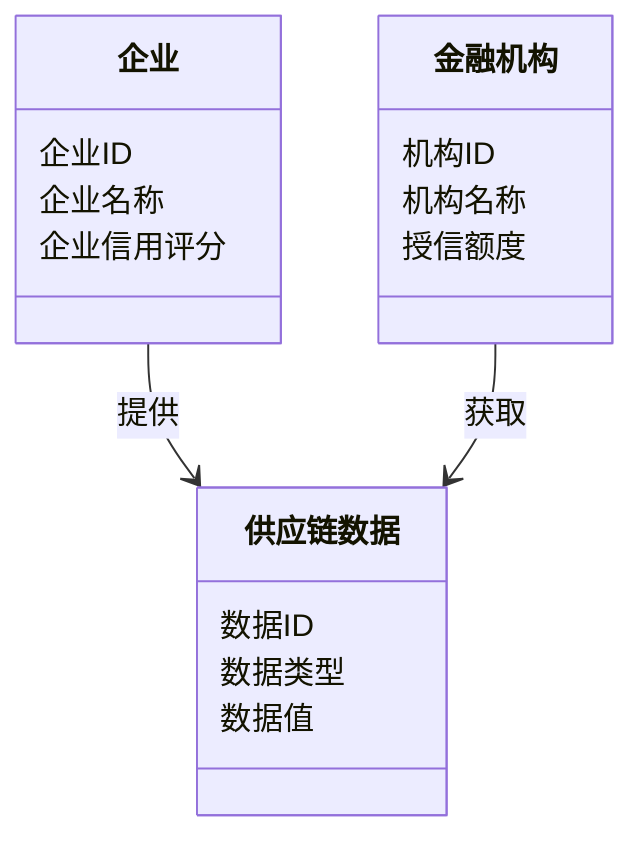
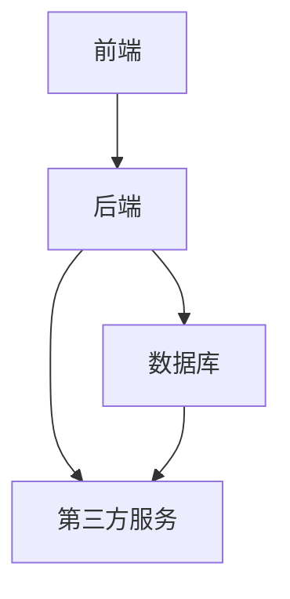
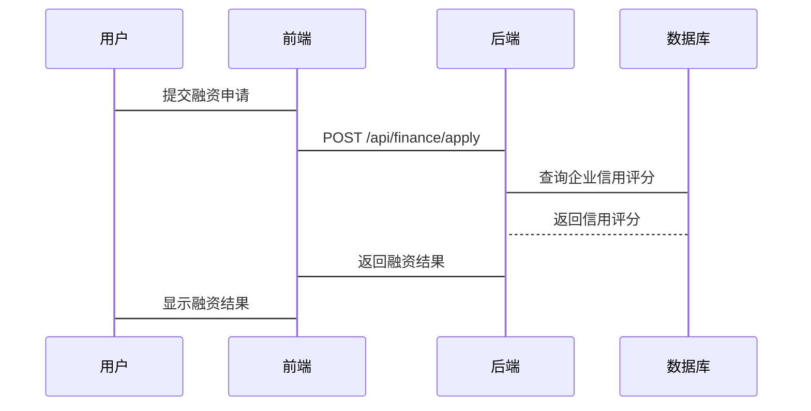

                 


# 智能供应链金融平台设计

> 关键词：智能供应链金融、平台设计、机器学习、系统架构、项目实战

> 摘要：智能供应链金融平台设计旨在通过智能化技术优化传统供应链金融的效率与安全性。本文详细探讨了智能供应链金融的核心概念、算法原理、系统架构，并通过项目实战展示了平台的实现过程。文章最后总结了最佳实践、注意事项和扩展阅读，为读者提供了全面的指导。

---

# 第1章: 智能供应链金融平台概述

## 1.1 供应链金融的定义与特点
### 1.1.1 供应链金融的定义
供应链金融是指通过整合供应链上下游资源，提供资金支持和风险管理服务，以优化供应链整体运作效率的金融模式。

### 1.1.2 供应链金融的核心特点
- **整体性**：关注整个供应链的价值链，而非单一企业。
- **流动性**：资金流动与供应链的实际运作紧密结合。
- **风险分担**：通过多方合作降低金融风险。

### 1.1.3 供应链金融的参与者与角色
- **核心企业**：供应链中的主导企业。
- **供应商**：提供原材料或服务的企业。
- **金融机构**：提供融资服务的银行或其他金融机构。
- **物流商**：负责货物运输的企业。

## 1.2 智能供应链金融的背景与意义
### 1.2.1 传统供应链金融的局限性
- 信息孤岛：上下游企业间信息不透明。
- 融资效率低：传统审批流程复杂，耗时长。
- 风险控制难：缺乏实时数据支持。

### 1.2.2 智能供应链金融的兴起
随着人工智能、大数据等技术的发展，智能供应链金融应运而生，利用技术手段提升效率和风险管理能力。

### 1.2.3 智能供应链金融的价值
- 提高融资效率。
- 降低企业成本。
- 提升整体供应链的透明度和安全性。

## 1.3 智能供应链金融平台的定义与构成
### 1.3.1 平台定义
智能供应链金融平台是一个基于人工智能和大数据技术的在线服务平台，为供应链上下游企业提供智能化的融资解决方案。

### 1.3.2 平台的核心构成
- **数据采集模块**：收集供应链上下游企业的数据。
- **信用评估模块**：基于机器学习模型评估企业信用。
- **融资匹配模块**：根据企业需求匹配合适的融资方案。
- **风险管理模块**：实时监控融资风险。

### 1.3.3 平台的业务流程
1. 企业注册并提交融资需求。
2. 平台采集并分析企业数据。
3. 信用评估模块生成信用评分。
4. 根据评分匹配合适的金融机构。
5. 金融机构审批并放款。

---

# 第2章: 智能供应链金融的核心概念与联系

## 2.1 供应链金融的核心原理
### 2.1.1 三流合一
供应链金融强调**物流**、**资金流**和**信息流**的三流合一，确保资金流向与实际业务一致。

### 2.1.2 供应链金融的核心流程
1. **需求分析**：了解企业的融资需求。
2. **信用评估**：评估企业的信用状况。
3. **融资方案设计**：根据需求和信用状况设计融资方案。
4. **执行与监控**：执行融资并实时监控风险。

## 2.2 智能供应链金融与传统供应链金融的区别
### 2.2.1 传统供应链金融的特点
- 依赖人工审核。
- 融资效率低。
- 风险控制有限。

### 2.2.2 智能供应链金融的创新点
- **自动化**：利用技术实现自动化审批和监控。
- **智能化**：基于大数据和人工智能优化融资方案。
- **实时性**：实时监控供应链数据，及时发现风险。

## 2.3 智能供应链金融平台的核心要素
### 2.3.1 数据流的智能化处理
- 数据采集：通过API接口采集供应链上下游数据。
- 数据分析：利用机器学习模型分析数据，生成信用评分。

### 2.3.2 业务流程的自动化优化
- 自动化审批：基于信用评分自动判断融资资格。
- 自动化监控：实时监控供应链状态，及时预警风险。

### 2.3.3 风险控制的智能化提升
- 风险评估：基于历史数据和实时数据评估风险。
- 风险预警：通过机器学习模型预测潜在风险。

## 2.4 本章小结
智能供应链金融通过技术手段实现了传统供应链金融的自动化和智能化，显著提高了融资效率和风险管理能力。

---

# 第3章: 智能供应链金融平台的算法原理

## 3.1 供应链金融中的信用评估模型
### 3.1.1 信用评估的基本原理
信用评估模型通过分析企业的财务数据、交易记录和市场表现，评估企业的信用状况。

### 3.1.2 基于机器学习的信用评估
- **特征选择**：从企业数据中提取关键特征。
- **模型训练**：利用机器学习算法训练信用评估模型。
- **模型验证**：通过历史数据验证模型的准确性。

### 3.1.3 常见的信用评估算法
- **逻辑回归**：适用于二分类问题，预测企业是否违约。
- **决策树**：通过树状结构进行分类，适合处理复杂的数据关系。
- **随机森林**：通过集成多个决策树提升模型的准确性。

## 3.2 基于机器学习的供应商评分系统
### 3.2.1 供应商评分的定义与目标
供应商评分系统通过量化供应商的表现，帮助金融机构评估其信用风险。

### 3.2.2 基于决策树的供应商评分模型
- **特征提取**：从供应商的历史交易数据中提取关键特征。
- **模型训练**：使用决策树算法训练供应商评分模型。
- **模型优化**：通过调整参数优化模型的准确率。

### 3.2.3 基于神经网络的供应商评分模型
- **神经网络结构**：设计适合的神经网络结构。
- **数据预处理**：对数据进行归一化处理。
- **模型训练**：利用训练数据训练神经网络模型。

## 3.3 算法实现与优化
### 3.3.1 算法实现流程
1. 数据采集与预处理。
2. 模型训练与优化。
3. 模型验证与部署。

### 3.3.2 算法优化策略
- **参数调优**：通过网格搜索找到最优参数。
- **特征工程**：优化特征选择，提升模型性能。
- **集成学习**：通过集成多种模型提升准确率。

### 3.3.3 算法效果评估
- **准确率**：模型预测的准确率。
- **召回率**：模型预测的召回率。
- **F1分数**：综合准确率和召回率的指标。

## 3.4 本章小结
基于机器学习的信用评估模型和供应商评分系统为智能供应链金融平台提供了强大的技术支持，显著提高了融资决策的科学性和准确性。

---

# 第4章: 智能供应链金融平台的系统分析与架构

## 4.1 问题场景介绍
智能供应链金融平台需要解决以下问题：
- 数据孤岛：供应链上下游企业数据分散。
- 融资效率低：传统融资流程耗时长。
- 风险控制难：缺乏实时数据支持。

## 4.2 系统功能设计
### 4.2.1 领域模型设计


### 4.2.2 系统架构设计


### 4.2.3 系统接口设计
- **用户登录接口**：`POST /api/login`
- **融资申请接口**：`POST /api/finance/apply`
- **信用评分查询接口**：`GET /api/credit-score`

### 4.2.4 系统交互设计


## 4.3 本章小结
智能供应链金融平台通过合理的系统架构设计，实现了数据的高效流通和融资流程的自动化，显著提升了平台的运行效率和安全性。

---

# 第5章: 项目实战

## 5.1 环境安装与配置
- **Python**：安装Python 3.8及以上版本。
- **Django**：安装Django框架。
- **TensorFlow**：安装TensorFlow用于机器学习模型训练。
- **其他工具**：安装Jupyter Notebook用于数据分析和模型开发。

## 5.2 核心代码实现
### 5.2.1 数据预处理代码
```python
import pandas as pd
import numpy as np

# 加载数据
data = pd.read_csv('supply_chain_data.csv')

# 数据清洗
data.dropna(inplace=True)
data = data[~data.duplicated()]
```

### 5.2.2 机器学习模型训练
```python
from sklearn.tree import DecisionTreeClassifier
from sklearn.model_selection import train_test_split

# 数据分割
X = data.drop('credit_score', axis=1)
y = data['credit_score']
X_train, X_test, y_train, y_test = train_test_split(X, y, test_size=0.2)

# 模型训练
model = DecisionTreeClassifier()
model.fit(X_train, y_train)

# 模型预测
y_pred = model.predict(X_test)
```

### 5.2.3 API接口实现
```python
from django.urls import path
from .views import *

urlpatterns = [
    path('api/login/', login, name='login'),
    path('api/finance/apply/', apply_finance, name='apply_finance'),
    path('api/credit-score/', get_credit_score, name='get_credit_score'),
]
```

## 5.3 代码解读与分析
- **数据预处理**：通过数据清洗和特征选择，确保数据质量。
- **模型训练**：基于决策树算法训练信用评分模型，实现自动化信用评估。
- **API接口**：通过Django框架实现API接口，支持平台的前后端交互。

## 5.4 实际案例分析
通过一个实际案例分析平台的运行过程，展示从数据采集到融资放款的完整流程。

## 5.5 本章小结
项目实战部分通过具体的代码实现和案例分析，展示了智能供应链金融平台的实际应用价值和技术实现路径。

---

# 第6章: 最佳实践与注意事项

## 6.1 最佳实践
- **数据安全**：确保供应链数据的安全性，防止数据泄露。
- **系统性能**：优化系统架构，提升平台的运行效率。
- **风险管理**：建立完善的风险监控机制，及时发现并处理潜在风险。

## 6.2 注意事项
- **数据隐私**：遵守相关法律法规，保护用户隐私。
- **技术选型**：选择合适的技术栈，确保系统的可扩展性和可维护性。
- **持续优化**：定期更新模型和优化系统，提升平台的性能和用户体验。

## 6.3 拓展阅读
推荐相关书籍和资源，供读者进一步学习和研究。

---

# 作者：AI天才研究院/AI Genius Institute & 禅与计算机程序设计艺术 /Zen And The Art of Computer Programming

