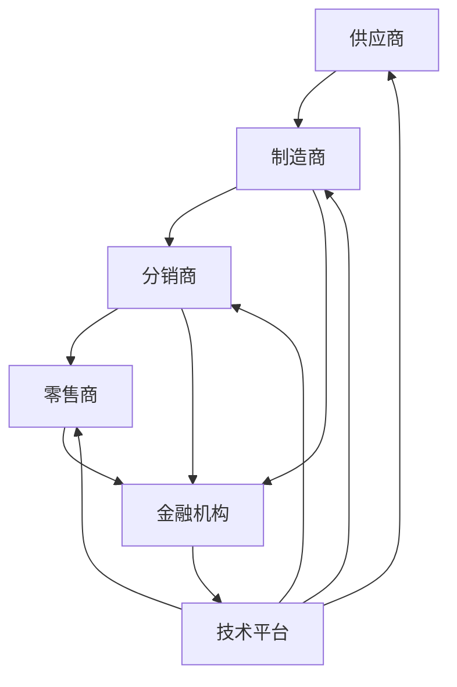
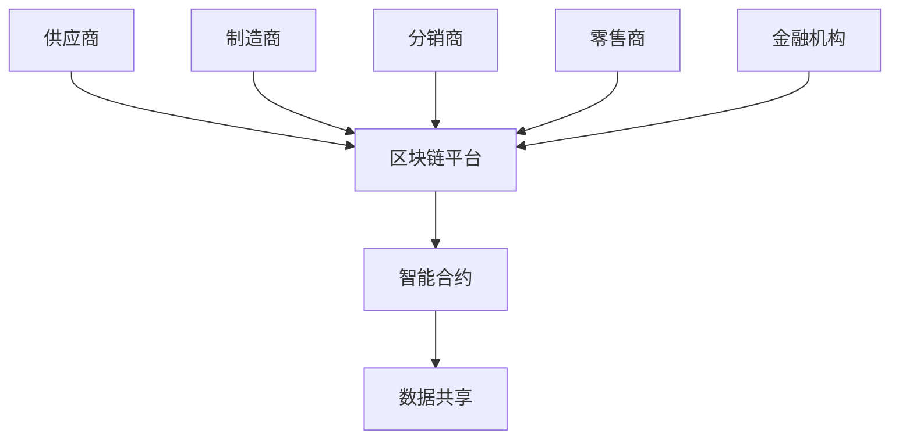
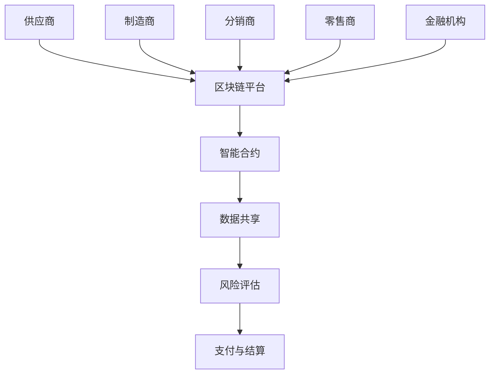
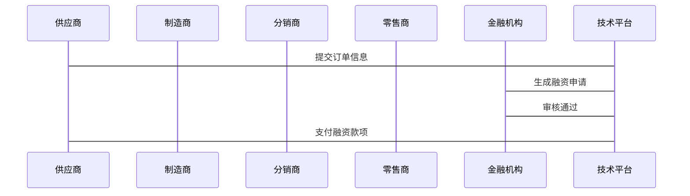

                 


# 智能供应链金融解决方案

> 关键词：智能供应链、供应链金融、区块链、大数据、人工智能、风险管理

> 摘要：本文将深入探讨智能供应链金融的核心概念、技术实现、系统设计以及实际应用。通过结合区块链、大数据和人工智能等先进技术，我们能够构建一个高效、透明、安全的供应链金融系统，解决传统供应链金融中的信息不对称、资金流动性不足以及风险控制难题。本文将从背景介绍、核心概念、技术实现、系统架构、项目实战到总结与展望，全面解析智能供应链金融的解决方案。

---

# 第一部分：智能供应链金融的核心概念与背景

## 第1章：供应链金融的基本概念与问题背景

### 1.1 供应链金融的定义与核心要素

供应链金融（Supply Chain Finance，SCF）是指通过整合供应链上的信息流、资金流和物流，为供应链上的企业提供融资支持的一种金融模式。其核心在于通过优化供应链中的资金流动，降低企业的融资成本，提高资金使用效率。

#### 1.1.1 核心概念
- **信息流**：供应链上的交易数据、合同信息、物流信息等。
- **资金流**：企业间的支付、融资活动等。
- **物流**：商品的流动与交付。
- **参与方**：供应商、制造商、分销商、零售商、金融机构等。

### 1.2 供应链金融的主要问题与挑战

#### 1.2.1 信息不对称
供应链上的企业之间由于缺乏透明的信息共享机制，导致金融机构难以准确评估企业的信用风险。

#### 1.2.2 资金流动性不足
中小企业在传统供应链金融模式下往往难以获得足够的融资支持，导致资金链紧张。

#### 1.2.3 风险控制难题
缺乏统一的信用评估体系和风险监控机制，导致金融机构在提供融资服务时面临较高的风险。

### 1.3 智能供应链金融的背景与意义

#### 1.3.1 数字化与智能化趋势
随着信息技术的快速发展，供应链金融逐渐从传统的线下模式向数字化、智能化方向转型。

#### 1.3.2 技术驱动创新
区块链、大数据和人工智能等技术的应用为供应链金融的智能化提供了技术支持。

#### 1.3.3 智能供应链金融的核心价值
通过技术手段实现信息共享、信用评估和风险控制的自动化，降低融资成本，提高融资效率。

---

## 第2章：智能供应链金融的核心概念与联系

### 2.1 核心概念原理

#### 2.1.1 供应链参与方的实体关系
- **供应商**：提供原材料或零部件的企业。
- **制造商**：负责生产产品的核心企业。
- **分销商**：负责产品分销的企业。
- **零售商**：面向最终消费者的销售终端。
- **金融机构**：提供融资服务的银行或其他金融机构。

#### 2.1.2 金融产品与服务的核心属性
- **融资服务**：包括贷款、保理、质押等融资方式。
- **风险管理**：通过信用评估和风险监控降低金融风险。
- **支付与结算**：实现供应链上的资金流转。

#### 2.1.3 智能技术在供应链金融中的应用
- **区块链**：用于实现供应链上的信息共享与数据不可篡改。
- **大数据**：用于信用评估和风险分析。
- **人工智能**：用于智能合约和自动化决策。

### 2.2 核心概念对比表

| 概念属性 | 供应链参与方 | 金融产品与服务 | 技术支撑 |
|----------|--------------|----------------|----------|
| 核心角色 | 供应商、制造商、分销商、零售商 | 贷款、保理、质押 | 区块链、大数据、人工智能 |
| 关键特征 | 信息共享、协同合作 | 资金流动、风险控制 | 数据分析、智能决策 |
| 实体关系 | 供应商-制造商-分销商-零售商 | 企业-金融机构 | 金融机构-技术平台 |

### 2.3 实体关系图



---

## 第3章：智能供应链金融的技术实现原理

### 3.1 核心技术概述

#### 3.1.1 区块链技术
区块链通过去中心化、不可篡改的特性，实现供应链上的信息共享与信任机制。

#### 3.1.2 大数据技术
通过收集和分析供应链上的海量数据，构建企业的信用评估模型，实现精准的风险控制。

#### 3.1.3 人工智能技术
利用机器学习算法，实现智能合约的自动执行和风险预警。

### 3.2 区块链技术实现流程



---

## 第4章：智能供应链金融的系统设计

### 4.1 系统功能设计

#### 4.1.1 信息共享模块
通过区块链技术实现供应链上企业之间的信息共享，包括订单、物流、支付等信息。

#### 4.1.2 风险评估模块
利用大数据和人工智能技术，对企业的信用状况进行实时评估，降低金融风险。

#### 4.1.3 智能合约模块
通过智能合约实现融资、支付等金融业务的自动化执行。

### 4.2 系统架构设计



### 4.3 接口设计与交互流程



---

## 第5章：智能供应链金融的项目实战

### 5.1 项目背景与目标

#### 5.1.1 项目背景
通过搭建一个智能供应链金融平台，解决传统供应链金融中的信息不对称和融资难问题。

#### 5.1.2 项目目标
实现供应链上的信息共享、信用评估和智能合约的自动化执行。

### 5.2 项目环境与工具

#### 5.2.1 环境搭建
- **区块链平台**：以太坊（Ethereum）或Hyperledger Fabric。
- **大数据工具**：Hadoop、Spark。
- **人工智能框架**：TensorFlow、PyTorch。
- **开发语言**：Python、Solidity（智能合约）。

### 5.3 核心功能实现

#### 5.3.1 区块链节点搭建
```bash
# 安装以太坊
sudo apt-get update
sudo apt-get install ethereum
```

#### 5.3.2 智能合约开发
```solidity
// Solidity代码示例
contract SupplyChain {
    address payable public supplier;
    address payable public manufacturer;

    function transferFunds(uint amount) public {
        require(msg.sender == supplier || msg.sender == manufacturer);
        // 转账逻辑
    }
}
```

#### 5.3.3 信用评估模型
```python
# 信用评估模型代码示例
import pandas as pd
from sklearn.ensemble import RandomForestClassifier

data = pd.read_csv('supply_chain.csv')
X = data.drop('credit_risk', axis=1)
y = data['credit_risk']

model = RandomForestClassifier()
model.fit(X, y)
```

### 5.4 项目总结与优化

#### 5.4.1 项目总结
通过搭建智能供应链金融平台，实现了供应链上的信息共享与自动化融资，显著提高了融资效率。

#### 5.4.2 优化方向
- 提高系统的可扩展性。
- 引入更多的智能合约功能。
- 加强数据安全和隐私保护。

---

## 第6章：智能供应链金融的总结与展望

### 6.1 最佳实践 tips

- **数据安全**：确保供应链上的数据加密存储和传输。
- **技术选型**：根据具体需求选择合适的技术方案。
- **风险管理**：建立完善的风险监控机制，降低金融风险。

### 6.2 小结

智能供应链金融通过区块链、大数据和人工智能等技术的结合，实现了供应链金融的智能化和高效化，解决了传统供应链金融中的诸多难题。

### 6.3 注意事项

- 在实际应用中，需注意数据隐私和合规性问题。
- 系统上线前，需进行充分的测试和优化。

### 6.4 拓展阅读

- 《Blockchain in Supply Chain Management》
- 《Artificial Intelligence in Financial Services》

---

# 作者：AI天才研究院（AI Genius Institute） & 禅与计算机程序设计艺术（Zen And The Art of Computer Programming）

---

### 本文总结
智能供应链金融解决方案通过技术创新，实现了供应链金融的智能化和高效化。本文从核心概念、技术实现、系统设计到项目实战，全面解析了智能供应链金融的解决方案，并对未来的发展方向进行了展望。

