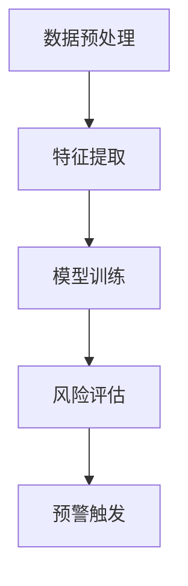
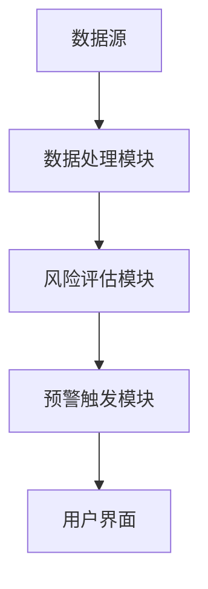

                 


# 智能供应链金融风险预警

> 关键词：供应链金融、风险预警、人工智能、大数据、风险管理

> 摘要：本文深入探讨智能供应链金融中的风险预警问题，结合大数据和人工智能技术，分析风险预警的核心概念、算法原理、系统架构设计及项目实战。通过详细讲解，帮助读者理解如何利用智能技术优化供应链金融中的风险管理，提升企业竞争力。

---

## 第一部分：智能供应链金融风险预警概述

### 第1章：供应链金融的基本概念与背景

#### 1.1 供应链金融的定义与特点
供应链金融是一种通过整合供应链上下游资源，优化资金流动效率的金融模式。其特点包括：
- **数据驱动**：依赖于供应链中的实时数据。
- **多方参与**：涉及供应商、制造商、分销商和消费者。
- **风险管理**：通过技术手段降低金融风险。

#### 1.2 供应链金融的传统模式与挑战
传统供应链金融面临的主要挑战包括：
- **信息不对称**：上下游企业之间的信息难以共享。
- **风险难以预测**：传统方法难以准确预测潜在风险。
- **效率低下**：人工审核和数据处理耗时长。

#### 1.3 智能供应链金融的优势与发展
智能供应链金融利用大数据和人工智能技术，显著提升了风险预警能力。其优势包括：
- **实时监控**：通过实时数据分析，快速识别潜在风险。
- **精准预测**：利用机器学习模型预测供应链中的风险点。
- **自动化处理**：自动化审核和预警触发，提高效率。

---

## 第二部分：智能供应链金融风险预警的核心概念与联系

### 第2章：风险预警的基本原理

#### 2.1 风险预警的定义与目标
风险预警是指通过数据分析和技术手段，提前识别和预测供应链中的潜在风险，并采取相应措施以降低风险影响。其目标是：
- 提高风险识别的准确性。
- 实现风险的早期预警。
- 最小化风险对供应链的影响。

#### 2.2 风险预警的关键要素
- **数据来源**：包括供应链中的交易数据、物流数据和市场数据。
- **分析模型**：基于机器学习的分类和回归模型。
- **预警机制**：根据风险评估结果触发预警。

### 第3章：核心概念对比与ER图分析

#### 3.1 核心概念对比表
| 对比维度 | 传统供应链金融 | 智能供应链金融 |
|----------|----------------|----------------|
| 数据来源 | 有限的静态数据 | 多源实时数据 |
| 风险评估 | 人工审核为主 | 数据驱动自动评估 |
| 预警机制 | 被动响应 | 主动实时预警 |

#### 3.2 ER图分析
```mermaid
erd
  left direction
  企业(Entity)
    name 企业名称
    code 企业代码
    industry 行业
  供应商(Supplier)
    name 供应商名称
    code 供应商代码
  客户(Customer)
    name 客户名称
    code 客户代码
  风险因素(RiskFactors)
    name 风险类型
    value 风险值
  订单(Order)
    orderID 订单编号
    productID 产品编号
    quantity 数量
    orderDate 订单日期
  供应链关系(SupplyChainRelationship)
    enterpriseID 企业ID
    supplierID 供应商ID
    customerID 客户ID
    relationshipType 关系类型
```

---

## 第三部分：智能供应链金融风险预警的算法原理

### 第4章：基于机器学习的风险评估模型

#### 4.1 算法流程


#### 4.2 算法实现
```python
import pandas as pd
from sklearn.model_selection import train_test_split
from sklearn.ensemble import RandomForestClassifier

# 数据加载与预处理
data = pd.read_csv('supply_chain_data.csv')
data = data.dropna()
X = data.drop(columns=['risk'])
y = data['risk']

# 数据分割
X_train, X_test, y_train, y_test = train_test_split(X, y, test_size=0.2)

# 模型训练
model = RandomForestClassifier()
model.fit(X_train, y_train)

# 模型评估
score = model.score(X_test, y_test)
print(f'模型准确率：{score}')
```

#### 4.3 数学模型
随机森林模型的数学公式：
$$
y = \sum_{i=1}^{n} \text{Tree}(x_i)
$$
其中，$x_i$ 表示每个决策树的预测结果，$n$ 表示决策树的数量。

---

## 第四部分：智能供应链金融风险预警的系统架构设计

### 第5章：系统功能设计

#### 5.1 领域模型设计
```mermaid
classDiagram
    class 企业(Entity) {
        name: string
        code: int
        industry: string
    }
    class 供应商(Supplier) {
        name: string
        code: int
    }
    class 客户(Customer) {
        name: string
        code: int
    }
    class 风险因素(RiskFactors) {
        name: string
        value: float
    }
    class 订单(Order) {
        orderID: int
        productID: int
        quantity: int
        orderDate: date
    }
    class 供应链关系(SupplyChainRelationship) {
        enterpriseID: int
        supplierID: int
        customerID: int
        relationshipType: string
    }
```

#### 5.2 系统架构设计


---

## 第五部分：智能供应链金融风险预警的项目实战

### 第6章：环境安装与核心代码实现

#### 6.1 环境安装
```bash
pip install pandas scikit-learn mermaid
```

#### 6.2 核心代码实现
```python
import pandas as pd
from sklearn.ensemble import RandomForestClassifier

# 数据加载与预处理
data = pd.read_csv('supply_chain_data.csv')
data = data.dropna()
X = data.drop(columns=['risk'])
y = data['risk']

# 数据分割
X_train, X_test, y_train, y_test = train_test_split(X, y, test_size=0.2)

# 模型训练
model = RandomForestClassifier()
model.fit(X_train, y_train)

# 模型评估
score = model.score(X_test, y_test)
print(f'模型准确率：{score}')
```

### 第7章：案例分析与小结

#### 7.1 案例分析
通过实际案例分析，展示模型在不同情况下的表现，如供应商延迟交货、客户支付风险等。

#### 7.2 小结
智能供应链金融风险预警通过大数据和人工智能技术，显著提升了风险识别和预警能力，为企业优化供应链管理提供了有力支持。

---

## 结语

智能供应链金融风险预警是大数据和人工智能技术在金融领域的典型应用。通过本文的详细讲解，读者可以深入了解其核心概念、算法原理和系统设计，并通过项目实战掌握其实现方法。未来，随着技术的不断发展，智能供应链金融将更加精准和高效。

---

作者：AI天才研究院/AI Genius Institute & 禅与计算机程序设计艺术/Zen And The Art of Computer Programming

