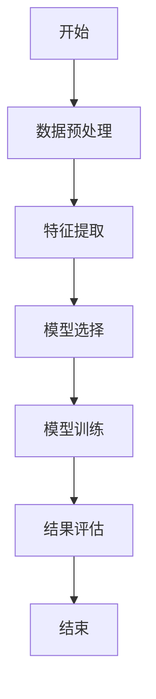
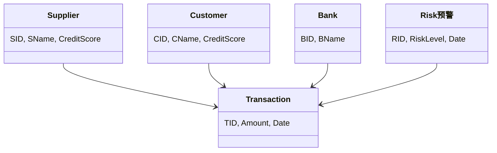
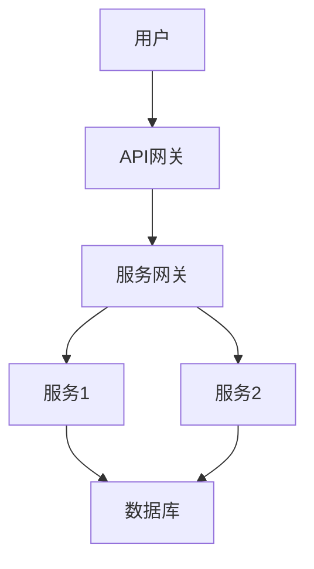

                 


# 智能供应链金融风险预警与额度管理系统

## 关键词：供应链金融，风险预警，额度管理，人工智能，大数据

## 摘要：本文详细探讨了智能供应链金融的风险预警与额度管理系统的构建与实现。通过分析供应链金融的核心问题，结合大数据和人工智能技术，提出了一套高效的解决方案，包括风险预警模型、额度管理系统、系统架构设计以及实际案例分析。

---

## 第一部分: 智能供应链金融风险预警与额度管理系统的背景与核心概念

### 第1章: 供应链金融的现状与挑战

#### 1.1 供应链金融的定义与特点

供应链金融是指通过整合供应链上下游企业，提供融资、结算、理财等金融服务，以优化资金流，提升供应链整体效率。其特点包括：依赖性强、涉及多方利益、资金流动复杂。

#### 1.2 供应链金融中的主要问题

1. 信息不对称：企业间数据不透明，导致融资难。
2. 资金流动性不足：企业间资金无法快速流转。
3. 风险控制困难：传统方法难以预测和应对复杂风险。

#### 1.3 智能技术在供应链金融中的应用

1. 大数据：分析企业行为和市场趋势。
2. 人工智能：用于风险预测和自动化决策。
3. 区块链：确保数据安全和透明。

#### 1.4 智能供应链金融的核心目标

1. 提升资金流动性。
2. 降低金融风险。
3. 提高供应链效率。

### 第2章: 智能供应链金融的核心概念与联系

#### 2.1 智能供应链金融的定义

智能供应链金融是利用智能技术优化传统供应链金融服务，实现风险预警与额度管理。

#### 2.2 核心概念与联系

- 供应链参与方：企业、供应商、客户。
- 金融产品：融资、结算、理财。
- 技术应用：大数据、AI、区块链。

#### 2.3 核心要素对比表

| 核心要素 | 传统供应链金融 | 智能供应链金融 |
|----------|-----------------|-----------------|
| 数据来源 | 单一来源        | 多源数据        |
| 分析方式 | 经验判断        | 数据驱动        |
| 决策速度 | 慢             | 快              |

#### 2.4 ER实体关系图

```mermaid
erDiagram
  supplier(SID, SName, CreditScore)
  customer(CID, CName, CreditScore)
  transaction(TID, Amount, Date)
  bank(BID, BName)
  risk预警(RID, RiskLevel, Date)
  supplier --> transaction: 参与交易
  customer --> transaction: 参与交易
  bank --> transaction: 提供融资
  risk预警 --> transaction: 基于交易数据
```

---

## 第二部分: 智能供应链金融风险预警与额度管理系统的算法原理

### 第3章: 智能供应链金融的风险预警模型

#### 3.1 基于机器学习的风险预警模型

- 数据预处理：清洗、特征提取。
- 模型选择：逻辑回归、随机森林。
- 模型训练与评估：准确率、召回率。

#### 3.2 风险传播模型

- 使用图论分析企业间的风险传播。

#### 3.3 算法流程图



#### 3.4 代码示例

```python
import pandas as pd
from sklearn.model_selection import train_test_split
from sklearn.linear_model import LogisticRegression

# 数据加载与预处理
data = pd.read_csv('transaction_data.csv')
X = data[['amount', 'time_lag', ' supplier_score']]
y = data['is_risk']

# 划分训练集和测试集
X_train, X_test, y_train, y_test = train_test_split(X, y, test_size=0.2)

# 模型训练
model = LogisticRegression()
model.fit(X_train, y_train)

# 模型评估
print(model.score(X_test, y_test))
```

#### 3.5 数学公式

风险概率计算公式：
$$ P = \frac{1}{1 + e^{- (w_1x_1 + w_2x_2 + ... + w_nx_n)}} $$

---

### 第4章: 智能供应链金融的额度管理系统

#### 4.1 基于信用评分的额度计算

- 信用评分模型：使用逻辑回归等方法。

#### 4.2 动态调整的额度管理

- 根据实时数据调整额度。

#### 4.3 多目标优化的额度分配

- 使用线性规划模型。

#### 4.4 额度计算公式

$$ \text{额度} = \frac{\sum (\text{历史交易额} \times \text{信用评分})}{\text{平均信用评分}} $$

---

## 第三部分: 系统分析与架构设计方案

### 第5章: 问题场景介绍

供应链金融中的资金流动不畅和风险控制问题。

### 第6章: 系统架构设计

#### 6.1 领域模型设计



#### 6.2 系统架构设计



---

## 第四部分: 项目实战与案例分析

### 第7章: 项目实战

#### 7.1 环境安装

安装Python、Pandas、Scikit-learn等库。

#### 7.2 核心功能实现

1. 数据采集与处理。
2. 风险预警模型实现。
3. 额度管理系统实现。

#### 7.3 案例分析

分析一家企业的交易数据，展示系统如何预警风险并调整额度。

---

## 第五部分: 总结与展望

### 第8章: 总结

智能供应链金融通过技术创新解决了传统问题，提高了效率和安全性。

### 第9章: 展望

未来将结合更多智能技术，推动供应链金融进一步发展。

---

## 最佳实践 tips

- 数据质量至关重要。
- 模型需要持续优化。
- 系统设计要注重扩展性。

---

## 作者：AI天才研究院 & Zen And The Art of Computer Programming

---

通过以上结构，文章详细探讨了智能供应链金融的风险预警与额度管理系统的构建与实现，结合理论与实践，提供了完整的解决方案。

