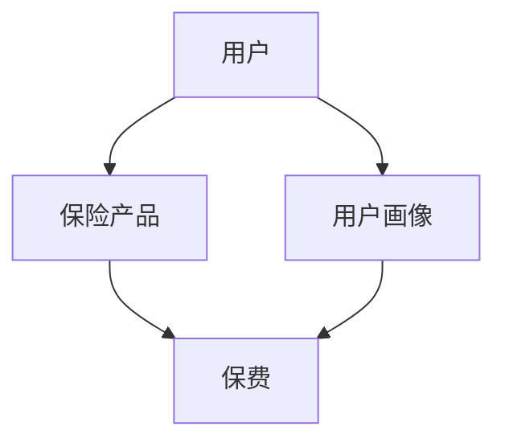
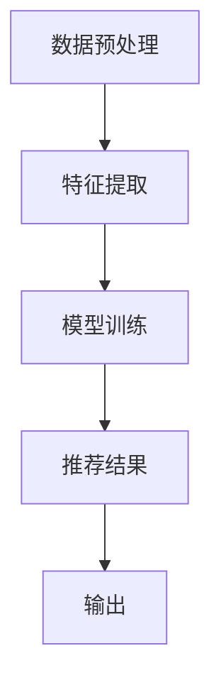
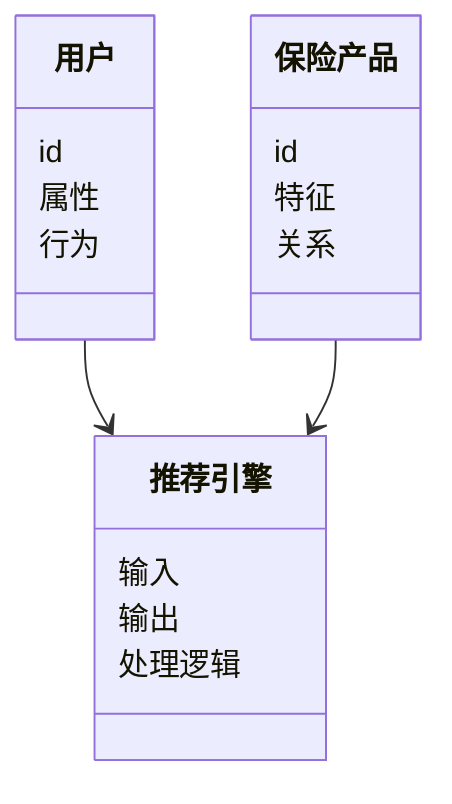
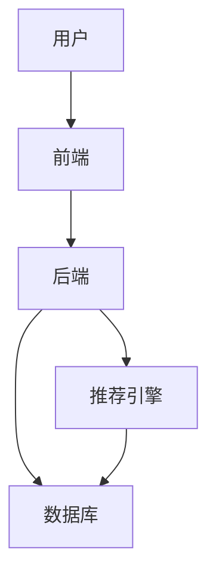
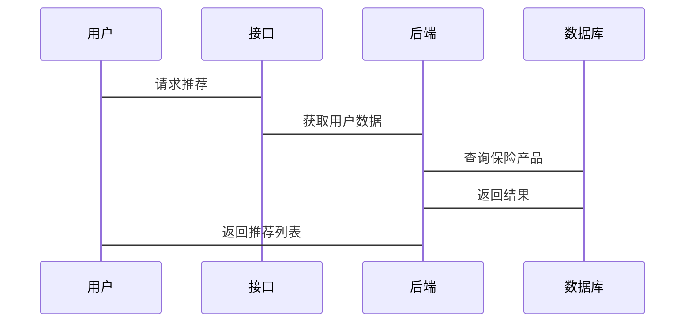

                 


# 目录大纲：《智能保险产品个性化定价与推荐引擎》

---

## 第1章：保险行业的数字化转型与智能定价的必要性

### 1.1 保险行业的现状与挑战
- 保险行业的传统定价模式及其局限性
- 数字化转型对保险行业的影响
- 智能定价与推荐在保险行业中的重要性

### 1.2 智能保险定价与推荐的背景
- 数据驱动决策的兴起
- 人工智能在保险行业的应用趋势
- 个性化定价与推荐引擎的定义

### 1.3 问题背景与目标
- 传统定价模型的不足
- 数据驱动的个性化定价需求
- 保险推荐引擎的目标与边界

---

## 第2章：智能保险定价与推荐的核心概念

### 2.1 核心概念解析
- 保险定价模型的基本原理
- 推荐算法的类型与特点
- 用户画像与行为分析

### 2.2 核心概念对比表
| 概念         | 描述                                                                 |
|--------------|----------------------------------------------------------------------|
| 保险定价模型 | 基于历史数据预测保费的数学模型                                         |
| 推荐算法     | 根据用户行为和偏好推荐保险产品的算法                                    |

### 2.3 实体关系图


---

## 第3章：智能保险定价与推荐的算法原理

### 3.1 协同过滤算法
- 基于用户的协同过滤
- 基于物品的协同过滤
- 混合协同过滤

### 3.2 基于内容的推荐算法
- 基于保险产品特征的推荐
- 基于用户偏好分析的推荐

### 3.3 深度学习模型
- 神经网络在保险定价中的应用
- 卷积神经网络（CNN）与循环神经网络（RNN）在推荐中的应用

### 3.4 算法流程图


### 3.5 算法实现示例
```python
import numpy as np

def collaborative_filtering(user_data, product_data):
    # 计算用户相似度
    user_similarity = np.dot(user_data, user_data.T)
    # 生成推荐结果
    recommendations = user_similarity.argsort()[:,::-1]
    return recommendations
```

---

## 第4章：数学模型与公式

### 4.1 矩阵分解模型
- 矩阵分解的数学公式
$$ R = U \cdot V^T $$

### 4.2 余弦相似度
$$ \cos(\theta) = \frac{\sum u_i v_i}{\sqrt{\sum u_i^2} \cdot \sqrt{\sum v_i^2}} $$

### 4.3 深度学习模型的损失函数
$$ \text{Loss} = \sum (y - \hat{y})^2 $$

---

## 第5章：系统分析与架构设计

### 5.1 问题场景介绍
- 用户需求分析
- 系统目标与范围

### 5.2 系统功能设计
- 用户画像模块
- 保险产品模块
- 推荐引擎模块

### 5.3 领域模型类图


### 5.4 系统架构图


### 5.5 接口与交互流程图


---

## 第6章：项目实战

### 6.1 环境安装与配置
- 安装Python和相关库
- 安装Jupyter Notebook

### 6.2 核心代码实现
```python
import pandas as pd
from sklearn.metrics.pairwise import cosine_similarity

def main():
    # 加载数据
    data = pd.read_csv('insurance.csv')
    # 特征提取
    features = data[['age', 'gender', 'premium']]
    # 计算相似度
    similarity_matrix = cosine_similarity(features)
    # 生成推荐
    recommendations = np.argsort(similarity_matrix, axis=1)
    # 输出结果
    print(recommendations)

if __name__ == "__main__":
    main()
```

### 6.3 实际案例分析
- 数据分析与清洗
- 模型训练与调优
- 结果解读与优化

### 6.4 项目总结
- 项目实现的关键点
- 经验与教训
- 进一步优化的方向

---

## 第7章：最佳实践与未来展望

### 7.1 小结
- 核心概念回顾
- 算法实现总结
- 系统设计要点

### 7.2 注意事项
- 数据隐私与安全
- 模型可解释性
- 系统性能优化

### 7.3 未来趋势
- AI在保险行业的深度应用
- 新兴技术对推荐引擎的影响
- 个性化服务的进一步发展

### 7.4 拓展阅读
- 推荐的书籍与资源
- 相关技术博客与论文
- 在线课程与培训

---

## 作者：AI天才研究院 & 禅与计算机程序设计艺术

---

**摘要**：本文系统地探讨了智能保险产品个性化定价与推荐引擎的核心概念、算法原理、系统设计与实现。通过深入分析保险行业的数字化转型需求，结合协同过滤、深度学习等算法，构建了智能化的推荐系统，并通过实际案例展示了系统的实现与优化过程，为保险行业的智能化发展提供了理论与实践指导。

