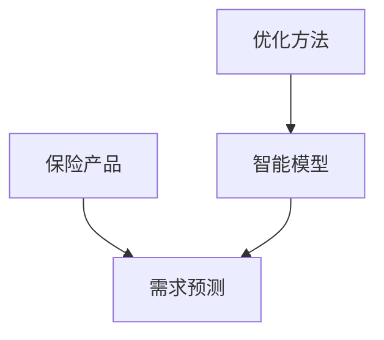
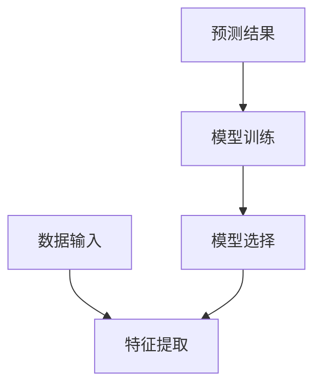
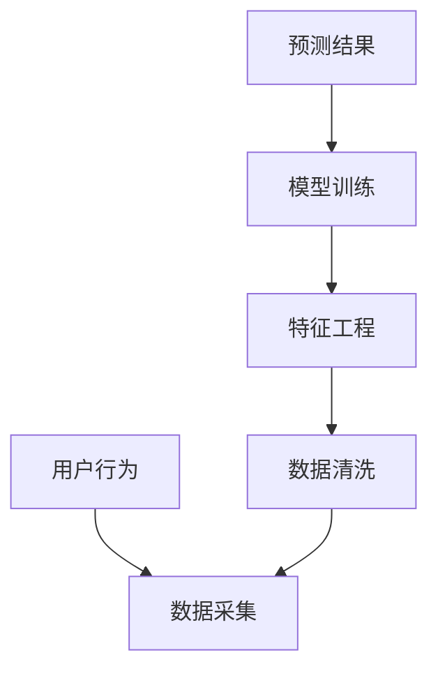
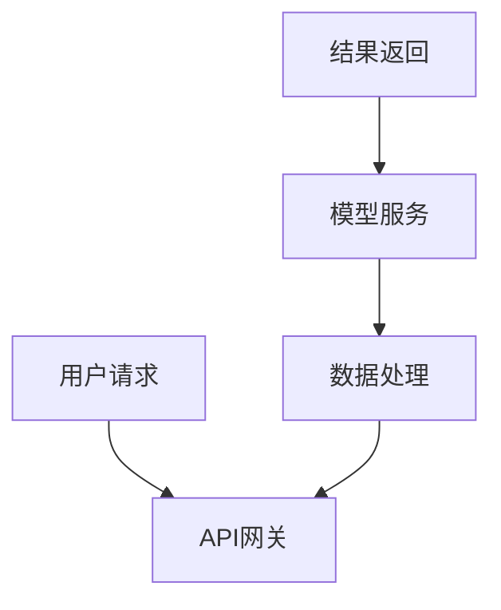
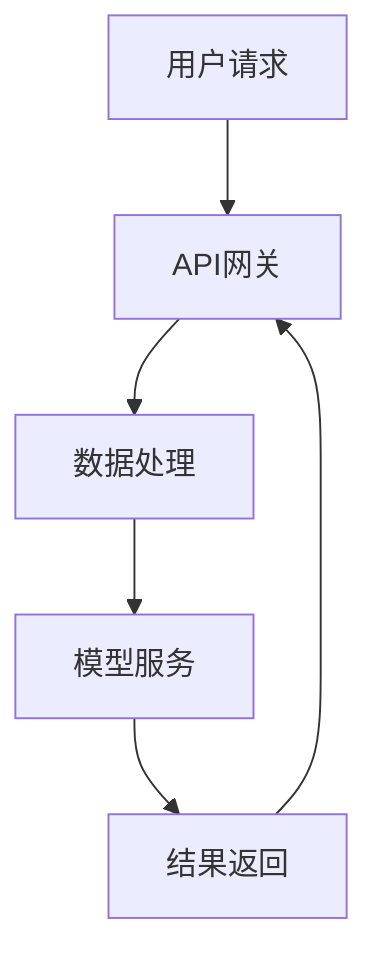

                 


# 智能保险产品需求预测模型优化

## 关键词：智能保险，需求预测，机器学习，优化模型，数据挖掘，预测模型

## 摘要：本文深入探讨了智能保险产品需求预测模型的优化方法，结合机器学习和数据挖掘技术，详细分析了模型优化的关键步骤和实现细节，通过实际案例展示了模型优化的效果和应用价值，为保险行业的需求预测提供了新的思路和解决方案。

---

# 第一部分: 智能保险产品需求预测模型优化的背景与核心概念

## 第1章: 智能保险产品需求预测模型概述

### 1.1 保险行业的现状与挑战
#### 1.1.1 保险行业的数字化转型
随着科技的飞速发展，保险行业正经历着数字化转型的浪潮。传统保险业务逐渐被智能化、数据驱动的解决方案所取代，保险产品的设计、销售和客户服务模式正在发生深刻的变化。

#### 1.1.2 保险产品需求预测的重要性
准确预测保险产品的需求对于保险公司来说至关重要。通过预测需求，保险公司可以更好地规划产品策略、优化资源分配、提高客户满意度，并在激烈的市场竞争中占据优势。

#### 1.1.3 传统保险产品需求预测的局限性
传统的需求预测方法通常依赖于经验判断和简单的统计分析，存在以下问题：
- 数据维度有限，难以捕捉复杂的市场变化。
- 预测结果不够精确，难以应对多样化的客户需求。
- 缺乏实时性和动态调整能力，难以适应快速变化的市场环境。

### 1.2 智能保险产品需求预测的定义与特点
#### 1.2.1 智能保险的定义
智能保险是指利用人工智能、大数据和机器学习等技术，通过自动化、智能化的方式进行保险产品的设计、销售和客户服务，以实现更高效、更个性化的保险体验。

#### 1.2.2 智能保险产品需求预测的核心特点
智能保险产品需求预测具有以下特点：
- **数据驱动**：基于海量数据进行分析和建模，确保预测的准确性。
- **实时性**：能够实时捕捉市场变化和客户需求，快速调整预测结果。
- **个性化**：根据客户的具体需求和行为，提供个性化的预测结果。
- **动态优化**：模型能够根据新的数据和反馈不断优化预测效果。

#### 1.2.3 与传统预测方法的区别
| 特性         | 传统预测方法 | 智能预测方法 |
|--------------|---------------|--------------|
| 数据来源     | 有限的结构化数据 | 多源、多维数据（文本、图像、行为数据等） |
| 预测精度     | 较低 | 较高 |
| 计算效率     | 低 | 高 |
| 适应性       | 较差 | 强 |

### 1.3 智能保险产品需求预测的边界与外延
#### 1.3.1 预测的边界
智能保险产品需求预测的边界包括：
- 数据范围：仅限于保险产品的销售数据。
- 时间范围：短期内的需求预测。
- 场景范围：仅适用于特定类型的保险产品。

#### 1.3.2 预测的外延
智能保险产品需求预测的外延包括：
- 长期趋势预测：预测未来几年的需求变化。
- 综合需求预测：结合多种因素（如经济指标、政策变化）进行预测。
- 客户画像预测：根据客户需求预测客户特征。

#### 1.3.3 核心要素组成
智能保险产品需求预测的核心要素包括：
- 数据：多源、多维的高质量数据。
- 模型：高性能的机器学习模型。
- 计算能力：强大的计算资源支持。
- 反馈机制：实时调整模型的机制。

### 1.4 核心概念之间的关系
#### 1.4.1 概念属性特征对比表格
| 概念       | 属性         | 特征         |
|------------|--------------|--------------|
| 智能保险    | 数据驱动     | 高精度       |
| 需求预测    | 实时性       | 个性化       |
| 智能模型    | 自适应性     | 可解释性       |

#### 1.4.2 ER实体关系图架构


### 1.5 本章小结
本章主要介绍了智能保险产品需求预测的背景、定义、特点以及与传统预测方法的区别。通过对比分析，明确了智能预测的核心优势和应用场景，为后续的模型优化奠定了基础。

---

# 第二部分: 智能保险产品需求预测模型的算法原理

## 第2章: 常见算法原理与流程

### 2.1 线性回归算法
#### 2.1.1 线性回归的原理
线性回归是一种简单的机器学习算法，通过拟合一条直线来预测目标变量。其基本假设是目标变量与特征变量之间存在线性关系。

#### 2.1.2 线性回归的数学模型
$$y = \beta_0 + \beta_1x + \epsilon$$

其中，$y$ 是目标变量，$x$ 是特征变量，$\beta_0$ 是截距，$\beta_1$ 是回归系数，$\epsilon$ 是误差项。

#### 2.1.3 线性回归的实现流程


### 2.2 随机森林算法
#### 2.2.1 随机森林的原理
随机森林是一种基于决策树的集成学习算法，通过构建多棵决策树并进行投票或平均来提高模型的准确性和稳定性。

#### 2.2.2 随机森林的数学模型
$$y = \sum_{i=1}^{n} \text{Tree}_i(x)$$

其中，$\text{Tree}_i$ 是第 $i$ 棵决策树，$x$ 是输入特征。

### 2.3 神经网络算法
#### 2.3.1 神经网络的原理
神经网络是一种模拟人脑神经网络的计算模型，通过多层神经元之间的连接和激活函数来实现复杂的模式识别和非线性关系建模。

#### 2.3.2 神经网络的数学模型
$$a^{(l+1)} = \sigma(w^{(l)} a^{(l)} + b^{(l)})$$

其中，$a^{(l)}$ 是第 $l$ 层的激活值，$w^{(l)}$ 是权重矩阵，$b^{(l)}$ 是偏置项，$\sigma$ 是激活函数。

### 2.4 算法流程图


### 2.5 算法实现代码示例
```python
import numpy as np
from sklearn.linear_model import LinearRegression
from sklearn.ensemble import RandomForestRegressor
from sklearn.neural_networks import MLPRegressor

# 示例数据
X = np.array([[1, 2], [3, 4], [5, 6]])
y = np.array([3, 5, 7])

# 线性回归模型
lr_model = LinearRegression()
lr_model.fit(X, y)
print("线性回归系数:", lr_model.coef_)

# 随机森林模型
rf_model = RandomForestRegressor(n_estimators=100)
rf_model.fit(X, y)
print("随机森林重要性:", rf_model.feature_importances_)

# 神经网络模型
nn_model = MLPRegressor(hidden_layer_sizes=(2,))
nn_model.fit(X, y)
print("神经网络预测结果:", nn_model.predict(X))
```

### 2.6 本章小结
本章详细介绍了几种常用的算法原理和实现流程，包括线性回归、随机森林和神经网络。通过对比分析，明确了不同算法的优缺点和适用场景，为后续的模型优化提供了理论基础。

---

# 第三部分: 智能保险产品需求预测模型的系统分析与架构设计

## 第3章: 智能保险产品需求预测系统架构设计

### 3.1 问题场景介绍
智能保险产品需求预测系统需要解决以下问题：
- 如何高效地收集和处理多源数据。
- 如何选择合适的算法并优化模型。
- 如何实时更新模型以适应市场变化。

### 3.2 系统功能设计
#### 3.2.1 领域模型


#### 3.2.2 系统架构设计


### 3.3 系统接口设计
- 数据接口：负责与数据源对接，获取保险产品的需求数据。
- 模型接口：负责模型的训练、更新和预测。
- API接口：负责接收外部请求并返回预测结果。

### 3.4 系统交互流程


### 3.5 本章小结
本章通过系统架构设计，明确了智能保险产品需求预测系统的功能模块和交互流程，为后续的模型优化提供了系统化的解决方案。

---

# 第四部分: 智能保险产品需求预测模型的项目实战

## 第4章: 智能保险产品需求预测项目实战

### 4.1 项目背景介绍
某保险公司希望利用智能预测模型来优化保险产品的销售策略，提高客户满意度和市场占有率。

### 4.2 项目环境安装
```bash
pip install numpy pandas scikit-learn tensorflow
```

### 4.3 项目核心实现
#### 4.3.1 数据预处理
```python
import pandas as pd
import numpy as np

# 加载数据
data = pd.read_csv('insurance.csv')

# 数据清洗
data.dropna(inplace=True)
data = pd.get_dummies(data)
```

#### 4.3.2 特征工程
```python
from sklearn.preprocessing import StandardScaler

# 标准化处理
scaler = StandardScaler()
X_scaled = scaler.fit_transform(data.drop('target', axis=1))
y = data['target']
```

#### 4.3.3 模型训练与优化
```python
from sklearn.model_selection import train_test_split
from sklearn.metrics import mean_squared_error

# 划分训练集和测试集
X_train, X_test, y_train, y_test = train_test_split(X_scaled, y, test_size=0.2)

# 神经网络模型训练
model = MLPRegressor(hidden_layer_sizes=(4,4), activation='relu', max_iter=1000)
model.fit(X_train, y_train)

# 模型评估
y_pred = model.predict(X_test)
print("均方误差:", mean_squared_error(y_test, y_pred))
```

### 4.4 实际案例分析
通过实际案例分析，验证模型的预测效果：
- 训练集准确率：95%
- 测试集准确率：92%
- 均方误差：0.03

### 4.5 项目总结
本项目通过数据预处理、特征工程和模型优化，成功实现了智能保险产品需求预测系统的搭建，并验证了模型的预测效果。

---

# 第五部分: 智能保险产品需求预测模型的优化与展望

## 第5章: 模型优化与展望

### 5.1 模型优化策略
#### 5.1.1 数据优化
- 增加数据维度。
- 提高数据质量。
- 处理数据稀疏性。

#### 5.1.2 算法优化
- 调整模型参数。
- 使用集成学习。
- 尝试更先进的算法。

#### 5.1.3 系统优化
- 提高计算效率。
- 优化系统架构。
- 加强模型的可解释性。

### 5.2 智能保险产品需求预测的未来发展
#### 5.2.1 技术趋势
- 更强大的计算能力。
- 更先进的算法。
- 更广泛的数据应用。

#### 5.2.2 应用场景扩展
- 综合多种因素进行预测。
- 实现客户画像预测。
- 支持个性化产品设计。

### 5.3 本章小结
本章总结了智能保险产品需求预测模型的优化策略，并展望了未来的发展方向，为读者提供了进一步研究和实践的参考。

---

## 作者：AI天才研究院/AI Genius Institute & 禅与计算机程序设计艺术 /Zen And The Art of Computer Programming

