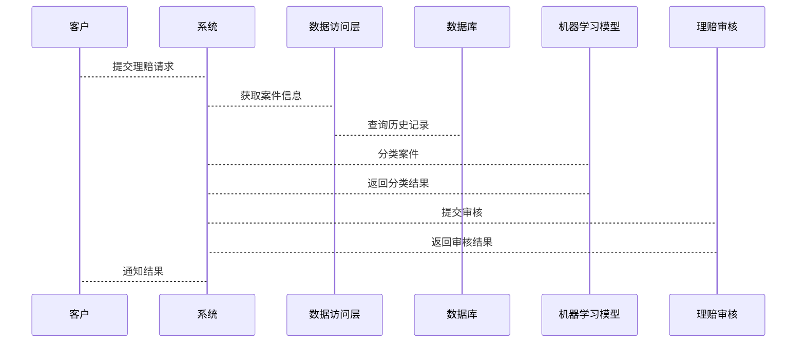

                 


# 智能保险理赔处理系统

> 关键词：智能保险、理赔处理系统、人工智能、机器学习、自然语言处理

> 摘要：本文详细探讨了智能保险理赔处理系统的构建与应用，从背景介绍到系统设计，再到算法实现和项目实战，系统地分析了该系统的各个组成部分及其工作原理。文章深入浅出地阐述了如何利用人工智能技术优化保险理赔流程，提高理赔效率和准确性。

---

## 第一部分: 智能保险理赔处理系统概述

### 第1章: 智能保险理赔处理系统背景与概述

#### 1.1 保险行业的现状与挑战
##### 1.1.1 保险行业的现状分析
保险行业作为金融领域的重要组成部分，近年来发展迅速。随着保险产品的多样化和客户需求的个性化，保险公司面临着如何高效处理理赔请求的挑战。

##### 1.1.2 保险理赔流程中的痛点
传统保险理赔流程复杂，涉及多个环节，包括报案、审核、调查、赔付等。这些环节不仅耗时长，还容易出错，导致客户满意度下降。

##### 1.1.3 传统保险理赔处理方式的局限性
传统理赔方式依赖人工处理，效率低、成本高，且容易受到人为因素的影响，导致理赔周期长、客户体验差。

#### 1.2 智能保险理赔处理系统的概念与目标
##### 1.2.1 智能保险理赔处理系统的定义
智能保险理赔处理系统是一种基于人工智能技术的自动化理赔处理系统，能够通过机器学习和自然语言处理等技术，实现理赔流程的自动化和智能化。

##### 1.2.2 系统的核心目标与价值
系统的核心目标是提高理赔效率、减少人工干预、降低运营成本，并提升客户满意度。通过智能化处理，能够快速准确地完成理赔，为客户带来更好的体验。

##### 1.2.3 系统的边界与外延
系统主要针对保险理赔流程中的关键环节，包括报案、审核、调查和赔付等，同时与保险产品的销售、风险评估等环节紧密相连。

#### 1.3 系统的核心要素与组成
##### 1.3.1 保险理赔处理的流程分解
理赔处理流程包括报案、信息收集、案件分类、审核、调查、赔付等步骤。

##### 1.3.2 智能保险理赔处理系统的核心要素
- **数据采集与处理模块**：负责收集和整理理赔相关的数据。
- **智能分类与优先级排序模块**：基于机器学习算法对案件进行分类和优先级排序。
- **自动审核与决策模块**：利用自然语言处理技术自动审核案件并作出决策。
- **客户交互模块**：提供用户友好的交互界面，方便客户提交和查询理赔进度。

##### 1.3.3 系统组成模块的分析与对比
通过对比传统理赔系统和智能理赔系统的模块组成，可以看出智能系统在自动化和智能化方面的显著优势。

---

## 第二部分: 智能保险理赔处理系统的核心概念与技术基础

### 第2章: 人工智能在保险理赔中的应用

#### 2.1 人工智能在保险行业的应用领域
##### 2.1.1 保险销售与客户画像
人工智能可以帮助保险公司更好地了解客户，制定个性化的保险方案。

##### 2.1.2 风险评估与定价
基于大数据和机器学习算法，保险公司可以更精准地评估风险，制定合理的保险价格。

##### 2.1.3 理赔处理与欺诈检测
人工智能技术在理赔处理中的应用尤为突出，能够快速识别欺诈行为，提高理赔效率。

#### 2.2 机器学习与自然语言处理基础
##### 2.2.1 机器学习在保险理赔中的应用
- **监督学习**：用于分类任务，如欺诈检测。
- **无监督学习**：用于异常检测，识别潜在的欺诈行为。

##### 2.2.2 自然语言处理在保险文档处理中的应用
- **文本分类**：用于快速分类理赔案件的类型。
- **实体识别**：从理赔文档中提取关键信息，如金额、时间等。

##### 2.2.3 人工智能技术的优缺点对比
人工智能的优势在于高效、准确，但其局限性在于需要大量的训练数据，且可能受到数据偏差的影响。

#### 2.3 智能保险理赔处理系统的核心技术
##### 2.3.1 保险理赔处理的流程自动化
通过自动化处理，减少人工干预，提高效率。

##### 2.3.2 基于AI的理赔决策支持
利用机器学习模型提供决策支持，帮助理赔人员快速作出准确的判断。

##### 2.3.3 系统的可扩展性与灵活性
系统设计需具备良好的扩展性，能够适应不同险种和理赔场景的需求。

---

## 第三部分: 智能保险理赔处理系统的系统设计与架构

### 第3章: 系统设计与架构设计方案

#### 3.1 问题场景介绍
保险理赔处理系统需要应对复杂的理赔场景，包括各种类型的保险案件和紧急情况。

#### 3.2 项目介绍
智能保险理赔处理系统旨在通过人工智能技术优化理赔流程，提升效率和准确性。

#### 3.3 系统功能设计（领域模型Mermaid类图）


#### 3.4 系统架构设计（Mermaid架构图）


#### 3.5 系统接口设计
系统需要与第三方数据源（如医院、交警等）进行接口对接，获取理赔所需的信息。

#### 3.6 系统交互（Mermaid序列图）


---

## 第四部分: 算法原理与实现

### 第4章: 算法原理与实现

#### 4.1 算法原理
##### 4.1.1 机器学习算法的选择与实现
- **支持向量机（SVM）**：用于分类任务。
- **随机森林（Random Forest）**：用于分类和回归任务。

##### 4.1.2 自然语言处理算法的选择与实现
- **文本分词**：使用jieba库对理赔文档进行分词。
- **关键词提取**：利用TF-IDF算法提取关键信息。

##### 4.1.3 算法的数学模型与公式
$$\text{SVM的目标函数：} \min_{w,b,\xi} \frac{1}{2}||w||^2 + C\sum_{i=1}^n \xi_i$$
$$\text{约束条件：} y_i(w\cdot x_i + b) \geq 1 - \xi_i, \xi_i \geq 0$$

##### 4.1.4 算法实现的Python代码示例
```python
from sklearn import svm
from sklearn.feature_extraction.text import TfidfVectorizer

# 初始化模型
model = svm.SVC()

# 文本向量化
vectorizer = TfidfVectorizer()
X = vectorizer.fit_transform(documents)

# 训练模型
model.fit(X, labels)

# 预测
new_doc = ["保险理赔申请"]
new_X = vectorizer.transform([new_doc])
predicted_label = model.predict(new_X)
```

---

## 第五部分: 项目实战

### 第5章: 项目实战

#### 5.1 环境搭建
- **Python版本**：3.8以上
- **依赖库安装**：`scikit-learn`, `jieba`, `tensorflow`

#### 5.2 系统核心功能实现
##### 5.2.1 文本分类实现
```python
def preprocess(documents):
    # 分词处理
    tokens = [jieba.lcut(doc) for doc in documents]
    return tokens

# 训练文本分类模型
model.fit(X, labels)
```

##### 5.2.2 自然语言处理实现
```python
def extract_keywords(documents):
    vectorizer = TfidfVectorizer()
    X = vectorizer.fit_transform(documents)
    feature_names = vectorizer.get_feature_names_out()
    return feature_names
```

#### 5.3 案例分析与总结
通过实际案例分析，验证系统的有效性和准确性，总结经验教训。

---

## 第六部分: 最佳实践与未来展望

### 第6章: 最佳实践与未来展望

#### 6.1 总结
智能保险理赔处理系统通过人工智能技术显著提升了理赔效率和准确性，为客户带来了更好的体验。

#### 6.2 系统的优缺点分析
- **优点**：自动化处理、高效准确。
- **缺点**：依赖数据质量，可能受到数据偏差的影响。

#### 6.3 改进建议
- 提高数据质量，优化模型性能。
- 引入更多先进的AI技术，如深度学习和强化学习。

#### 6.4 未来展望
随着AI技术的不断发展，智能保险理赔处理系统将更加智能化和自动化，为保险行业带来更大的变革。

---

作者：AI天才研究院/AI Genius Institute & 禅与计算机程序设计艺术 /Zen And The Art of Computer Programming

