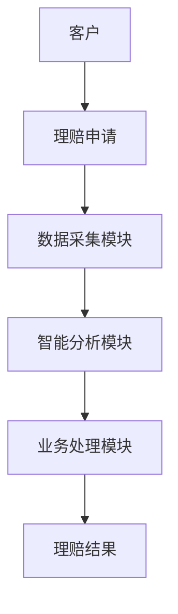
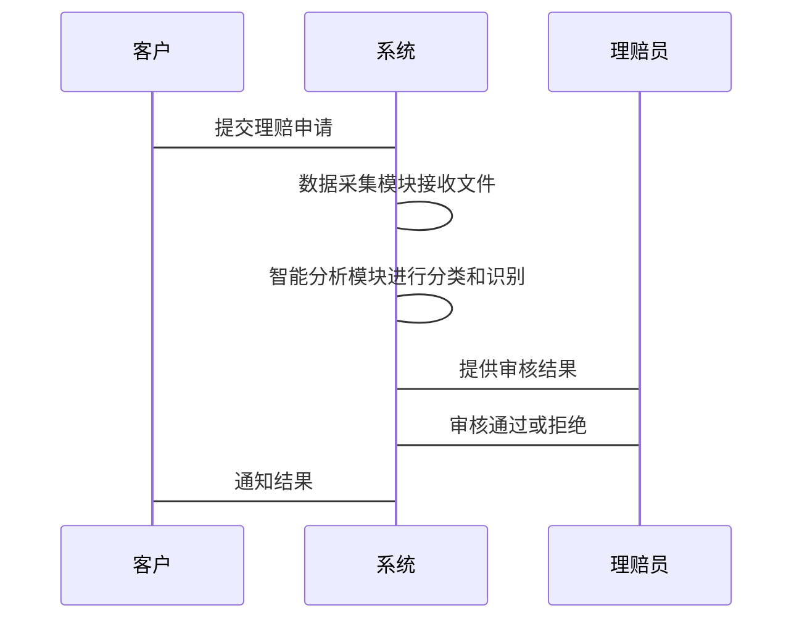

                 


# 智能保险理赔快速处理系统

## 关键词：智能保险、理赔系统、人工智能、机器学习、自然语言处理、计算机视觉

## 摘要：  
智能保险理赔快速处理系统是一种结合人工智能技术的解决方案，旨在优化传统保险理赔流程中的效率和准确性。本文从问题背景、核心概念、算法原理、系统架构设计、项目实战等方面进行详细阐述，探讨如何利用AI技术提升保险理赔的智能化水平。通过实际案例分析和代码实现，本文为读者提供一个全面了解智能保险理赔系统的机会。

---

# 第一章: 背景介绍

## 1.1 问题背景

### 1.1.1 传统保险理赔流程的痛点  
传统保险理赔流程存在效率低、人工成本高、容易出错等问题。例如，理赔员需要手动审核大量的纸质文件，包括保单、事故报告、医疗记录等，耗时且容易出错。

### 1.1.2 保险行业数字化转型的需求  
随着数字化技术的普及，保险行业亟需通过技术手段提升效率和客户体验。智能保险理赔系统的出现，正是为了满足这一需求。

### 1.1.3 智能化理赔的必要性  
通过引入人工智能技术，可以实现理赔流程的自动化和智能化，减少人为错误，缩短理赔时间，提高客户满意度。

## 1.2 问题描述

### 1.2.1 传统理赔流程的效率问题  
传统理赔流程依赖人工审核，导致处理时间长，尤其是在理赔高峰期，容易积压大量案件。

### 1.2.2 人工审核的局限性  
人工审核容易受到主观因素影响，存在误判和漏判的风险，尤其是在处理复杂案件时。

### 1.2.3 数据孤岛与信息不对称  
不同保险公司和机构之间的数据难以共享，导致信息不对称，影响理赔效率和准确性。

## 1.3 解决方案

### 1.3.1 智能保险理赔系统的概念  
智能保险理赔系统是一种基于人工智能技术的自动化理赔系统，能够快速处理和审核理赔申请。

### 1.3.2 系统的核心目标  
- 自动化处理理赔申请。
- 智能识别和分类理赔文件。
- 提高理赔准确性和效率。
- 提升客户体验。

### 1.3.3 边界与外延  
系统的核心功能包括数据采集、智能分析和业务处理，但不涉及保险产品的设计和销售。

## 1.4 核心概念与联系

### 1.4.1 保险理赔流程的实体关系  
- **客户**：提交理赔申请，提供相关文件。
- **保险公司**：接收申请，进行审核和赔付。
- **理赔员**：处理异常情况，与客户沟通。

### 1.4.2 AI技术在保险理赔中的应用  
- 机器学习用于风险评估和欺诈检测。
- 自然语言处理用于文档分析和信息提取。
- 计算机视觉用于识别和验证文件的真实性。

### 1.4.3 系统架构的核心要素  
- **数据采集模块**：接收和处理理赔文件。
- **智能分析模块**：利用AI技术进行分类和识别。
- **业务处理模块**：完成理赔审核和赔付。

## 1.5 本章小结  
本章介绍了传统保险理赔流程的痛点，提出了智能保险理赔系统的概念和目标，并详细阐述了系统的核心要素和AI技术的应用。

---

# 第二章: 核心概念与联系

## 2.1 保险理赔流程的实体关系

### 2.1.1 客户、保险公司、理赔员的实体关系  
客户提交理赔申请，保险公司接收并处理，理赔员负责审核和沟通。

### 2.1.2 保险合同、理赔申请、理赔结果的关联  
保险合同是理赔的基础，理赔申请是合同的具体体现，理赔结果是合同履行的结果。

### 2.1.3 数据流与业务流的可视化  
数据流包括客户提交的文件和保险公司处理的反馈，业务流包括申请提交、审核、赔付等步骤。

## 2.2 AI技术在保险理赔中的应用

### 2.2.1 机器学习在风险评估中的应用  
通过机器学习模型评估客户的理赔风险，识别潜在的欺诈行为。

### 2.2.2 自然语言处理在文档处理中的应用  
利用NLP技术提取理赔文件中的关键信息，如金额、时间等。

### 2.2.3 计算机视觉在理赔单证识别中的应用  
通过图像识别技术，自动识别和验证理赔文件的真实性。

## 2.3 系统架构的核心要素

### 2.3.1 数据采集模块  
负责接收客户的理赔申请和相关文件，将其转化为结构化数据。

### 2.3.2 智能分析模块  
利用AI技术对数据进行分类、识别和分析，生成初步的审核结果。

### 2.3.3 业务处理模块  
根据智能分析模块的结果，完成理赔审核和赔付。

## 2.4 本章小结  
本章详细阐述了保险理赔流程的实体关系，以及AI技术在各个环节中的具体应用，为后续的系统设计奠定了基础。

---

# 第三章: 算法原理讲解

## 3.1 机器学习模型在保险理赔中的应用

### 3.1.1 监督学习在风险评估中的应用  
- **线性回归**：用于预测理赔金额。
- **支持向量机（SVM）**：用于分类，如欺诈检测。

### 3.1.2 无监督学习在异常检测中的应用  
- **聚类分析**：发现异常理赔模式。

### 3.1.3 深度学习在图像识别中的应用  
- **卷积神经网络（CNN）**：用于识别和验证理赔文件中的图像信息。

## 3.2 自然语言处理在保险文档处理中的应用

### 3.2.1 文本分类在理赔单分类中的应用  
- 使用文本分类算法，如朴素贝叶斯，将理赔单分类到不同的类别中。

### 3.2.2 信息抽取在理赔信息提取中的应用  
- 使用命名实体识别（NER）技术，提取关键信息，如金额、时间等。

### 3.2.3 机器翻译在多语言文档处理中的应用  
- 使用神经机器翻译技术，将非中文理赔文件翻译成中文。

## 3.3 计算机视觉在理赔单证识别中的应用

### 3.3.1 图像分类  
- 使用CNN对理赔文件进行分类，如识别文件类型。

### 3.3.2 文本识别（OCR）  
- 使用OCR技术提取文本信息，如识别身份证号码、保单号等。

---

# 第四章: 系统分析与架构设计方案

## 4.1 问题场景介绍  
系统需要处理大量的理赔申请，包括文件上传、分类、识别和审核。

## 4.2 系统功能设计

### 4.2.1 领域模型  
- **客户信息**：包括姓名、身份证号、联系方式等。
- **理赔申请**：包括申请金额、申请时间、文件类型等。
- **理赔结果**：包括审核结果、赔付金额、赔付时间等。

### 4.2.2 系统架构设计  
- **数据采集模块**：接收和处理理赔文件。
- **智能分析模块**：利用AI技术进行分类和识别。
- **业务处理模块**：完成理赔审核和赔付。

## 4.3 系统架构设计  

### 4.3.1 系统架构图  


### 4.3.2 接口设计  
- 数据采集模块接口：接收理赔文件。
- 智能分析模块接口：提供分类和识别结果。
- 业务处理模块接口：输出审核结果和赔付信息。

### 4.3.3 交互流程  


## 4.4 本章小结  
本章详细介绍了系统的设计思路和架构，为后续的实现奠定了基础。

---

# 第五章: 项目实战

## 5.1 环境安装

### 5.1.1 安装Python  
- 使用Anaconda安装Python 3.8及以上版本。

### 5.1.2 安装依赖库  
- `pip install numpy`
- `pip install scikit-learn`
- `pip install tensorflow`

## 5.2 系统核心实现源代码

### 5.2.1 数据采集模块  
```python
import pandas as pd

def collect_data():
    # 读取理赔申请数据
    data = pd.read_csv('claims.csv')
    return data
```

### 5.2.2 智能分析模块  
```python
from sklearn.svm import SVC
from sklearn.model_selection import train_test_split
from sklearn.metrics import accuracy_score

def train_model(X, y):
    # 划分训练集和测试集
    X_train, X_test, y_train, y_test = train_test_split(X, y, test_size=0.2)
    # 训练SVM模型
    model = SVC()
    model.fit(X_train, y_train)
    # 预测
    y_pred = model.predict(X_test)
    print("准确率:", accuracy_score(y_test, y_pred))
    return model
```

### 5.2.3 业务处理模块  
```python
def process_claim(model, claim_data):
    # 预测理赔结果
    prediction = model.predict(claim_data)
    return prediction
```

## 5.3 实际案例分析  
以一个医疗理赔案例为例，详细说明系统的处理流程。

## 5.4 本章小结  
本章通过实际案例展示了系统的实现过程，验证了系统的可行性和有效性。

---

# 第六章: 最佳实践

## 6.1 小结  
总结系统的实现和应用效果。

## 6.2 注意事项  
- 数据安全和隐私保护。
- 系统的可扩展性和维护性。

## 6.3 拓展阅读  
- 推荐相关书籍和论文，供读者进一步学习。

## 6.4 本章小结  
本章提供了系统的使用建议和注意事项，帮助读者更好地理解和应用智能保险理赔系统。

---

# 作者：AI天才研究院 & 禅与计算机程序设计艺术

---

通过以上结构和内容的编写，希望为读者提供一个全面、详细的智能保险理赔快速处理系统的技术博客文章。

