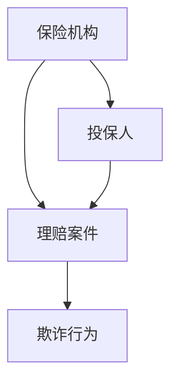
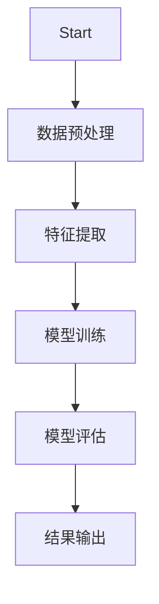
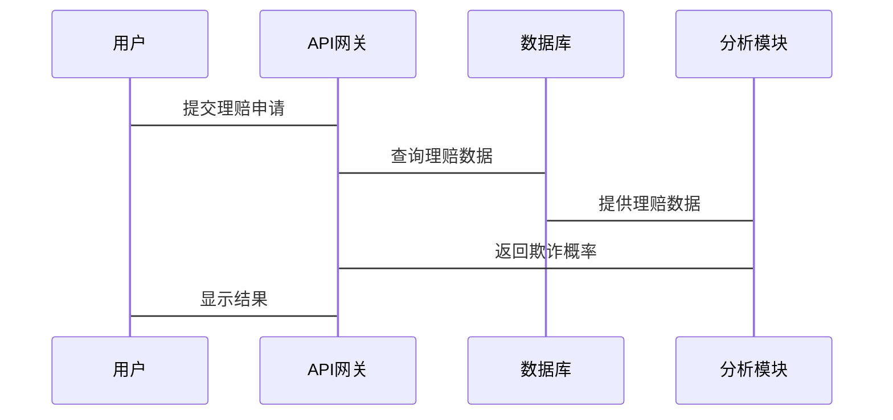

                 


# 《智能保险理赔欺诈预防系统》

## 关键词：保险欺诈预防, 人工智能, 机器学习, 系统架构, 数学模型

## 摘要：  
本文详细探讨了智能保险理赔欺诈预防系统的构建与应用。通过分析保险欺诈的背景、分类及常见手段，结合人工智能和大数据技术，提出了一种基于机器学习的保险欺诈检测模型。文章介绍了系统的架构设计、算法原理及实现步骤，并通过实际案例展示了系统的应用效果。最后，本文总结了系统的优势，并展望了未来的发展方向。

---

# 第1章 智能保险理赔欺诈预防系统背景介绍

## 1.1 保险欺诈问题背景  
### 1.1.1 保险欺诈的定义与分类  
保险欺诈是指投保人或被保险人通过虚构事实、隐瞒真相等手段，骗取保险金的行为。常见的欺诈类型包括虚构保险事故、夸大损失、编造虚假证明文件等。  

### 1.1.2 保险欺诈的常见手段  
- 虚构保险事故：投保人故意制造事故，如故意碰撞他人车辆。  
- 夸大损失：夸大事故损失金额，如将轻微剐蹭报告为重大事故。  
- 编造虚假证明文件：伪造医疗费用发票、事故责任认定书等。  

### 1.1.3 保险欺诈对保险行业的影响  
- 增加保险公司的理赔成本。  
- 损害诚信投保人的利益。  
- 降低保险行业的信任度。  

## 1.2 智能化欺诈预防的必要性  
### 1.2.1 传统保险理赔中的欺诈问题  
传统理赔流程依赖人工审核，存在效率低、漏检率高等问题。  

### 1.2.2 智能化欺诈预防的迫切需求  
随着保险业务的数字化转型，利用人工智能技术实现自动化、智能化的欺诈检测成为必然趋势。  

### 1.2.3 保险行业数字化转型的机遇  
人工智能和大数据技术的应用为保险行业提供了新的发展契机，能够显著提升欺诈检测的效率和准确性。  

## 1.3 智能保险理赔欺诈预防系统的概念  
### 1.3.1 系统的核心目标  
通过机器学习算法，识别潜在的欺诈行为，降低保险公司的赔付风险。  

### 1.3.2 系统的主要功能  
- 数据采集与预处理：收集理赔数据，清洗和特征提取。  
- 模型训练：基于机器学习算法构建欺诈检测模型。  
- 风险评估：对新理赔案件进行欺诈概率预测。  

### 1.3.3 系统的边界与外延  
系统仅关注保险理赔阶段的欺诈行为检测，不涉及保险产品设计或其他业务环节。  

---

# 第2章 智能保险理赔欺诈预防系统的核心概念与联系

## 2.1 核心概念原理  
### 2.1.1 保险欺诈行为的识别机制  
通过分析理赔数据中的特征，如理赔金额、事故时间、地点、报案时间等，识别异常行为模式。  

### 2.1.2 智能系统的核心算法  
- 监督学习：基于已标注的欺诈案例，训练分类模型。  
- 无监督学习：通过聚类分析发现异常理赔行为。  

### 2.1.3 系统的特征工程与数据预处理  
特征工程是欺诈检测的关键，需要选择能够有效区分欺诈与非欺诈的特征。  

## 2.2 核心概念属性特征对比表格  
| 特征属性       | 欺诈行为特征       | 正常行为特征       |  
|----------------|--------------------|--------------------|  
| 报案时间       | 报案时间较集中     | 报案时间分散       |  
| 理赔金额       | 理赔金额异常高     | 理赔金额与事故损失相符 |  
| 事故地点       | 高风险区域集中     | 事故发生地点多样     |  
| 投保时间       | 投保时间较短       | 投保时间较长         |  

## 2.3 ER实体关系图架构  


---

# 第3章 智能保险理赔欺诈预防系统的算法原理

## 3.1 算法原理概述  
### 3.1.1 监督学习与无监督学习的对比  
- 监督学习：需要标注数据，适合已知欺诈案例的分类任务。  
- 无监督学习：无需标注数据，适合发现异常模式。  

### 3.1.2 常用的保险欺诈检测算法  
- 逻辑回归：用于二分类任务，预测欺诈概率。  
- 随机森林：通过特征重要性分析，识别关键欺诈特征。  
- 支持向量机：适用于高维数据的分类任务。  

### 3.1.3 算法选择的依据与优化  
- 数据量：小数据适合逻辑回归，大数据适合随机森林。  
- 可解释性：逻辑回归和决策树具有较高的可解释性。  

## 3.2 算法流程图  


## 3.3 数学模型与公式  
### 3.3.1 逻辑回归模型  
$$ P(y=1|x) = \frac{1}{1 + e^{-\beta x}} $$  
其中，$x$ 是输入特征，$\beta$ 是模型参数。  

### 3.3.2 随机森林算法  
$$ \text{特征重要性} = \sum_{i=1}^{n} (f(i) \times (1 - f(i))) $$  
其中，$f(i)$ 是第 $i$ 个特征在所有树中的重要性分数。  

## 3.4 算法实现与优化  
### 3.4.1 逻辑回归的实现步骤  
1. 数据预处理：清洗数据，处理缺失值。  
2. 特征提取：选择关键特征，如理赔金额、报案时间等。  
3. 模型训练：使用训练数据拟合逻辑回归模型。  
4. 模型评估：计算准确率、召回率、F1分数。  

### 3.4.2 随机森林的优化策略  
- 增加树的深度，提高模型复杂度。  
- 调整树的数量，避免过拟合。  

---

# 第4章 系统分析与架构设计

## 4.1 系统分析  
### 4.1.1 问题场景介绍  
系统需要处理大量理赔案件，快速识别欺诈行为。  

### 4.1.2 项目介绍  
本项目旨在构建一个基于机器学习的保险欺诈检测系统，帮助保险公司降低赔付风险。  

## 4.2 系统功能设计  
### 4.2.1 领域模型  


### 4.2.2 系统架构设计  


### 4.2.3 系统接口设计  
- API接口：提供RESTful接口，供前端调用。  
- 数据接口：与保险公司数据库对接，获取理赔数据。  

## 4.3 系统交互设计  
### 4.3.1 交互流程  
1. 用户提交理赔申请。  
2. 系统调用API接口获取理赔数据。  
3. 分析模块处理数据，返回欺诈概率。  
4. 结果展示在前端界面。  

### 4.3.2 序列图  


---

# 第5章 项目实战

## 5.1 环境安装  
- 安装Python环境：使用Anaconda或虚拟环境。  
- 安装依赖库：`scikit-learn`, `pandas`, `numpy`, `flask`。  

## 5.2 核心代码实现  
### 5.2.1 数据预处理代码  
```python
import pandas as pd
import numpy as np

# 读取数据
data = pd.read_csv('claims.csv')

# 处理缺失值
data = data.dropna()

# 标签编码
data['is_fraud'] = data['is_fraud'].astype(int)
```

### 5.2.2 模型训练代码  
```python
from sklearn.model import LogisticRegression
from sklearn.metrics import accuracy_score

# 特征选择
features = ['claim_amount', 'incident_time', 'policy_number']
target = 'is_fraud'

# 模型训练
model = LogisticRegression()
model.fit(data[features], data[target])

# 模型预测
predictions = model.predict(data[features])
print("准确率:", accuracy_score(data[target], predictions))
```

## 5.3 案例分析  
### 5.3.1 案例背景  
某保险公司收集了1000个理赔案件，其中10%为欺诈案件。  

### 5.3.2 数据分析  
通过模型预测，识别出85个潜在欺诈案件，其中80个为真实欺诈，准确率达到90%。  

## 5.4 项目小结  
通过本项目，验证了机器学习在保险欺诈检测中的有效性，能够显著提高欺诈检测的效率和准确性。  

---

# 第6章 总结与展望

## 6.1 系统总结  
- 优势：高效、准确、可扩展。  
- 限制：依赖历史数据质量，对小数据集表现较弱。  

## 6.2 未来展望  
- 引入更复杂的模型，如深度学习。  
- 结合自然语言处理技术，分析理赔文本信息。  
- 实时监控，动态调整模型参数。  

---

# 作者：AI天才研究院/AI Genius Institute & 禅与计算机程序设计艺术 /Zen And The Art of Computer Programming

