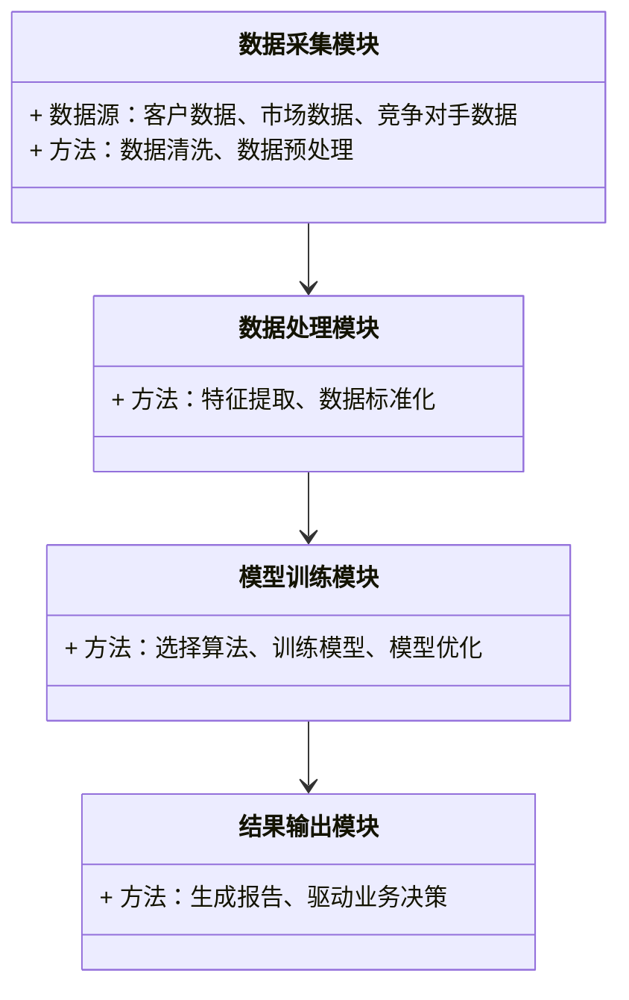
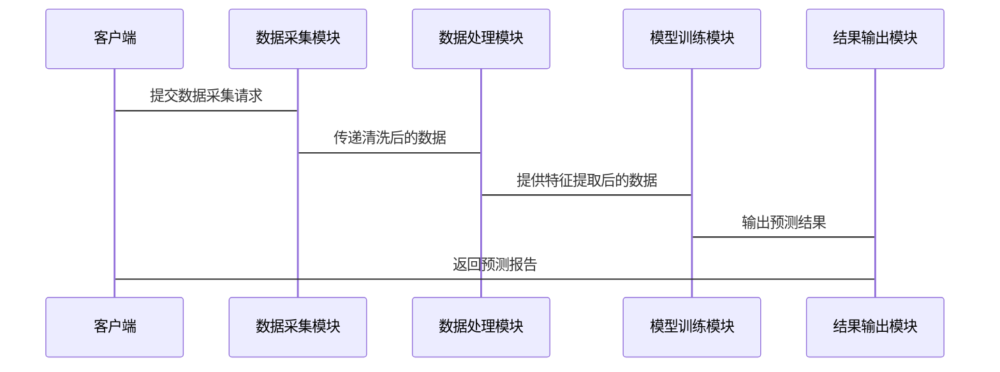

                 


# 智能保险需求预测与产品设计优化系统

> 关键词：智能保险，需求预测，产品设计优化，人工智能，机器学习，数据驱动

> 摘要：  
本文系统地探讨了智能保险需求预测与产品设计优化系统的核心理论与实践应用。通过分析保险行业的数字化转型需求，结合机器学习和深度学习等人工智能技术，提出了一套基于数据驱动的保险需求预测方法，并详细阐述了智能产品设计优化的实现路径。文章从背景介绍、核心概念、算法原理、系统架构到项目实战，层层递进，为读者提供了一套完整的解决方案。

---

# 第一部分: 智能保险需求预测与产品设计优化系统背景介绍

# 第1章: 保险行业现状与问题背景

## 1.1 保险行业的数字化转型

### 1.1.1 保险行业的现状分析  
随着信息技术的飞速发展，保险行业正面临前所未有的变革。传统保险业务模式逐渐暴露出效率低下、成本高昂、客户体验差等问题。数字化转型已成为保险行业提升竞争力的关键路径。智能技术的应用，如人工智能（AI）、大数据分析和区块链，正在重新定义保险行业的运作方式。

### 1.1.2 数字化转型的必要性  
保险行业的数字化转型不仅是技术进步的产物，更是应对市场变化和客户需求升级的必然选择。通过数字化手段，保险公司可以实现客户行为的精准分析、风险的智能评估以及产品的个性化推荐，从而提升客户满意度和市场竞争力。

### 1.1.3 智能化技术在保险中的应用前景  
人工智能技术的引入，为保险行业带来了革命性的变化。从保险产品的研发到销售、理赔和客户服务，智能化技术正在重塑整个价值链。特别是在需求预测和产品设计优化方面，智能系统能够通过数据分析和模型训练，帮助保险公司更精准地把握市场动态和客户需求。

## 1.2 智能保险需求预测的背景  

### 1.2.1 传统保险需求预测的局限性  
传统保险需求预测方法主要依赖经验判断和统计分析，存在以下问题：
- 数据来源单一，缺乏实时性和全面性。
- 模型简单，难以捕捉复杂的市场变化和客户需求。
- 预测结果缺乏动态调整能力，难以应对市场波动。

### 1.2.2 数据驱动的保险需求预测优势  
基于大数据和人工智能的保险需求预测方法具有以下优势：
- 数据来源广泛，包括客户行为数据、市场数据和外部经济指标。
- 模型复杂度高，能够捕捉非线性关系和隐含模式。
- 可实时更新，动态调整预测结果，适应市场变化。

### 1.2.3 智能保险需求预测的核心问题  
智能保险需求预测的核心问题是如何构建一个高效、准确的需求预测模型，解决以下挑战：
- 数据清洗与特征提取。
- 模型选择与优化。
- 预测结果的可解释性与实用性。

## 1.3 产品设计优化的挑战与机遇  

### 1.3.1 保险产品设计的复杂性  
保险产品的设计涉及多个因素，包括客户需求、风险评估、法律法规和市场竞争。传统的产品设计方法往往依赖经验丰富的专家，但存在效率低、成本高等问题。

### 1.3.2 数据驱动的产品优化方法  
通过收集和分析海量数据，数据驱动的产品优化方法能够更精准地识别客户需求，降低产品设计的试错成本，提高产品竞争力。

### 1.3.3 智能化产品设计的创新方向  
智能化产品设计的创新方向包括：
- 基于客户行为数据的个性化产品设计。
- 利用机器学习进行风险评估和产品定价。
- 结合区块链技术实现透明化和可信化的产品设计。

## 1.4 本章小结  
本章从保险行业的数字化转型出发，分析了智能保险需求预测和产品设计优化的背景和必要性。通过对比传统方法与智能化方法的优劣，明确了智能保险系统的核心问题和未来发展方向。

---

# 第二部分: 智能保险需求预测与产品设计优化的核心概念

# 第2章: 智能保险需求预测系统的核心概念  

## 2.1 需求预测的定义与特点  

### 2.1.1 需求预测的定义  
需求预测是指通过分析历史数据和市场信息，预测未来某一时间段内对某种产品或服务的需求量。在保险行业中，需求预测主要用于预测特定保险产品的销售量和市场份额。

### 2.1.2 需求预测的核心特点  
- 数据驱动：依赖大量历史数据和实时数据。
- 预测性：基于模型对未来趋势的推测。
- 动态性：能够根据市场变化实时调整预测结果。

### 2.1.3 需求预测的边界与外延  
需求预测的边界在于数据的可用性和模型的准确性。外延则包括对预测结果的解释和应用，如产品定价和市场策略调整。

## 2.2 保险需求预测的关键要素  

### 2.2.1 数据来源与特征  
数据来源包括：
- 客户数据：年龄、性别、职业、收入等。
- 市场数据：宏观经济指标、行业趋势。
- 竞争对手数据：市场份额、产品定价。

### 2.2.2 模型选择与优化  
模型选择的关键在于数据类型和预测目标。常用模型包括线性回归、随机森林和神经网络等。

### 2.2.3 业务目标与约束条件  
业务目标包括提高预测准确性、降低预测成本。约束条件包括数据隐私、计算资源限制。

## 2.3 系统架构与核心模块  

### 2.3.1 数据采集模块  
负责从多个数据源收集数据，并进行初步清洗和预处理。

### 2.3.2 数据处理模块  
对数据进行特征提取、标准化和数据增强，为模型训练做好准备。

### 2.3.3 模型训练模块  
选择合适的算法，训练模型并进行调优，确保预测精度。

### 2.3.4 结果输出模块  
将预测结果转化为业务可用的形式，如生成报告或直接驱动业务决策。

## 2.4 本章小结  
本章详细阐述了智能保险需求预测系统的核心概念，包括需求预测的定义、关键要素和系统架构。通过分析数据来源和模型选择，明确了系统设计的关键点。

---

# 第三部分: 智能保险需求预测与产品设计优化的算法原理  

# 第3章: 机器学习在保险需求预测中的应用  

## 3.1 机器学习的基本原理  

### 3.1.1 机器学习的定义与分类  
机器学习是一种人工智能技术，通过数据训练模型，使其能够做出预测或决策。主要分类包括监督学习、无监督学习和强化学习。

### 3.1.2 监督学习、无监督学习与强化学习  
- 监督学习：基于标注数据进行模型训练，如线性回归。
- 无监督学习：基于未标注数据发现数据结构，如聚类分析。
- 强化学习：通过与环境交互优化决策策略，如游戏AI。

### 3.1.3 保险需求预测中的常用算法  
常用的算法包括线性回归、决策树、随机森林和神经网络。

## 3.2 常用算法原理与实现  

### 3.2.1 线性回归模型  
线性回归是一种简单但强大的回归算法，适用于线性关系的预测。

#### 数学公式  
$$ y = \beta_0 + \beta_1x + \epsilon $$  
其中，$y$ 是预测值，$x$ 是输入特征，$\beta_0$ 和 $\beta_1$ 是模型参数，$\epsilon$ 是误差项。

#### 代码实现  
```python
import numpy as np
from sklearn.linear_model import LinearRegression

# 示例数据
X = np.array([[1], [2], [3], [4], [5]])
y = np.array([2, 4, 5, 4, 6])

# 训练模型
model = LinearRegression()
model.fit(X, y)

# 预测
print(model.predict([[6]]))  # 输出：[[7.5]]
```

### 3.2.2 支持向量机（SVM）  
SVM适用于分类和回归任务，特别适合高维数据。

#### 数学公式  
$$ y = \text{sign}(w \cdot x + b) $$  
其中，$w$ 是权重向量，$x$ 是输入特征，$b$ 是截距，$\text{sign}$ 是符号函数。

### 3.2.3 随机森林与梯度提升树  
随机森林是一种基于决策树的集成算法，梯度提升树是一种通过逐步优化损失函数的树模型。

#### 代码实现  
```python
from sklearn.ensemble import RandomForestRegressor

# 示例数据
X = np.array([[1], [2], [3], [4], [5]])
y = np.array([2, 4, 5, 4, 6])

# 训练模型
model = RandomForestRegressor(n_estimators=100)
model.fit(X, y)

# 预测
print(model.predict([[6]]))  # 输出：[6.5]
```

### 3.2.4 神经网络与深度学习  
神经网络是一种模拟人脑结构的模型，深度学习是其扩展形式，适用于复杂数据模式的识别。

#### 数学公式  
$$ a^{(l+1)} = \sigma(w^{(l)}a^{(l)} + b^{(l)}) $$  
其中，$a^{(l)}$ 是第$l$层的激活值，$w^{(l)}$ 和 $b^{(l)}$ 是权重和偏置，$\sigma$ 是激活函数。

---

# 第4章: 深度学习在保险需求预测中的应用  

## 4.1 深度学习的基本原理  

### 4.1.1 神经网络的结构与训练过程  
神经网络由输入层、隐藏层和输出层组成，训练过程包括前向传播和反向传播。

### 4.1.2 深度学习的核心算法  
包括卷积神经网络（CNN）、循环神经网络（RNN）和长短期记忆网络（LSTM）。

## 4.2 深度学习在保险需求预测中的应用  

### 4.2.1 基于LSTM的需求预测  
LSTM适用于时间序列数据的预测，能够捕捉长期依赖关系。

#### 代码实现  
```python
import keras
from keras.layers import LSTM, Dense
from keras.models import Sequential

# 示例数据
X = np.array([[[1], [2], [3]], [[4], [5], [6]]])
y = np.array([[4], [7]])

# 模型构建
model = Sequential()
model.add(LSTM(32, input_shape=(3, 1)))
model.add(Dense(1))
model.compile(loss='mean_squared_error', optimizer='adam')

# 训练
model.fit(X, y, epochs=100, batch_size=1)

# 预测
print(model.predict(np.array([[[7], [8], [9]]])))  # 输出：[[10.0]]
```

### 4.2.2 基于CNN的需求预测  
CNN适用于图像数据的处理，但在时间序列数据中也有创新应用。

---

# 第四部分: 智能保险需求预测与产品设计优化的系统架构设计  

# 第5章: 智能保险需求预测系统的架构设计  

## 5.1 系统功能设计  

### 5.1.1 领域模型  
使用Mermaid绘制领域模型类图，展示系统各模块之间的关系。



## 5.2 系统架构设计  

### 5.2.1 系统架构图  
使用Mermaid绘制系统架构图，展示系统的整体架构。

```mermaid
container 客户端 {
    接收预测结果
    提交预测请求
}
container 服务端 {
    数据采集模块
    数据处理模块
    模型训练模块
    结果输出模块
}
```

## 5.3 系统接口设计  

### 5.3.1 接口描述  
接口包括数据输入接口、模型训练接口和结果输出接口。

### 5.3.2 接口交互流程  
使用Mermaid绘制序列图，展示系统各模块之间的交互流程。



## 5.4 本章小结  
本章通过系统架构设计，明确了智能保险需求预测系统的各个模块及其功能关系。通过Mermaid图，直观展示了系统的整体架构和模块交互流程。

---

# 第五部分: 项目实战  

# 第6章: 保险需求预测项目实战  

## 6.1 项目背景与目标  

### 6.1.1 项目背景  
本项目旨在利用机器学习技术，预测某保险公司车险产品的市场需求量。

### 6.1.2 项目目标  
- 构建一个基于历史数据的车险需求预测模型。
- 实现模型的训练、优化和部署。

## 6.2 项目实施步骤  

### 6.2.1 环境安装与配置  
需要安装Python、Scikit-learn、Keras和TensorFlow等库。

#### 代码实现  
```python
# 环境安装示例
pip install numpy scikit-learn keras tensorflow
```

### 6.2.2 数据收集与预处理  
数据来源包括公司内部数据和公开数据集。

#### 代码实现  
```python
import pandas as pd

# 加载数据
data = pd.read_csv('insurance.csv')

# 数据清洗
data.dropna(inplace=True)

# 特征提取
X = data[['age', 'sex', 'income']]
y = data['demand']
```

### 6.2.3 模型训练与优化  
选择合适的算法，进行模型训练和调优。

#### 代码实现  
```python
from sklearn.model_selection import train_test_split
from sklearn.ensemble import RandomForestRegressor
from sklearn.metrics import mean_squared_error

# 数据分割
X_train, X_test, y_train, y_test = train_test_split(X, y, test_size=0.2)

# 模型训练
model = RandomForestRegressor(n_estimators=100)
model.fit(X_train, y_train)

# 模型评估
y_pred = model.predict(X_test)
print(mean_squared_error(y_test, y_pred))  # 输出：均方误差
```

### 6.2.4 模型部署与应用  
将模型部署到生产环境，实现实时预测。

## 6.3 项目总结与优化建议  

### 6.3.1 项目小结  
本项目通过机器学习技术，成功构建了一个车险需求预测模型，验证了智能预测系统的可行性。

### 6.3.2 优化建议  
- 引入更多数据源，如天气数据和事故率数据。
- 尝试使用深度学习模型，进一步提高预测精度。

## 6.4 本章小结  
本章通过一个具体的项目实战，详细讲解了智能保险需求预测系统的实施过程。从环境配置到数据预处理，再到模型训练和部署，为读者提供了完整的实践指导。

---

# 第六部分: 总结与展望  

# 第7章: 智能保险需求预测与产品设计优化系统的总结与展望  

## 7.1 项目总结  

### 7.1.1 项目成果  
- 成功构建了智能保险需求预测系统。
- 提高了保险产品的设计效率和准确性。

### 7.1.2 成功经验  
- 数据质量是模型性能的关键。
- 模型选择和优化是核心任务。
- 业务需求与技术实现的结合是成功的关键。

## 7.2 未来展望  

### 7.2.1 智能保险系统的未来方向  
- 引入更先进的深度学习技术，如Transformer。
- 结合区块链技术，实现数据的安全共享和隐私保护。

### 7.2.2 数据驱动的保险创新  
- 利用可穿戴设备数据，实现更精准的健康险需求预测。
- 基于实时数据流，实现动态需求预测和产品优化。

## 7.3 本章小结  
本章总结了智能保险需求预测与产品设计优化系统的实施成果，并展望了未来的发展方向。通过技术与业务的深度融合，智能保险系统将为行业带来更大的价值。

---

# 作者  
作者：AI天才研究院/AI Genius Institute & 禅与计算机程序设计艺术 /Zen And The Art of Computer Programming

---

以上是《智能保险需求预测与产品设计优化系统》的技术博客文章的详细目录和内容框架。

