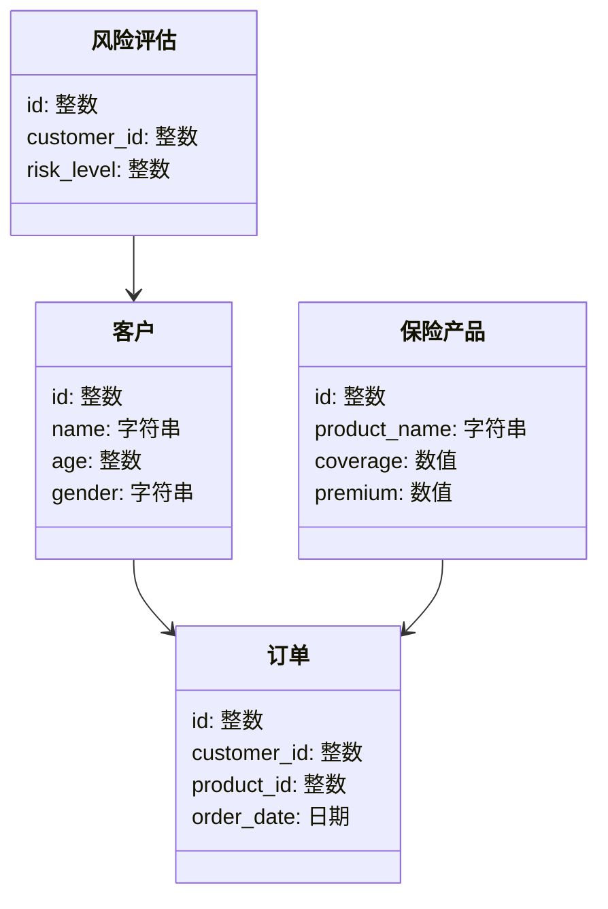

                 


# 智能保险需求预测与产品设计系统

> 关键词：智能保险，需求预测，产品设计，机器学习，系统架构，数据分析

> 摘要：本文探讨了智能保险需求预测与产品设计系统的核心概念、算法原理、系统架构和项目实战。通过数据分析、机器学习和系统设计，展示了如何利用智能技术优化保险行业的需求预测和产品设计过程，提供了一种高效、精准的解决方案。

---

## 第1章: 背景介绍

### 1.1 保险行业的现状与挑战

#### 1.1.1 保险行业的现状分析
保险行业作为金融体系的重要组成部分，近年来随着科技的发展，正逐步从传统模式向智能化方向转型。传统保险业务依赖于经验丰富的保险专家和历史数据，但随着数据量的爆炸式增长和客户需求的多样化，传统方法的局限性日益显现。

#### 1.1.2 保险行业面临的主要挑战
- **数据碎片化**：保险数据来源多样，包括客户行为数据、市场数据、健康数据等，如何有效整合和分析这些数据成为挑战。
- **需求预测不精准**：传统的需求预测方法依赖经验，难以捕捉市场变化和客户需求的动态变化。
- **产品设计周期长**：传统产品设计流程复杂，从需求分析到产品上线耗时较长，难以快速响应市场需求。

#### 1.1.3 智能保险的需求预测与产品设计的重要性
智能保险通过大数据分析和机器学习技术，能够实时捕捉市场变化和客户需求，实现精准的需求预测和高效的产品设计。这不仅提高了保险公司的竞争力，还能为客户提供更个性化的保险产品。

---

### 1.2 智能保险需求预测的背景

#### 1.2.1 数据驱动的需求预测
随着大数据技术的发展，保险公司可以收集大量客户数据，包括购买记录、健康状况、风险偏好等。通过分析这些数据，可以更准确地预测客户的需求。

#### 1.2.2 传统保险需求预测的局限性
传统需求预测方法主要依赖历史数据分析和经验判断，难以应对市场变化和客户需求的多样性。此外，传统方法通常需要大量人工干预，效率低下。

#### 1.2.3 智能保险需求预测的核心价值
智能保险需求预测通过机器学习算法，能够实时分析数据，捕捉市场趋势和客户需求变化，从而实现精准预测。这不仅提高了预测的准确性，还大大缩短了预测周期。

---

### 1.3 保险产品设计的智能化转型

#### 1.3.1 传统保险产品设计的痛点
传统保险产品设计流程复杂，从需求分析到产品上线耗时较长。此外，传统设计方法难以捕捉客户的真实需求，导致产品与市场脱节。

#### 1.3.2 智能化产品设计的优势
智能保险产品设计通过大数据分析和机器学习技术，能够快速分析客户需求，生成个性化的产品方案。此外，智能化设计还能提高设计效率，降低人工成本。

#### 1.3.3 保险产品设计的未来趋势
未来的保险产品设计将更加依赖人工智能技术，实现从需求分析到产品设计的全流程自动化。同时，智能化设计将推动保险产品向个性化和定制化方向发展。

---

## 第2章: 智能保险需求预测与产品设计的核心概念

### 2.1 智能保险需求预测的核心概念

#### 2.1.1 数据驱动的预测
数据驱动的预测是智能保险需求预测的核心，通过收集和分析大量数据，利用机器学习算法进行预测。

#### 2.1.2 机器学习在需求预测中的应用
机器学习算法，如线性回归、随机森林和神经网络，被广泛应用于保险需求预测。这些算法能够从数据中提取特征，建立预测模型。

#### 2.1.3 预测模型的构建与优化
预测模型的构建包括数据预处理、特征选择、模型训练和模型评估等步骤。优化模型可以通过调整参数和选择合适的算法来提高预测准确率。

---

### 2.2 保险产品设计的智能化

#### 2.2.1 数据驱动的产品设计
数据驱动的产品设计通过分析客户数据，了解客户需求，生成个性化的产品方案。

#### 2.2.2 智能化产品设计的流程
智能化产品设计流程包括需求分析、数据分析、模型构建、产品设计和产品优化等步骤。

#### 2.2.3 产品设计中的用户行为分析
用户行为分析是智能化产品设计的重要组成部分，通过分析客户的购买行为和偏好，优化产品设计。

---

## 第3章: 智能保险需求预测与产品设计的核心概念与联系

### 3.1 核心概念原理

#### 3.1.1 数据驱动的预测原理
数据驱动的预测通过收集和分析大量数据，利用机器学习算法建立预测模型，实现需求预测。

#### 3.1.2 机器学习在预测中的应用
机器学习算法能够从数据中提取特征，建立预测模型，实现精准的需求预测。

#### 3.1.3 智能化产品设计的流程
智能化产品设计流程包括需求分析、数据分析、模型构建、产品设计和产品优化等步骤。

---

### 3.2 概念属性特征对比表格

| 概念               | 数据驱动的需求预测 | 传统需求预测 |
|--------------------|--------------------|--------------|
| 数据来源           | 多样化数据         | 历史数据       |
| 方法               | 机器学习算法       | 经验判断       |
| 准确率             | 高                 | 低            |
| 优势               | 精准、高效         | 依赖经验       |

---

### 3.3 ER实体关系图架构

```mermaid
erdiagram
insurance_system {
    客户(Customers) {
        id: 整数
        name: 字符串
        age: 整数
        gender: 字符串
    }
    风险评估(Risk_assessment) {
        id: 整数
        customer_id: 整数
        risk_level: 整数
    }
    保险产品(Insurance_products) {
        id: 整数
        product_name: 字符串
        coverage: 数值
        premium: 数值
    }
    订单(Orders) {
        id: 整数
        customer_id: 整数
        product_id: 整数
        order_date: 日期
    }
}
```

---

## 第4章: 智能保险需求预测的算法原理

### 4.1 算法原理概述

#### 4.1.1 线性回归模型
线性回归是一种简单而强大的回归算法，适用于线性关系的数据。

- **数学模型**：
  $$ y = \beta_0 + \beta_1x + \epsilon $$
  其中，$\beta_0$ 是截距，$\beta_1$ 是斜率，$\epsilon$ 是误差项。

- **算法流程图**：
  ```mermaid
  graph LR
      A[开始] --> B[数据预处理]
      B --> C[特征选择]
      C --> D[模型训练]
      D --> E[模型评估]
      E --> F[结束]
  ```

---

### 4.2 算法流程图

#### 4.2.1 线性回归算法流程图


---

## 第5章: 系统分析与架构设计方案

### 5.1 问题场景介绍

#### 5.1.1 问题描述
保险公司需要预测客户需求，设计个性化保险产品，但传统方法效率低下，准确性不足。

#### 5.1.2 项目介绍
本项目旨在开发一个智能保险需求预测与产品设计系统，利用机器学习技术提高预测准确率和设计效率。

---

### 5.2 系统功能设计

#### 5.2.1 领域模型类图


---

## 第6章: 项目实战

### 6.1 环境安装

#### 6.1.1 安装Python
```bash
python --version
pip install --upgrade pip
```

#### 6.1.2 安装机器学习库
```bash
pip install numpy scikit-learn pandas
```

---

### 6.2 系统核心实现源代码

#### 6.2.1 数据预处理
```python
import pandas as pd
import numpy as np

# 加载数据
data = pd.read_csv('insurance.csv')

# 数据清洗
data.dropna(inplace=True)
data = pd.get_dummies(data)
```

#### 6.2.2 特征选择
```python
from sklearn.feature_selection import SelectKBest
from sklearn.feature_selection import chi2

selector = SelectKBest(score_func=chi2, k=2)
selected_features = selector.fit_transform(data)
```

#### 6.2.3 模型训练
```python
from sklearn.linear_model import LinearRegression
from sklearn.model_selection import train_test_split

X_train, X_test, y_train, y_test = train_test_split(selected_features, data['target'], test_size=0.2)
model = LinearRegression()
model.fit(X_train, y_train)
```

#### 6.2.4 模型评估
```python
from sklearn.metrics import mean_squared_error

y_pred = model.predict(X_test)
print(mean_squared_error(y_test, y_pred))
```

---

### 6.3 代码应用解读与分析

#### 6.3.1 数据预处理
通过数据清洗和特征工程，为模型提供干净的数据。

#### 6.3.2 模型训练
利用线性回归算法训练模型，预测保险需求。

#### 6.3.3 模型评估
评估模型的预测准确率，优化模型性能。

---

### 6.4 实际案例分析和详细讲解剖析

#### 6.4.1 数据收集与处理
从实际业务场景中收集客户数据，清洗和处理数据。

#### 6.4.2 模型训练与优化
训练机器学习模型，优化模型参数，提高预测准确率。

#### 6.4.3 产品设计与实现
根据预测结果，设计个性化保险产品，优化产品结构。

---

## 第7章: 最佳实践 tips、小结、注意事项、拓展阅读

### 7.1 小结

智能保险需求预测与产品设计系统通过机器学习和大数据分析，实现了精准的需求预测和高效的产品设计。本文详细介绍了系统的背景、核心概念、算法原理和项目实战。

---

### 7.2 注意事项

- 数据隐私保护：在处理客户数据时，需遵守相关法律法规，保护客户隐私。
- 模型优化：定期优化模型，确保预测准确率。
- 技术更新：关注机器学习领域的新技术，保持系统的技术领先性。

---

### 7.3 拓展阅读

- 《机器学习实战》
- 《数据分析的艺术》
- 《系统设计指南》

---

## 作者：AI天才研究院/AI Genius Institute & 禅与计算机程序设计艺术 /Zen And The Art of Computer Programming

