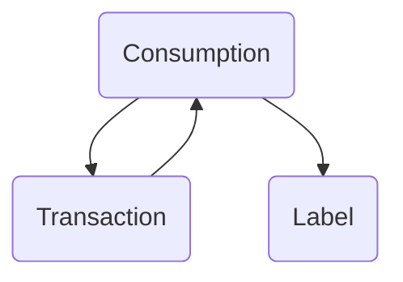
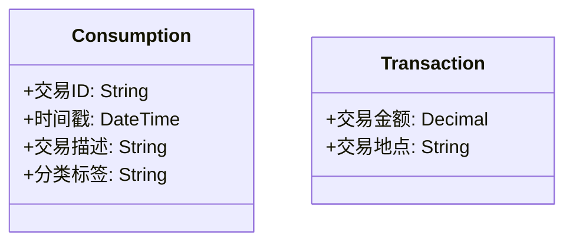
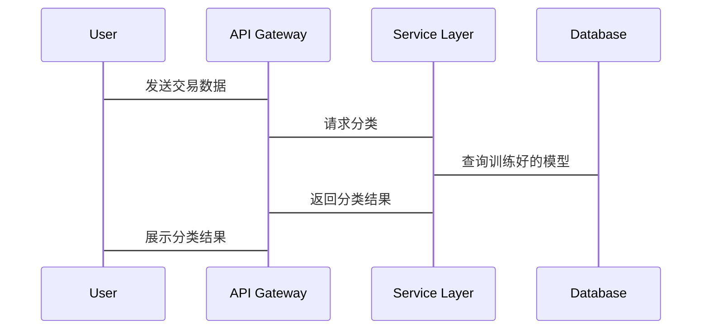

                 


# 智能信用卡支出分类系统

> 关键词：智能信用卡支出分类系统，人工智能，自然语言处理，深度学习，文本分类，信用卡消费记录

> 摘要：智能信用卡支出分类系统利用人工智能技术，特别是自然语言处理和深度学习，来自动分类用户的信用卡消费记录。本文详细探讨了该系统的背景、核心算法、系统架构、项目实现及最佳实践，旨在为技术人员和相关领域的读者提供全面的指导。

---

# 第1章 智能信用卡支出分类系统背景介绍

## 1.1 问题背景与描述

### 1.1.1 传统信用卡支出分类的痛点
传统的信用卡支出分类方法依赖于人工规则匹配，存在以下问题：
- **分类粒度过粗**：无法区分复杂的消费场景。
- **效率低下**：人工分类耗时且容易出错。
- **难以扩展**：面对海量数据时分类效率下降。

### 1.1.2 智能分类的需求与目标
智能信用卡支出分类系统的目标是通过机器学习算法实现自动化、精准的消费分类。具体需求包括：
- 实时分类能力。
- 高分类准确率。
- 能处理非结构化数据（如交易描述）。

### 1.1.3 系统边界与外延
系统的边界包括：
- 数据输入：信用卡交易记录和描述。
- 数据输出：分类结果和分类标签。
- 边界外延：不包括信用评分和欺诈检测。

### 1.1.4 核心要素与概念结构
系统的核心要素包括：
- 消费记录（Consumption）。
- 交易（Transaction）。
- 分类标签（Category）。

## 1.2 智能分类的核心概念与联系

### 1.2.1 实体关系架构（ER图）


### 1.2.2 核心概念属性对比
| 属性 | 传统分类 | 智能分类 |
|------|----------|----------|
| 数据来源 | 结构化数据 | 结构化+非结构化数据 |
| 分类方式 | 规则匹配 | 机器学习模型 |
| 分类粒度 | 粗分类 | 细粒度分类 |

---

# 第2章 智能信用卡支出分类系统的核心算法原理

## 2.1 文本分类算法原理

### 2.1.1 基于规则的分类
- 通过预设规则匹配交易描述。
- 例如，规则“超市”匹配“购买超市商品”。

### 2.1.2 基于聚类的分类
- 使用K-means算法对交易描述进行聚类。
- 计算文本相似度：使用余弦相似度。
$$ \text{余弦相似度} = \frac{\vec{A} \cdot \vec{B}}{|\vec{A}| |\vec{B}|} $$

### 2.1.3 基于深度学习的分类
- 使用预训练语言模型（如BERT）进行文本表示。
- 训练分类器（如随机森林或支持向量机）进行分类。

## 2.2 深度学习模型原理

### 2.2.1 Word2Vec文本表示
- 将交易描述转换为向量表示。
- 使用Word2Vec模型生成词向量。
$$ \text{词向量} = \text{Word2Vec}(x) $$

### 2.2.2 LSTM模型结构
- 使用LSTM处理序列数据。
$$ f(x) = \text{LSTM}(x, h) $$

### 2.2.3 BERT模型应用
- 使用BERT进行文本编码。
$$ \text{编码结果} = \text{BERT}(x) $$

---

# 第3章 智能信用卡支出分类系统的系统分析与架构设计

## 3.1 问题场景介绍

### 3.1.1 系统功能需求
- 数据采集：从信用卡系统获取交易数据。
- 数据处理：清洗和预处理数据。
- 分类引擎：运行分类算法。
- 结果展示：分类结果展示。

## 3.2 系统功能设计

### 3.2.1 领域模型设计


## 3.3 系统架构设计

### 3.3.1 微服务架构
- 前端：用户界面。
- 后端：API网关。
- 服务层：数据处理和分类引擎。
- 数据库：存储交易数据和分类结果。

### 3.3.2 系统架构图
```mermaid
graph TD
    Frontend --> API Gateway
    API Gateway --> Service Layer
    Service Layer --> Database
```

## 3.4 系统接口设计

### 3.4.1 接口说明
- API接口：`POST /api/classify`
- 请求格式：JSON格式数据。
- 返回格式：JSON格式结果。

## 3.5 系统交互流程图

### 3.5.1 交互流程


---

# 第4章 智能信用卡支出分类系统的项目实战

## 4.1 环境安装

### 4.1.1 安装Python
```bash
python --version
pip install --upgrade pip
```

### 4.1.2 安装依赖库
```bash
pip install numpy scikit-learn tensorflow transformers
```

## 4.2 系统核心实现

### 4.2.1 核心代码实现
```python
from sklearn.feature_extraction.text import TfidfVectorizer
from sklearn.svm import SVC

# 数据预处理
X = data['交易描述']
y = data['分类标签']

# 特征提取
vectorizer = TfidfVectorizer(max_features=1000)
X_vec = vectorizer.fit_transform(X)

# 训练模型
model = SVC(C=1.0, gamma=0.001)
model.fit(X_vec, y)

# 分类实现
def classify_transaction(description):
    vec = vectorizer.transform([description])
    return model.predict(vec)[0]
```

### 4.2.2 代码应用解读
- 使用TF-IDF提取特征。
- 使用SVM进行分类。

## 4.3 案例分析与详细讲解

### 4.3.1 案例分析
- 输入：交易描述“购买电影票”。
- 输出：分类标签“娱乐”。

### 4.3.2 案例详细讲解
- 数据预处理：清洗交易描述。
- 特征提取：将描述转换为TF-IDF向量。
- 模型训练：训练SVM分类器。
- 分类实现：输入描述，返回分类结果。

---

# 第5章 智能信用卡支出分类系统的最佳实践

## 5.1 小结

### 5.1.1 核心要点回顾
- 使用深度学习模型提高分类准确率。
- 采用微服务架构实现系统扩展性。
- 使用TF-IDF和SVM进行高效分类。

## 5.2 注意事项

### 5.2.1 数据隐私保护
- 确保交易数据的隐私保护。
- 遵守数据保护法规。

## 5.3 拓展阅读

### 5.3.1 推荐书目
- 《深度学习》——Ian Goodfellow
- 《自然语言处理入门》——Nikolaus K. F. Rejtas

---

# 作者

**作者：AI天才研究院/AI Genius Institute & 禅与计算机程序设计艺术 /Zen And The Art of Computer Programming**

