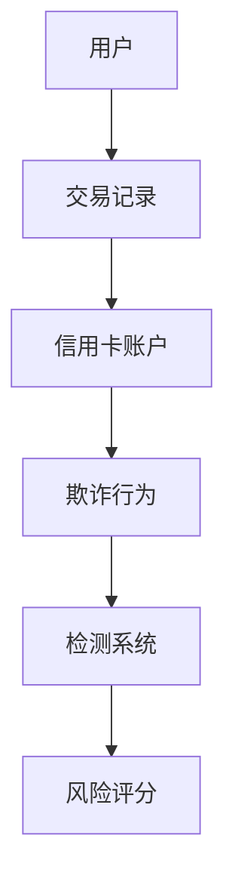
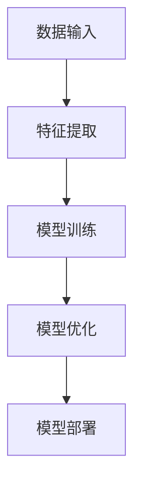
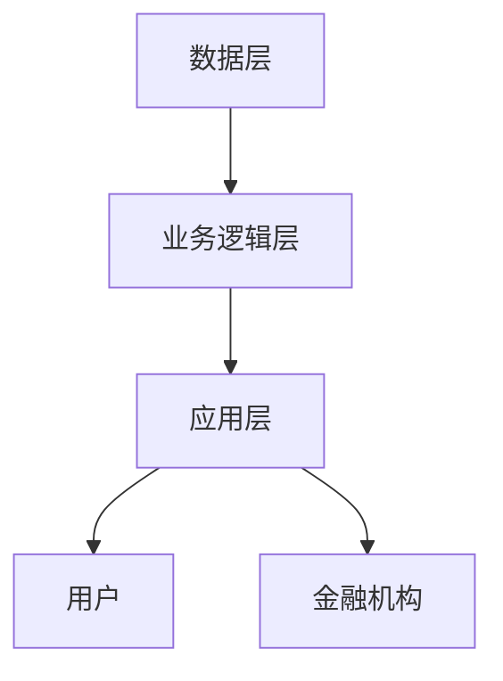
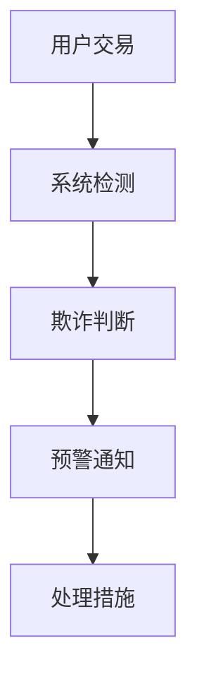
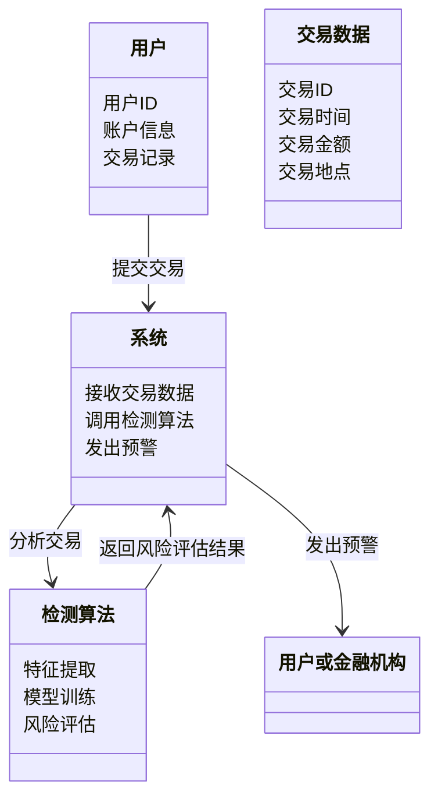

                 


# 智能信用卡欺诈检测系统

## 关键词：信用卡欺诈检测，人工智能，机器学习，实时检测，风险管理

## 摘要：
智能信用卡欺诈检测系统是一种基于人工智能和机器学习技术的实时监控系统，旨在通过分析信用卡交易数据，识别潜在的欺诈行为，保护用户和金融机构的财产安全。本文详细探讨了信用卡欺诈检测的背景、核心概念、算法原理、系统架构设计以及实际项目实现，为读者提供全面的技术解读。

---

# 第一部分：智能信用卡欺诈检测系统概述

## 第1章：信用卡欺诈检测的背景与挑战

### 1.1 信用卡欺诈的现状与问题背景

#### 1.1.1 信用卡欺诈的定义与类型
信用卡欺诈是指非法使用他人信用卡进行未经授权的交易，导致持卡人或发卡机构遭受经济损失的行为。常见的欺诈类型包括：

- **伪卡欺诈**：使用复制的信用卡进行交易。
- **账单欺诈**：未经授权的持卡人进行线上或线下的交易。
- **身份盗用**：非法获取持卡人信息后进行欺诈交易。
- **欺诈性申请**：通过虚假信息申请信用卡并进行欺诈交易。

#### 1.1.2 欺诈行为对个人和机构的影响
信用卡欺诈不仅给持卡人带来经济损失，还可能导致个人信用记录受损。对于金融机构而言，欺诈行为会增加运营成本，降低客户信任度，并面临法律风险。

#### 1.1.3 当前欺诈检测的主要挑战
传统的欺诈检测方法主要依赖规则-based系统，例如检查交易金额是否超过信用额度或交易地点是否与用户习惯不符。然而，这种方法存在以下局限性：

- **规则的局限性**：规则-based系统难以应对复杂的欺诈手段，且需要频繁调整规则以适应新的欺诈模式。
- **数据孤岛问题**：不同机构之间的数据难以共享，导致检测系统无法全面分析交易背景。
- **实时性不足**：传统的检测方法往往依赖事后分析，无法实现实时欺诈检测。

### 1.2 智能检测技术的引入背景

#### 1.2.1 传统欺诈检测方法的局限性
传统欺诈检测方法主要依赖人工审查和简单的规则匹配，这种方法在面对复杂的欺诈手段时显得力不从心。例如，黑产团伙可能会通过多次小额交易规避规则-based系统的检测。

#### 1.2.2 智能技术在金融领域的应用趋势
随着人工智能和大数据技术的快速发展，金融机构开始广泛采用智能技术来提升欺诈检测能力。智能技术能够通过分析海量数据，发现隐藏的模式和异常行为，从而实现更精准的欺诈检测。

#### 1.2.3 智能信用卡欺诈检测的必要性
智能信用卡欺诈检测能够通过实时分析交易数据，快速识别潜在的欺诈行为，从而在第一时间采取措施，防止损失扩大。这种技术不仅提高了检测效率，还能够降低误报率和漏报率。

### 1.3 智能信用卡欺诈检测的核心目标

#### 1.3.1 实时性与准确性要求
智能信用卡欺诈检测系统需要在交易发生时立即进行分析，做到实时检测。同时，系统需要尽可能提高检测的准确性，减少误报和漏报。

#### 1.3.2 用户隐私保护的重要性
在检测欺诈行为的同时，系统需要严格保护用户的隐私数据，确保数据的安全性和合规性。

#### 1.3.3 系统可扩展性与灵活性
随着欺诈手段的不断演变，系统需要具备良好的可扩展性和灵活性，能够快速适应新的欺诈模式和技术变化。

## 1.4 本章小结
本章从信用卡欺诈的现状出发，分析了传统欺诈检测方法的局限性，并介绍了智能技术在欺诈检测中的应用趋势。明确了智能信用卡欺诈检测的核心目标，为后续章节的分析奠定了基础。

---

## 第2章：智能信用卡欺诈检测的核心概念与联系

### 2.1 核心概念原理

#### 2.1.1 数据流与特征提取
智能信用卡欺诈检测系统需要处理大量的交易数据，包括交易金额、时间戳、地理位置、交易类型等。通过对这些数据进行特征提取，可以识别出潜在的欺诈行为。

#### 2.1.2 分类算法与模型训练
分类算法是智能检测系统的核心，通过训练模型，系统能够识别出正常交易和欺诈交易的区别。

#### 2.1.3 模型评估与优化
模型评估是确保系统准确性的关键步骤，常用的评估指标包括准确率、召回率和F1值等。通过优化模型参数和调整算法，可以提高检测的准确性。

### 2.2 核心概念属性特征对比表

| 特征类型 | 输入特征 | 输出特征 | 关键属性 |
|----------|----------|----------|----------|
| 数据特征 | 时间戳、交易金额、地理位置 | 风险评分、欺诈概率 | 实时性、关联性 |
| 行为特征 | 用户行为模式、交易频率 | 用户信用评分 | 行为一致性、异常检测 |
| 模型特征 | 特征向量、标签 | 模型权重、损失函数 | 可解释性、泛化能力 |

### 2.3 ER实体关系图（Mermaid）



## 2.4 本章小结
本章详细介绍了智能信用卡欺诈检测系统的核心概念，包括数据流与特征提取、分类算法与模型训练，以及模型评估与优化。通过对比不同特征类型的属性，帮助读者更好地理解系统的整体架构。

---

## 第3章：智能信用卡欺诈检测的算法原理

### 3.1 特征工程与数据预处理

#### 3.1.1 数据清洗与特征提取
数据清洗是特征工程的第一步，需要去除噪声数据和异常值。特征提取则是从原始数据中提取有用的特征，例如交易时间间隔、交易金额的变化趋势等。

#### 3.1.2 特征选择与降维技术
特征选择可以通过选择最具区分度的特征来减少维度，同时提高模型的训练效率。常用的技术包括基于统计的方法（如卡方检验）和基于机器学习的方法（如Lasso回归）。

#### 3.1.3 时间序列特征分析
时间序列特征分析是智能检测系统的重要组成部分，通过对交易时间序列的分析，可以发现异常的交易模式。

### 3.2 分类算法原理

#### 3.2.1 常见分类算法对比
常用的分类算法包括逻辑回归、支持向量机（SVM）、随机森林和梯度提升树（GBDT）等。每种算法都有其优缺点，适用于不同的场景。

#### 3.2.2 支持向量机（SVM）原理
SVM是一种监督学习算法，通过构建超平面将数据分为两类。在信用卡欺诈检测中，SVM可以用于区分正常交易和欺诈交易。

#### 3.2.3 随机森林与梯度提升树（GBDT）
随机森林是一种基于决策树的集成算法，具有高准确性和鲁棒性。GBDT则通过梯度提升技术，逐步优化模型，适用于复杂的欺诈检测场景。

### 3.3 模型训练与优化

#### 3.3.1 模型训练流程
模型训练流程包括数据预处理、特征选择、模型训练和模型评估。通过交叉验证和网格搜索等技术，可以优化模型的超参数，提高检测准确率。

#### 3.3.2 超参数优化方法
超参数优化是提高模型性能的重要步骤，常用的方法包括网格搜索和随机搜索。通过优化学习率、树深度等参数，可以显著提高模型的准确率。

#### 3.3.3 模型评估指标
常用的评估指标包括准确率（Accuracy）、召回率（Recall）、精确率（Precision）和F1值（F1 Score）。其中，F1值是精确率和召回率的调和平均数，能够综合衡量模型的性能。

### 3.4 算法流程图（Mermaid）



## 3.5 本章小结
本章详细介绍了智能信用卡欺诈检测系统的算法原理，包括特征工程、分类算法和模型优化。通过对比不同算法的特点，帮助读者选择合适的算法，并通过模型优化提高检测的准确率。

---

## 第4章：智能信用卡欺诈检测的系统分析与架构设计

### 4.1 系统功能需求分析

#### 4.1.1 实时交易监控
系统需要实时监控信用卡交易，快速识别潜在的欺诈行为。

#### 4.1.2 欺诈行为预警
通过设置阈值和规则，系统可以在检测到潜在欺诈行为时，立即向用户或金融机构发出预警。

#### 4.1.3 用户行为分析
系统需要分析用户的交易行为，建立正常交易模式，以便更好地识别异常行为。

### 4.2 系统架构设计

#### 4.2.1 分层架构设计
智能信用卡欺诈检测系统的架构通常分为数据层、业务逻辑层和应用层。数据层负责存储和管理交易数据，业务逻辑层负责处理数据并运行检测算法，应用层负责与用户和金融机构进行交互。

#### 4.2.2 系统架构图（Mermaid）



#### 4.2.3 系统接口设计
系统需要与信用卡发卡机构、收单机构和支付网关等外部系统进行对接，通过API接口实现数据交互。

#### 4.2.4 系统交互流程图（Mermaid）



### 4.3 系统功能设计（领域模型Mermaid类图）



### 4.4 本章小结
本章详细分析了智能信用卡欺诈检测系统的功能需求和架构设计，通过Mermaid图展示了系统的整体架构和交互流程，为后续的系统实现奠定了基础。

---

## 第5章：智能信用卡欺诈检测的项目实战

### 5.1 项目环境配置

#### 5.1.1 数据集准备
需要准备信用卡交易数据，包括正常交易和欺诈交易两类数据。常用的数据集包括公开数据集（如Kaggle上的信用卡欺诈检测数据集）。

#### 5.1.2 工具安装与配置
需要安装Python、机器学习库（如Scikit-learn、XGBoost）和数据处理工具（如Pandas、NumPy）。建议使用虚拟环境进行包管理。

#### 5.1.3 环境配置示例代码

```python
# 创建虚拟环境并安装依赖
conda create -n fraud_detection python=3.8
conda activate fraud_detection
pip install scikit-learn xgboost pandas numpy
```

### 5.2 系统核心实现源代码

#### 5.2.1 数据预处理与特征提取

```python
import pandas as pd
import numpy as np

# 加载数据集
data = pd.read_csv('credit_card_fraud.csv')

# 数据清洗
data = data.dropna()
data = pd.get_dummies(data)

# 特征选择
selected_features = data.drop('fraud', axis=1)
target = data['fraud']

# 数据分割
from sklearn.model_selection import train_test_split
X_train, X_test, y_train, y_test = train_test_split(selected_features, target, test_size=0.2, random_state=42)
```

#### 5.2.2 模型训练与优化

```python
from sklearn.ensemble import RandomForestClassifier
from sklearn.metrics import accuracy_score, recall_score, precision_score, f1_score

# 初始化模型
model = RandomForestClassifier(n_estimators=100, max_depth=30, random_state=42)

# 训练模型
model.fit(X_train, y_train)

# 预测
y_pred = model.predict(X_test)

# 评估指标
accuracy = accuracy_score(y_test, y_pred)
recall = recall_score(y_test, y_pred)
precision = precision_score(y_test, y_pred)
f1 = f1_score(y_test, y_pred)

print(f'Accuracy: {accuracy}')
print(f'Recall: {recall}')
print(f'Precision: {precision}')
print(f'F1 Score: {f1}')
```

#### 5.2.3 系统交互流程实现

```python
def detect_fraud(transaction_data):
    # 数据预处理
    processed_data = preprocess(transaction_data)
    
    # 预测欺诈概率
    prediction = model.predict(processed_data)
    
    # 返回结果
    return prediction

# 示例调用
transaction = {
    'amount': 1000,
    'time': '2023-10-01 15:30:00',
    'location': 'New York'
}
result = detect_fraud(transaction)
print(f'Fraud detected: {result}')
```

### 5.3 实际案例分析

#### 5.3.1 案例背景
假设某用户在短时间内进行了多笔小额交易，系统需要通过分析交易时间间隔和金额变化，判断是否存在欺诈行为。

#### 5.3.2 案例分析与解决
通过特征工程和模型训练，系统能够识别出异常交易模式，并及时发出预警。

### 5.4 本章小结
本章通过实际项目案例，详细介绍了智能信用卡欺诈检测系统的实现过程，包括数据预处理、模型训练和系统交互流程。通过代码示例，帮助读者更好地理解和应用相关技术。

---

## 第6章：智能信用卡欺诈检测的最佳实践与注意事项

### 6.1 最佳实践 Tips

#### 6.1.1 数据隐私保护
在处理用户数据时，必须严格遵守数据隐私法规，确保用户信息的安全和合规性。

#### 6.1.2 模型持续优化
欺诈手段不断演变，需要定期更新模型和优化算法，以应对新的欺诈模式。

#### 6.1.3 系统性能优化
通过优化算法和采用分布式计算技术，可以提高系统的处理能力和响应速度。

### 6.2 系统优化建议

#### 6.2.1 采用流数据处理技术
通过实时处理交易数据，可以实现更快速的欺诈检测。

#### 6.2.2 引入无监督学习算法
无监督学习算法能够发现数据中的异常模式，适用于未知的欺诈手段。

#### 6.2.3 结合规则-based系统
将规则-based系统与智能检测系统相结合，可以提高检测的准确率和效率。

### 6.3 拓展阅读
推荐阅读以下书籍和论文，以深入理解智能信用卡欺诈检测技术：

- 《Python机器学习实战》
- 《深入浅出机器学习》
- 《Credit Card Fraud Detection with Machine Learning》

### 6.4 本章小结
本章总结了智能信用卡欺诈检测系统在实际应用中的最佳实践和注意事项，为读者提供了实用的建议和拓展阅读的方向。

---

## 第7章：智能信用卡欺诈检测的未来展望

### 7.1 技术发展趋势

#### 7.1.1 大模型的应用
随着大模型技术的发展，未来的欺诈检测系统将更加智能化和自动化。

#### 7.1.2 联邦学习与隐私计算
联邦学习和隐私计算技术将为数据隐私保护提供新的解决方案。

#### 7.1.3 边缘计算的应用
边缘计算能够实现更快速的本地化检测，减少数据传输延迟。

### 7.2 应用场景扩展

#### 7.2.1 多维度欺诈检测
未来的欺诈检测系统将结合更多的数据源，如社交媒体数据和地理位置信息，实现更精准的检测。

#### 7.2.2 智能风控体系
智能风控体系将通过整合多种技术手段，构建全方位的风控系统。

### 7.3 未来挑战

#### 7.3.1 数据隐私与安全
数据隐私和安全问题将是未来欺诈检测系统面临的最大挑战之一。

#### 7.3.2 模型解释性
随着模型复杂度的增加，模型的解释性将成为一个重要问题。

#### 7.3.3 技术成本
大模型和边缘计算等新技术的应用将带来更高的技术成本，需要在成本和性能之间找到平衡点。

### 7.4 本章小结
本章展望了智能信用卡欺诈检测技术的未来发展趋势，分析了技术应用的潜力和面临的挑战，为读者提供了对未来技术发展的思考。

---

## 作者：AI天才研究院/AI Genius Institute & 禅与计算机程序设计艺术 /Zen And The Art of Computer Programming

---

通过以上章节的详细阐述，本文系统地介绍了智能信用卡欺诈检测系统的背景、核心概念、算法原理、系统架构设计以及实际项目实现。从理论到实践，从现状到未来，全面剖析了智能信用卡欺诈检测技术的关键点，为读者提供了一个全面的技术指南。

