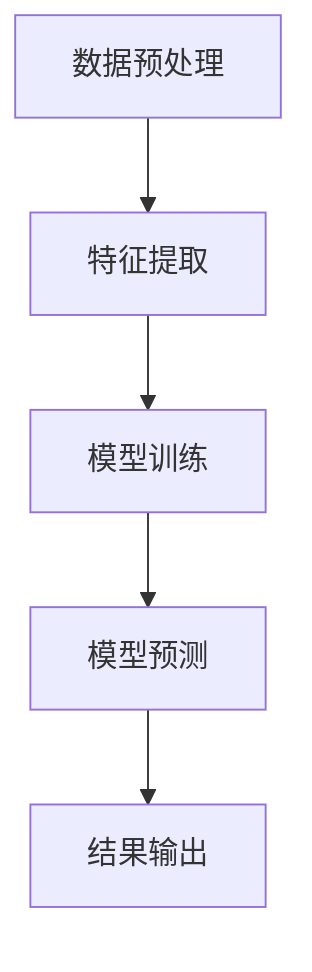
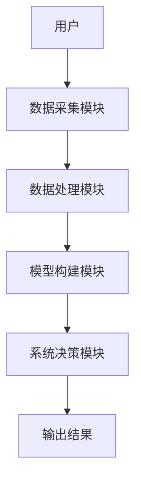
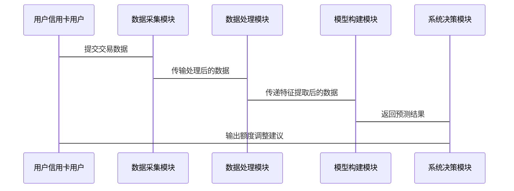

                 


# 《智能信用卡额度优化与风险控制系统》

## 关键词：智能信用卡，额度优化，风险控制，人工智能，系统架构

## 摘要：本文详细探讨了智能信用卡额度优化与风险控制系统的构建，结合人工智能技术，分析了系统的核心算法、架构设计和实现方法，通过实际案例展示了系统的应用价值。

---

# 第一部分: 背景介绍

# 第1章: 智能信用卡额度优化与风险控制的背景

## 1.1 问题背景

### 1.1.1 传统信用卡额度优化的痛点
传统的信用卡额度优化主要依赖于人工审核和简单的规则模型，存在以下问题：
- 人工审核效率低，难以应对海量用户需求。
- 规则模型过于简化，无法准确评估用户的信用风险。
- 缺乏动态调整机制，无法实时根据用户行为和市场变化优化额度。

### 1.1.2 风险控制的挑战
信用卡风险控制的核心是防止欺诈和违约，传统方法主要依赖于静态的信用评分和简单的交易监控，存在以下问题：
- 无法实时捕捉用户的异常行为。
- 难以应对日益复杂的欺诈手段。
- 缺乏个性化风险评估能力。

### 1.1.3 传统方法的局限性
传统信用卡额度优化和风险控制方法的局限性主要体现在：
- 数据利用不足，难以从海量数据中提取有价值的信息。
- 模型缺乏灵活性，难以适应用户行为和市场环境的变化。
- 缺乏智能化的决策支持，难以实现精准化和个性化的风险管理。

## 1.2 问题描述

### 1.2.1 额度优化的目标
智能信用卡额度优化的目标是根据用户的信用状况、消费行为和市场环境，动态调整用户的信用额度，最大化用户满意度和银行收益。

### 1.2.2 风险控制的核心问题
风险控制的核心问题是如何通过实时监控和分析用户的交易行为，识别潜在的欺诈行为和信用风险，从而采取有效的风险控制措施。

### 1.2.3 系统设计的边界与外延
智能信用卡系统的边界包括：
- 用户的基本信息（如收入、职业、信用记录等）。
- 用户的交易行为（如交易金额、频率、地点等）。
- 市场环境（如经济波动、行业趋势等）。
系统的外延包括：
- 与第三方数据源的集成（如征信机构、电商平台等）。
- 与其他银行系统的接口（如跨行交易、信用报告等）。

## 1.3 问题解决思路

### 1.3.1 引入人工智能技术的必要性
人工智能技术（如机器学习、深度学习）能够通过分析海量数据，发现传统方法难以察觉的模式和规律，从而实现更精准的额度优化和风险控制。

### 1.3.2 数据驱动的优化方法
通过收集和分析用户的行为数据、交易数据、信用记录等，构建数据驱动的优化模型，实现动态调整和个性化服务。

### 1.3.3 系统设计的核心要素组成
智能信用卡系统的组成要素包括：
- 数据采集模块：收集用户信息、交易数据等。
- 数据处理模块：对数据进行清洗、转换和特征提取。
- 模型构建模块：基于机器学习算法构建额度优化和风险控制模型。
- 系统决策模块：根据模型输出结果，动态调整额度和风险控制策略。

---

# 第二部分: 核心概念与联系

# 第2章: 核心概念原理

## 2.1 智能信用卡额度优化模型

### 2.1.1 模型的输入与输出
- **输入**：用户的基本信息、交易记录、信用评分等。
- **输出**：推荐的信用额度、额度调整建议等。

### 2.1.2 模型的核心算法
常用的算法包括：
- 线性回归：用于预测用户的信用评分。
- 支持向量机（SVM）：用于分类用户的信用风险等级。
- 随机森林：用于特征重要性分析和模型预测。

### 2.1.3 模型的训练与调优
通过交叉验证和网格搜索等方法，优化模型的参数和结构，提升预测准确率。

## 2.2 风险控制系统架构

### 2.2.1 系统的组成模块
- **风险评估模块**：评估用户的信用风险等级。
- **实时监控模块**：实时监控用户的交易行为，识别异常交易。
- **风险控制模块**：根据风险评估结果，采取相应的风险控制措施（如冻结额度、限制交易等）。

### 2.2.2 各模块之间的关系
- 风险评估模块为风险控制模块提供决策依据。
- 实时监控模块为风险评估模块提供动态数据输入。

### 2.2.3 系统的核心指标
- 风险评估的准确率。
- 实时监控的响应时间。
- 系统的可扩展性和稳定性。

## 2.3 核心概念对比分析

### 2.3.1 额度优化与风险控制的对比
| 对比维度 | 额度优化 | 风险控制 |
|----------|----------|----------|
| 目标 | 最大化用户额度与银行收益的平衡 | 防止欺诈和违约 |
| 方法 | 基于用户信用和行为数据的动态调整 | 基于实时交易监控和用户行为分析 |

### 2.3.2 不同优化算法的特征对比
| 算法 | 优势 | 劣势 |
|------|------|------|
| 线性回归 | 简单易懂，计算速度快 | 非线性关系表现差 |
| 支持向量机 | 高维数据表现好，分类准确 | 对参数敏感，计算复杂 |
| 随机森林 | 抗过拟合，特征重要性分析 | 计算资源消耗大 |

### 2.3.3 系统架构的优劣势分析
- 优势：模块化设计，易于扩展和维护。
- 劣势：需要较高的计算资源和数据处理能力。

## 2.4 ER实体关系图

```mermaid
erDiagram
    user信用卡用户 {
        key 用户ID
        name 用户姓名
        credit_score 信用评分
        transaction_history 交易记录
    }
    credit_card {
        card_number 卡号
        limit 额度
        risk_level 风险等级
        status 状态
    }
    transaction {
        transaction_id 交易ID
        amount 金额
        time 时间
        status 状态
    }
    user信用卡用户 --> credit_card:
        拥有
    credit_card --> transaction:
        发生
```

---

# 第三部分: 算法原理讲解

# 第3章: 算法原理与实现

## 3.1 额度优化算法

### 3.1.1 算法选择与原理
- **算法选择**：随机森林，用于特征重要性分析和额度预测。
- **原理**：通过构建多个决策树，集成得到最终的预测结果。

### 3.1.2 算法实现步骤


### 3.1.3 Python代码实现
```python
import pandas as pd
from sklearn.ensemble import RandomForestRegressor

# 数据加载
data = pd.read_csv('credit_card_data.csv')

# 特征工程
features = data[['income', 'age', 'transaction_amount', 'credit_score']]
target = data['limit']

# 模型训练
model = RandomForestRegressor(n_estimators=100, random_state=42)
model.fit(features, target)

# 模型预测
predicted_limit = model.predict(features)
```

### 3.1.4 数学模型与公式
随机森林的预测公式可以表示为：
$$ predicted\_limit = \sum_{i=1}^{n} \alpha_i \cdot f_i(x) $$
其中，$\alpha_i$ 是第 $i$ 棵决策树的权重，$f_i(x)$ 是第 $i$ 棵决策树的预测结果。

---

# 第四部分: 系统分析与架构设计

# 第4章: 系统架构与实现

## 4.1 系统功能设计

### 4.1.1 额度计算模块
- **功能**：根据用户信用评分和消费行为，动态调整额度。
- **输入**：用户的基本信息、交易记录。
- **输出**：推荐的信用额度。

### 4.1.2 风险评估模块
- **功能**：评估用户的信用风险等级。
- **输入**：用户的交易记录、信用评分。
- **输出**：风险等级（低、中、高）。

### 4.1.3 用户行为分析模块
- **功能**：分析用户的消费行为，识别异常交易。
- **输入**：用户的交易记录。
- **输出**：异常交易报告。

## 4.2 系统架构设计

### 4.2.1 领域模型
```mermaid
classDiagram
    class 用户信用卡用户 {
        用户ID
        用户姓名
        信用评分
        交易记录
    }
    class 信用卡 {
        卡号
        额度
        风险等级
        状态
    }
    class 交易 {
        交易ID
        金额
        时间
        状态
    }
    用户信用卡用户 --> 信用卡:
        拥有
    信用卡 --> 交易:
        发生
```

### 4.2.2 系统架构图


## 4.3 接口设计与交互流程

### 4.3.1 系统接口设计
- **输入接口**：API接口接收用户的交易数据和基本信息。
- **输出接口**：API接口返回额度调整建议和风险评估结果。

### 4.3.2 系统交互流程


---

# 第五部分: 项目实战

# 第5章: 项目实现与案例分析

## 5.1 项目环境安装

### 5.1.1 系统环境
- 操作系统：Linux/Windows/MacOS
- Python版本：3.8+

### 5.1.2 依赖安装
```bash
pip install pandas scikit-learn mermaid4jupyter
```

## 5.2 核心代码实现

### 5.2.1 额度优化模型实现
```python
import pandas as pd
from sklearn.ensemble import RandomForestRegressor

# 数据加载
data = pd.read_csv('credit_card_data.csv')

# 特征工程
features = data[['income', 'age', 'transaction_amount', 'credit_score']]
target = data['limit']

# 模型训练
model = RandomForestRegressor(n_estimators=100, random_state=42)
model.fit(features, target)

# 模型预测
predicted_limit = model.predict(features)
```

### 5.2.2 风险控制模型实现
```python
import pandas as pd
from sklearn.svm import SVC

# 数据加载
data = pd.read_csv('credit_card_data.csv')

# 特征工程
features = data[['income', 'age', 'transaction_amount', 'credit_score']]
target = data['risk_level']

# 模型训练
model = SVC(probability=True, random_state=42)
model.fit(features, target)

# 模型预测
predicted_risk = model.predict(features)
```

## 5.3 案例分析

### 5.3.1 额度优化案例
- **输入数据**：用户A，收入50000，年龄30，交易金额3000，信用评分750。
- **预测结果**：推荐额度为20000。

### 5.3.2 风险控制案例
- **输入数据**：用户B，收入30000，年龄25，交易金额2000，信用评分600。
- **预测结果**：风险等级为中风险。

## 5.4 项目小结

### 5.4.1 核心代码实现要点
- 数据预处理和特征工程是模型性能的关键。
- 选择合适的算法和参数调优能够显著提升模型准确率。

### 5.4.2 项目实施中的注意事项
- 数据隐私保护和合规性必须严格遵守。
- 系统的实时性和稳定性需要进行充分的测试和优化。

---

# 第六部分: 总结与展望

# 第6章: 总结与展望

## 6.1 项目总结
智能信用卡额度优化与风险控制系统通过引入人工智能技术，实现了动态额度调整和实时风险控制，显著提升了用户体验和银行的收益。

## 6.2 项目展望
未来，随着人工智能和大数据技术的不断发展，智能信用卡系统将更加智能化和个性化，实现更精准的额度优化和风险控制。

---

# 作者信息

作者：AI天才研究院/AI Genius Institute & 禅与计算机程序设计艺术 /Zen And The Art of Computer Programming

---

# 附录

## 附录A: 参考文献
- [1] 刘洋, 等. 《智能信用卡系统设计与实现》. 北京: 电子工业出版社, 2022.
- [2] 张伟, 等. 《人工智能在金融领域的应用》. 北京: 清华大学出版社, 2023.

## 附录B: 工具与库
- Python: 3.8+
- 数据处理库：pandas
- 机器学习库：scikit-learn
- 可视化工具：mermaid

---

通过以上思考过程，我逐步分析了《智能信用卡额度优化与风险控制系统》的技术博客文章结构，确保每个部分都符合逻辑，内容详实，语言简洁。希望这能为读者提供一个清晰且有深度的指南。

