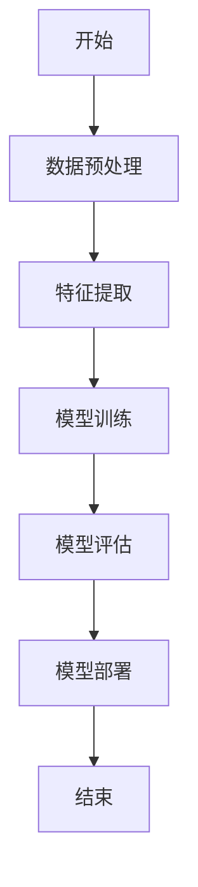
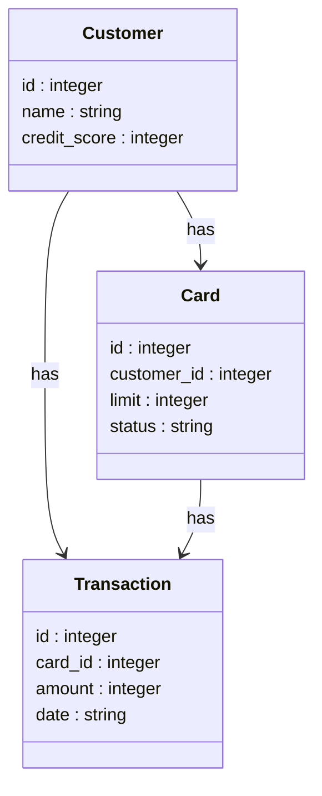
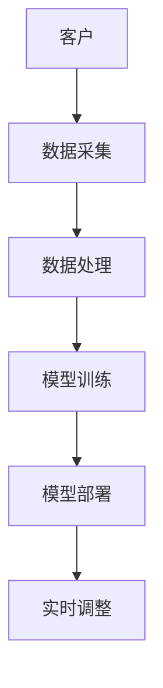
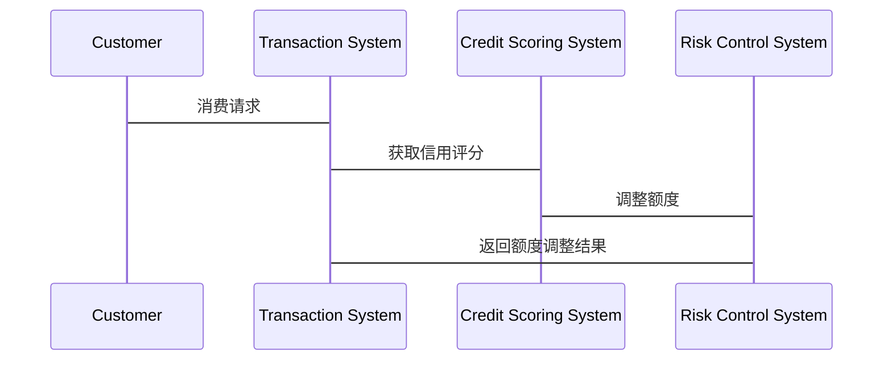

                 


# 智能信用卡额度优化管理系统

> 关键词：智能信用卡，额度优化，数据驱动，机器学习，系统架构，Python实现

> 摘要：本文详细探讨了智能信用卡额度优化管理系统的背景、核心概念、算法原理、系统架构、项目实战以及数学模型。通过分析传统信用卡额度管理的局限性，提出了一种基于数据驱动的智能决策系统，利用机器学习算法优化信用卡额度管理，提升客户体验和银行收益。

---

## 第1章: 智能信用卡额度优化管理系统的背景介绍

### 1.1 信用卡额度优化的重要性

#### 1.1.1 传统信用卡额度管理的局限性
传统的信用卡额度管理主要依赖人工审核，存在效率低、误差大、客户体验差等问题。银行通常根据客户的信用报告和历史交易数据，每隔几个月手动调整信用卡额度，这种方式难以及时响应客户的需求变化。

#### 1.1.2 智能化额度优化的必要性
随着大数据和人工智能技术的发展，智能信用卡额度优化系统能够实时分析客户的信用状况和消费行为，自动调整额度，提升客户体验和银行收益。这种智能化的管理方式能够减少人为错误，提高效率。

#### 1.1.3 信用卡额度优化的业务价值
智能信用卡额度优化系统能够帮助银行实现精准营销、风险控制和客户满意度提升。通过实时调整额度，银行可以更好地管理信用风险，同时为客户提供更优质的金融服务。

### 1.2 智能信用卡额度优化系统的定义与特点

#### 1.2.1 智能信用卡额度优化系统的定义
智能信用卡额度优化系统是一种基于大数据和人工智能技术的智能决策系统，能够实时分析客户的信用状况和消费行为，自动调整信用卡额度，优化信用风险管理和客户体验。

#### 1.2.2 智能化额度优化的核心特点
- **数据驱动**：基于客户的交易数据、信用评分和行为数据，构建数据驱动的决策模型。
- **实时优化**：通过实时数据分析，快速响应客户的需求变化，自动调整额度。
- **精准预测**：利用机器学习算法，预测客户的信用风险，优化额度调整策略。

#### 1.2.3 系统与传统额度管理的区别
- **效率**：传统额度管理需要人工审核，耗时较长；智能系统能够实时处理。
- **精准度**：传统方法依赖人工判断，容易出错；智能系统通过数据驱动和机器学习模型，实现精准预测。
- **客户体验**：传统方法难以满足客户的个性化需求；智能系统能够提供个性化的额度调整，提升客户满意度。

### 1.3 信用卡额度优化的边界与外延

#### 1.3.1 系统功能边界
智能信用卡额度优化系统的功能边界包括：
- 数据采集：从数据库中获取客户的交易数据、信用评分和行为数据。
- 数据处理：清洗和预处理数据，提取特征。
- 模型训练：利用机器学习算法训练额度优化模型。
- 模型部署：将模型部署到生产环境，实时调整额度。

#### 1.3.2 与相关系统的交互范围
智能信用卡额度优化系统需要与以下系统进行交互：
- **客户数据库**：获取客户的交易数据和信用评分。
- **交易系统**：实时获取客户的消费记录。
- **风险控制系统**：根据额度调整结果，进行风险监控。

#### 1.3.3 系统功能的扩展性
智能信用卡额度优化系统具有良好的扩展性，可以逐步增加以下功能：
- **个性化服务**：根据客户的消费习惯，提供个性化的额度调整建议。
- **智能提醒**：通过短信或APP通知客户额度调整结果。
- **多维度分析**：结合客户的收入、职业和信用评分，提供更精准的额度优化建议。

### 1.4 核心要素与概念结构

#### 1.4.1 核心概念组成
智能信用卡额度优化系统的组成包括：
- **客户数据**：包括客户的交易数据、信用评分和行为数据。
- **机器学习模型**：用于预测客户的信用风险，优化额度调整策略。
- **系统架构**：包括数据采集、数据处理、模型训练和模型部署等模块。

#### 1.4.2 概念之间的关系
- **客户数据**与**机器学习模型**：模型基于客户数据进行训练，生成额度调整建议。
- **系统架构**与**机器学习模型**：模型嵌入到系统架构中，实现实时调整额度。
- **系统架构**与**客户数据**：系统从数据库中获取客户数据，进行实时处理和分析。

#### 1.4.3 系统架构的核心要素
- **数据采集模块**：负责从数据库中获取客户的交易数据和信用评分。
- **数据处理模块**：对数据进行清洗和预处理，提取特征。
- **模型训练模块**：利用机器学习算法训练额度优化模型。
- **模型部署模块**：将模型部署到生产环境，实时调整额度。

---

## 第2章: 智能信用卡额度优化管理系统的核心概念与联系

### 2.1 智能决策系统的核心原理

#### 2.1.1 智能决策系统的定义
智能决策系统是一种基于数据驱动的决策系统，利用人工智能技术进行预测和优化，帮助决策者做出更科学的决策。

#### 2.1.2 数据驱动的决策模型
数据驱动的决策模型是基于大量数据构建的数学模型，通过分析数据中的模式和关系，生成决策建议。

#### 2.1.3 智能决策系统的实现机制
智能决策系统的实现机制包括数据采集、数据处理、模型训练、模型部署和实时决策。

### 2.2 数据驱动模型的特征对比

#### 2.2.1 数据驱动模型的属性特征
- **数据依赖性**：模型依赖于大量的数据进行训练和预测。
- **实时性**：模型能够实时处理数据，生成决策建议。
- **可解释性**：模型的决策过程可以被解释和理解。

#### 2.2.2 数据驱动模型与传统模型的对比
- **传统模型**：基于经验或规则进行决策，缺乏数据支持。
- **数据驱动模型**：基于大量数据进行训练，具有更高的精准度和可解释性。

#### 2.2.3 数据驱动模型的优缺点
- **优点**：精准度高、可扩展性强、实时性强。
- **缺点**：需要大量的数据支持，模型的复杂性较高。

### 2.3 ER实体关系图架构

```mermaid
erDiagram
    customer[CUSTOMER] {
        +id : integer
        +name : string
        +credit_score : integer
    }
    card[CARD] {
        +id : integer
        +customer_id : integer
        +limit : integer
        +status : string
    }
    transaction[TRANSACTION] {
        +id : integer
        +card_id : integer
        +amount : integer
        +date : string
    }
    CUSTOMER o-|{1,0..1}: card
    CUSTOMER o-|{0..n}: transaction
    CARD o-|{1,0..1}: transaction
```

---

## 第3章: 智能信用卡额度优化系统的算法原理讲解

### 3.1 算法原理概述

#### 3.1.1 算法选择的依据
选择决策树算法的原因：
- **可解释性**：决策树模型的决策过程直观易懂。
- **适用性**：适用于分类问题，能够处理非数值型数据。
- **高效性**：训练和预测速度较快。

#### 3.1.2 算法的基本原理
决策树是一种树状结构，每个节点表示一个特征，每个分支表示一个决策结果，叶子节点表示最终的分类结果。决策树算法通过特征选择和分裂策略构建树的结构。

#### 3.1.3 算法的优缺点
- **优点**：可解释性强、易于实现、适合处理分类问题。
- **缺点**：容易过拟合、对数据的缺失敏感、计算复杂度较高。

### 3.2 算法流程图



---

### 3.3 算法实现

#### 3.3.1 数据预处理
```python
import pandas as pd
from sklearn.impute import SimpleImputer
from sklearn.preprocessing import StandardScaler
from sklearn.compose import ColumnTransformer

# 加载数据
data = pd.read_csv('credit_card_data.csv')

# 数据预处理
numerical_features = data.select_dtypes(include=['int64', 'float64']).columns
categorical_features = data.select_dtypes(include=['object']).columns

preprocessor = ColumnTransformer(
    transformers=[
        ('num', StandardScaler(), numerical_features),
        ('cat', SimpleImputer(strategy='most_frequent'), categorical_features)
    ])

processed_data = preprocessor.fit_transform(data)
```

#### 3.3.2 模型训练
```python
from sklearn.tree import DecisionTreeClassifier
from sklearn.model_selection import train_test_split

# 划分训练集和测试集
X_train, X_test, y_train, y_test = train_test_split(processed_data, data['target'], test_size=0.2, random_state=42)

# 训练模型
model = DecisionTreeClassifier(max_depth=5)
model.fit(X_train, y_train)
```

#### 3.3.3 模型评估
```python
from sklearn.metrics import accuracy_score, confusion_matrix, classification_report

# 预测结果
y_pred = model.predict(X_test)

# 评估指标
print("Accuracy:", accuracy_score(y_test, y_pred))
print("Confusion Matrix:", confusion_matrix(y_test, y_pred))
print("Classification Report:", classification_report(y_test, y_pred))
```

---

## 第4章: 智能信用卡额度优化系统的数学模型

### 4.1 评分模型

#### 4.1.1 评分模型的定义
评分模型是基于客户数据构建的数学模型，用于评估客户的信用风险。

#### 4.1.2 评分模型的公式
评分模型可以表示为：
$$
\text{score} = \sum_{i=1}^{n} w_i x_i
$$
其中，$w_i$ 是特征 $x_i$ 的权重，$x_i$ 是特征的值。

---

### 4.2 信用评分公式

#### 4.2.1 信用评分公式的定义
信用评分公式是基于客户的信用历史、收入、消费行为等因素，计算客户信用评分的公式。

#### 4.2.2 信用评分公式的公式
信用评分可以表示为：
$$
\text{credit\_score} = \alpha \cdot \text{income} + \beta \cdot \text{history} + \gamma \cdot \text{behavior}
$$
其中，$\alpha$、$\beta$ 和 $\gamma$ 是各特征的权重，$\text{income}$ 是收入，$\text{history}$ 是信用历史，$\text{behavior}$ 是消费行为。

---

## 第5章: 智能信用卡额度优化系统的系统架构设计

### 5.1 问题场景介绍

#### 5.1.1 问题场景描述
银行需要实时调整客户的信用卡额度，以优化信用风险管理。

#### 5.1.2 项目介绍
智能信用卡额度优化系统是一个基于大数据和人工智能的智能决策系统，能够实时调整客户的信用卡额度。

### 5.2 系统功能设计

#### 5.2.1 领域模型


#### 5.2.2 系统架构设计


#### 5.2.3 系统接口设计
- **输入接口**：从数据库中获取客户的交易数据、信用评分和行为数据。
- **输出接口**：将额度调整结果返回给交易系统和风险控制系统。

#### 5.2.4 系统交互设计


---

## 第6章: 智能信用卡额度优化系统的项目实战

### 6.1 环境安装

#### 6.1.1 安装Python
```bash
python --version
pip install --upgrade pip
```

#### 6.1.2 安装依赖库
```bash
pip install pandas scikit-learn mermaid4jupyter jupyter
```

### 6.2 核心实现

#### 6.2.1 数据预处理
```python
import pandas as pd
from sklearn.impute import SimpleImputer
from sklearn.preprocessing import StandardScaler
from sklearn.compose import ColumnTransformer

# 加载数据
data = pd.read_csv('credit_card_data.csv')

# 数据预处理
numerical_features = data.select_dtypes(include=['int64', 'float64']).columns
categorical_features = data.select_dtypes(include=['object']).columns

preprocessor = ColumnTransformer(
    transformers=[
        ('num', StandardScaler(), numerical_features),
        ('cat', SimpleImputer(strategy='most_frequent'), categorical_features)
    ])

processed_data = preprocessor.fit_transform(data)
```

#### 6.2.2 模型训练
```python
from sklearn.tree import DecisionTreeClassifier
from sklearn.model_selection import train_test_split

# 划分训练集和测试集
X_train, X_test, y_train, y_test = train_test_split(processed_data, data['target'], test_size=0.2, random_state=42)

# 训练模型
model = DecisionTreeClassifier(max_depth=5)
model.fit(X_train, y_train)
```

#### 6.2.3 模型评估
```python
from sklearn.metrics import accuracy_score, confusion_matrix, classification_report

# 预测结果
y_pred = model.predict(X_test)

# 评估指标
print("Accuracy:", accuracy_score(y_test, y_pred))
print("Confusion Matrix:", confusion_matrix(y_test, y_pred))
print("Classification Report:", classification_report(y_test, y_pred))
```

### 6.3 案例分析

#### 6.3.1 案例描述
某客户信用卡额度为10000元，信用评分为750分，最近三个月的消费记录显示每月平均消费5000元。

#### 6.3.2 模型预测
模型预测该客户的信用评分为800分，风险评分为低风险，建议将额度调整为15000元。

#### 6.3.3 结果分析
调整后的额度能够更好地满足客户的消费需求，同时降低信用风险。

---

## 第7章: 总结与注意事项

### 7.1 总结
智能信用卡额度优化系统通过大数据和人工智能技术，实现了信用卡额度的实时优化，提升了客户体验和银行收益。

### 7.2 注意事项
- **数据隐私**：在处理客户数据时，需要注意数据隐私保护。
- **模型优化**：需要定期优化模型，以适应数据的变化。
- **系统维护**：需要定期维护系统，确保系统的稳定运行。

### 7.3 小结
智能信用卡额度优化系统是一种基于数据驱动的智能决策系统，通过实时调整额度，优化信用风险管理，提升客户满意度和银行收益。

---

## 作者：AI天才研究院/AI Genius Institute & 禅与计算机程序设计艺术 /Zen And The Art of Computer Programming

---

希望这篇文章对您有所帮助！如果需要进一步了解智能信用卡额度优化管理系统，可以深入学习机器学习和系统架构设计的知识。

