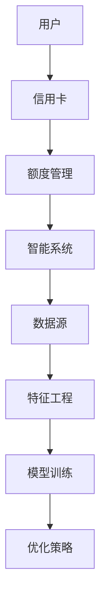
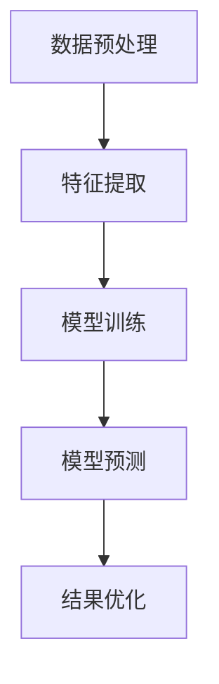

                 


# 智能信用卡额度管理优化系统

## 关键词：信用卡、额度管理、人工智能、优化系统、金融技术

## 摘要：本文介绍了一种基于人工智能的智能信用卡额度管理优化系统，探讨其背景、核心概念、算法原理、系统架构、项目实战及最佳实践，详细分析了该系统的优化策略及其在金融领域的应用价值。

---

# 第一部分: 智能信用卡额度管理优化系统概述

## 第1章: 智能信用卡额度管理优化系统背景

### 1.1 问题背景与描述

#### 1.1.1 传统信用卡额度管理的痛点
传统的信用卡额度管理主要依赖于人工审核和简单的规则引擎，存在以下问题：
- **审批效率低**：人工审核耗时长，难以满足用户实时需求。
- **精准度不足**：基于简单规则的审批可能导致额度设置过宽或过严。
- **风险控制弱**：无法实时捕捉用户行为变化，导致信用风险暴露。

#### 1.1.2 信用卡额度管理的优化需求
随着金融科技的快速发展，用户对信用卡额度管理提出了更高的要求：
- 实时调整额度以适应用户的消费习惯。
- 提供个性化额度建议，提升用户体验。
- 建立智能风险控制机制，降低信用违约风险。

#### 1.1.3 智能化管理的必要性
人工智能技术的引入，为信用卡额度管理带来了新的可能性：
- **自动化**：实时采集用户数据，自动计算额度。
- **精准化**：通过机器学习模型实现精准的额度预测。
- **智能化**：基于用户行为和市场变化动态调整额度。

### 1.2 问题解决与边界

#### 1.2.1 智能系统的核心目标
智能信用卡额度管理优化系统的核心目标是：
- 实现实时数据采集和分析。
- 提供基于机器学习的额度预测和优化建议。
- 构建智能风险控制系统，降低信用风险。

#### 1.2.2 系统的边界与外延
系统的边界包括：
- 数据源：用户交易数据、信用报告、市场数据。
- 处理范围：用户行为分析、额度预测、风险评估。
- 输出结果：额度调整建议、风险预警、用户画像。

#### 1.2.3 核心要素与组成模块
系统的组成模块包括：
- 数据采集模块：实时采集用户交易数据。
- 特征提取模块：提取用户行为特征。
- 模型训练模块：训练额度预测模型。
- 优化策略模块：生成额度调整建议。

### 1.3 核心概念与联系

#### 1.3.1 智能信用卡额度管理优化系统的定义
智能信用卡额度管理优化系统是一种基于人工智能技术的金融系统，旨在通过实时数据采集、特征提取、模型训练和优化策略生成，实现信用卡额度的智能调整和风险控制。

#### 1.3.2 核心概念的属性特征对比
| 概念 | 属性 | 特征 |
|------|------|------|
| 数据采集 | 来源 | 用户交易数据、信用报告 |
| 特征提取 | 方法 | 时间序列分析、聚类分析 |
| 模型训练 | 算法 | XGBoost、随机森林 |
| 优化策略 | 输出 | 额度调整建议、风险预警 |

#### 1.3.3 实体关系图


## 第2章: 智能信用卡额度管理优化系统的算法原理

### 2.1 算法原理概述

#### 2.1.1 梯度下降法
梯度下降法是一种优化算法，用于最小化损失函数。公式如下：
$$
J(\theta) = \frac{1}{2m} \sum_{i=1}^{m} (y_i - h_\theta(x_i))^2
$$
其中，$J(\theta)$ 是损失函数，$h_\theta(x_i)$ 是预测值，$y_i$ 是实际值。

#### 2.1.2 随机森林算法
随机森林是一种基于决策树的集成学习算法，通过组合多个决策树的结果来提高预测准确性。

#### 2.1.3 时间序列预测模型
时间序列预测模型用于分析用户交易数据的时间特性，常用ARIMA模型：
$$
ARIMA(p, d, q)
$$
其中，$p$ 是自回归阶数，$d$ 是差分阶数，$q$ 是移动平均阶数。

### 2.2 算法流程图


### 2.3 算法实现代码

```python
import numpy as np
import pandas as pd

def gradient_descent(X, y, lr=0.01, iterations=100):
    theta = np.zeros(X.shape[1])
    for _ in range(iterations):
        h = np.dot(X, theta)
        loss = (h - y).sum() / X.shape[0]
        gradient = (np.dot(X.T, (h - y))) / X.shape[0]
        theta = theta - lr * gradient
    return theta

# 示例数据
X = np.array([[1, 2], [3, 4], [5, 6]])
y = np.array([7, 8, 9])
theta_optimal = gradient_descent(X, y)
print(theta_optimal)
```

### 2.4 算法数学模型

#### 2.4.1 损失函数
$$
J(\theta) = \frac{1}{2m} \sum_{i=1}^{m} (y_i - h_\theta(x_i))^2
$$

#### 2.4.2 优化目标
$$
\min_{\theta} J(\theta)
$$

---

## 下一部分将探讨系统的系统分析与架构设计。

---

## 作者：AI天才研究院 & 禅与计算机程序设计艺术

