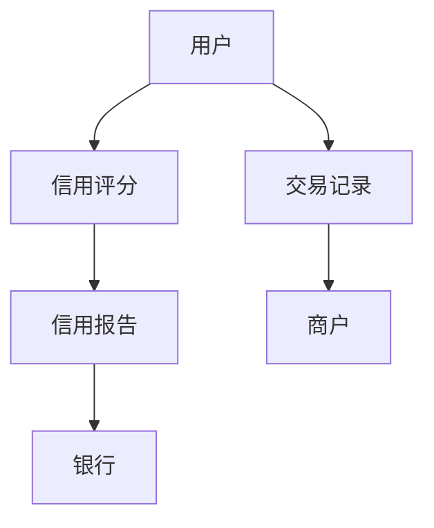
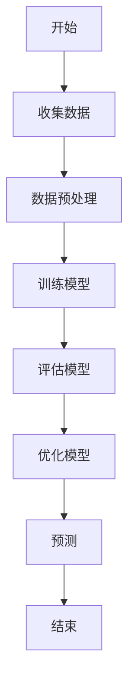
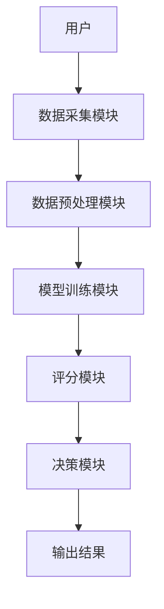

                 


# 智能信用评分系统

> 关键词：智能信用评分系统、机器学习、评分算法、数据预处理、数学模型、系统架构

> 摘要：智能信用评分系统是一种基于人工智能技术的金融信用评估工具，通过收集和分析用户数据，利用机器学习算法和数学模型对用户的信用状况进行评分，从而帮助金融机构进行风险控制和决策优化。本文将从背景介绍、核心概念、算法原理、数学模型、系统架构、项目实战、优化与扩展等多个方面详细探讨智能信用评分系统的设计与实现。

---

## 第1章: 背景介绍

### 1.1 信用评分系统的基本概念
信用评分系统是金融行业中的重要工具，用于评估个人或企业的信用状况，从而决定是否授予贷款或其他信用服务。传统的信用评分系统主要依赖人工审核和简单的评分规则，而智能信用评分系统则通过引入机器学习和大数据技术，显著提升了评分的准确性和效率。

### 1.2 问题背景与问题描述
传统的信用评分系统存在以下问题：
1. **数据维度有限**：传统评分系统通常只考虑少量的信用历史数据，无法充分利用其他类型的特征数据（如消费行为、社交数据等）。
2. **评分规则固定**：传统的评分规则通常是基于经验的静态规则，难以适应市场变化和用户行为的多样性。
3. **人工审核效率低**：人工审核不仅耗时，而且容易受到主观因素的影响，导致评分结果的不准确。

### 1.3 系统的目标与实现
智能信用评分系统的目标是通过自动化数据处理和智能算法，实现对用户信用状况的精准评估。其主要实现方式包括：
1. **数据收集与整合**：从多个数据源收集用户信息，包括信用历史、消费行为、社交数据等。
2. **数据预处理**：对收集到的数据进行清洗、特征提取和标准化处理。
3. **模型训练与优化**：基于预处理后的数据，训练机器学习模型，并通过交叉验证和调参优化模型性能。
4. **评分与决策**：利用训练好的模型对用户进行信用评分，并根据评分结果生成决策建议。

---

## 第2章: 核心概念与联系

### 2.1 核心概念原理
智能信用评分系统的核心概念包括以下几个方面：
1. **数据来源**：系统的数据来源包括信用 bureau 数据、银行交易记录、社交网络数据等。
2. **评分模型**：常用的评分模型包括逻辑回归（Logistic Regression）、随机森林（Random Forest）和梯度提升（Gradient Boosting）等。
3. **评分标准**：评分标准通常基于模型的输出结果，将用户分为不同的信用等级（如优秀、良好、一般、较差、差）。

### 2.2 概念属性特征对比
以下是一个对比表格，展示了不同评分模型的特点：

| 模型类型           | 优点                               | 缺点                               |
|--------------------|------------------------------------|------------------------------------|
| 逻辑回归           | 解释性强，计算速度快               | 非线性关系处理能力较差             |
| 随机森林           | 鲁棒性好，能够处理高维数据         | 对特征的重要性解释能力较弱           |
| 梯度提升（如 XGBoost） | 高精度，支持分布式训练             | 计算复杂度较高，资源消耗较大         |

### 2.3 ER实体关系图
以下是一个简单的实体关系图，展示了智能信用评分系统的主要实体及其关系：



---

## 第3章: 算法原理讲解

### 3.1 算法原理概述
智能信用评分系统的核心算法主要包括以下几种：
1. **逻辑回归**：用于分类问题，通过拟合一个逻辑函数来预测用户违约的概率。
2. **随机森林**：一种基于树的集成算法，通过构建多个决策树并取其预测结果的平均值来提高模型的准确性和稳定性。
3. **梯度提升**：一种优化算法，通过迭代地优化损失函数来构建模型。

### 3.2 算法流程图
以下是一个逻辑回归算法的流程图：



### 3.3 算法实现代码
以下是一个基于逻辑回归的Python代码示例：

```python
import pandas as pd
from sklearn.linear_model import LogisticRegression
from sklearn.model_selection import train_test_split
from sklearn.metrics import accuracy_score

# 加载数据
data = pd.read_csv('credit_data.csv')

# 数据预处理
X = data[['income', 'employment_length', 'debt_to_income_ratio']]
y = data['default']

# 划分训练集和测试集
X_train, X_test, y_train, y_test = train_test_split(X, y, test_size=0.2, random_state=42)

# 训练逻辑回归模型
model = LogisticRegression()
model.fit(X_train, y_train)

# 模型预测
y_pred = model.predict(X_test)

# 评估模型
print('模型准确率:', accuracy_score(y_test, y_pred))
```

---

## 第4章: 数学模型与公式

### 4.1 评分模型的数学公式
逻辑回归模型的目标函数可以表示为：
$$
\text{loss} = -\sum_{i=1}^{n} [y_i \ln(p_i) + (1 - y_i) \ln(1 - p_i)]
$$

其中，$p_i$ 是第 $i$ 个样本的违约概率，可以表示为：
$$
p_i = \frac{e^{w \cdot x_i + b}}{1 + e^{w \cdot x_i + b}}
$$

### 4.2 模型优化与调参
模型优化的目标是最小化损失函数，通常使用梯度下降算法来优化参数 $w$ 和 $b$。优化过程如下：
$$
w := w - \alpha \frac{\partial \text{loss}}{\partial w}
$$
$$
b := b - \alpha \frac{\partial \text{loss}}{\partial b}
$$

其中，$\alpha$ 是学习率。

---

## 第5章: 系统分析与架构设计

### 5.1 问题场景介绍
智能信用评分系统需要处理以下问题场景：
1. **数据来源多样**：数据可能来自多个不同的系统，需要进行数据清洗和整合。
2. **数据量大**：需要处理海量数据，对系统的性能和扩展性提出了较高的要求。
3. **模型更新频繁**：需要定期更新模型以适应数据分布的变化。

### 5.2 系统功能设计
系统的功能模块包括：
1. **数据采集模块**：负责从多个数据源采集用户数据。
2. **数据预处理模块**：对数据进行清洗、特征提取和标准化处理。
3. **模型训练模块**：负责训练和优化评分模型。
4. **评分模块**：根据模型预测结果生成信用评分。
5. **决策模块**：根据评分结果生成授信决策建议。

### 5.3 系统架构图
以下是一个简化的系统架构图：



---

## 第6章: 项目实战

### 6.1 环境安装与配置
需要安装以下依赖：
- Python 3.6+
- scikit-learn
- pandas
- mermaid

### 6.2 核心代码实现
以下是一个完整的项目实现代码示例：

```python
import pandas as pd
from sklearn.ensemble import RandomForestClassifier
from sklearn.model_selection import train_test_split
from sklearn.metrics import classification_report

# 加载数据
data = pd.read_csv('credit_data.csv')

# 数据预处理
X = data[['income', 'employment_length', 'debt_to_income_ratio', 'credit_score']]
y = data['risk_rating']

# 划分训练集和测试集
X_train, X_test, y_train, y_test = train_test_split(X, y, test_size=0.2, random_state=42)

# 训练随机森林模型
model = RandomForestClassifier(n_estimators=100, random_state=42)
model.fit(X_train, y_train)

# 模型预测
y_pred = model.predict(X_test)

# 评估模型
print(classification_report(y_test, y_pred))
```

### 6.3 代码解读与分析
1. **数据加载**：使用 `pandas` 加载数据文件。
2. **数据预处理**：选择相关特征并进行训练测试集的划分。
3. **模型训练**：使用随机森林算法训练模型。
4. **模型预测与评估**：对测试集进行预测，并输出分类报告。

---

## 第7章: 优化与扩展

### 7.1 系统优化策略
1. **模型优化**：通过超参数调优和模型集成提升模型性能。
2. **数据优化**：引入实时数据流处理，提高数据的时效性。
3. **系统扩展**：采用分布式架构，提升系统的处理能力。

### 7.2 系统扩展方向
1. **实时评分**：实现实时信用评分，满足金融机构的实时需求。
2. **多模型融合**：结合多种算法的优势，提升评分的准确性。
3. **个性化评分**：根据用户的个性化特征，提供定制化的评分服务。

---

## 第8章: 结论与展望

智能信用评分系统通过引入机器学习和大数据技术，显著提升了信用评分的准确性和效率。本文从背景介绍、核心概念、算法原理、系统架构、项目实战等多个方面详细探讨了智能信用评分系统的设计与实现。未来，随着人工智能和大数据技术的不断发展，智能信用评分系统将在金融行业发挥越来越重要的作用。

---

**作者：AI天才研究院/AI Genius Institute & 禅与计算机程序设计艺术 /Zen And The Art of Computer Programming**

