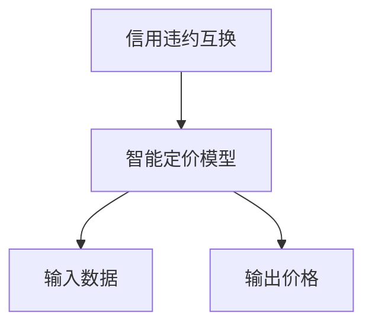
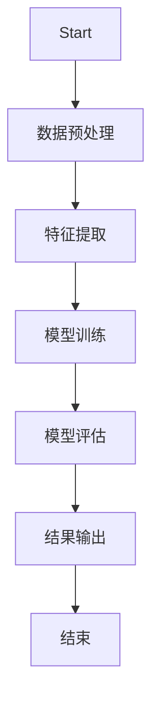
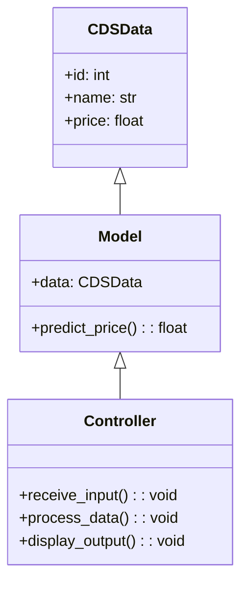
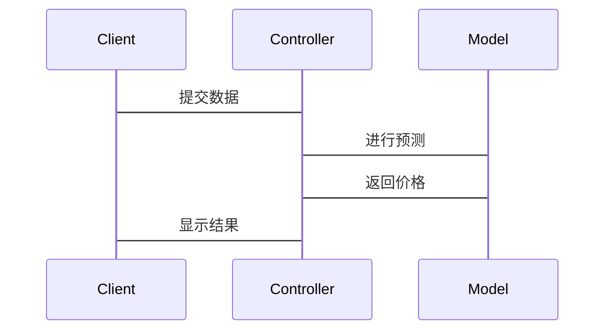

                 


# 智能信用违约互换定价模型

## 关键词
信用违约互换, 智能定价模型, 机器学习, 人工智能, 金融衍生工具, 风险定价

## 摘要
本文深入探讨智能信用违约互换定价模型的构建与应用。通过结合机器学习和人工智能技术，提出了一种高效、精准的定价方法，解决了传统模型的局限性。文章详细介绍了模型的核心概念、算法原理、系统架构，并通过实际案例展示了模型的应用效果，为金融风险管理和投资决策提供了新的思路。

---

# 目录

## 第1章 信用违约互换与智能定价概述

### 1.1 信用违约互换的基本概念
1.1.1 信用违约互换的定义  
1.1.2 市场发展与现状  
1.1.3 经济意义与应用场景  

### 1.2 智能定价模型的背景与意义
1.2.1 传统定价方法的局限性  
1.2.2 智能定价模型的提出  
1.2.3 智能定价模型的创新与优势  

## 第2章 智能信用违约互换定价模型的核心概念

### 2.1 模型的基本原理
2.1.1 数据驱动的定价方法  
2.1.2 机器学习在定价中的应用  
2.1.3 模型的输入输出关系  

### 2.2 核心概念与联系
2.2.1 实体关系图（ER图）  

2.2.2 核心概念对比表  
| 概念 | 描述 | 示例 |  
|------|------|------|  
| 信用风险 | 债务人无法履行债务的风险 | 债务人违约概率 |  
| 智能模型 | 使用AI技术进行预测和定价 | 神经网络模型 |  
| 定价公式 | 计算信用违约互换价格的数学表达式 | CDS价格计算公式 |  

## 第3章 智能信用违约互换定价模型的算法原理

### 3.1 算法原理概述
3.1.1 机器学习在定价中的应用  
3.1.2 常见算法介绍（如随机森林、神经网络）  
3.1.3 算法选择的依据  

### 3.2 算法流程图


### 3.3 算法实现代码
```python
import pandas as pd
from sklearn.model_selection import train_test_split
from sklearn.ensemble import RandomForestRegressor

# 数据加载与预处理
data = pd.read_csv('cds_data.csv')
X = data.drop('price', axis=1)
y = data['price']

# 划分训练集和测试集
X_train, X_test, y_train, y_test = train_test_split(X, y, test_size=0.2, random_state=42)

# 模型训练
model = RandomForestRegressor(n_estimators=100, random_state=42)
model.fit(X_train, y_train)

# 模型预测与评估
y_pred = model.predict(X_test)
print('模型预测价格:', y_pred[:5])
print('实际价格:', y_test[:5].values)
```

## 第4章 智能信用违约互换定价模型的系统分析与架构设计

### 4.1 项目背景与目标
4.1.1 项目背景介绍  
4.1.2 项目目标与范围  

### 4.2 系统功能设计
4.2.1 领域模型设计（类图）  


### 4.3 系统架构设计
4.3.1 系统架构图  


### 4.4 接口与交互设计
4.4.1 系统接口设计  
4.4.2 交互流程图  


## 第5章 项目实战与案例分析

### 5.1 环境安装与配置
5.1.1 安装Python与相关库  
5.1.2 数据集准备与预处理  

### 5.2 核心代码实现
5.2.1 模型训练代码  
5.2.2 模型预测代码  

### 5.3 案例分析与结果解读
5.3.1 实际案例分析  
5.3.2 模型预测结果与实际价格对比  

## 第6章 总结与展望

### 6.1 总结
6.1.1 核心内容回顾  
6.1.2 模型的优势与不足  

### 6.2 未来展望
6.2.1 模型的优化方向  
6.2.2 新技术的应用前景  

## 附录

### 附录A 术语表
- 信用违约互换（CDS）：一种金融衍生工具，用于对冲债券违约风险。  
- 智能定价模型：基于机器学习的定价方法，能够自动学习和优化定价策略。  

### 附录B 参考文献
1. 书籍：《信用衍生产品定价与风险度量》  
2. 论文：《机器学习在金融定价中的应用研究》  

---

## 作者：AI天才研究院 & 禅与计算机程序设计艺术

