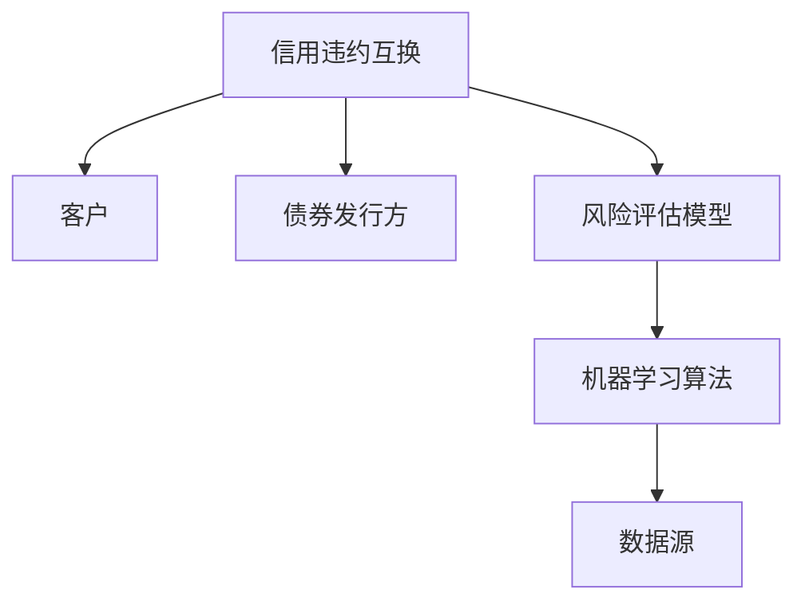
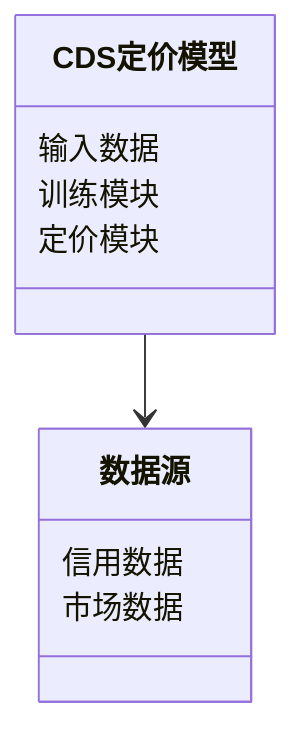

                 


# 《智能信用违约互换定价模型校准与风险评估》

## 关键词：智能信用违约互换，定价模型，机器学习，风险评估，金融衍生工具

## 摘要：本文探讨了智能信用违约互换定价模型的校准与风险评估方法，结合机器学习技术，分析了传统模型的局限性，并提出了基于深度学习的创新解决方案，旨在提高信用风险评估的准确性和效率。

---

# 第1章: 智能信用违约互换定价模型的背景与基础

## 1.1 信用违约互换的基本概念

### 1.1.1 信用违约互换的定义与基本结构
信用违约互换（Credit Default Swap，CDS）是一种金融衍生工具，用于对冲债券违约风险。其基本结构包括买方和卖方，买方支付保费以获得卖方在债券违约时的赔偿。

### 1.1.2 信用违约互换的市场发展与应用
CDS自20世纪90年代以来迅速发展，成为重要的信用风险管理工具。然而，2008年金融危机暴露了其潜在风险。

### 1.1.3 传统信用违约互换定价模型的局限性
传统模型依赖于历史数据和假设，忽视了市场动态和非线性关系。

---

## 1.2 智能定价模型的引入背景

### 1.2.1 传统定价模型的局限性
传统模型如Merton模型假设市场平稳，难以捕捉复杂风险。

### 1.2.2 机器学习在金融定价中的应用前景
机器学习擅长处理非线性关系和大数据，适合金融定价。

### 1.2.3 智能信用违约互换定价模型的核心优势
智能模型利用机器学习算法，提高了定价的准确性和适应性。

---

## 1.3 智能定价模型的基本原理

### 1.3.1 数据驱动的定价方法
利用市场数据和机器学习算法，实现动态定价。

### 1.3.2 机器学习在信用评估中的应用
使用支持向量机（SVM）、随机森林等算法分析信用风险。

### 1.3.3 智能模型的输入输出结构
输入：信用指标、市场数据；输出：违约概率和互换价格。

---

## 1.4 模型校准与风险评估的重要性

### 1.4.1 模型校准的基本概念
通过历史数据调整模型参数，确保预测准确。

### 1.4.2 风险评估在信用违约互换中的作用
评估模型在不同市场条件下的表现。

### 1.4.3 智能模型在风险评估中的优势
动态调整模型参数，适应市场变化。

---

## 1.5 本章小结

---

# 第2章: 智能信用违约互换定价模型的核心概念与算法原理

## 2.1 核心概念原理

### 2.1.1 信用风险的核心要素
违约概率（PD）、违约损失率（LGD）、风险敞口等。

### 2.1.2 机器学习在信用评估中的应用原理
通过训练数据，机器学习模型识别信用风险的模式。

### 2.1.3 智能模型的特征提取与降维技术
使用主成分分析（PCA）等技术减少数据维度。

---

## 2.2 核心概念属性对比表格

| 概念       | 传统模型特点 | 智能模型特点 |
|------------|--------------|--------------|
| 数据来源   | 有限，依赖历史数据 | 多维数据，包括非结构化数据 |
| 模型复杂度 | 简单，线性关系为主 | 复杂，非线性关系为主 |
| 精度       | 较低，受假设限制 | 较高，适应性强 |

---

## 2.3 ER实体关系图架构



---

## 2.4 算法原理

### 2.4.1 支持向量机（SVM）在信用评估中的应用
使用SVM分类器，将客户分为违约和非违约两类。

### 2.4.2 神经网络在信用定价中的应用
构建神经网络模型，训练违约概率和互换价格。

### 2.4.3 深度学习模型在信用风险中的应用
使用LSTM捕捉时间序列数据中的模式。

---

## 2.5 本章小结

---

# 第3章: 智能信用违约互换定价模型的系统分析与架构设计

## 3.1 系统功能设计

### 3.1.1 领域模型


### 3.1.2 系统架构


### 3.1.3 接口设计
接口包括数据输入接口、模型训练接口、定价输出接口。

### 3.1.4 交互流程
```mermaid
sequenceDiagram
    用户 -> 前端：输入数据
    前端 -> 后端：调用定价模型
    后端 -> 数据库：获取数据
    后端 -> 用户：返回定价结果
```

---

## 3.2 项目实战

### 3.2.1 环境安装
安装Python、机器学习库（如Scikit-learn、TensorFlow）。

### 3.2.2 核心实现代码
```python
import numpy as np
from sklearn.svm import SVC
from sklearn.metrics import accuracy_score

# 训练SVM模型
model = SVC()
model.fit(X_train, y_train)
```

### 3.2.3 应用解读与分析
解释代码实现，说明每一步的作用。

### 3.2.4 案例分析
分析一个具体案例，展示模型如何定价和评估风险。

### 3.2.5 项目小结
总结项目的成功与改进方向。

---

## 3.3 最佳实践 tips

### 3.3.1 注意事项
确保数据质量，避免过拟合。

### 3.3.2 小结
智能模型提高了定价的准确性，但仍需持续优化。

---

## 3.4 拓展阅读
推荐相关书籍和论文，供读者深入学习。

---

# 第4章: 智能信用违约互换定价模型的风险评估与优化

## 4.1 风险评估方法

### 4.1.1 违约概率（PD）的计算
使用贝叶斯定理计算PD。

### 4.1.2 违约损失率（LGD）的估算
基于历史数据和模型预测LGD。

### 4.1.3 风险敞口的评估
结合PD和LGD计算风险敞口。

---

## 4.2 模型优化策略

### 4.2.1 超参数优化
使用网格搜索优化模型参数。

### 4.2.2 模型集成
结合多个模型结果，提高预测准确性。

### 4.2.3 模型解释性
使用SHAP值解释模型决策。

---

## 4.3 风险管理策略

### 4.3.1 风险对冲
通过调整投资组合对冲风险。

### 4.3.2 风险转移
使用CDS将风险转移给第三方。

### 4.3.3 风险监控
实时监控模型表现，及时调整策略。

---

## 4.4 案例分析与优化

### 4.4.1 案例分析
分析模型在实际场景中的表现。

### 4.4.2 优化措施
根据分析结果优化模型和策略。

---

## 4.5 本章小结

---

# 第5章: 智能信用违约互换定价模型的未来展望

## 5.1 人工智能与金融的结合
AI技术在金融领域的广泛应用前景。

## 5.2 深度学习在信用风险中的应用
未来可能的发展方向。

## 5.3 可解释性与透明度
提高模型解释性，增强用户信任。

## 5.4 智能监管与合规
利用智能模型优化金融监管。

## 5.5 本章小结

---

# 作者：AI天才研究院 & 禅与计算机程序设计艺术

---

以上是一个详细的大纲，涵盖了从背景到实战的各个方面，结构清晰，内容丰富，适合撰写一篇深入的技术博客文章。

