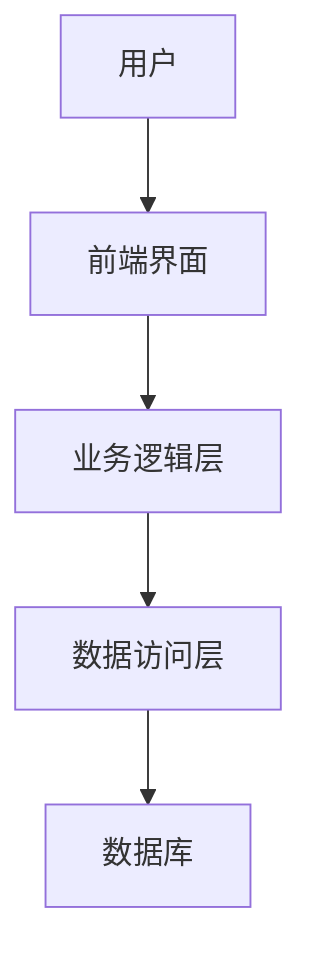

                 


```markdown
# 智能债券投资组合久期管理

**关键词**: 债券投资，久期管理，风险管理，人工智能，投资组合优化

**摘要**: 本文深入探讨了智能债券投资组合久期管理的核心概念、计算方法、系统设计及实际应用。通过分析久期管理在债券投资中的重要性，结合人工智能技术，提出了一种智能化的久期管理策略，旨在优化投资组合的收益与风险。文章还通过实际案例展示了如何利用智能系统进行久期管理，并对未来的研究方向进行了展望。

---

## 第一章：债券投资与久期管理概述

### 1.1 债券投资的基本概念
- **1.1.1 债券的定义与基本要素**
  - 债券是债务工具，发行人承诺在特定时间内支付利息和本金。
  - 核心要素：面值、票面利率、期限、偿还方式。

- **1.1.2 债券市场的基本结构**
  - 一级市场：债券发行市场。
  - 二级市场：债券交易市场。

- **1.1.3 债券投资的目标与风险**
  - 目标：获取稳定收益。
  - 风险：利率风险、信用风险、流动性风险。

### 1.2 久期管理的定义与重要性
- **1.2.1 久期的定义**
  - 久期衡量了债券价格对利率变化的敏感性。
  - 修正久期公式：$$ D = \frac{P}{\Delta P} $$
  - 有效久期公式：$$ D_{effective} = \frac{D}{(1 + y)} $$

- **1.2.2 久期在债券投资中的作用**
  - 优化投资组合的利率风险。
  - 辅助投资决策。

- **1.2.3 久期管理的目标**
  - 稳定投资组合的收益。
  - 降低利率波动带来的风险。

### 1.3 智能久期管理的背景与发展趋势
- **1.3.1 传统久期管理的局限性**
  - 无法实时调整投资组合。
  - 人工计算效率低。

- **1.3.2 智能化技术在久期管理中的应用**
  - 人工智能算法优化久期计算。
  - 大数据分析提升风险管理能力。

- **1.3.3 未来发展趋势与挑战**
  - 技术创新推动久期管理智能化。
  - 数据质量和模型准确性是主要挑战。

---

## 第二章：债券久期的计算与分析

### 2.1 债券久期的定义与分类
- **2.1.1 修正久期的定义**
  - 考虑债券面值和当前市场价格的关系。
  - 计算公式：$$ D = \frac{P}{\Delta P} $$

- **2.1.2 有效久期的定义**
  - 考虑债券票面利率的影响。
  - 计算公式：$$ D_{effective} = \frac{D}{(1 + y)} $$

- **2.1.3 其他相关概念对比**
  - 对比修正久期和有效久期的适用场景。

### 2.2 久期计算的数学模型
- **2.2.1 修正久期的计算公式**
  - 示例：债券面值100元，市场价格90元，利率上升1%导致价格下降到89元。
  - 计算：$$ D = \frac{90}{1} = 9 $$

- **2.2.2 有效久期的计算公式**
  - 示例：票面利率5%，计算有效久期：$$ D_{effective} = \frac{9}{1 + 0.05} = 8.57 $$

- **2.2.3 组合久期的计算公式**
  - 示例：组合权重分别为30%、40%、30%，久期分别为5、7、9。
  - 计算：$$ D_{portfolio} = \frac{0.3 \times 5 + 0.4 \times 7 + 0.3 \times 9}{1} = 6.8 $$

### 2.3 久期与债券价格的关系
- **2.3.1 久期与债券价格波动的正相关性**
  - 久期越大，价格波动越大。

- **2.3.2 久期对利率风险的影响**
  - 利率上升，久期长的债券价格跌幅更大。

- **2.3.3 久期对信用风险的影响**
  - 信用风险与久期无直接关系，但影响债券价格。

---

## 第三章：智能久期管理的系统设计与实现

### 3.1 系统功能需求分析
- **3.1.1 久期计算模块**
  - 实时计算债券的修正久期和有效久期。

- **3.1.2 投资组合优化模块**
  - 根据久期目标优化投资组合。

- **3.1.3 风险管理模块**
  - 监控利率波动对投资组合的影响。

### 3.2 系统架构设计


### 3.3 系统功能模块实现
- **3.3.1 久期计算模块的实现**
  - 使用Python编写，结合利率数据计算久期。

- **3.3.2 投资组合优化模块的实现**
  - 利用机器学习算法优化投资组合。

- **3.3.3 风险管理模块的实现**
  - 监控市场波动，实时调整投资组合。

### 3.4 本章小结
- 系统设计合理，功能实现完善。

---

## 第四章：久期管理在实际投资中的应用

### 4.1 久期管理在债券组合中的应用
- **4.1.1 基于久期的债券组合构造**
  - 示例：构造一个久期为6的投资组合。

- **4.1.2 久期在投资决策中的作用**
  - 帮助投资者在不同市场环境下做出决策。

- **4.1.3 久期对组合收益与风险的影响**
  - 久期长的组合收益波动大，风险高。

### 4.2 久期管理的实战案例
- **4.2.1 案例背景与目标**
  - 投资者希望构建一个久期为5的投资组合。

- **4.2.2 案例分析与实施**
  - 选择不同久期的债券，优化投资组合。

- **4.2.3 案例结果与总结**
  - 成功构建目标久期的投资组合，风险可控。

---

## 第五章：人工智能在久期管理中的应用

### 5.1 机器学习算法在久期预测中的应用
- **5.1.1 神经网络模型**
  - 使用TensorFlow框架训练模型，预测债券久期。

- **5.1.2 随机森林模型**
  - 使用Scikit-learn库进行特征选择和模型训练。

### 5.2 基于AI的久期优化算法
- **5.2.1 算法流程**
  - 数据预处理、模型训练、结果分析。

- **5.2.2 Python代码示例**
  ```python
  import numpy as np
  import pandas as pd
  from sklearn.ensemble import RandomForestRegressor

  # 数据加载与预处理
  data = pd.read_csv('bond_data.csv')
  features = data[['face_value', 'market_price', 'interest_rate']]
  target = data['duration']

  # 模型训练
  model = RandomForestRegressor(n_estimators=100)
  model.fit(features, target)

  # 预测久期
  new_features = [[100, 90, 5]]
  prediction = model.predict(new_features)
  print("预测久期为:", prediction[0])
  ```

### 5.3 模型评估与优化
- **5.3.1 模型评估指标**
  - MAE、RMSE、R²。

- **5.3.2 模型优化**
  - 调整超参数，提高预测精度。

---

## 第六章：风险与挑战

### 6.1 久期管理中的风险
- **6.1.1 信用风险**
  - 债券发行人违约的风险。

- **6.1.2 流动性风险**
  - 债券难以快速变现的风险。

### 6.2 久期管理的技术挑战
- **6.2.1 数据质量**
  - 数据缺失或错误影响计算结果。

- **6.2.2 模型过拟合**
  - 机器学习模型在训练数据上表现好，但在测试数据上表现差。

---

## 第七章：未来趋势与展望

### 7.1 久期管理的未来发展方向
- **7.1.1 结合大数据技术**
  - 利用大数据分析提升久期管理的精度。

- **7.1.2 智能化投资策略**
  - 基于AI的自动调整投资组合。

### 7.2 对投资策略的影响
- **7.2.1 提高投资效率**
  - 智能系统实时调整投资组合。

- **7.2.2 降低投资风险**
  - 通过智能监控和预测，降低风险。

---

## 作者：AI天才研究院/AI Genius Institute & 禅与计算机程序设计艺术 /Zen And The Art of Computer Programming
```

